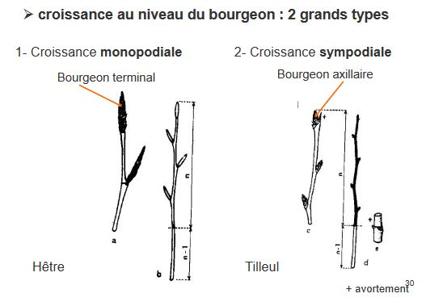

# Chapitre 1 : Morphologie et architecture de la tige

## I) Généralités

L'ensemble des tiges d'une plante :

* est généralement aérien
* porte les feuilles puis les fleurs puis les fruits
* met en communication des organes d'absorption et assimilateurs

Grande diversité morphologique des tiges : 

*Quercus suber*

* tige orthotrope à structures secondaires et longévité importantes

*Ferocactus rectispinus*

Crassulescence :

* mise en place 
* activité photosynthétique : CAM

*Phyllostachys bambusoides* (Poaceae):

* Tige orthotrope à croissance très rapide engendrée par des entrenoeuds surmontés par des méristèmes intercalaires
* Activité photosynthétique : C4

*Polygonatum multiflorum*

* une tige florifère épigée annuelle
* une tige endogée vivace 
	* le bourgeon terminal produit la tige florifère
	* le bourgeon latéral produit le segment suivant
* tige souterraine : rhizome, ici à croissance sympodiale    

Stolon :

* tige épigée à croissance plagiotrope
* émet à chaque noeuf des racines adventives et un bourgeon pouvant évoluer à terme en individu autonome

## II) Organisation générale

Feuilles

* appendices latéraux de la tige
* d'autant plus jeunes qu'elles sont proches du sommet
* un (ou plusieurs) bourgeon axillaire à chaque feuille 
* séparées par un entre - noeud

Bourgeon terminal

* produit simultanément les tiges et les feuilles

L'unité fondamentale répétitive de la tige est appelée : **phytomère**

Deux types morphologiques fondamentaux (plupart des végétaux):

* tiges herbacées
* tiges ligneuses

Tige herbacée

* Axe vert, mince, souple, terminé par le bourgeon terminal
* Ramification souvent simple : vie brève, tige annuelle
* Ramification à une certaine hauteur : bas vers le haut
* Epaississement léger possible des parties les plus anciennes de la tige
* Abondance de tissus parenchymateux, rôle parfois important de la turgescence
* Rôle important des tissus de soutien primaire dans le port de la plante

Tige ligneuse (ex : *Fagus*)

* Tige similaire à une tige herbacée en première année
* Subit un épaississement en cours d'année : production de tissus ligneux et de liège
* Perte des feuilles à l'automne : présence uniquement du bourgeon terminal et des bourgeons axillaires
* Pousse de début d'année : comparables à une tige herbacée puis devient ligneuse 
* Forte dominance apicale, facteur déterminant du port de la plante

Tige ligneuse de type Arbre, caractérisé par un tronc

pendant n années : 

* pas de ramifications
* bourgeons axillaires dormants
* éventuellement quelques ramifications qui dégénèrent 

ensuite :

* ramifications définitives, contrôlées par les ramifications les plus proches du sommet 

Acrotonie :

* longue dominance apicale
* adapté à un contexte compétitif pour la lumière
* axe principal orthotrope oblique chez les angiospermes horizontales chez les conifères

Hypotonie :

* plus fort développement des rameaux situés sur la face inférieur

Amphitonie :

* développement des rameaux dans le plan de la ramification 

Type Buisson

Première année : faible développement de la tige, s'incline souvent vers le sol

Seconde année :

* tige principale se développe peu
* apparition de rameaux vigoureux à la base de la tige pricipale, souvent dépassant la tige

Combinaison : basitonie et épitonie

* contribue à un port en touffe
* efficace pour intercepter la lumière
* empêche ou ralentit la croissance des arbres
* plus compétitifs pour aller chercher la lumière plus haut

Des types de transition existent : basitone puis acrotone

Croissance au niveau du bourgeon : 2 types

* Croissance **monopodiale** : bourgeon terminal
* Croissance **sympodiale** : bourgeon axillaire

Croissance au niveau du bourgeon : ramification monopodiale dischasiale : Croissance sympodiale

Cas des bourgeons adventifs : 

* se forment tardivement sans relation avec les anciennes feuilles, par dédifférenciation et néoformation
* apparaissent sur les racines ou au niveau du collet, par recloisonnement des cellules corticales
* interêt en biotechnologies

Chez certaines espèces : naissance de nombreuses tiges dréssées = drageons formation souvent à la suite d'un traumatisme (rejet apparaissant sur les souches d'arbres abattus, taille en têtard des saules et des platanes)

Bilan port des plantes :

* plantes à port dressé
* plantes à port rampant : tige grêle 
* plantes à port grimpant : structures non autoportantes, nécessitent un support pour être compétitives pour la lumière, s'accrochent par des poils, des crampons, des vrilles ... ou grâce à des mouvements préhenseurs (volubiles)
