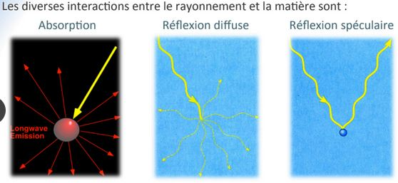
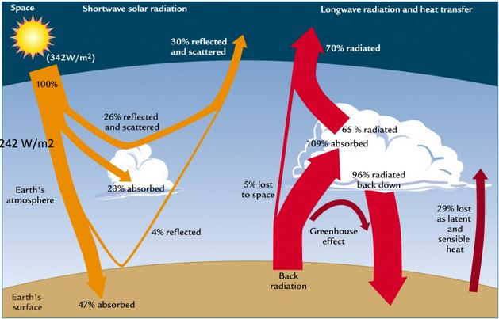
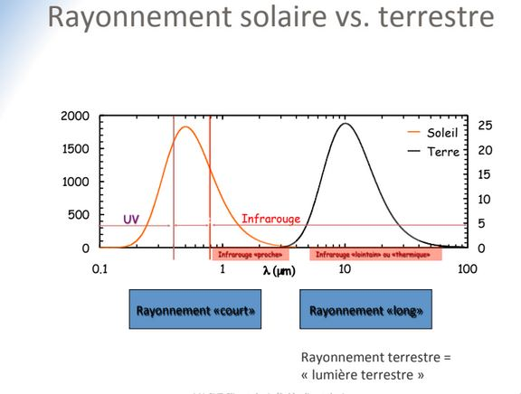
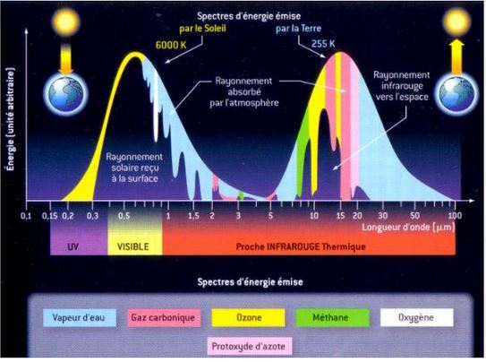
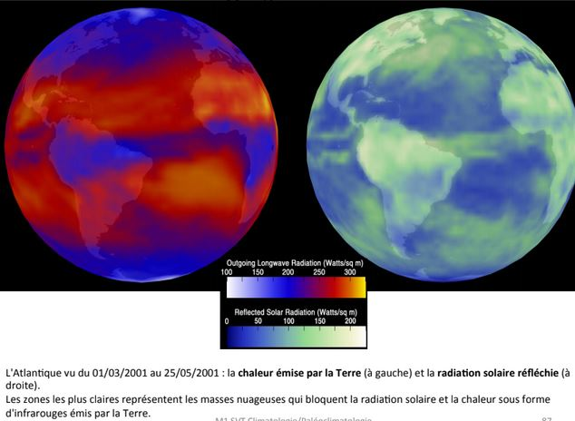
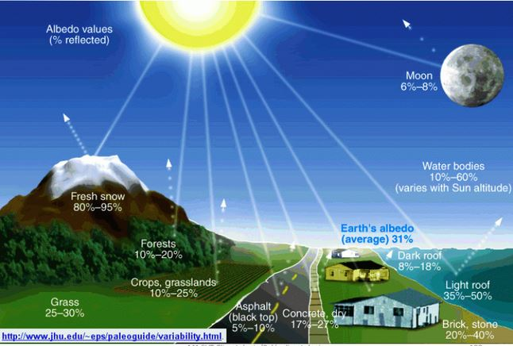
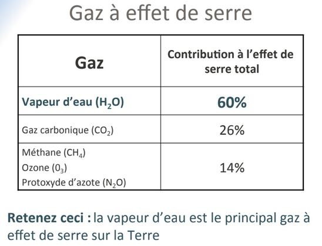
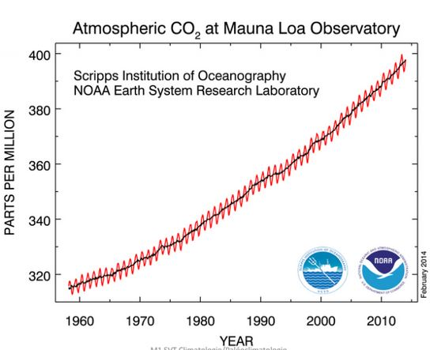

# Climatologie cours 1

Excès d'énergie dans l'hemisphère Sud avec l'inclinaison de la Terre.

L'énergie arrivant par en dessous est négligeable à celle arrivant par l'espace.

L'échelle est primordiale. Un échelle de temps où on peut rajouter une échelle spatiale.

**Météorologie** : Science qui étudie les phénomènes atmosphériques notamment en vue d'établir des prévisions.

**Climatologie** : Etude de la succession de conditions météorologiques sur de longues périodes de temps

**Paléoclimatologie** : Discipline qui documente les climats passés à l'échelle des temps géologiques.

La climatologie peut avoir un impact sur la météorologie.

## I) Mise en contexte

Le Soleil :

* Etoile ordinaire en périphérie de notre Galaxie (la Voie Lactée) contenant quelques 200 milliards d'étoiles
* Etoiles : boules de gaz d'hydrogène incandescent générant des quantités colossales d'énergie provenant de la fusion nucléaire de leur hydrogène en hélium dans le noyau
* Le Soleil est prévu pour fournir cette énergie pour encore 5 milliards d'années, avant de s'éteindre

Le Système solaire :

* Huit planètes majeures gravitant autour du Soleil
* Astéroïdes, comètes, planètes naines (Pluton etc..), poussières
* Formation : il y a 4,5 milliards d'années par accrétion de la matière interstellaire. La Terre est en quelque sorte un amas de poussières rocheuses et de gaz, agglutinés par gravité.

La Terre : 

* 3e planète en distance, à ~150 millions de km du Soleil
* 5e planète en taille (diamètre de ~12 700 km)
* Planète rocheuse comme Mercure, Vénus et Mars

On est situé à la distance parfaite pour avoir l'eau sur trois phases, et ainsi créer un cycle hydrologique.

### Les atmosphère planétaires

Lors de la formation des planètes, les poussières et roches forment la partie solide sphérique et les gaz s'accumulent autour, puisque plus légers.

L'atmosphère est conséquence naturelle de la formation des planètes.

Seules les planètes les plus massives conservent leur atmosphère. Toutes les planètes majeures, sauf Mercure, en possèdent une.

### Notre atmosphère

La Terre est entourée d'une mince pellicule de gaz appelée l'atmosphère. Principalement composée d'azote (N2) et d'Oxygène (O2). Epaisseur avoisinant la centaine de km (ligne de Kàrmàn).

* limite aéronotique de l'atmosphère

Poids total : 5 000 000 000 000 000 tonnes

Le rôle de l'atmosphère est très importante. Elle nous protège des rayons x, UV du Soleil, des météorites et des écarts extrêmes de températures grâce à son effet de serre. Elle permet à la vie d'exister.

L'énergie rayonné par la Terre est emprisonnée par les gaz à effet de serre.

Destin de la radiation solaire dans l'atmosphère

25% réfléchie vers l'espace

* 19% réfléchie par les nuages
* 6% diffusée par les gaz atmosphériques

25% absorbée par les gaz atmosphériques

* 18% : vapeur d'eau
* par l'ozone

* 50% transmise au sol

Un rayonnement dans le domaine du visible. On a une radiation de la Terre correspondant à la température de la Terre (15°C) renvoie en IR. Les gaz à effet de serre piège les infrarouges émit par la Terre (96%). 

Si on augmente la quantité de CO2, méthane ou gaz à effet de serre, on empêche encore plus de gaz à repartir donc les basses couches de l'atmosphère se réchauffe.

En terme de spectre, le Soleil renvoie dans le domaine du visible. Ainsi que le domaine de l'UV mais l'Ozone le filtre donc on ne le reçoit pas, nous ne sommes donc pas brulé par le rayonnement.

Le spectre d'emission de la Terre est absorbé par le méthane et le gaz carbonique ce sont des cycles ouverts.

L'effet de serre piègeage des gaz à effet de serre du rayonnements infrarouge de la Terre pas celui du Soleil. 

La vapeur d'eau est un cycle fermé, on ajoute pas de vapeur d'eau dans l'atmopshère.

Les nuages réfléchissent les rayonnement solaire ainsi que les déserts et les zones polaires.

L'energie émise du Soleil est plus grande que celle émise par la Terre

## II) Bilan énergétique de la Terre

### L'énergie et la météo

Tous les phénomènes météorologiques sont le résultat de transferts d'énergie (chaleur). Tout transfert de chaleur requiert une différence de température. Trois mécanismes de transfert de chaleur par différence de température :

* conduction
* convection
* rayonnement (radiation)
* changement d'état

#### 1/ Conduction

**Transfert des vibrations moléculaires par contact direct** avec molécules voisines. Energie transférée **sans déplacement macroscopique des molécules elles - mêmes**. 

Impératif : la présence de matière (solide, liquide ou gaz).

#### 2/ Convection

Transport d'énergie par **transport direct de la matière elle - même**. N'est possible que pour les fluides (liquides ou gazeux).

Le moins dense remonte (Orage, Eau qui bout sur le feu)

#### 3/ Rayonnement

Transfert d'énergie par **ondes électromagnétiques**. Possible à travers toute forme de matière **et aussi dans le vide**.

Entre le Soleil et la Terre il y a du vide, donc le transfert par rayonnement est le seul moyen de transmettre de la chaleur du Soleil à la Terre.

Tous les corps matériels émettent des ondes électromagnétiques (EM) (
(également appelées rayonnement thermique)  en vertu de leur chaleur
interne, c’est à dire leur température.

En quelque sorte, les ondes EM contiennent l’énergie de l’objet et la 
diffusent ou la transportent dans toutes les directions à la vitesse de la 
lumière (300 000 km/s).

À son tour, l’énergie (ou la « chaleur ») contenue dans une onde EM dépend 
de :

* Sa longueur d’onde (la « qualité » de ses rayons)
* Son intensité (la « quantité » de ses rayons)

Les ondes EM sont classées selon leur longueur d’onde, selon leur «qualité».

Une onde "dure" (très courte) : les rayons X

* balles d'acier
* une seule balle de fusil peut tuer

Une onde "douce" (très longue) : les ondes radio

* balle de ouate
* des centaines de balles de ouates ne font rien

Les "balles" de lumière s'appellent des "photons".

### Lois du rayonnement thermique

Le rayonnement thermique est proportionnel, la température à la quatrième puissance. Un corps x2 plus chaud émet x16 plus d'énergie.

N'existe pas qu'à une seule longueur d'onde mais s'étale selon une distribution.

Un corps chaud :

* émet plus d'énergie totale
* émet la majorité de cette énergie à des longueurs d'ondes relativement courtes (ondes plus énergétiques ou plus "dures"). (Etoiles)

Un corps froid :

* émet moins d'énergie totale
* émet la majorité de cette énergie à des longueurs d'ondes relativement longues (moins énergétiques ou plus "molles"). (Terre, notre propre corps car émet dans l'IR)

## III) Bilan énergétique de la Terre : Chauffage vs Bilan radiatif

### Exemple de rayonnements thermiques : rayonnement solaire vs terrestre

La rayonnement solaire se situe principalement enctre 0,25µm et 4µm (UV + visible + IR "proche"). Le rayonnement terrestre se situe principalement entre 4µm et 20 µm (IR "lointain").

Les rayonnements sont donc distincts

* Solaire : rayonnement "court"
* Terrestre : rayonnement "long"

Une longueur d'onde donnée peut donc être attribuée sans ambuiguïté à l'une ou l'autre source.

* Important pour l'interprétation des images satellitaires

La constante solaire exprime la puissance rayonnée reçue, que recevrait une surface de 1m² située à une distance de 1 Ua (Distance moyenne Terre - Soleil), exposée perpendiculairement aux rayons du Soleil, en l'absence d'atmosphère. Elle s'exprime en Watt.m-²

Energie du Soleil interceptée par la Terre : ~176 000 000 000 MW. Elle représente 1/ 2 000 000 000 de l'énergie émise par le Soleil.

### Le Rayonnement Solaire

Etoile chaude : 15 000 °C, couleur bleue (~75% UV, ~25% visible)

Soleil : 6 000 °C, couleur jaune (~50% visible, ~50% IR "proche")

Etoile froide : 3 000 °C, couleur rouge (~25% visible, ~75% IR "proche")

### La rondité de la Terre

Le fait que le Soleil illumine une Terre qui soit sphérique a une conséquence fondamentale

* les pôles de la Terre reçoivent des rayons solaires fortement inclinés à longueur d'année
* les régions tropicales/ équatoriales reçoivent des rayons solaires faiblement inclinés
* résulats : les pôles sont froids et l'équateur est chaud.

### Les saisons

L'isolation est plus grande en été car

* L'angle d'incidence des rayons solaires est plus grand
* Les jours sont plus longs que les nuits
* Les rayons solaires traversent une couche atmosphérique plus mince

L'inverse est vrai dans l'hémisphère d'hiver

* L'angle d'incidence des rayons solaires est plus faible
* Les jours sont plus courts que les nuits
* Les rayons solaires traversent une couche atmosphérique plus épaisse

L'effet des saisons est maximal aux pôles et minimal à l'équateur. Sous les latitudes moyennes et polaires, l'inclinaison de l'axe de rotation de la Terre amplifie (l'été) ou diminue (l'hiver) l'angle d'incidence des rayons solaires.

Sous les latitudes tropicales, l'angle d'incidence des rayons solaires demeure élevé à l'année longue.

### Le devenir des rayons solaires en traversant l'atmosphère

Le rayonnement en provenance du Soleil peut subir, lorsque qu'il rencontre l'atmosphère l'un des trois destins suivants :

* il peut - être réfléchi par l'atmosphère
* il peut - être diffusé par l'atmosphère
* il peut - être absorbé par l'atmosphère

La transmission représente le rayonnement dans le faisceau de lumière à l'issu de l'absorption, la diffusion et la réflexion.

C'est la longueur d'onde du rayonnement ainsi que la nature du milieu qu'il traverse qui déterminent s'il est absorbé, diffusé, réfléchi ou simplement transmis.

#### 1/ La diffusion

La diffusion est le processus par lequel une onde électromagnétique est dispersée lorsqu'elle intéragit avec la matière

En augmentant l’épaisseur de la couche atmosphérique traversée par la radiation, on favorise la diffusion complète du bleu. Le seul rayonnement nous parvenant à l’oeil est donc le rouge.

Destin de la radiation solaire dans l'atmosphère

25% réfléchie vers l'espace

* 19% réfléchie par les nuages
* 6% diffusée par les gaz atmosphériques (diffusion de Rayleigh)

25% absorbée par les gaz atmosphériques

* 18% : vapeur d'eau troposphérique
* 7%  : ozone stratosphérique

50% transmise au sol

#### 2/ La réflexion

L'atmosphère n'absorbe (donc n'utilise) que le quart de la radiation solaire incidente. Les trois quarts restants sont en majorité transmis vers la surface (2/3 de ces trois quarts). C'est la surface qui absorbe la majorité des rayons solaires. L'albédo planétaire est dominé par les reflexions atmosphériques des nuages et de la diffusion de Rayleigh.

** La réflexion des rayons solaires est effectuée principalement par l'atmosphère. L'absorption des rayons solaires est effectuée principalement par la surface. L'atmosphère est donc réchauffée par en - dessous.**

#### 3/ L'absorption

On a une radiation de la Terre correspondant à la température de la Terre (15°C) renvoie en IR. Les gaz à effet de serre piège les infrarouges émit par la Terre (96%). 

Si on augmente la quantité de CO2, méthane ou gaz à effet de serre, on empêche encore plus de gaz à repartir donc les basses couches de l'atmosphère se réchauffe.

En terme de spectre, le Soleil renvoie dans le domaine du visible. Ainsi que le domaine de l'UV mais l'Ozone le filtre donc on ne le reçoit pas, nous ne sommes donc pas brulé par le rayonnement.

Le spectre d'emission de la Terre est absorbé par le méthane et le gaz carbonique ce sont des cycles ouverts.

L'effet de serre piègeage des gaz à effet de serre du rayonnements infrarouge de la Terre pas celui du Soleil. 

La vapeur d'eau est un cycle fermé, on ajoute pas de vapeur d'eau dans l'atmopshère.

Les nuages réfléchissent les rayonnement solaire ainsi que les déserts et les zones polaires.

L'energie émise du Soleil est plus grande que celle émise par la Terre.

L'atmosphère terrestre est relativement transparente au rayonnement solaire, mais essentiellement opaque aux IR "lointains". L'atmosphère absorbe 96% du rayonnement IR émis par la surface, puis la réémet en partie vers la surface. En conséquence, la surface dispose de deux sources de chaleur au lieu d'une seule.

La source IR est x2 plus intense que la source solaire. La surface est réchauffée davantage par notre atmosphère que par le Soleil lui - même. L'effet de serre atmosphérique naturel est substantiel : il maintient la température à la surface de la Terre 33 °C plus élevée qu'en son absence; sa présence est essentielle à toute vie sur la Terre.

### L'albédo

Effet d'albédo : renvoie le rayonnement au lieu de l'absorber

L'albédo de la Terre est le rayonnement solaire réfléchi vs rayonnement solaire incident, ratio entre ce qui arrive et ce qui part.

Albédo = rayonnement solaire réfléchi/ rayonnement solaire incident

Un albédo faible 5 à 10 % est au niveau des océans. Les océans vont donc se dilater, augmentation du niveau marin. 0% de ce qui arrive du rayonnement dans l'Océan repart dans l'atmosphère. L'albédo faible capte beaucoup d'énergie donc l'océan se réchauffe et va se dilater, hausse du niveau marin.

Les deserts sont des lieux où on a un albédo très fort donc beaucoup d'énergie renvoyé dans l'atmosphère donc dans l'espace.

On estime à 31% le taux d'albédo global planétaire. L'albédo est réparti de façon très hétérogène.

Albédo est très fort au pôle grâce à la glace. Au Nord, on a plus d'amplitude si c'est très étroit ou qu'on descend plus bas en altitude car le Groeland descend beaucoup plus bas en latitude et on a beacoup de glace de mer (couche de glace sur l'Océan).
 

 
En somme, l'albédo est la fraction du rayonnement solaire frappant une surface qui est réfléchie vers le haut. Cette énergie est perdue car non utilisée pour réchauffer la surface en question. L'albédo le plus élevé dans la nature est la neige fraîchement tombée (90%). L'albédo le plus bas se retrouve au - dessus des océans. 
 
On a une variabilité de l'albédo en fonction des saison. Quand il va tomber de la neige dans une grande surface de l'hémisphère Nord (plus de continent que l'hémisphère Sud, l'albédo sera très fort, 85 à 90% de l'énergie est réfléchie.

Pas de neige, l'albédo baisse et piègeage de la chaleur, tout dépend de l'occupation des sols.

* forêt : 10-20%
* champs : 10-30%
* eau : 3-100%
* neige : 40-95%

Disparition des glaciers à un rôle aussi énergétique. Le fait de disparaitre les calottes de glace fait disparaitre la glace flottante, la banquise,  au lieu d'avoir de la banquise qui réfléchie à 90%, on a un Océan, un sol qui absorbera à 90%, on va donc réchauffer encore plus.

Le toit d'une maison est à 8-10% d'albédo, donc on emmagasine à fond. Les routes accumulent beaucoup d'énergie et le relargue la nuit, le béton aussi, **Ilot de chaleur** dans les villes, l'été est donc irrespirable dans ces zones. Toute l'énergie emmagasiner dans la journée est reémise sous forme de rayonnement IR. En ville, on a pleins de gaz à effet de serre, on capte cette énergie.

Entre 2000 et 2012, lorsque la glace est fraiche, bien blanche, il y a un fort albédo mais pas quand elle fond car elle devient marron. La glace quand elle fond elle va avoir tendance à concentrer toutes les particules quelle aura accumulé dans sa chute, particules éoliennes, sables du Sahara, des suies produites par nos usines, des éruptions volcaniques, qui vont venir baisser l'albédo de la glace. Si l'albédo de la glace diminue, elle réfléchie mois donc elle emmagasine plus d'énergies, si elle en piège, elle font plus vite. La fonte de la neige accélère sa fonte. 

Ilot de chaleur dans les villes l'été lié au béton.

En fonction de la taille de la glace de mer, l'albédo va varier.

La glace de mer disparaît, on gagne une zone qui en emmagasine beaucoup.

L'ocean amortit le réchauffement climatique. 

Boucle de rétroaction positive

Le rayonnement est donc réfléchie beaucoup moins en été quand hiver.

En janvier, c'est l'été dans l'hemisphère Sud. L'Ocean réfléchie beaucoup au dessus du Groeland grâce à la glace de mer.

Iceberg : morceau de glacier

Glace de mer : mer qui gèle, glace somatre

La glace de mer va geler, plus elle est vieille, plus elle sera épaisse 3 - 4m d'épaisseur. En fonction de sa taille, l'albédo varie, proche de 90% pour la vieille. Si elle est plus fine, on sera à 0,5%.

La disparition aux pôles de la glace de mer est très importante. En Artique le réchauffement climatique aura donc plus d'impact sur la température qu'ailleurs. On est entrain de perdre la vielle glace de mer.

L'Artique fait gagner beaucoup d'argent pour aller en Chine car on va plus vite.

Depuis 1960, l'Ocean emmagasine et piège le CO2. Il a un rôle essentiel pour ralentir le réchauffement climatique mais c'est une bombe à retardement car il se dilate et plus il se dilate plus le niveau de la mer augmente. De plus, celui ci s'acidifie.

On observe sur la banquise des piscine d'eau de fond, elles piègent de l'énergie et vont fondre la glace autour. A l'Antarctique, la surface de glace est très épaisse donc l'albédo n'a pas encore vraiment varier. Les changements en Arctique sont très importante. La dégration va accentuer la dégradation. 

La glace de mer à perdu 1/3 à 2/3 de son épaisseur actuellement. L'Antartique ne compense par la perte de l'Arctique. Sur le plateau Sibérien, il y a une grosse réserve en hydrocarbure mais on ne sait pas la dépollué. 

### Effet de serre

L'eau a un rôle important dans le gaz à effet de serre. Il a fallu 40 ans pour résorber le trou de la couche d'Ozone après la décision d'arrêter ces effets (traité de Montréal) grâce à une prise de conscience international même si les chinois on continué dans relarguer un peu.

L'Ozone stratosphérique nous protège. L'Ozone troposphérique (smog) est néfaste pour nous, il a une forte augmentation l'été dans les villes, effet toxique sur l'Homme et la végétation.

L'Ozone Stratosphérique comprimé ferait 3 mm d'épaisseur. Elle permet la vie sur Terre car bloque les UV.

Contribution à l'effet de serre 50% de CO2

Le potentiel de réchauffement des gaz. Le CO2 est prit comme référence, est ce que ça emmagasine plus de chaleur que le CO2 ou pas.

On compte 1 an pour le CO2, au bout de 100 ans nous ne reserberons pas la couche de méthane, protoxyde d'azote : augmentation 100 ans après. Il suffit d'avoir une très faible quantité pour avoir un réchauffement très fort.

L'origine du CO2 est 91% de l'utilisation d'énergie fossile type ciment.

Les suies sont pieger par l'atmosphère, 25% dans les forêts, si on veut tout pieger il faut énormément d'arbre. 25% va dans les Océans.

L'augmentation du CO2 est historique depuis 1960, depuis qu'on s'en rend compte. L'augmentation du CO2 est en dent de scie, 2014 on a atteint la barre des 400ppm. Dent de scie : saisons, plus de continents dans l'hémisphère Nord, pendant l'été boréale, on piège plus de CO2 que pendant l'été australe.

Le CO2 est dans l'atmosphère à cause des industries.

Les sources du méthane : feu de biomasse, les ruminants, les zones humides (si en Sibérie il fait plus chaud, neige va fondre, donc marécages, zone humides : zone de méthane, c'est une bombe climatique), sources fossiles, thermites, hydrate de gaz sur les talus continentaux qu'on veut chercher pour le carburant

L'Ocean piège le méthane.  Il est en augmentation depuis 1983. 

C'est augmentation sont dû à la population qui ne cesse de croitre.

L'Ozone stratosphérique, aux pôles car réaction à très faible température.

### Arc en ciel

gouttes d'eau qui font un prisme et décompose la lumière blanche

2 arcs en ciel avec les couleurs qui sont inversés. L'angle d'observation est de 51 et 42°. Double réfraction, réflexion qui a permet de réfracter l'image.

### Origine et composition de l'atmosphère terrestre

Avant les Océans était acide et la planète n'était pas accueillante il y a 300 MA. On a séquestrer les gaz carbonique et à condenser l'eau. Le CO2 commence à se dissoudre. L'azote devient majoritaire par soustraction il y a 3,5 GA. Les stromatolites rejetait l'O2, qui était un déchet est on saturé les Océans ce qui a permit le dégazage de celui ci dans l'atmosphère.

La taille des espèces ont augmenté en fonction du taux d'oxygène dans l'atmosphère. L'apparition de la couche d'Ozone a été un évenement majeur. Pour avoir de l'O3 il a fallu avoir de l'O2.

### Notre cocktail atmosphérique

* 78% d'azote 
* 21% d'O2
* très peu de CO2
* aérosols, poussières suies..

L'eau à trois phases, liquide, solide, gazeuse

L'histoire de l'atmosphère terrestre

* Atmosphère primaire
* Atmosphère secondaire
* Atmosphère tertiaire

PV = nrT

La plupart des molécules sont au niveau du sol, plus l'altitude monte, moins les molécules sont présentes, pression. Pour modéliser l'atmosphère on utilise la mécanique des fluides.

Les avions volent dans la troposphère, pour pouvoir s'appuyer sur les particules, si il n'y a pas assez de particules ils décroche.

Plus l'altitude augmente, plus la température chute. Si on est au dessus de la stratosphère, on est affecté par les UV.

La météorologie se passe dans la troposphère car on étudie les atomes qui sont potentiellement en dessous de la stratosphère où il ne s'y passe pas grand chose.

Stratosphère 10 à 50Km d'altitude

La ligne de Carman, 100 Km d'altutide. Il faut 1Km avant que 2 molécules ne se rencontrent.

### Aurores boréales

Les Aurores boréales arrivent aux pôles notamment. Nos pôles sont des points faibles en champ magnétique. On a des entrées de pluies de particules principalement provenant du Soleil qui pénètrent par les pôles car ailleurs le champs magnétique est assez fort. Les couleurs dépendent de l'altitude où pénètrent ces vents solaires. Bleu et rouge : oxygène qui est stimulé, vert :azote et oxygène, rouge : azote 

### La pression atmosphérique à l'origine des vents

Densité, colonne de particules sur nos épaules, elle est hétérogène

vent : pression atmosphérique qui cherche à se rééquilibré suite à des différence de pression, transfert de particules d'atome.