# Climatologie cours 2

## IV) Origine et composition de l'atmosphère terrestre

### L'histoire de l'Atmosphère

**Atmosphère primaire** : Origine dégazage volcanique après accrétion initiale et refroidissement

* Gaz volcaniques : 80% de vapeur d'eau, 10% gaz carbonique, 5% sulfure d'hydrogène (H2S), 2-3% d'azote (N2), traces de monoxyde de carbone (CO), méthane (CH4), hydrogène (H2), autres gaz rares..
* Durant les premiers ~300 millions d'années de l'existence de la Terre (4,5 à 4,2 milliards d'années)

**Atmosphère secondaire** : Séquestration des gaz volcaniques

* Vapeur d'eau se condense en océans globaux (séquestration de H2O) à partir de ~4,2 milliards d'années
* Océans couvrent déjà toute la Terre vers 3,8 milliards d'années
* Puis, le gaz carbonique se dissout dans les jeunes océans (séquestration de C02)
* Azote (N2) devient prédominant (car chimiquement peu réactif) vers 3,5 milliards d'années (1 milliards d'années d'âge : ~1/4 de l'âge présent de la Terre)

**Atmosphère tertiaire** : La vie primitive (anoxique?) apparaît à peine 500 millions d’années après la formation de la Terre. Puis, 500 millions d’années plus tard, des organismes plus complexes (les algues vertes) utilisent la photosynthèse comme source de nourriture

Trois conséquences majeures pour l’atmosphère

* Accumula1on d’oxygène libre (O2) dans l’atmosphère
* Séquestra1on additionnelle de gaz carbonique (CO2) par la photosynthèse et enfouissement d’énormes quanAtés de carbone dans les organismes morts aux fonds des océans
* Appari1on d’une couche d’ozone capable de filtrer les rayons UV nocifs et permetant à la vie de foisonner sur les continents

Concentrations augmentent graduellement de moins de 1% jusqu'à ~20% aujourd’hui. Résultat final : atmosphère majoritairement azotée et contenant une frac1on importante d’oxygène.

### Métérologiquement parlant, les gaz en petit concentration sont les plus intéressants...

* la vapeur d'eau (H2O)
* le gaz carbonique (CO2)
* l'ozone (O3)

**La vapeur d'eau** : L'eau est présente sur la Terre dans ses trois phases

* Solide (glaces et neige)
* Liquide (lacs, mers, pluie)
* Gazeuse (vapeur d’eau)

Conséquence fondamentale : cycle de l’eau (cycle hydrologique)

Vapeur d’eau : ~60-70% de l’effet de serre naturel total sur la Terre. L’eau est partout sur la Terre. N’est pas nécessaire pour l’existence de phénomènes météorologiques, mais elle les complexifie substantiellement. L’eau rend la météo terrestre beaucoup plus intéressante !

**Le gaz carbonique** : Environ 20-25% de l’effet de serre naturel total de la Terre. Concentrations ont augmenté depuis le XVIIIe siècle de 280ppm à 387ppm (rejets dûs à la combustion humaine de carburants fossiles). Cette augmentaAon est la principale cause de l’effet de serre
anthropique (donc, qui s’ajoute à l’effet de serre naturel) et
du réchauffement planétaire depuis ~1950.

**L'ozone** : La majorité de l’oxygène dans l’atmosphère existe sous forme d’oxygène moléculaire (O2). Pour chaque million de molécules de O2, une vingtaine existe sous une forme plus exo1que comprenant trois atomes d’oxygène : c’est l’ozone (O3). Se forme lorsque l’oxygène moléculaire (O2) est en présence d’une source d’énergie suffisante pour dissocier la molécule en deux atomes individuels, qui se recombinent ensuite avec d’autres molécules O2 pour former de l’ozone : Rayons UV du Soleil, décharges électriques. Les rayons UV du Soleil provoquent la formation d’une
couche d’ozone (O3) dans la stratosphère entre 10km et 50km d’altitude.
Cette couche filtre complètement les rayons UV les plus nocifs pour la présence de vie hors de l’eau (UVC) et filtre substantiellement les UVB. L’ozone est aussi un gaz à effet de serre non-négligeable, mais minoritaire par rapport à la vapeur d’eau et le gaz carbonique.

### La structure verticale de l'atmosphère

L'atmosphère n'est pas uniforme :

* sa structure varie et dans l'horizontale, et dans la verticale
* les variations les plus marquées sont presque exclusivement observées dans la verticale

La structure verticale de l'atmosphère peut - être décrite selon différentes variables physiques

* la densité
* la pression
* la température

Ces trois variables sont celles requises pour décrire tout gaz dans la nature.

### La densité et la pression de l'air

Densité de l’air : masse d’air par unité de volume (kg par m3 d’air)

Pression : force totale due aux collisions des molécules d’air contre
une surface unitaire donnée

La gravité comprime l’atmosphère vers la surface de la Terre. Deux
conséquences sur la structure verAcale de l’atmosphère :

* La densité de l’air est maximale tout près du sol et diminue avec la hauteur
* La pression de l’air s’ajuste à tous les niveaux afin de soutenir son propre poids. La pression atmosphérique est donc maximale au sol et diminue avec la hauteur.

En d’autres termes, la pression atmosphérique à un niveau donné
est égale au poids de l’air au-dessus de ce niveau. Elle s’exprime en
hPa (hectopascals) sur les cartes météorologiques (ancienne unité :
le millibar – mb)

### Profils verticaux de pression et de densité atmosphériques

La densité de l'air est proportionnelle au nombre de molécules d'air par unité de volume. La pression de l'air est le poids des molécules d'air aux niveaux supérieurs. 1Pa est la force (poids) qui exerce la masse d'un kilogramme sur la surface de 1m². 

### Couches atmosphériques

La température de notre atmosphère varie de façon plus complexe dans la verticale que la pression et la densité. Le profil vertical typique de la température atmosphérique est utilisé pour définir quatre couches atmosphériques.

* la troposphère
* la stratosphère
* la mésosphère
* la thermosphère

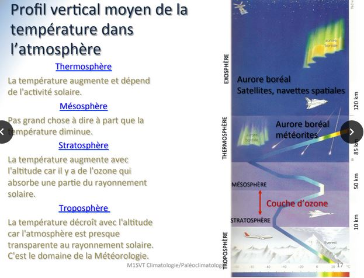

La troposphère : La couche qui est en contact avec la surface terrestre. Épaisseurs typiques : 8km (pôles) – 18km (tropiques). Comprend 75-80% de la masse totale de l’atmosphère. Température diminue rapidement avec la hauteur (~6,5°C /km en moyenne). – 15°C en surface jusqu’à -50°C à 10km d’altitude. C’est la couche qui contient toute la météo que nous connaissons, et la quasi-totalité de la vapeur d’eau. Limite supérieure : **la tropopause**

La stratosphère : Située entre 10km et 50km d’altitude. Beaucoup plus clémente météorologiquement parlant. Contient la couche d’ozone qui filtre les rayons UV solaires nocifs pour la vie. Température augmente avec l’alAtude de -50°C à 10km jusqu’à ~0°C à 50km. C’est une couche extrêmement sèche. L’air y est déjà très raréfié. Limite supérieure : **la stratopause**

La mésosphère : Couche située entre 50km et 80km. Domaine extrêmement raréfié, aux portes de l’espace. Températures diminuent de ~0°C à 50km jusqu’à -90°C à 80km. La mésopause est donc la région la plus froide de
l’atmosphère terrestre. Limite supérieure : **la mésopause**.

La thermosphère : Limite inférieure de « l’espace »

* Ligne de Karman : définie à 100 km d’altitude, c’est la porte officielle de l’espace (altitude à laquelle le vol balistique est plus efficace que le vol atmosphérique)

Domaine des satellites artificiels, de la navette spatiale et de la
Station spatiale internationale. La température augmente rapidement avec l’altitude, jusqu’à des centaines de °C à des centaines de km d’altitude. Cependant, la notion de température devient floue dans ce milieu extrêmement
raréfié (une molécule d’air voyagera ~1km avant d’en frapper une autre). La limite supérieure de la thermosphère est à environ 500km.

Grâce à notre atmosphère.. toute la météo

* Nuages, vents
* Pluie, neige, grêle
* Tempêtes hivernales
* Orages
* Ouragans
* Tornades
* Phénomènes optiques atmosphériques

## V) La pression atmosphérique à l'origine des vents

### Le concept de la pression et température

Niveau moléculaire : force, par unité de surface, qu’un gaz exerce contre une surface en vertu des collisions aléatoires de ses molécules. Cette force est la même dans toutes les directions puisque les trajectoires des molécules sont aléatoires : toute collision contre une surface donnée peut se faire dans toute les directions possibles. Comme la pression, la température est reliée aux mouvements moléculaires, mais ici on parle de l’énergie de mouvement moyen des molécules sans regard aux collisions éventuelles contre une surface.

### Le concept de la pression

Si on augmente la vitesse des molécules en augmentant la température, on pourrait croire que la pression augmentera puisque les collisions seront plus violentes. Oui en partie, mais pas si on diminue la densité du gaz
en question :

* Un gaz chaud mais peu dense peut donc exercer la même pression sur une surface que s’il était froid et dense
* Dans le premier cas, on a des molécules en moins grand nombre mais plus rapides, dans le second cas des molécules moins rapides mais plus nombreuses. Dans les deux cas, on a la même force moyenne due aux collisions, et donc la même pression.

### La loi des gaz parfaits

La pression, la température et la densité ou masse volumique d’un gaz comme l’air au températures et pressions caractéristiques de notre atmosphère sont en tout temps reliées entre elles par la loi des gaz parfaits : p = ρRT

En plus d’obéir à la loi des gaz parfaits, l’air de l’atmosphère terrestre subit une autre contrainte fondamentale : la gravité, qui attire l’air irrémédiablement vers le sol.

### La présence de la gravité

*Pourquoi alors l’atmosphère ne s’effondre-t-elle pas complètement au sol, à nos pieds?*

L’atmosphère ajuste localement sa pression afin de soutenir son propre
poids. L’air au bas d’une colonne subit le maximum de poids de l’air au-dessus de celui-ci et donc doit avoir le maximum de pression pour soutenir ce poids. L’air, disons, au milieu de la colonne n’a pas autant de poids à supporter contre la gravité (puisqu’il y a moins de masse au-dessus), et donc affichera une moins grande pression. Dans les deux cas, il s’établit un équilibre entre la force de gravité qui pousse l’air vers le bas et la pression locale qui le pousse vers le haut : l’équilibre hydrostatique.

C’est pourquoi la pression barométrique à un niveau donné est définie
comme étant égale au poids de la colonne d’air au-dessus de ce niveau.
À un emplacement donné , la pression barométrique diminue toujours avec
la hauteur, puisque le poids à soutenir est toujours plus faible en altitude
que près du sol.

*Comment mesure-t-on la pression barométrique ?*

Le poids de la colonne de mercure vers le bas égalise celui de la colonne d’air qui la force vers le haut. La hauteur de la colonne de mercure à l’équilibre est donc une mesure de la pression atmosphérique.

Une hauteur de mercure de 76 cm représente la pression atmosphérique standard, qui équivaut à 1013,25 hPa. Si la pression atmosphérique augmente, celle-ci poussera davantage sur la surface de mercure contenu dans la cuvette, ce qui fera monter la hauteur de la colonne de mercure. L’inverse se produit lorsque la pression atmosphérique diminue.

### L'origine du vent

Le vent est le mouvement macroscopique de l’air dans une direction donnée. Le vent, une fois créé, peut subir plusieurs forces qui l’influencent en grandeur et direction. Mais l'origine du vent est unique :

* C’est la différence de pression entre deux parcelles d’air qui force l’air de la parcelle ayant la plus grande pression à se mouvoir spontanément vers la parcelle ayant la pression la moins grande.

* Cette différence de pression se nomme aussi gradient de pression

Cette force génératrice du vent s'appelle : force du gradient de pression. L'air se déplace toujours (au départ) d'une région de haute pression vers une région de basse pression. C'est là encore la conséquence des mouvements aléatoires des molécules de l'air.

*Comment crée t-on des gradients de pression ?*

Nous nous attarderons à la création des vents horizontaux 

* Les vents verticaux sont toujours très faibles car la gravité s’oppose toujours et annule presque complètement vers le bas le gradient verAcal de pression vers le haut

Pour générer un vent horizontal, il faut créer un gradient de pression horizontal

C'est dans ce contexte que l'on parle des régions de hautes et basses pression : différences de pression dans un même plan horizontal. Puisque nous avons vu que la pression à un niveau donné est le poids de l'air au - dessus de ce niveau, il suffit, pour changer cette pression, de faire varier le poids ( ou la masse) de l'air au - dessus de ce niveau. Nous verrons que la nature a un moyen fabuleux d'accomplir cette tâche : il suffit de faire varier la température de l'air. Ce concept peut - être illustré par l'exemple qui suit : la circulation thermique.

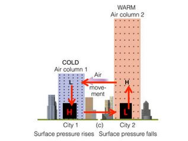

Elle est donc :

* Une combinaison de réchauffement et de refroidissement de l’air causant des variations horizontales de pression en altitude et au sol
* Ces variations de pression forcent l’air à se déplacer des régions de haute pression vers celles de basse pression.
* Ces vents horizontaux sont accompagnés d’ascendance au-dessus des basses pressions en surface et de subsidence au-dessus des hautes pressions en surface. 
* Ces vents horizontaux sont accompagnés d’ascendance au-dessus des basses pressions en surface et de subsidence au-dessus des hautes pressions en surface.

En résumé : le vent provient des variations horizontales de la pression atmosphérique (ou barométrique) à un niveau donné. Ces variations de pression sont dues aux variations horizontales de température. Température et pression atmosphériques sont donc intimement reliées dans ce ballet aérien qu'est la circulation thermique. Un exemple réel de ce type de circulation est la brise de mer.

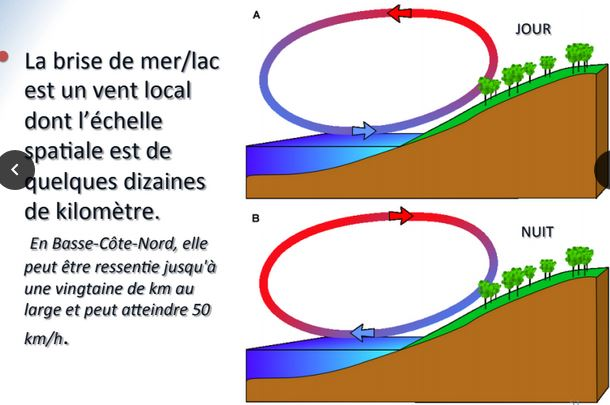

Soient les conditions isothermes et isobares à la surface, tôt un matin, par vent calme. Quelques heures plus tard, la température de la terre augmente tandis que celle de l'eau demeure à peu près constante grâce à la grande capacité calorifique de l'eau. L'air n'est pas réchauffé directement par le Soleil mais plutôt indirectement par la surface. Donc, au dessus de la terre l'air est plus chaud qu'au dessus de l'eau. Ce réchauffement peut affecter typiquement une couche de 1000 à 1500 m d'épaisseur. Puisque l'air chaud est moins dense, l'air au dessus de la terre se dilate à partir du sol. Cela provoque une augmentation de la distance entre les surfaces de pression. Au dessus de l'eau où l'air est très peu réchauffé, la distance entre les surfaces de pression reste la même. Une zone de haute pression se développe en altitude au dessus de la terre et par conséquent, une dépression au dessus de la mer en ressort. Un flux d'air s'établit en altitude de la terre vers la mer à cause de ce gradient de pression. En réponse à l'écoulement en altitude, un dépression se développe en surface sur la terre et une haute pression sur la mer. Un déplacement d'air plus frais s'établit de la mer vers la terre à cause de ce gradient de pression. Des mouvements verticaux s'établissent aussi en réponse aux écoulements horizontaux de l'air ce qui complète la circulation de la brise de mer.

Résumé : La pression atmosphérique est la pression exercée par la masse d'air au dessus du point de mesure. A un endroit donné, la pression atmosphérique change parce que la masse de la colonne d'air de surface = 1m², au dessus de l'endroit, à changé. Le réchauffement ou le refroidissement d'une colonne d'air au dessus d'un endroit donné peut établir des variations de pression sur une surface de hauteur constante au dessus de la surface. Les différences de pression sur un plan horizontale crééent le mouvement horizontal de l'air : le vent. La force du gradient de pression est due aux variations spatiales de pression : 

* Dirigée perpendiculairement aux isobares et toujours dirigée des hautes vers les basses pressions. 
* Proportionnelle au gradient de pression (variation de la pression entre deux points divisée par la distance entre ces deux points). 
* Est la force qui cause le mouvement de l'air.

## VI) L'humidité de l'air, les nuages et la précipitation

### L'eau l'extraordinaire

La seule substance sur la terre présente dans ses trois phases à l'état naturel. La molécule d'eau possède un dipôle électrique permanent, créant des liaisons hydrogène entre les molécules. Les liens hydrogène aident les molécules d'eau à "se tenir" ensemble plus facilement, ce qui confère à l'eau un nombre de propriétés tout à fait unique :

* ils permettent à la molécule d'exister à l'état liquide aux températures et pressions communément rencontrées dans l'atmosphère. 
* il faut beaucoup d'énergie pour changer la température de l'eau (on dit qu'elle possède une grande capacité calorifique). Beaucoup de chaleur peut - être stockée dans l'eau liquide (les océans).
* les énergies impliquées dans les changements de phase sont très élevées : 2,5 millions de joules pour évaporer 1 petit litre d'eau
* l'eau possède une grande tension de surface (effets de capillarité)
* la phase solide de l'eau, la glace, flotte

### Evaporation condensation et saturation

En phase liquide, les mouvements des molécules individuelles sont assez faibles pour que les liaisons hydrogène forcent les molécules à « coller » entre elles, mais assez forts pour que la masse d’eau reste « mouvante » et non cristallisée comme la glace. En phase gazeuse, les liaisons hydrogènes sont inexistantes et les molécules se déplacent librement. A la surface d'un volume d'eau liquide, il y a toujours une fraction des molécules en phase liquide qui, au fil des collisions avec leurs voisines, acquièrent une énergie suffisante, et dans la bonne direction, pour échapper à l'attraction des liaisons hydrogène et passer à la phase gazeuse. C'est l'**évaporation**. De la même manière, il existe toujours une fraction des molécules dans la phase gazeuse possédant une faible énergie qui « plonge » dans la phase liquide, devenant emprisonnée par les liaisons hydrogènes des molécules « liquides ». C’est **la condensation**. Dans un contenant fermé, les taux d’évaporation et de condensation arrivent éventuellement à l’équilibre : c’est la **saturation**. Cet équilibre est fonction **uniquement de la température**. Aux pressions et températures communes, la vapeur d'eau et l'eau liquide coexistent donc parfaitement bien et, à la saturation, la vapeur d'eau a atteint sa **pression saturante**.

### Comment s'exprime la vapeur d'eau dans l'air

* Humidité absolue (kg/m3) (densité de la vapeur d’eau – non utile car sa valeur change avec le volume pour une même masse de vapeur)
* Pression partielle de vapeur d’eau (hPa)
* Humidité spécifique (g/kg) Masse de vapeur d’eau par masse d’air totale
* Humidité relative (%) Taux d’humidité de l’air (masse de vapeur d’eau dans l’air/ masse de vapeur s’il était en équilibre avec l’eau liquide)
* Point de rosée (°C) Température à laquelle une parcelle d’air humide doit être refroidie pour atteindre la saturation de sa vapeur d’eau : c’est la température à laquelle on forme du brouillard ou du nuage

### La pression partielle et de saturation

La pression atmosphérique est la force par unité de surface exercée par le poids de l'air au dessus de la surface. La pression partielle est la pression qu'exerce une seule espèce gazeuse du mélange air atmosphérique. Sachant que l'air est composé d'oxygène (~21%) et d'azote (~78%), on sait qu'à la pression standard, soit environ 1013 hPa, la répartition des pressions partielles est : Azote = ~790 hPa et Oxygène = ~213 hPa.

Dans les premiers 100 Km de l'atm terrestre, les pressions partielles de l'azote et de l'oxygène dépendent uniquement de la pression totale. La pression partielle de la vapeur d'eau varie dans le temps et dans l'espace en relation avec les conditions météorologiques. La pression de saturation de la vapeur d'eau, dépend uniquement de la température et est atteinte lorsque les taux d'évaporation et de condensation sont égaux.

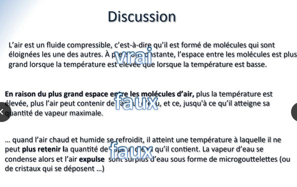

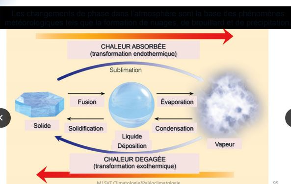

Le point de rosée : la température à laquelle l'air est refroidi sans changer la quantité de vapeur d'eau dans l'air pour atteindre une humidité relative de 100% (saturation)

La pression de vapeur saturante : La pression à laquelle l'eau ou la glace est en équilibre avec la vapeur d'eau dans un volume donné.

### Qu'est ce qu'un nuage ?

Un nuage est un amas de gouttelettes d'eau et de cristaux de glace en très grande concentration (environ de 100 à 500 par cm3). Les gouttelettes et les cristaux ont une taille typique de 0,01mm et sont si légers qu'ils demeurent en suspension dans l'air (par les molécules d'air elles - mêmes). Les nuages stockent l'eau dans l'atmosphère, produisent la précipitation et sont une importance capitale dans la régulation du climat. Les nauges réfléchissent la majeure partie des rayons solaires incidents et provoquent un climat beaucoup plus frais qu'en leur absence (environ 15°C).

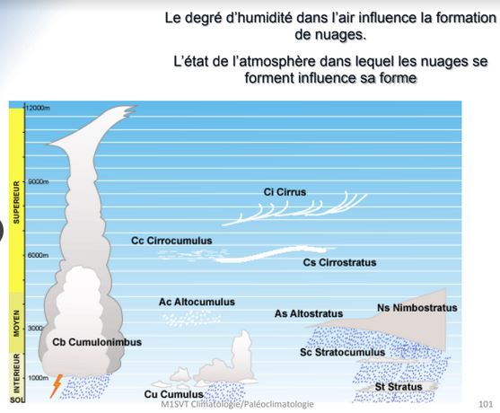

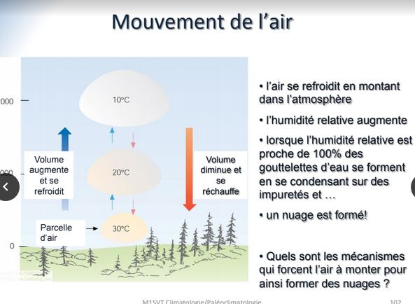

La formation des nuages :

* La convection : La surface de la terre est réchauffée par le soleil, l'air chaud monte et se refroidit en montant.
* La rencontre entre deux masses d'air : La rencontre de différentes masses d'air force l'air à se déplacer verticalement. L'air monte et se refroidit en montant.
* La topographie : Le relief de la terre force l'air à monter. L'air se refroidit en montant.

La formation de précipitation :

* condensation : Pour une gouttelette d'eau pure, l'air doit être supersaturé afin d'atteindre un équilibre évaporation/condensation. Par contre, lorsque la gouttelette est formée sur d'impuretés, elle atteint son équilibre à une humidité relative beaucoup plus basse.
* collisions et coalescence : Grosse gouttelettes capture les petites sur son passage
* formation de cristaux de glace : processus de Bergeron. Dans les nuages les plus froids, les cristaux de glace sont formés : 1. par le gel instantané d'ue goutte d'eau, 2. par le dépôt de vapeur d'eau sur une impureté. La pression de vapeur saturée est plus faible pour la glace que pour l'eau. Ceci produit un flux de vapeur de la goutte d'eau à la glace et réduit la pression de vapeur par rapport à l'eau. Les cristaux de glace croissent en capturant des gouttelettes de nauages, ils peuvent aussi se briser en morceau et capturer d'autres cristaux de glace sur leur passage.

### Le brouillard

La formation du brouillard : formé de petites gouttelettes d'eau, se produit lorsque l'humidité relative s'approche de 100% favorable pour la formation de gouttelettes d'eau par condensation. Une humidité relative 100% est atteinte de différentes façons, par exemple : l'air peut se refroidir de plusieurs façons en gardant sa quantité d'humidité presque constante. Radiation : Lorsque l'air se refroidit durant la nuit.

## VII) Les vents et la circulation de l'atmosphère à l'échelle planétaire

### Physique élémentaire : vitesse et forces

*Qu'est ce que la vitesse d'un objet?*

* Distance parcourue dans un temps donné
* La direction dans laquelle l'objet se déplace

En physique, lorsque la vitesse d'un objet change (en grandeur et/ou en direction), on dit qu'il y a accélération lorsque :

* seulement la direction change ou,
* seulement la grandeur change
* ou les deux changent

Toute accélération d’un objet est le résultat d’une force agissant sur l’objet (si aucune force n’agit, la vitesse de l’objet restera constante et en grandeur, et en direction). Donc si un objet va plus vite, ou s’il va moins vite, ou s’il change de direction, il est accéléré, et cela est dû à une force agissant sur lui. La direction et la vitesse du vent dépend donc de la nature des forces agissant sur l’air.

### Les forces agissant sur le vent

* Force de gradient de pression
* Force de Coriolis
* Force centripède
* Force de friction

#### Force du gradient de pression

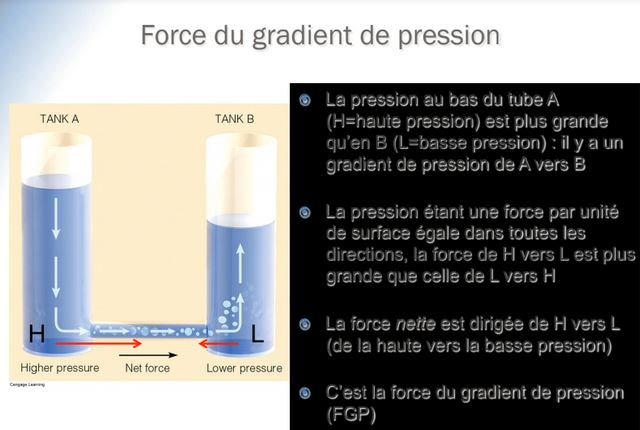

Sur une carte de surface, la force du gradient de pression FGP est toujours dirigée des hautes pressions vers les basses pressions. Plus les isobares sont rapprochés, plus la FGP est grande. Elle est perpendiculaire aux isobares. Les isobares rapprochées correspondent à de forts vents. Les isobares plus lâches correspondent à des vents plus faibles.

#### Force de Coriolis

La FGP est la cause d'origine du vent. Dès que l'air se met à bouger, à cause de la FGP, il est immédiatement dévié de sa course par la force de Coriolis.

La force de Coriolis sur un objet se déplaçant au - dessus d'une Terre en rotation dépend de :

* la vitesse de l'objet
* la latitude de l'objet

La force de Coriolis ne **change que la direction du vent** jamais la vitesse.

Lorsque le vent est à l'équilibre, entre le FGP et la force de Coriolis, il souffle à vitesse constante et dans la même direction, et se nomme **vent géostrophique**. Le vent est purement géostrophique le long d'isobares **rectilignes**. Le vent géostrophique en altitude peut - être estimé comme suit : 

* Direction : parallèle aux isobares
* Vitesse : inversement proportionnelle à l'espacement des isobares (rapprochées = vents forts; éloignées = vents faibles)
* Donc : même en l'absence de mesures directes du vent, le vent réel peut - être estimé (à 10% près) par les mesures de pression seulement.

Force fictive agissant perpendiculairement à la direction du mouvement d'un corps en déplacement dans un référentiel. Les mouvements des masses d’air (résultant de différences de pression) entre les différentes régions du globe vont être affectés par cette force due à la rotation de la Terre et être déviés.

#### Force centripède

Les isobares des cartes météo ne sont pas seulement rectilignes, mais présentent très souvent une courbure plus ou moins importante. La courbure des isobares cause **un déséquilibre** entre la force du
gradient de pression et la force de Coriolis, causant à son tour un
changement dans la direction du vent. La force nette se nomme **force centripète**, puisqu’elle agit vers le centre du système afin de changer la direction du vent.

#### Force de friction

La surface de la Terre, avec toutes ses irrégularités et sa topographie variée, cause une force de friction importante sur le vent, qui se fait sentir typiquement jusqu’à 1000m d’altitude. Cette couche de l'atmosphère dans laquelle l'effet de la surface terrestre est notable se nomme la **couche limite planétaire**. La force de friction cause une diminution de la vitessse du vent, et donc de la force de Coriolis. Il s’ensuit une **domination du gradient** de pression sur la force de Coriolis, qui
amène le vent à tourner vers les basses pressions de sorte que la direction du vent croise les isobares vers les basses pressions selon un angle d’environ 30° en moyenne. Autour d'une dépression en surface, le vent tourne donc dans le sens anti - horaire dans l'hémisphère Nord (horaire dans l'hémisphère Sud) et **converge** vers son centre. Autour d'un anticyclone en surface, le vent tourne dans le sens horaire dans l'hémisphère Nord (anti - horaire dans l'hémisphère Sud) et **diverge** de son centre.

La convergence des vents de surface autour d'une dépression provoque l'ascension de l'air au centre. Vers 5-6 Km d'altitude, cet air commence à diverger. La pression centrale de la dépression changera si la convergence en surface n'est pas égale à la divergence en altitude. Le **développement** d'une depression dépend donc du **déséquilibre** entre la convergence de surface et la convergence d'altitude. 

Résumé des forces :

* Force de gradient de pression : produite par la différence due à une différence de température.
* Force de Coriolis (force apparente) : dévie la circulation atmosphérique vers la droite dans l'hémisphère Nord à cause de la rotation de la Terre.
* Force centripède : force nette dirigeant le vent vers l'intérieur des systèmes de basse et de haute pression.
* Friction : frottement dû à la surface de la Terre.

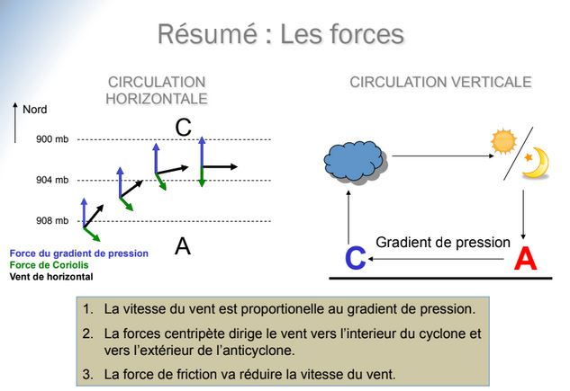

## VIII) La circulation de l'atmosphère à l'échelle planétaire

### Les vents à l'échelle planétaire : la circulation générale 

Nous verrons que la Terre, étant un objet sphérique, n’est pas réchauffée
uniformément par le Soleil, les tropiques recevant toujours plus d’énergie
que les pôles (l’effet étant modulé par l’inclinaison l’axe de rotation de la Terre et les saisons). La rotondité de la Terre provoque ainsi un
**réchauffement différentiel latitudinal**.

Si la Terre n’avait pas d’atmosphère ni d’océans, il s’ensuivrait un équilibre **radiatif** entre la surface et l’espace interplanétaire grâce auquel, à chaque latitude, des quantités égales d’énergie infra-rouge émise et d’énergie solaire reçue seraient observées. Dans ce cas, le contraste entre l’équateur et les pôles serait extrême. Par exemple, sur la Lune, le contraste entre l’équateur et les pôles peut atteindre plus de 300°C (+100°C à l’équateur vs. -200°C aux pôles).

A l'echelle globale, la Terre est à l'équilibre radiatif : elle émet autant d'énergie qu'elle en reçoit du Soleil. Cependant, l'ensoleillement oblique sur le globe cause un réchauffement plus marqué à l'équateur qu'aux pôles et un transport de chaleur des laltitudes ayant un surplus énéergétique vers les latitudes ayant un déficit en résulte.

### La circulation générale

La circulation atmosphérique : les perturbations atmosphériques (hautes et basses pressions) entraînent l'air chaud vers les pôles et l'air froid vers l'Equateur.

La circulation océanique : les courants marins contribuent efficacement à amoindrir les écarts de température sur la planète.

La présence d'une atmosphère autour de la Terre modifie la réponse de la planète au réchauffement différenAel à la manière d’une gigantesque brise de mer nord-sud. Dans ce contexte, la circula1on planétaire transportera l’excès de chaleur équatoriale vers les pôles, de sorte que le contraste pôle-équateur n’est plus que d’environ 70°C en moyenne (+30° à l’équateur vs. -40°C aux pôles). L'effet de l'atmosphère terrestre est donc de **redistribuer globalement la chaleur solaire et minimiser le contraste nord - sud des températures**.

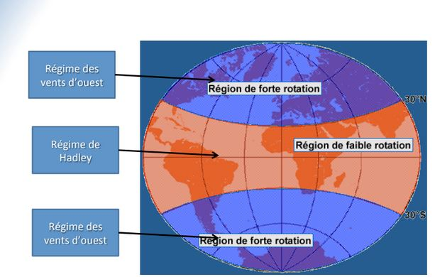

### Les courants jet sous - tropical et polaire

Le régime des vents d’ouest prend naissance des gradients nord-sud de température entre les tropiques et les pôles, lesquels produisent des gradients nord-sud de pression en altitude. Combiné à la force de Coriolis, des vents d’ouest en altitude résultent nécessairement, et ce dans les deux hémisphères. Par définition, le gradient nord-sud de température est très élevé le long du front polaire. Il s’ensuit un fort gradient nord-sud de pression en altitude, et donc un fort vent d’ouest. Ces vents particulièrement forts se situent à la tropopause, et sont fondamentalement
reliés à la présence du front polaire : c’est le **courant jet polaire**, que l’on observe généralement près de 60° de latitude. De manière similaire, l’air convergent au-dessus des anticyclones sous-tropicaux concentre les températures en altitude le long du front sous-tropical (mais qui n’existe pas en surface), et forme le **courant jet sous-tropical** à la tropopause près de 30° de latitude. Les courants jet s’assimilent donc à des « rivières » rapides d’air qui englobent la Terre aux latitudes sous-tropicales et moyennes.

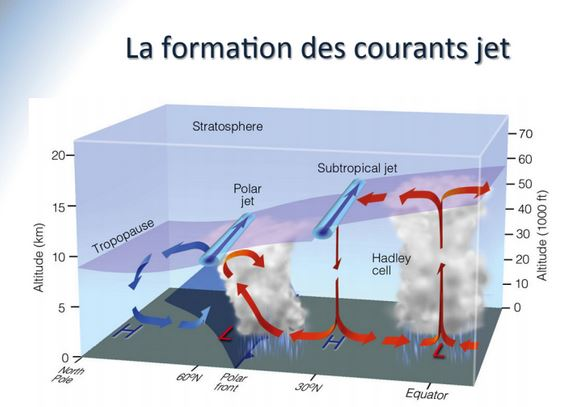

### Des rivières d'air autour du globe

Les courants dominants se situent en altitude où les vents soufflent le plus fort. Il y a moins de friction en altitude qu'à la surface de la Terre. La différence de température entraîne la formation du courant polaire et subtropical. En hiver, la plus grande différence de température entre l'équateur et le pôle intensifie le courant jet. Ces vents sont dirigés d'ouest en est à cause de la force de Coriolis.

La circulation générale est la circulation moyenne de l'air atmosphérique. Le vent instantané est très différent de la valeur moyenne. Les conditions moyennes nous aident à identifier les causes majeures de l'écoulement de l'air. La cause fondamentale de la circulation atmosphérique est le réchauffement différentiel de la planète : 

* l'air chaud est transféré de l'équateur vers les pôles
* l'air froid est transféré des pôles vers l'équateur

Le modèle à une cellule suppose :

* Une surface uniforme d’eau
* Le rayonnement solaire est perpendiculairement à l’équateur
* La Terre ne tourne pas autour de son axe

Le modèle à trois cellules

* La Terre est en rotation autour de son axe = trois cellules (Hadley, Ferrell,Polar)
* Formation de ceintures de hautes et basses pressions alternativement (avec une ceinture de basses pressions à l’équateur)
* Des ceintures de vents de direcAon différente en commençant par des vents de NE au nord de l’Équateur et SE au sud.

Les vents et la pression à la surface : centres de haute et basse pression semi permanents. Circulation générale et patrons de précipitation :

* Pluvieux où l'air monte (dépressions à la surface)
* Régions sèches ou même désertiques où l'air descend (anticyclones à la surface).

Ecoulement moyen et pression en altitude

* Le gradient de température sud – nord et le gradient de pression en altitude est à l’origine des vents Ouest – Est, surtout où les gradients sont le plus élevés : aux latitudes moyennes.
* Formation des courants-jet : des forts vents de 100-200 nd à l’altitude de 10-15 km, des rubans entourant la planète de milliers kilométres de longueur et de 100 km de largeur et quelques kilomètres de hauteur. Courant-jet polaire et courant jet sous tropical.

### La circulation globale

L'océan et l'atmosphère interagissent entre eux par des échanges d'énergie. Il se génère ainsi des différences dans les zones de pressions donnant les **dépressions** (ou cyclones) et les **anticyclones**.

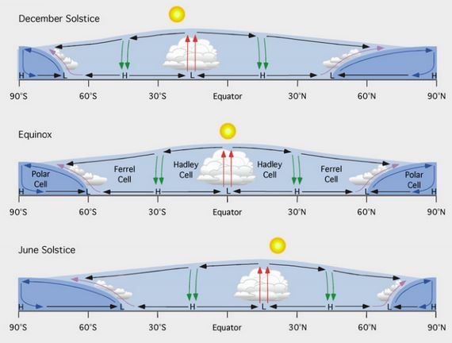

## IX) Masses d'air et fronts

### Variabilité des conditions météorologiques

L'observation et l'analyse des conditions atmosphériques mettent en évidence des variations parfois brusques des divers éléments météorologiques :

* Rotation soudaine des vents;
* Variation importante et rapide de la température;
* Bouleversement rapide du type de temps, par exemple passage d'un temps froid et sec à un temps doux et humide ... etc....

Pour interpréter ces phénomènes, on admet que l'atmosphère n'est pas une
masse de fluide homogène, mais un ensemble de grandes **masses d'air**, plus
au moins individualisées, plus au moins homogènes en elles-mêmes, séparées
les unes des autres par des **zones de transition**, parfois abruptes, qui peuvent être assimilées à des discontinuités.

Une masse d'air est un concept uAle dans les laAtudes moyennes et correspond à une grande étendue horizontale d'atmosphère où les caractéristiques de température et d'humidité sont similaires.

* Elle couvre plusieurs millions de kilomètres carrés.

* En bonne partie, la prévision du temps à nos latitudes consiste à diagnostiquer et catégoriser les masses d’air du jour et à prévoir leur mouvement et leurs interacAons le long du front polaire.

Régions source d'une masse d'air

* Surfaces relativement plates et de composition uniforme
* Vents faibles

Des bonnes régions source de masses d'air sont donc les plaines de l'arctique recouvertes de neige et les océans aux latitudes tropicales et équatoriales. Les masses d'air interagissent aux latitudes moyennes le long du front polaire.

### Les systèmes météorologiques aux latitudes moyennes

Les sytèmes météorologiques aux latitudes moyennes redistribuent l'énergie dans l'atmosphère. Ils sont les principaux artisants de la météo. L'étude des ces sytèmes météorologiques a vu le jour suite à un désastre maritime survenu lors de la guerre de Crimée. Napoleon III demanda à l'astronome français Le Verrier si on aurait pu prévoir cette tempête. Ils ont été l'objet d'études extensives du groupe de scientifiques à Bergen, Norvège (Vilhelm et Jakob Bjerknes, Halvor Solberg, et Tor Bergeron). C'est dans les années 1920 que ce groupe de scientifiques développa la théorie du front polaire pour décrire la formaAon et l'évolution des systèmes aux laAtudes moyenne.

Vortex polaire -> origine boucle de convection

Pôle fond -> moins froid, océan stocke plus de chaleur

Gradient Energie absorbée entre le Nord et l'Equateur diminu

courant de gel moins contraint par le gradient donc ocsillation -> air froid descend plus bas et l'air chaud remonte plus haut

changement climatique destabilise le vortex polaire

Le gradient doit être à altitude équivalente pour la formation des vents

Un pôle Nord où on ne peut pas mettre  beaucoup d'humidité donc peu de précipitation

Zone aride apparait plus facilement des zones froides

les vents en altitude sont soumis à Coriolis

Coriolis change uniquement la direction par l'intensité 

Golf stream apporte chaleur sur les côtes françaises

Mer morte -> érosion, dorsale apporte minéraux 

Azote et Chlore -> temps de résidence le plus long dans l'eau (~ 200 000 ans)

La variation de salinité mondiale liée à la différence d'évaporation

thermoclyne -> limite de l'impact des saisons sur la température de l'eau

Au  fond de l'océan , on peut avoir des températures inf à 4 °C car la pression empêche le gel

gradient de densité liée à la salinité entraine circulation thermo - aline

halocline -> limite de l'impact de surface sur la salinité 

pycrocline -> limite de l'impact sur la densité 

variation oxygène et nutriments liés à l'activité en phytoplancton

évaporation supérieur dans l'Altlantique car avec Coriolis,  l'évaporation précipite dans le Pacifique 

Ordre de grandeur du débit des courants profonds = milions de m3. s-1

Apport d'eau douce dans zone de plongeon -> ralentir courant marin car apport eau douce -> réduit la remontée de du Golf Stream donc période plus froide jusqu'à fonte totale de la glace.

