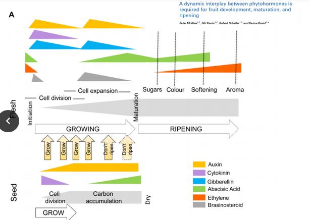
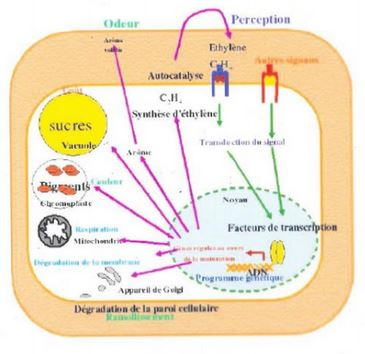
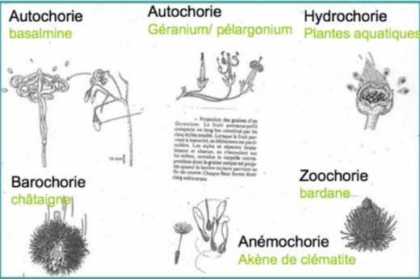

# Chapitre 3 : La formation des fruits

La maturation des fruits va être découpé en trois phases :

* phase de **croissance**
* phase de **maturation**
* phase de **sénescence**

I) Phase de croissance du fruit charnu ou nouaison

C'est la phase de **transformation de l'ovaire en fruit**, elle est **déclenchée par la pollinisation** ce qui donne des fruits parthénocarpique. Cela se fait de façon naturelle (banane) ou chez le raisin (sans graine) transformé pour ne pas qui est de graine à l'intérieur.

Phase de croissance : phase de croissance importante après la fécondation, dûe à l'**élongation cellulaire**. Grandissement cellulaire : augmentation de la taille considérable. La multiplication cellulaire n'intervient pas ou très peu. Souvent la courbe se termine par un plateau (surtout chez les drupes car lignification de l'endocarpe), courbe **sigmoïdale**. Deux phyto hormones acitves durant cette phase : auxine et gibbérellines. Après la pollinisation, le dvp des fruits (ou faux fruits) est contrôlé par les graines en formation source importante d'hormones.

Les gibbérelines peuvent égalemet jouer un rôle dans l'**élongation cellulaire** et l'**ouverture des fruits**.

L'ovule après pollinisation secrète de l'auxine en grande quantité. Induit la **prolifération des tissus du péricarpe**. Expérimentalement, l'application exogène d'auxine mime la pollinisation : obtention de **fruits parthénocarpiques**.

L'auxine va diminuer ensuite ce qui inhibe le **murissement** du fruit (couleur..), pour que le fruit puisse avoir sa **phase de murrissement**.

## II) La maturation des fruits charnus

La **phase de maturation** des fruits charnus débute quand le fruit atteint sa taille limite. Les fruits vont subir de nombreux **changements métaboliques** (teneur en sucre, alcool). Le fruit sera moins acide, plus juteux, changement de couleur.. Toutes ces modifications ont pour objectif d'attirer les aniamux pour favoriser la **dispersion des semences**.

Ce changement de la couleur du fruit est la **véraison** : augmentation de la **synthèse en pigment** et diminution de la **teneur en chlorophylle**. On va avoir un enrichissement en **sucres solubles** et une diminution de la teneur en **acides organiques**. Au cours de la maturation, on aura une diminution de la teneur en acide organique : la saveur du fruit va s'effectuer en fonction de la balance sucres - acides. 

Le fruit deviendra moins ferme -> relachement de la paroi cellulaire végétale. Elle va s'accompagner d'une augmentation d'activité enzymatiques :

* Polygalacturonases : pomme, kiwi, cerise, tomate
* Cellulases : hydrolysent la cellulose chez la tomate
* XET : tomate, kiwi, melon

Ces modifications sont sous le contrôle des **phytohormones** : Ethylène va contrôler l'activité d'enzyme chez les climactériques.

**Fruits climactérique** sont des fruits avec la production d'éthylène à maturité, possède ces propres récepteurs à l'éthylène. A partir du moment où on peut cueillir un fruit, dans la phase de maturation, il est capable de continuer sa maturation. Comme l'éthylène est une hormone gazeuse, il va pouvoir stimuler les fruits étant à proximité. Pour retarder la maturation des fruits, on baisse le taux d'éthylène, ou on va retarder son activité.

Chez les **non climactérique**, on a une production d'**acide abscissique**. 

Durant la maturation des fruits, 2 piques : **éthylène** et **intensité respiratoire**. Les fruits possèdent une **crise climactérique**. Chez les non - climactérique, il n'y a pas de pique d'éthylène et une diminution de l'intensité respiratoire. 

Chez les fruits **non climactérique** l’**éthylène n’intervient pas** dans la maturation des fruits. L’acide abscissique intervient. Chez les agrumes par exemple ou la fraise. Ils peuvent présenter une
**acidité beaucoup plus prononcée que chez les fruits climactérique** parce qu’on a pas le **pic d’intensité respiratoire**. Lors de cette **intensité respiratoire**, c’est l’apport d’oxygène qui va faire
une oxydation des fruits climactérique.

### La maturation des fruits secs

On a les **fruits secs déhiscent**, le **péricarpe** se lignifie. Il va devenir **imperméable**. La lignification dans ce cas là va s’effectuer au niveau de l’**épicarpe** et au niveau de l’**endocarpe**. Cette
lignification aboutit à la formation de **fibres**, ces fibres vont être orientées perpendiculairement par rapport à l’**axe de déhiscence**, le fruit en arrivant à maturité va se déshydrater.

Chez les **fruits secs indéhiscent** on a une lignification de **toutes les cellules du péricarpe**. Le fruit ne s’ouvre pas à maturité. La lignification a un rôle de **protection**. Par exemple dans le cas du
nucule de la noisette.

## IV) La sénescence et l'abscission

La **sénescence** est le vieillissement du fruit et l’**abscission** est la chute des fruits. On prend l’exemple du fruit de tomate, c’est un **fruit climactérique**. Lors de sa **maturation** il produit de l’**éthylène**. L’**éthylène** va être transporté jusqu’à la tige du fruit. Lorsque le fruit charnu est **sénescent** les cellules produisent de grandes quantité d’éthylène qui vont diffuser jusqu’à la **zone d’abscission** du fruit.

L’**auxine** et l’**éthylène** vont avoir un **rôle antagoniste** au niveau de l’**abscission** du fruit, l’auxine **ralentit la chute du fruit** et l’éthylène va **favoriser sa chute**. L’**éthylène** va stimuler la production d’**enzyme** de type **cellulase** ou de type **polygalacturonase**. L’éthylène va **hydrolyser les parois primaires** au niveau du **tissu séparateur** sur la zone d’abscission. Le tissu séparateur est constitué de cellules avec une paroi fine, sous l’action de l’éthylène on a **activation** d’enzyme qui vont fragiliser la paroi de ces cellules. Le fruit est retenu à la plante mère que au niveau des tissus à cet endroit donc il va tomber plus facilement. La plante mère ne va pas nécessairement mourir après la chute du fruit, il est important pour elle de cicatriser cette zone en produisant du **suber** pour renforcer cette zone pour empêcher l’entré de micro-organismes.

## V) La dissémination des fruits

On a un transport à courte distance quand le fruit tombe au pied de la plante mère.

## VI) La classification des fruits 

Une **semence** est l'organe de dissémination des spermaphytes.

On distingue deux types de fruits en fonction du devenir du **péricarpe**:

- **Charnus**: selon le niveau de développement de l’endocarpe:
	- Membraneux gélifié; Bacciens ou baies. On les appelles aussi les fruits à pépin (exemple du raisin)
	- Sclérification; drupacés ou drupes. On les appelles aussi les fruits à noyau (exemple de la pêche).
- **Secs**
	- **Déhiscents**: fruits qui s’ouvrent, capsuloïde. On en distingue plusieurs selon le nombre de lignes de déhiscence:
		- Follicules: Une ligne de déhiscence.
		- Gousses: deux lignes de déhiscence.
		- Capsules: trois lignes de déhiscence.
		- Siliques; s’ouvrent le long de la capsule.
	- **Indéhiscent**:
		- Akènes: gynécée conservée dans sa totalité, souvent plumeux (pissenlit).
		- Samares: développement sous forme « d’aile » du péricarpe (érable, frêne).
		- Nucules: péricarpe osseux (noisette).
		- Caryopses: fruit des poacées, le péricarpe est soudé aux téguments de la graine

On a des fruits:

- **Simples**: le fruit résulte d’un seul ovaire ou de plusieurs carpelles soudées.
- **Multiples**: le fruit résulte du développement de plusieurs carpelles libres.
- **Complexe**: dans le développement du fruit on a une autre composante que le gynécée. Par exemple une pièce stérile de la fleur; réceptacle floral, pétales... Cas des ovaires infères adhérant au réceptacle floral. Par exemple chez les pommes, poires. Chez la fraise le réceptacle floral devient charnu (fruit à la fois multiple et complexe).
- **Infructance**: résulte du développement d’une inflorescence (Ananas).
- **Parthénocarpique**: fruit simple sans graine (banane)
