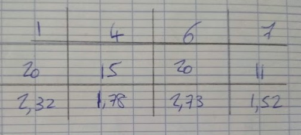
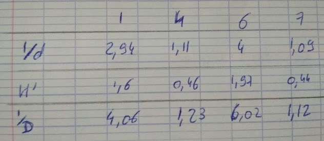
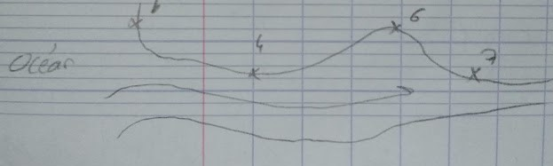
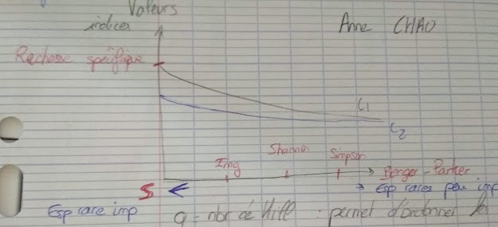
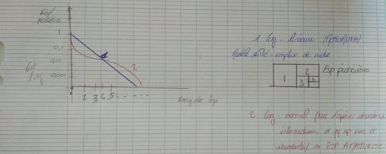

# Td Structure des communautés

* Connaître la diversité
* Savoir la quantifié

Ceci n'est pas simple car il existe une double facette dans le mot "Diversité".

* le nombre d'espèce : comparaison entre écosystèmes
* l'abondance de chaque espèce

Importance qu'on doit donner entre une espèce dominante et une espèce rare.

## I) Indices basées sur la richesse

**Indice de Margaleff**

S : Richesse spécifique

N : Abondance totale de la communauté

**Img = (S-1) / ln N**

L'équation s'annule lorsque qu'il n'y aura qu'une espèce : pas de communauté mais une population. Plus l'indice augmente, plus la diversité augmente.

## II) Indice basé sur l'abondance relative

**Indice de Berger - Parker**

**d = (nmax) / N => 1/d**

N : Effectif totale de la communauté

n max : Effectif de l'espèce de Rang 1 

## III) Indices composites

**Indice de Shannon**

**H' = ∑ pi ln pi**

pi : Abondance de l'espèce i

H'max : ln S

Eveness = H'/ H'max

**Indice de Simpson**

**D =  ∑ pi² => 1/D** 

pi : Abondance relative de l'espèce i

La station la moins diversifié est la même pour chaque indice. La station 6 est la plus diversifié et la station 7 est la moins diversifié. La différence des stations va différée en fonction des indices.

La station 6 est la plus diversifié car il y a des périodes d'eau salée et des périodes d'eau douce. Il n'y a donc pas d'espèces dominantes. La station 1 possède une communauté complètement aline car il y a peu d'eau douce, certaines espèces sont dominantes. La station 4 prend des courants dominants marins en pleine figure donc le substrat est très instable et le niveau de perturbation est très fort. La station 7 est très faible en diversité car elle connait un fort taux de pollutions dû à une usine.

## IV) Profils de diversité

q : nombre de Hill : permet d'ordonner les nombres en fonctions des espèces rares.

## V) Modèles basés sur les abondances relatives

