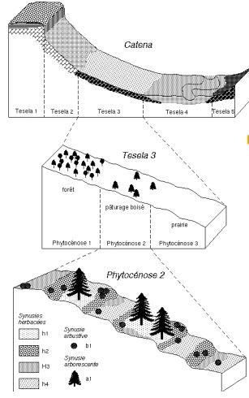
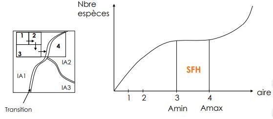
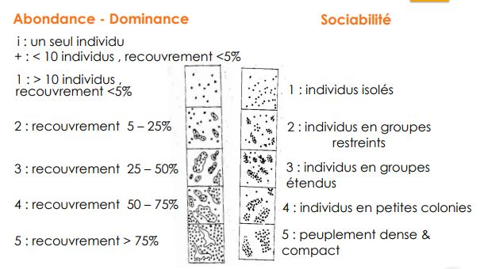
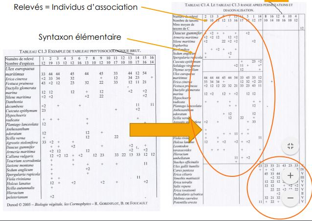
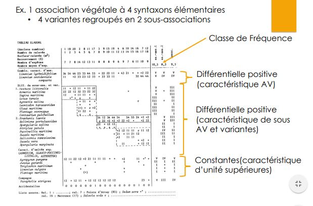
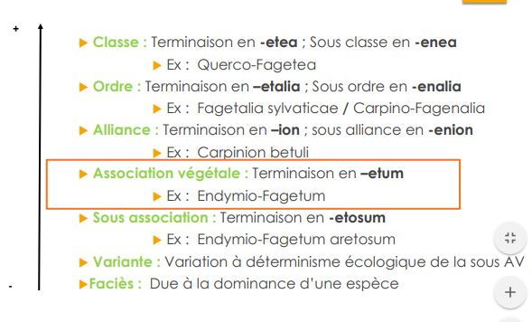
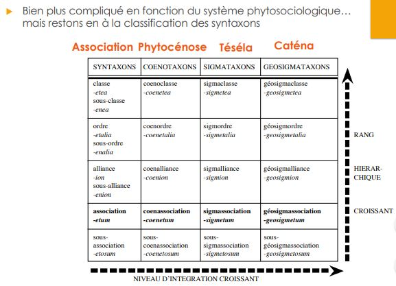
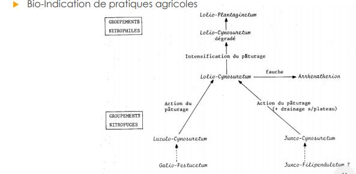
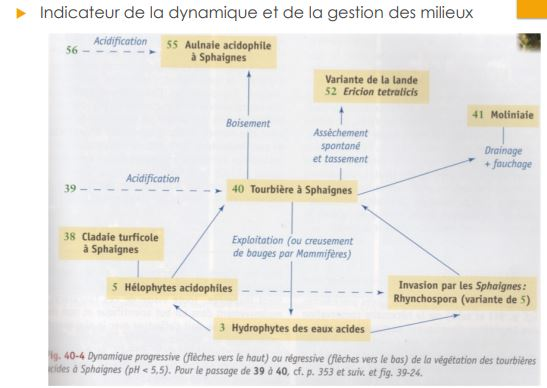
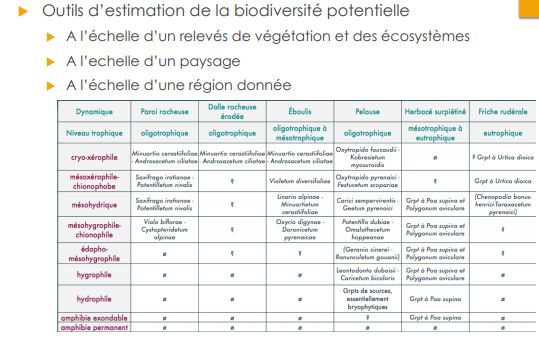

# La phytosociologie sigmatiste

## Introduction

La **phytosociologie** est une sous discipline de l'Ecologie. On s'interresse à la **répartition des population / espèces à l'échelle global**. C'est pourquoi nous allons travailler sur l'**Autécologie** (facteurs de répartition). Les interactions biotiques sont variables entre les espèces en fonction des espèces déjà présentes, **Synécologie**. Une **communauté** est un **regroupement d'espèces différentes mais d'unité taxonomique proche** regroupées dans **une station donnée et présentant des relations fonctionnelles fortes**. Elles peuvent être d'ordres trophique ou neutre.

La phytosociologie est **fondatrice** de l'Ecologie végétal. Science de l'étude des tendances naturelles que manifestent des population d'espèces végétales différentes à cohabiter dans une communauté végétale ou au contraire à s'en exclure.

En Biogéographie, l'approche est physionomique donné par les types biologiques dominant : forêt, formation arbusives, landes, prairies. Cependant, à l'échelle du paysage, cela reste l'observation reste "grossière".

Un **catena**, un complexe de Tesela assemblé par zonation ou par mosaïque au sein d'une même unité géomorphologique. 

Un **Tesela**, un complexe de phytocénose dérivant les unes des autres par dynamique successionnelle. 

La **phytocénose** est une communauté végétale formée d'un complexe de synusie organisé dans l'espace et dans le temps au sein d'une station.

Une **station**, une surface à l'intérieur duquel les conditions géomorphologiques, édaphiques, climatiques sont globalement uniformes. 

Une **Synusie**, un ensemble d'individus d'une espèce végétale caractériser par la représentation forte d'une stratégie adaptative.

Selon l'unité de base :

* Phytosociologie Synusiale (Synusie) 
* Phytosociologie Sigmatiste (Phytocénose, communauté végétale)

## Historique de la Sigmatiste

SIGMA = Station Internationale de Géobotanique Méditerrannéene et Alpine

Les objectifs : 

* Identifier et classer les groupements végétaux
* Caractériser leur écologie
* Caractériser leur dynamique  et leur distribution 
* Faire émerger leur potentiel de bio-indication

## Le concept central

Notion d'**association végétale**, l'association est une **combinaison originale d'espèces** dont certaines, dites caractéristiques, lui sont plus particulièrement **liées**, les autres étant qualifiées **campagnes**. Concept abstrait qui se dégage d'un **ensemble d'individus d'association** possédant en commun à peu près les **mêmes caractères floristiques, statistiques écologiques, dynamiques, chorologiques et historiques**. 

## L'individu d'association 

Il ne faut pas confondre **association végétale et "Formation végétale"**.
Elle est pour l'association végétale l'équivalent de l'**individu** pour l'espèce. L'individu d'association est le relevé floristique.

## Méthode d'Etude de la végétation

Pour caractériser, une association végétale statistiquement robuste, il faut décrire plusieurs individus d'associations. A l'échelle du paysage : repérage d'ensembles végétaux homogènes : individus d'association. La physionomie homogène provoque une composition floristique homogène.

Notion de surface floristiquement homogène, surface necessaire à faire la liste des espèces qui donnent la physionomie uniforme à votre individu d'association. Définir la taille de la surface du relevé de végétation. 

Le relevé floristique :

* sur une surface physionomiquement et stationnellement homogène
* lister pour chaque strate la liste des espèces présentes
* donner pour chaque strate le % de recouvrement total
* décrire le comportement de chaque espèce par strate
* 2 coefficients principaux : abondance, dominance et sociabilité 
* autre coefficient : indice de vitalité : °(réduite) et ! (forte), état : j (juvénile) notamment pour les plantules
* décrire le relevé : date, localisation, topographie, surface du relevé, nature de la roche mère, type d'humus..

## Classement

La démarche phytosociologique vise ensuite à réunir les IA selon leur ressemblance en termes de physionomie et de composition floristique ,en catégories abstraites que l'on appelle :

* des syntaxes élémentaires (syn-E)
* puis association végétale (AV) a minima.

Faire émerger les espèces caractéristiques des Syn-E. Il existe plusieurs méthodes, le manuel : méthode des tableaux, informatique : CAH/AFC.

Il faut faire apparaître les espèces constantes avec un fort pourcentage d'occurrence, et les espèces  compagnes, avec un faible pourcentage d'occurrence.

Différentielles positives d'AV

* espèces fortement présente dans une AV
* absentes dans une autre
* espèces caractéristiques d'AV

Différentielle négative d'AV :

* espèces absentes dans une AV
* présentes dans une autre

## Synsystème

Les **syntaxons sont ordonnés dans un système hiérachisé**. La construction du système se fait du **niveau le plus bas vers le niveau le plus large**: démarche **ascendante**. De par le caractère intégrateur des plantes, chaque groupement représente les **conditions écologiques** (biotiques et abiotiques) et **géographiques** qui lui permettent de s'exprimer. Le synsystème est décliné jusqu'au niveau de la sous- alliance pour le territoire français, fixé par le Podrome des végétations de France. 

Ensuite, communication à l'internationale et enfin le développement d'outils de gestion. 