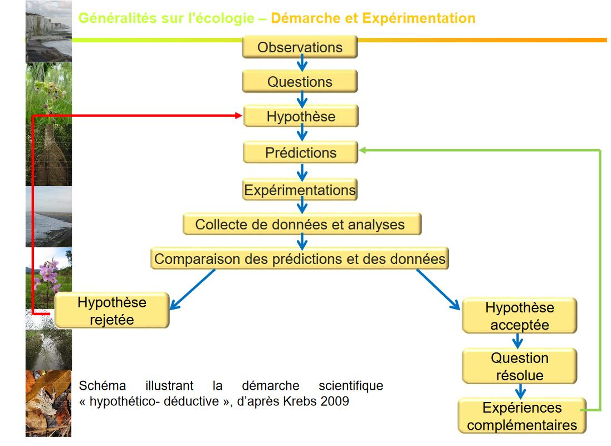

## Introduction générale

## I) Un peu d'histoire 

Discipline ancienne, remontant aux premiers hommes ayant développé la chasse, la pêche, collecte : besoin de connaissance sur quand et où trouver leurs ressources.

Vers le developpement de la sédentarisation et des pratiques agricoles : besoin de comprendre le developpement des plantes et le comportement des animaux.

Traces d'écrits datant des Egyptiens, Babyloniens concernant les récoltes (centre de passage de commerces très importants)

Ecrits du 4e siècle par Aristote traitant des fléaux de mulots et de criquets.

A partir du 17e siècle, beaucoup d'étude sont entreprises sur les pop humaines (dynamique des pop) et en histoire naturelle (diversité du vivant)

La pomme de terre a été une très grosse ressource de même pour les tomates, maïs, riz. Elles vont être apportées au fur et à mesure des découvertes. L'Homme a aidé les espèces à se développer, ce qui a pu provoquer des espèces invasives créant la disparition d'espèces.

**GRAUNT** en **1662** décrit les changements quantitatifs de la population humaine de Londres et estime qu'elle peut doubler en 64 ans.

**MATHUS** (énonomiste) en 1798 décrit son inquiétude face à la démographie humaine galopante dans son ouvrage *Essay on Population*

* **loi mathus** (mettant en relation la démographie et la ressource alimentaire)
* interêt des maths dans la compréhension des règles de la démographie : ex courbe logistique de Verhuist 1838 

**Carl VON LINNE**: Nombreuses expéditions en Europe
* **1735** : publication de *Systenna naturae* qui présente sa classification de la nature
* **1753** : publication de *Species plantarium* description des espèces végétale, utilisation de la nomenclature bionimale

**BUFFON** 1756 : écrit l'ouvrage *Histoire naturelle* qui est l'une des plus importantes entreprises de publication scientifique du Siècle des Lumières

**1805: ALEXANDER VON HUMBOLDT** géographe et naturaliste travaille sur la *géographie des plantes* Nombreuses expéditions pour les Amériques
* étape de la végétation : met en relation végétation - climat

**G. SAINT HILAIRE** dvp le sciences du comportement (Ethologie)

**ERNST HECKEL** propose en 1866 le terme **ECOLOGIE***

**FLAHAUT** propose le concept d'association végétale*

**1913** fondation de la British Ecological Society

**1916** : fondation de la Ecological Society Américaine

**1992** : Nations Unies - **Sommet de la Terre à Rio de Janeiro**
* préservation de la diversité biologique

**1976** Ecologie devient une science officielle en France (section *ecologie* au CNRS)

**1997** : signature du protocole de Kyoto
* diminution de 6 gaz : CO2, le méthane, No, HFCs, PFCs

## II) Place de l'écologie 

L'écologie à besoin de biologie, science comportementale (ex type de musique), l'évolution, la génétique (ex :retrouver les ancêtres communs) et la physiologie.

* **étudier le fonctionnement et l'évolution de chaque système ou niveau d'organisation**
* **mettre en évidence les relations**:
	* entre organismes vivants et leur milieu
    * entre organismes vivants
* **interpréter les structures de ces organismes et les modes de fonctionnement dans une démarche évolutionniste** 
	* écologie évolutionniste
    
Organisation biologique = Hiérachie de niveaux structuraux

**Un niveau** = ensemble d'unités élémentaires du niveau inf
**Un niveau** = une unité élémentaire du niveau sup

**Tout niveau d'organisation possède des propriétés qui lui sont propres.**

Individu < Population (reproduction, gestion des prédateurs) < Communauté < Ecosystème 

Niveaux d'oragnisation:

Atome -> Molécule -> Organite -> Cellule -> Organe -> **Organisme = individu -> Population -> Communauté = Peuplement -> Ecosystème -> Biome -> Biosphère**

L'**ecologie** est une science qui étudie les ** les relations entre les organismes vivants et leur milieu **, il y a une condition d'existence.
C'est une science des **faits de l'évolution** notion rajoutée suite à la parution de l'ouvrage de DARWIN. 

Travaux de WALLACE

* monde non immuable
* processus évolutifs garduels
* postulat d'une ascendance commune (l'Homme descend du singe)
* existence d'une selection naturelle

Definition modifiée par KREBS en 1972
 
Etude des écosystèmes:
 
 * **comprendre leur fonctionnement global**
 * **identifier les facteurs influençant l'organisation et la répartition des organismes** 
 * **cerner les relations s'établissant entre les organismes**

**Ecologie** = science qui peut contribuer à résoudre certains problèmes environnementaux (souvent liés aux politiques menées n'envisage en aucun cas de les résoudre tous à elle seule)

2003 -> réchauffement climatique -> baisse du taux d'O dans les rivières -> augmentation de mortalité pour certains poissons

**_Environnement_**

Concept très général se concrétisant de façons diverses selon le niveau auquel on se place:
* **proximité** : préoccupation de la qualité de vie individuelle (santé, sécurité, loisirs)
* **local** : préoccupation de la qualité des paysages, des milieux

**global**: préoccupation environnemntal à l'échelle de grandes régions de la planète, qualité des océans, réchauffement climatique..

Le concept d'environnement s'articule avec celui de **developpement durable**

*"Le developpement durable et le developpement qui répond aux besoins présents sans compromettre la capacité des générations futures à répondre à leurs propre besoin"* Nations Unies

## III) Etapes et questions en écologie

**1e étape: décrire à l'échelle de la Terre**
* répartition des êtres vivants
* leur abondance 
* identifier déjà les facteurs globaux à l'origne de leur distribution = **Approche biogéographie**

Afin de connaître l'environnement des espèces,** étudier la distribution des systèmes biologiques par rapport aux variations géo de l'environnement** et en fonction de l'échelle que l'on prend (facteurs différents)

**Notion de facteurs écologiques** = facteurs de l'environnement = facteurs environnementaux

**2e étape : étude de la bio des organismes**
* performance écophysiologiques (suisse normande où il pleut très peu)
* performance démographiques
* facteurs influençant ces performances

**Niveau** : espèces, pop -> approche autécologie -> ecologie populationnelle

**Niveau** : communauté, écosystèmes -> approche synécologique -> ecologie des écosystèmes

**Ecologie = Biologie des populations et des ecosystemes**

## IV ) Démarche et expérimentation en écologie

Une démarche à priviligier :

* **Démarche hypothético - déductive** (constat par rapport à un problème où on mettra une hypothèse qui pourrait répondre au problème -> déduction qui pourra être formuler)

**L'hypothèse est considéré comme scientifique si elle est falsifiable càd réfutable par l'expérimentation (l'homme descend du singe)**

VS

* **Démarche inductive** : l'observation à partir de laquelle on établit des lois

L'expérimentation peut également être tournée vers **les conséquences**: 

* ajout d'espèces exotiques

*ex lapin en Australie -> 27 lapins introduits -> 5 milliards d'individus 1 siècle plus tard -> contrôle de la prolifération par l'introduction du virus de myxomatose*

*ex Millepertuis d'Europe
Introduction en Amérique -> colonisation de millions d'hectares de culture -> enrayé par une chrysomèle européenne*

*  retrait d'éspèces
*ex disparition des éléphants en Inde, ou dans certaines parties d'Afrique*

*ex disparition de certaines espèces végétales par la dégradation de leur habitat*

* modification de facteurs écologiques

*ex augmentation T°C d'une rivière de 4°C -> disparition de plusieurs espèces de poissons* 

*ex modification des apports sédimentaires sans une baie via la construction d'une digue -> disparition d'une espèce végétale ou prolifération d'une autre* 

Deux apporches dans la démarche expérimentale:

* **Suivi diachronique** : au cours du temps, comparaison Etat initial ET Etat final, suivi des trajectoires de changement = dynamique du syst, établissement d'une chronoséquence

Il n'est pas toujours réalisable à l'échelle humaine (semis de chêne : 120 ans pour que le système arrive à maturité)

* **Suivi synchronique** : reconstituer la trajectoire su système, échantillonnage conditionné par le facteur étudié

C'est une démarche gérable à l'échelle humaine, comparaison à un temps t de stades de maturité différents (*ex étude simultanée de plusieurs parcelles de forêt d'âge différent soumises à un traitement T*)

Mais l'inconvénient est que l'on **compare de choses différentes**, les stades de developpements sont différents donc les facteurs seront différents. 

Il faut donc:

* sélectionner un paramètre à tester 

*  faire un échantillonnage stratifié : pour chaque stade les facteurs doivent être les mêmes (pH, T°, Humidité..)

