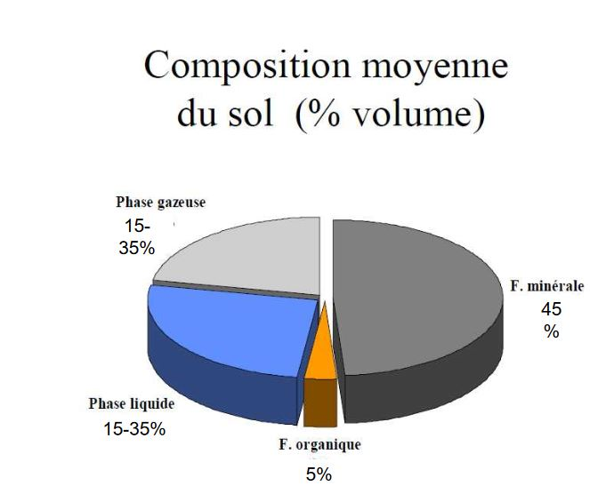

# Les facteurs édaphiques

## I) Introduction

### Les facteurs écologiques

**Facteurs écologiques** = éléments du milieu susceptibles d'agir directement sur les êtres vivants, au moins durant une partie de leur cycle de développement.

Des facteurs écologiques agissent à tous les niveaux d'organisation des écosystèmes:

* **individus** (écologie des organismes ou autoécologie, écophyiologie);
* **population** (écologie des populations); 
* **communauté** ou biocénoses (écologie systémique ou synécologie)

Pour qu'un **sol** se forme il faut minimum 1 000 ans. En zone tropical, les sols ont plus de 100 000 ans. C'est un compartiment fonctionnel de l'écosystème et une interface entre le monde vivant et minéral. C'est une source non- renouvelable à l'échelle de temps humain.

La fonction du sol est de recycler la matière organique, pour cela il faut une activité biologique. Les champignons et bactéries aident au recyclage.

* Distinction courante

	* **facteur abiotiques** = ensemble des caractéristiques du milieu
    * **facteur biotique** = ensemble des intéractions qui se réalisent entre les individus de la même espèce ou non
    

* Autre distiction possible:
	
    * **facteurs indépedants de la densité** qui agissent sur les organismes avec une intensité qui ne dépend pas de leur abondance: en général, les facterurs abiotiques tels que les facteurs climatiques (T°C, lumière, pluviométrie...) ou édaphiques
    * **facteurs dépendants de la densité** ont une action dont l'intensité augmente avec l'abondance des individus: en général, facteurs biotiques comme la prédation ou la compétition

### Descripteur écologique

**Descripteur écologique** = tout élément ou toute condition caractérisant l'environnement 

Descripteur écologique = tout caractère du milieu observé, relevé ou mesuré, **qu'il agisse ou non directement ou indirectement**, sur l'organismes, la population ou la communauté concernée.

Distinction :

* descripteurs qualitatifs (sans grandeur)
* descripteurs quantitatifs (variables quantitatifs chiffrées = statistiques applicables)
* descripteur semi-quantitatifs (s'ordonne selon un gradient)

### Les facteurs édaphiques

Dans les écosystèmes terrestres, l'écologie factorielle distingue 2 grandes catégories **de facteurs qui agissent sur la répartition des organismes vivants**:

* les **facteurs climatiques**
* les **facteurs édaphiques**

Les constituants du sol qui ont une action directe sur les organismes (végétaux mais aussi micro-organisme et faune du sol) sont considérés comme des facteurs édaphiques.

Facteurs édaphiques concernent donc les propriétés physiques et chimiques des sols. 

**Facteurs édaphiques** = facteurs écologiques qui se rapportent au sol, **édaphon** = sol)

* Les sols de la réserve biologique dirigée du Mont du Fresne

En bas de pente nous trouverons des colluvions. Très peu de calcium.

Lorsque l'on monte sur la pente, on a un sol calcaire riche en calcium.

Quand on monte sur le plateau, on trouve en profondeur des argiles à silex (craies décarbonatées). C'est un faciès de décarbonatation.

Sur les plateaux, les limons apportés par les vents sont les **Loess**.

* Les sols limoneux des plateux, Forêt de Lyons

Les strates herbacés sont indicatrices des conditions du sol

### Définition du sol

Le sol constitue la couche extérieur de notre planète et se compose de roches et de matières végétales et animales en décomposition

Science du sol *sensu stricto* (ou science des sols) est une science très ancienne.

La pédologie est une discipline relativement récente: le **sol n'est pas un milieu interte et stable**, mais il se forme et se developpe

Le sol évolue sous l'influence du climat, du relief et des organismes vivants (végétation, pédofaune et micro-organismes) aux dépends du **matériel minéral** (substratum géologique : matériel parental ou *roche mère*)...

Durant son évolution, le sol s'approfondit et se différencie en couches successives, ou **horizons**, de plus en plus nombreuses, épaisses et distinctes, dont l'ensemble constitue le **profil**.

"*Le sol est la formation naturelle de surface meuble et d'épaisseur variable, résultant de la transformation de la roche-mère sous-jacente de divers processus, physiques, chimiques et biologiques*" A Demolon

### Définition proposée par l'Association Française pour l'Etude du Sol

Le sol est un volume qui s'étend depuis la surface de la Terre jusqu'à une profondeur marquée par l'apparition d'une roche dure ou meuble, peu altérée ou peu marquée par la **pédogénèse**.

L'épaisseur du sol peut varier de quelques centimètres à quelques dizaine de mètres ou plus.

Il constitue, localement, une partie de la **couverture pédologique** qui s'étend à l'ensemble de la surface de la Terre.

Il comporte le plus souvent plusieurs **horizons** correspondant à une organisation des constituants organiques et/ou minéraux (la terre).

Cette organisation est le résultat de la **pédogénèse** et de l'**altération du matériau parental**. Il est le lieu d'une intense **activité biologique** (racines, faune et microorganismes)

Le sol est une interface dans l'environnement, un compartiment des écosystèmes terrestres.

Composition moyenne du sol (% poids)

Composition moyenne du sol (% volume)

## II) Les facteurs édaphiques

### Propriétés physiques du sol:

* texture (éléments)
* structure (comment les éléments s'arrangent)
* porosité (vide, en relation avec la disponibilité en eau)

### Définition de la texture

La **texture minérale** = "*Composition granulométrique définie d'après la proportion des particules minérales du sol inférieurs à 2mm, claséées, après destruction des agrégats, par catégories de grosseurs en fractions principales correspondant à une échelle internationale.*"

20mm< **graviers** < 2mm < **sables** < 50µm < **limon** < 2µm < **argiles**

Les argiles sont des éléments minéraux chargés négativement. Ce sont des **coloïdes**.

La texture est une **propriété stable** ne variant que sur l'évolution à long terme du sol.

### Les agrégats du sol

Les agégats du sol sont constitués des particules minérales de sol, de ciments (organique, oxydes et hydroxydes...) et des vides intra-agrégats.

Ils sont visibles à l'oeil nu (diamètres de l'ordre du mm).

### Définition de la structure

La **structure** est un mode d'assemblage à un moment donné de ses constituants solides (minéraux et organiques)

* état qui peut donc évoluer dans le temps (variation à court terme)
* la solidité de sa structure, sa résistance aux agents de dégradation est évaluée par des tests de stabilité

### Définition de la porosité 

La **porosité** est l'ensemble des vides du sol

* la macroporosité, vide > 50 µm
* la mesoporosité, 0,5 µm< vide < 50 µm, utilisé par les plantes
* la microporosité, vide < 0,2 µm, inutilisable par les plantes

La granulométrie se rapporte à la fraction considérée comme active dans le sol, à savoir la fraction <2mm (ou terre fine)

**sables grossiers** > 200 µm > **sables fins** > 50 µm > **limes grossiers** > 20 µm > **limons fins** > 2 µm > **argiles**

L'état de la structure influe directement des propriétés sur la fertilité globale du sol, celle-ci est résultante

* de bonnes propriétés physiques
* de bonnes propriétés chimiques
* de bonnes propriétés biologiques

La porosité renseigne sur les capacités hydriques ou atmosphériques d'un sol.

L'eau inutilisable par les plantes se rouve en dessous du point de flétrissment.

## III) Propriétés chimiques

### Le pH

Le pH permet d'évaluer la concentration de l'ion hydrogène dans un solution avec :

pH = - log10 [H3O]+

