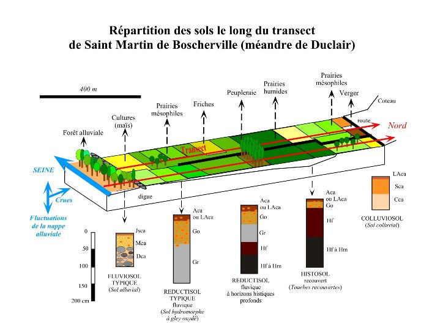
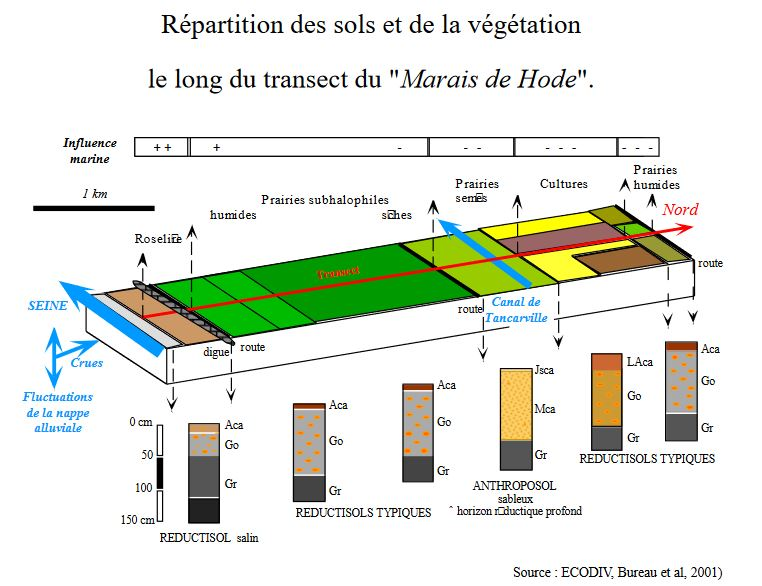
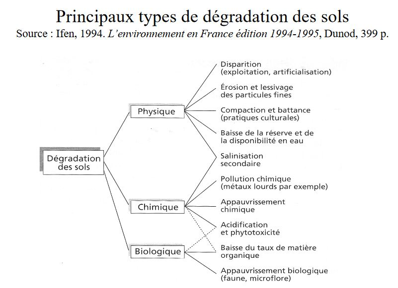

# Les Facteurs édaphiques (V)

# H) Le potentiel d'oxydo-réduction (sols hydromorphes)

Le potentiel d'oxydo-réduction ou potentiel redox (Eh) est une valeur qui reflète les transferts quantitatifs d'électrons des donneurs vers les accepteurs; mesuré au moyen d'un électrode de plaine combinée, il est exprimé en mV.

Le Eh du sol se répartie en 4 domaines : 

* de **800 à 450 mV** : O2 est fortement présent et la nitrification active; la Matière Organique est décomposée plus ou moins rapidement;
* de **450 à 0 mV** : le milieu devient pauvre en O2; ralentissement de la décomposition de la Matière Organique; si le pH est bas, les processus de réduction débutent rapidement. 
* **O à -200 mV** : le milieu est anoxique; la Matière Organique se décompose par fermentation anaérobie; des sels ferreux s'accumulent, teintant le matériau en gris bleuâtre-verdâtre (horizon Gr)
* **-200 mV à -300 mV** : la réduction est totale; la Matière Organique fermente en dégageant de l'hydrogène sulfuré ou du méthane (tourbière).

### Les sols à engorgement en eau : les sols hydromorphes

# I) La salinité (sols salés)

### La salinité (NaCl) et la répartition des plantes

Les **sols salés (sols halomorphes)** ont une flore très particulières. La culture de diverses espèces végétales sur des milieux ayant des teneurs variables en NaCl a montré l'existance :

* d'**halophytes strictes**, qui ont besoin de NaCl pour se developper (*Suaeda macrocarpa*);
* d'**halophytes tolérantes** (*Atriplex littoralis* et *Suaeda flexilis*), qui peuvent se passer de NaCl mais qui en supportent la présence.
* d'**espèce intolérantes** qui ne peuvent se developper que sur des milieux pauvres en NaCl.

# Discussion - Conclusion

**Les facteurs édaphiques = vision très typologique du rôle du sol (disponibilité en eau et assimilation des éléments minéraux).**

Le sol dans les péoccupations environnementales actuelles :

* Sommet de Rio (1992) :
	* Mise en avant de la biodiversité 
    * Communautés du sol = la "troisième frontière biotique" (1 = grands fonds océaniques; 2 = canopées des forêts tropicales)
    
* Millenium Ecosystem Assesment (MEA), 2005 : *Ecosystems and Human Well-being : Synthesis. Island Press, Washington, DC.*
	* Notion de services écosystèmiques 
    
* Contexte des changements globaux et des changements climatiques.

Le sol se situe à l'interface de: **l'atmosphère**, de **l'hydrosphère** (les eaux continentales, voire marines), de la **biosphère** (végétaux, microorganismes, animaux, dont l'homme : **antroposphère**), de la lithosphère (les formations géologiques) et de la **toposphère** (relief).

Par de nombreuses fonctions essentielles qu'il exerce en intéractions avec ces compartiments, le sol joue un rôle majeur dans le fonctionnement général de la planète Terre.

A ce titre, et s'il est géré correctement, il fournit des services qui profitent aux sociétés humaines.

* les **services de support ou d'auto-entretien**. Le sol constitue le support des animaux (dont l'homme) et des végétaux. Si son fonctionnement est opérant, la ressource qu'il représente autorise l'efficacité de tous les autres services décrits ci-dessous;

* les **services d'approvisionnement**. Le sol, comme **ressource agricole** (au sens large), fournit des aliments (végétaux et animaux) et des fibres; comme **ressource génétique**, il abrite un patrimoine biologique encore mal connu mais très diversifié et qui fournit notamment, des produits biochimiques et pharmaceutiques; comme **ressources en "terre"**, il fournit des matériaux de construction;

* les **services de régulation**. Le sol permet de réguler la quantité de l'air et des eaux, de lutter contre la sécheresse et contre les inondations; il permet de participer à la lutte contre l'effet de serre, et constitue un site de stockage de divers éléments et, par filtrage, assure la dépollution de nombreux contaminants; il recycle certains déchets et permet la régulation des ravageurs de cultures.

* les **services culturels et culturels**. Le sol fournit des matériaux pour la production artistique (terres colorés, pigments et argiles pour la peinture et la céramique); il est un lieu de stockage et de protection des données anciennes touchant à l'Histoire ou au passé de notre planète (archéologie, archives paléo-climatiques, ect.); il est lui-même objet d'inspiration pour les régions, les mythes, les cultes mais aussi pour la production artistique et littéraire."

### Fonctions du sol et dégradation

Toute modification défavorable de l'atmosphère, de l'hydrosphère et de la biosphère à un répercussion sur l'état du sol.

La **protection du sol** devient un objetif proritaire à l'échelle européenne et mondiale :

* **_Commission européenne_** travaille sur un stratégie thématique pour la protection des sols et devrait proposer une directive cadre pour les sols.
* **_FAO_** distingue 12 catégories de dégradation du sol dans le cadre de la réalisation de la cartographie mondiale.

La Commission européenne dans sa communication "Vers une stratégie thématique pour la protection des sols "distingue 8 menaces qui pèsent sur les sols :

* l'érosion,
* la contamination,
* la diminution des teneurs en matières oragniques,
* la salinisation,
* le tassement du sols, 
* les glissements de terrain,
* les inondations,
* manque acidification des sols

Les aspects connexes à la protection des sols : la **notion de seuils** à ne pas dépasser pour **maintenir durablement** les propriétés du sol (notion de rôle épurateur du sol vis-à-vis de l'air et de l'eau) et la problématique d'évaluation de la qualité de l'air et de l'eau) et la problématique d'évaluation de la qualité du sol et de l'eau) et la problématique d'évaluation de la qualité du sol(quels indicateurs mesurer et comment les mesurer ?)

