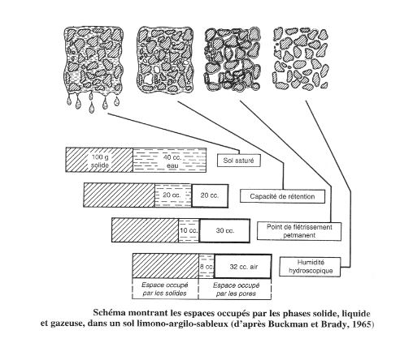

# III) Relation avec la disponibilité en eau

## A) Les états de l'eau dans le sol

## B) L'eau de gravité

L'**eau de gravité** n'existe que dans les heures ou les jours qui suivent une **précipitation** ou s'il existe une **nappe phréatique permanente**.

Quand les forces dues à la gravitation s'équilibrent avec la force de rétention du sol, le **point de ressuyage** est atteint : l'eau restante est conservée dans le sol et constitue **la capacité au champ**.

Le **taux d'humidité à la capacité au champ** traduit la **capacité de rétention en eau** du sol.

L'eau de gravité circule dans les pores grossiers et moyens (> 10µm) verticalement voire obliquement (pente, diminution perméabilité dans les horizons profonds).

Pour l'eau de gravité à écoulement verticale, on peut distinguer :

* l'eau à **écoulement rapide** qui circule dans les pores grossiers (>50µm)
* l'eau à **écoulement lent** qui circule dans les pores moyens (10µm < diamètre < 50µm)

Si le sol est perméable, les eaux de gravité alimentent le drainage profond.

## C) L'eau utilisable 

L'eau utilisable est mieux retenue par le sol que l'eau de gravité. Elle remplit les pores 0,2 < diamètre < 10µm ou forme des films de 5 à 10 nm à la surface des particules.

Les racines l'absorbent jusqu'au **point de flétrissement temporaire**, réversible, puis jusqu'au **point de flétrissement permanent**. Ce dernier est atteint lorsque la force de rétention de l'eau par le sol est égale à la force de succion maximale des racines. Le fim d'eau créé constitue un habitat pour de nombreux représentants de la microfaune (protozoaires et nématodes).

## D) L'eau inutilisable

L'eau inutilisable par les plantes se trouve en dessous du point de flétrissement permanent. Elle forme un film très mince (< 5nm) à la surface des particules du sol. Cette eau est contenue dans les pores les plus fins de diamètre inférieur à 0,2µm.

Seule une évaporation intense permet de l'éliminer. Même à des températures élevées, il reste toujours un peu d'eau dans le sol, autour de certains minéraux dont elle assure l'hydratation.

## E) Forces s'exerçant sur l'eau du sol

Trois forces agissent sur l'eau du sol:

* la **force de gravitation** découlant de l'attration terrestre, **P**;
* la **force de rétention** par les solides, **F**;
* la **force de succion** des plantes, **S**.

Ces forces parfois assimilées à des pressions, sont exprimés en mégapascals (MPa), en bars, en atmosphères, en centimètres d'eau ou de mercure :

1 MPa = 10 bars = 9,87 atm = 10 197 cm H2O = 750cm Hg

## F) Notion de potentiel matriciel, pF

L'augmentation exponentielle de la force F rend plus commode sa transformation en logarithme et l'utilisation du symbole pF :

pF = log10 (F(en bars))

pF = potentielle matricielle ou potentielle capillaire Ψm

Ce potentiel correspond à l'énergie résultant de la pression de l'eau due:

* aux effets de liaison autour des particules solides, 
* aux effets de capillarités dans les pores.

Les quatres valeurs habituelles du pH sont donc à retenir.

* La **capacité au champ** qui correspond à pF 1,8 (moment où l'eau de gravité à écoulement rapide est partie et où l'eau de gravité à écoulement lent comment à disparaître)
* La **capacité de rétention** ou **humidité équivalente** (à la capacité au champ, déterminée au laboratoire) correspond à une force de 1/3 d'atmosphère donc à un pF de 2,5.
* Le **point de flétrissement temporaire** qui correspond à pF 4,0.
* Le ** point de flétrissement permanent** qui correspond à pF à 4,2.

### pF et taux d'humidité

Les valeurs du pF aux points de ressuyage (pF 2,7) sont les mêmes pour tous les sols, indépendamment de leur texture. Le taux d'humidité correspondant à ces pF varie selon l'état textural. Un plante mésophile se flétrit définitivement avec environ:

* 4% d'eau sans un sol sableux,
* 15% dans un sol limonno-argileux,
* 50% dans certaines tourbes

### CSE, RUM, RFU

#### CSE 

CSE = Capacité de Stockage pour l' Eau

CSE d'1 horizon = volume maximal d'eau qu'il retient contre la seule force de gravité in situ (correspondance avec la capcité au champ).

**CSE (en mm) = Hv x E**

* Avec Hv = Humidité exprimée en % à la capcité au champ
* Avec E = épaisseur en décimètres de l'horizon

La somme des CSE des horizons d'un profil donne la CSE du sol, on la calcule souvent jusqu'à la profondeur utilisable maximale (1,5m).

#### RUM

RUM = Réservoir Utilisable Maximal

**RUM de chaque horizon = E x Da x (HCC - HPF)

* Avec E = épaisseur en mm de l'horizon
* Avec Da = densité apparente (en g/cm3)
* Avec HCC = Humidité pondérale exprimée en % (ou g/100g) à la capacité au champ
* Avec HPF = Humidité pondérale exprimée en % (ou g/100g) au point de flétrissement

RUM du sol est RUM des différents horizons jusqu'à la profondeur utilisable maximale pour l'enracinement des plantes.

#### RFU

RFU = Réservoir Facilement Utilisable Maximal

**RFU = 2/3 RUM**

### pF et disponibilité en eau

L'influence de l'eau du sol sur la végatation en fonction de la capacité des espèces à compenser ou non la force de rétention du sol. 

* Les **plantes hygrophiles** ont besoins de beaucoup d'eau facile à prélever donc à faible pF
* Les **plantes xérophiles** peuvent subsister lorsque les valeurs du pF sont voisines du point de flétrissement 
* C'est à partir de l'observation des **plantes mésophiles**, intermédiaire entre les 2 cas précédent, que la valeur référence du point de flétrissement permanent à été fixé à 1,6 MPa ou pF = 4,2

Cette valeur est donc une limite pour les plantes qui ne subissent guère de stress hydrique : plantes cultivées, plantes de prairies ou des sous-bois des régions tempérées.

La pression osmotique interne des plantes xérophytes peut-être très élevée pour favoriser l'absorption d'eau sous le seuil des plantes mésophiles (pF = 4,2). L'augmentation de la pression osmotique possible dans les cellules de radicelles par apport de potassium.

*Et pour la faune du sol ?*

### Rôle et importance de la texture pour la pédofaune

Les vers de terre sont plus nombreux dans les sols limoneux ou argilo-sableux que dans ls sables, les graviers ou les argiles. Les sols les plus favorables à l'installation des Coléoptères endogés ont toujours une tenur élevée en éléments fins (A et L). La texture intervient dans la répartition des animaux des sables de plages ou des bords de rivières.

### pF et besoins en eau de la pédofaune

BONNET (1964) a montré qu'il existe des espèces de Thécamoebiens inféodés aux sols squelettiques dont l'eau, quoique peu abondante, est facilment disponible (pF faible) comme par exemple *Centropyxis halophila* ou *Geophyxella sylvicola*. D'autres espèces vivent dans des sols humides et riches en matières organiques, mais se comportant comme des milieux physiologiquemenet secs (pF élevé) comme par exemple *Assulina muscorum* ou *Heleopora sylvaticola*.

Les collemboles présentent trois types biologiques différents correspondant à des possibilités différentes de contrôle de la perte d'eau par transpiration à travers leur tégument :

* le type **hygrophile** : espèces endogées et de forêt humides qui ne peuvent s'affranchir de milieux humides (pertes importantes par transpiration sinon);
* le type **mésophile** : espèces qui vivent au contact de la surface du sol et qui peuvent s'aventurer dans la litière des forêts tempérées (régulation active des pertes d'eau par régulation)
* le type **xérophile** : espèces qui fréquentent les milieux secs ou peuvent effectuer de long séjours dans la végétation hors de la litière (une couche de cire de l'épicuticule assure la régulation des pertes en eau pendant plusieurs heures chez certaines espèces).

