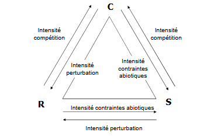

# Approches synthétiques des stratégies bio-démographiques

Travaux scientifiques de différents auteurs, stratégies générales de comportement

* forte mortalité de jeunes et d'adultes, croissance rapide et maturité précoce

Ex : Batraciens

Reproduction fréquente et nombreuses pour compenser la mortalité importante aux stades oeuf et larve

* environnement compétitif (intra ou inter-spécifique), maturité plus tardive

* succès important de la reproduction et augmentation taux de survie, alllocation des ressources vers le croissance

Adaptation des variables démographiques aux conditions du milieu, fixée sur le plan génétique -> Avantage de se spécialiser pour éviter au maximum la compétition inter - spécifique

2 variables démographiques essentielles :

* r
* K

Dans les années 60, Mac Arthur et Wilson ont distingué 2 types de **selection** (basé sur un modèle de compétiton entre génotype)

-> selection r = s'excerce dans population à basse densité entraîne une reproduction la plus élevée possible

-> selection K = s'exerce dans une population à forte densité favorise une meilleure conversion des ressources trophiques 

Découlent directement de la cinétique des populations animales

Travaux rapidement repris et adaptés en écologie

* stratégie r
* stratégie K

On distingue : 

1) Les populations en **expansion** : valeur sélective mesurée par rm, génotypes plus productifs l'emportent sélection indépendante de la densité -> idée de milieu fluctuant, déséquilibre entre population et son milieu

2) Les populations stationnaires (dans milieux saturés) : valeur sélective représentée par K, génotypes les plus efficients l'emportent convertissent l'énergie en nouveaux reproducteurs -> idée de milieu stable, équilibre entre population et milieu

Très rapidement, ces deux stratégies se sont révélées mal adaptées pour la majorité des populations (5 à 10 % des cas entrent dans ces stratégies) -> utilisation dans des conditions bien particulières

En 1974, Grime complète ces notions de stratégie en s'appuyant essentiellement sur des travaux sur les végétaux, 3 stratégies en ressortent et impliquent 3 types de selection : 

* selection C : aptitude élevée des individus à la concurrence, dépend des caractéristiques optimisant la croissance des végétaux en condition de haute productivité

* selection R : identifiée chez les populations à courte durée de vie, production de semences élevée dans un habitat sévèrement perturbé mais tout de même productif

* selection S : entraîne une réduction des vigueurs végétative et reproductrice

Correspondance avec la stratégie de Mc Arthur 

R = espèce à croissance rapide, renouvellement important, régulation de la population indépendante de la densité. Aptitude compétitive faible ou faible taille des individus -> **R**

K = faible fluctuation des effectifs, régulation liée directmeent à la densité, compétition fortement intense limitée dans les faits par les ajustements de niche. Grande taille, croissance lente -> **C**

Autre stratégie developpée : **beyond K** (au - delà de K) due à Greenslade :

**beyond K** = population se maintient au delà des capacités du milieu, il y a alors **diminution importante des capacités des individus : S**

Grime représente sa stratégie dans un triangle : 

A partir de ce triangle on peut généraliser :

C = espèces compétitives = aptitude Compétitive

S = espèces tolérantes aux contraintes = stress tolerator

R = espèces tolérantes aux perturbations = ruderal

