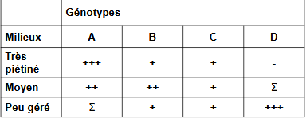

# Relations entre paramètres biologiques et populationnels

Description des populations permet de décrire les variables démographiques liées à ces populations :

* strcture démographique = variables d'état
	* densité
    * sex ratio
    * structure d'âge..
* diversité interne
	* polymorphisme phénotypique
    * diversité génétique
* variables dynamiques
	* taux de croissance
    * taux de reproduction
    
Cycle de vie d'un organisme directement lié à ces traits contribuant à sa survie et sa reproduction -> donne une valeur sélective à l'orgnisme = **fitness darwinienne**

Variables démographiques également liées à l'environnnement :

* présence ou non de prédateur
* présence ou non de compétiteur
* resssources du milieu = K

Variables également liées aux paramètres biologiques de l'organisme :

* paramètres morphologiques (taille, poids ..)
* paramètres physiologiques (longévité, maturité sexuelle, fécondité...)
* paramètres écologiques

Existe des **combinaisons** entre les caractéristiques :

* morphologiques
* physiologiques
* éthologiques
* écologiques
* démographiques

Les combinaisons sont :

* variables et complexes
* appelées dans une perspective évolutionniste = **stratégies** ou **tactiques**

Combinaisons réunissent des traits fonctionnant et évoluant ensembles -> traduisent l'adaptation de la population à son environnement 

Paramètres subissent des **contraintes** internes et/ ou externes 

* présentent donc des fluctuations
* impliquent une sélection des traits les plus favorables à la situation -> notion de **compromis** ou de **choix -> trade off**

Illustration :

Le maintien d'une espèce dans son environnement dépend :

* survie
* reproduction

Directement liés aux besoins en matière et en énergie

Energie directement alllouées aux différentes fonctions vitales

Si une contrainte s'éxerce sur le milieu -> énergie initialement disponible peut être limitée (abondance de proies, temps d'ingestion...)

Modification de l'allocation de l'énergie -> énergie allouée à la reproduction plutôt qu'à la croissance ou aux dépenses d'entretien

**-> implique un choix ou un compromis**

Fonctions vitales d'un organisme sont liées à :

* acquisition de ressources
* la mise en réserve 
* la régénération de l'espèce

Ainsi :

**Stratégies = combinaisons** particulières de caractères conduisant à la **meilleure valeur adaptative** pour l'espèce ou la population

Ex : plantes annuelles placées dans des conditions déterminées et
identiques   chaque   année   (ressources   suffisantes   pour   se
développer et se reproduire)

Hypothèse  de  croissance  :  génotype  investit  toutes  les
réserves dans la croissance somatique :

* plante vigoureuse de grande taille
* incapable de se reproduire
* **valeur sélective** nulle : espèce ne peut se maintenir, dans les faits la sélection naturelle aura éliminé cette plante

En fait, valeur sélective (W) va croître avec l’augmentation
progressive   de   la   proportion   de   ressources   allouée   à   la production de graines

* augmentation jusqu’à un maximum = stratégie optimale
* au delà de ce max. : la plante ne peut se maintenir car taille trop frêle

D'un point de vue évolutionniste : 

" La  sélection  naturelle  devrait  favoriser  les  génotypes  qui,  entre  les différentes  stratégies  possibles,  adoptent  celles  qui  leur  confèrent  de génération en génération le taux de multiplication (= valeur sélective) le plus important "

**Les  traits  bio-démographiques  sont  donc  des ensembles de traits co-adaptés, modelés par le jeu de  la  sélection  naturelle  pour  résoudre  des problèmes écologiques particuliers -> Profil bio-démographique d'une population = expression de l'adaptation de l'organisme à son environnement**

* Optimisation de la valeur sélective de l'organisme sous l'influence de la sélection naturelle
* Les traits sont interdépendants

Remarque : L'idée de contrainte de l'environnement implique que tout n'est pas réalisable pour un organisme -> **compromis d'adaptation n'est pas toujours possible**

## I) Stratégies liées à la reproduction

Relation taille des organismes et temps de génération -> temps de génération court favorise des tailles réduites et une maturité sexuelle précoce

Taille des pontes 

* Poissons et batraciens : chez plusieurs espèces le nombre d'oeufs produit est limité par la capacité abdominale de la femelle

* Anoures : chez certaines espèces, il existe une relation entre **volume de ponte** et **longueur de la femelle**, interdépendance entre un trait morphologique (taille) et un trait physiologique (fécondité) chez toutes les espèces considérées. Relation également entre **taille de la ponte** (nombre d'oeufs) et le **diamètre d'un oeuf**

Des différences sont observées selon les espèces : 

* petits oeufs pour en faire le plus possible (généralement mortalité importante)
* gros oeufs pour maximiser la probabilité de survie (avantage compétitif pour l'exploitation des ressources et pour l'évitement des prédateurs)

La valeur sélective dans ce cas dépend du nombre de descendants susceptibles de se reproduire 

* nécéssité d'un **compromis entre nombre et taille**
* compromis également lié à la pression extérieure et aux contraintes propres des organismes

Stratégie démographique chez le pissenlit :

3 cultures de 3 populations de milieux différents :

* 1 pelouse fortement piétinée et souvent tondue = mortalité élevée  indépendante de la densité
*  1 pelouse moins piétinée et tondue moins régulièrement
*  1 pelouse peu gérée où la mortalité élevée est densité dépendante

Analyse des phénotypes et génotypes liés (polymorphisme enzymatique par électrophorèse)

On a 4 identifié types : 

Decription morphologique

* Type A : individus petits et féconds dans milieux fortement perturbés -> plus de fleurs
* Type D : individus grands et moins féconds dans milieux moins perturbés -> plus de feuilles

2 types fixés génétiquement

* spécialisation dans un type de milieu
* présentation d'une stratégie optimale sur le plan de la survie

L'un favorise la reproduction, l'autre la croissance et la compétition

Entre les 2 extrêmes :

* stratégies intermédiaires B et C

Favorisent la plasticité phénotypique et sont capables d'exploiter les différents milieux sans être prépondérant par rapport à une stratégie sélectionnée

Ainsi, il est possible de dresser des **stratégies types** et des **réponses** des populations à partir de différents constats :

* variations démographiques ne sont pas constantes : variabilité peut-être le fait d'individus ayant une plasticité phénotypique 
* variations démographiques peuvent découler de l'action de contraintes environnementales : perturbations / compétitions ...
* un forte mortalité adulte et jeune entraîne une croissance rapide et une maturité sexuelle précoce 

ex : Batraciens : forte mortalité au stade larves / têtards -> reproduction nombreuse et fréquente 

* environnement compétitif (interspécifique) entraîne une maturité plus tardive
* succès de reproduction et augmentation du taux de survie entraînent un déplacement des ressources vers le budget croissance

Caractéristiques démographiques peuvent également du fait de la **compétition intra spécifique** : 

* compétition s'établit :
	* ressources limitées (alimentaire, spatiales, reproduction)
	* recherche de la ressource implique une nuisance à l'autre

* compétion **Directe** / **Indirecte**

Directe : compétition par **interférence**

Indirecte : compétition par **exploitation**

* effet ultime :
	* diminution de la contribution des individus
    * baisse de la fécondité / survie

Il est maintenant admis : intensité de l'effet dépend de la densité

Effet **densité dépendance** = tendance régulatrice de la compétition sur la population lorsque celle - ci atteint son seuil biotique max. = **K** ou bien de l'accroïtre quand elle est inférieure

Remarque : May a montré que la densité dépendance peut avoir un effet différé -> peut déstabiliser la population

Effets sur la surdensité sont variables 

* sur la qualité de la population
* sur ses performances :
	* affaiblisssement physiologiques
    * ralentissement de la croissance
    * diminution de la fécondité / longévité
    * modification du comportement

Graphique A : Baisse de la production de fleurs chez une crassulacée annuelle 

Graphique B : Baisse de l'espérance de vie des propagules végétatives chez un bouton d'or

Graphique C : Baisse de la fécondité chez un papillon du pin

Graphique D : Accroissement de la mortalité au stade chrysalide (due à la prédation) chez *Operophtera brumata*

Graphique E : Elevation de l'âge de la maturité chez les éléphants 

Graphique F : Accroissement du taux de maortalité des adultes chez le buffle africain

Conséquences : 

* diminution de la densité 
* diminution de la composiiton génétique de la population : l'effet densité dépendance agit comme un **facteur de sélection** sur les individus pouvant le mieux résister à la contrainte 
* modification de la strcture sociale

Les effets peuvent se ressentir sur plusieurs générations : ce qui peut expliquer les phénomènes de cycle comme chez le lièvre du Canada.

**La reproduction représente un coût énergétique non négligeable -> diminution de l'allocation à la croissance**

## II) Stratégies à l'alimentation

Il existe d'autres compromis notamment par rapport à l'alimentation

Les choix sont orientés selon le rapport

Energie gagnée (par la consommation de la proie) / Temps dépensé à acquérir la proie

Cela donne un indice de **profit**

Choix orienté vers les proies **profitables** au prédateur -> gain d'énergie maximum

Ex : crabes verts, *Carcinus maenas*

* proie : moules de taille réduites, facile à briser -> rentabilité plus importante
* "profitabilité" maximum de cette proie se situe pour une taille d'environ 2,7 cm

! Les crabes peuvent se nourrir de proies moins profitables

La stratégie adoptée peut - être orientée par le **temps** de recherche de la proie la plus profitable -> dans le même temps, le prédateur s'expose à ses propres prédateurs

Des contraintes autres qu'energétiques peuvent entrer en ligne de compte -> contraintes **nutritives**

Ex : Elan

-> régime alimentaire influencé par les besoins en Na

2 types de milieux prospectés :

* Forêts : feuilles pauvres en Na et riche en énergie
* Lacs : plantes aquatiques riches en Na et pauvres en énergie

-> besoins de l'élan sont doubles pour 

* survivre
* se reproduire

Le modèle stratégique tien compte de trois contraintes :

* quantité minimale de Na
* quantité d'énergie nécessaire
* capacité de l'Elan à ingérer sa nourriture (volume de l'estomac)

Stratégies alimentaires directement dépendantes :

* des **risques** de prédations
* du **degré de faim**

