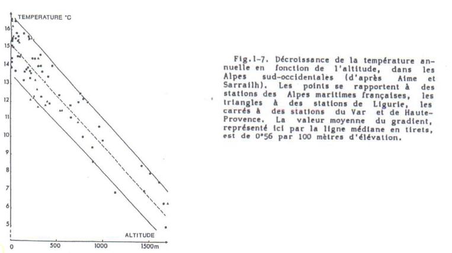
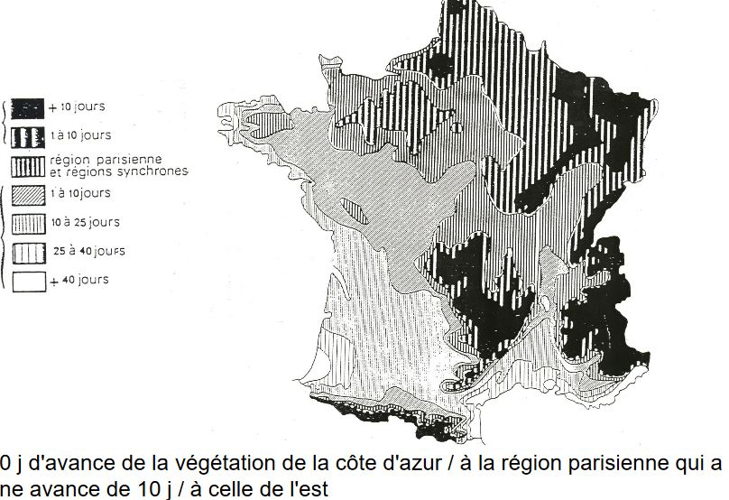
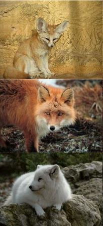
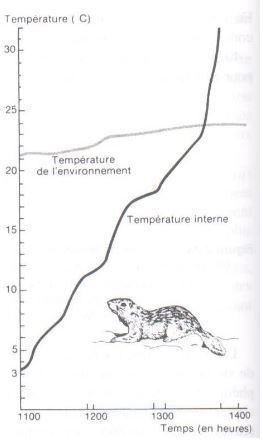

# Influence de la température

## A) Généralités

Température = élément majeur (avec humidité) des macro-climats terrestres

* hemisphère Sud : isothermes annuels ~ parallèles à l'équateur
en raison des masses maritimes

* hémisphère Nord : isothermes plus irréguliers
masses continentales plus importantes

Température moyennes annuelles les plus fortes: >30°C en Afrique (contient le plus chaud)

Régions intertropicales = températures élevées mais les variations journalières sont supérieur aux variations annuelles (pluies abondantes)

Régions extratropicales = régime thermique bien marqué

* Nord : chaud en juillet/août, froid en janvier 
* Sud : inverse (pluies moins importantes sauf massifs montagneux)

Intervalle thermique dans lequel la vie est possible :

* 200°C et + 100°C

Certaines formes de durée de vie supportent des - 180°C  :

* Spores de cryptogames
* Kystes de nématodes

Survie rendue possible par leur faible teneur en eau = **anhydrobiose**

Ex: Strain 121

Organisme unicellulaire appartenant aux Archées découverte en 2003, capable de survivre et de se reproduire à des températures extrêmes.

Localisation : évents hydrothermaux sous marins

Conditions : 

* obscurité totale
* eau bouillonnante (réchauffée par le magma) 121°C
* eau reste liquide en raison des fortes pressions 240 bars
* respire des oxydes de fer pour transformer sa nourriture, rejette de la magnétite

Particularité : Si la température est inférieure à 80°C, Strain 121 entre en dormance, elle survit après 2h passées à 130°C

## B) Propriétés thermiques

Grandes différences entre les milieux naturels à température égales, car cela dépend des conditions physiques des milieux.

Propriétés caractérisées par :

* capacité calorique : quantité en énergie nécessaire pour élever de 1°C un volume de 1cm3 d'un corps

eau >> humus >> silice > air

* diffusion thermique : inversement proportionnelle à la capacité calorique, elle dépend de la conductivité du corps considéré et varie avec:

* humidité
* porosité
* composition des matériaux

Le **régime thermique du sol** est très important en écologie

* influence des microorganismes, de la pédofaune...
	* croissance
    * reproduction
    * activité physiologique
    
* dépend:
	* du bilan énergétique du système sol - atmosphère
    * couvert végétal
    * des caractéristiques propres du sol :
    	* réflectance de la surface
        * constituants solides
        * prosité
        * humidité
        
## C) Température du sol et ses variations

Variations journalières

* Les variations de températures diminuent rapidement avec la profondeur des sols

* Au delà de 50 cm de profondeur, on a une absence de variation

Variations saisonnières

* Concerne des épaisseurs de sol beaucoup plus importantes 

Ex : sols en zones boréales pouvant atteindre 1m de profondeur (permafrost)

## D) Température de l'air

Diminution de la température avec l’augmentation de l'altitude: 100m de dénivelé équivaut à une diminution de ~ 0,56°C

Les variations journalières au contact des surfaces (sol, végétation...) provoque la création des variations verticales de température :

* élévation de haut en bas le jour
* élévation de bas en haut la nuit

Influence par le couvert végétal

* le flux de chaleur dépend : 
	* surface foliaire 
    * ventilation intervenant dans le couvert de végétation
    
La végétation rase ouverte : température max atteinte à la surface du sol

La végétation dense : température max au sommet de la végétation

## E) Température et milieux aquatiques

La température dépend : 

* échanges thermiques et radiatifs avec atmosphère 
* déplacement des masses d'eau qui se font
	* sous l'action de l'eau
    * densité de l'eau (salinité)
    
Ex: Lac profond en zones tempérées ou froides

* stratification thermique
	* variable avec les saisons
    * différente selon les conditions du climat
    
[Stratification thermique schématique d’un lac profond en zone tempérée hiver vs été](Images/température.JPG)    

[Mouvement de l'eau et stratification thermique](Images/mouvementdel'eau.JPG)

Ce sont des lacs dimictiques par opposition aux lac monomictiques qui présentent une stratification constante.

Sous les tropiques : lacs **holomictiques** = pas de stratification car pas de saison froide

D'autres facteurs influent sur le fonctionnement d'un lac:

* vent 
* courants

Rôle des océans 

* 70% de la surface de la Terre (rôle capital sur la répartition des climats)
* absorbent environ 80% du rayonnement solaire (évaporation importante au niveau de leur surface)

## F) Action de la température sur les végétaux

Influence de tous les processus biologiques et métaboliques :

* croissance
* photosynthèse, respiration
* reproduction, survie..

-> repartition des espèces

Action de la température sur la croissance = résultante de son action sur : 

* photosynthèse
* activation enzymatique respiratoire

Action sur fixation du CO2 

* fixation maximale pour les espèces tempérées : entre 20 à 30°C
* fixation maximale pour les espèces montagnardes et subarctiques : entre 10 à -13°C 
* fixation maximale pour les espèces des climats chauds: autour de 40°C (plantes en C4)

### 1) Importance des températures extrêmes 

**Les températures froides**

* nécessité de s'adapter pour résister aux températures basses
	* ex : vie ralentie sous forme de : 
		* graines, 
		* spores, 
		* tubercules, 
		* bulbes

* organismes végétaux aux cytoplasmes riches en eau vont être tués par le gel

Remarques :

* différence entre **température minimale de survie** et **température minimale de croissance**
* température létale = température à laquelle la moitié des individus est tuée

Quelques exemples de température minimale de survie :

* Algues marines tropicales = entre + 5 et + 15°C
* Algues des mers froides = - 10 à - 40°C
* Plantes vasculaires tropicales = +5 à - 2°C
* Plantes vasculaires tempérées = - 10°C à - 20°C
* Plantes vasculaires zones boréales = au dessous de – 20°C
* Certains lichens en état de déshydratation peuvent résister à - 80°C

**Les températures chaudes**

Altérations irréversibles = **thermodénaturation**

Remarques :

Température maximale d'activité : variables selon les espèces

* une dizaine de °C : algues unicellulaires des névés
* 70°C : cynaophycées (eaux thermales)
* 80°C : bactéries thermophiles
* 45°C : plantes vasculaires tuées très rapidement
* 55°C : survie des Cactées et quelques espèces méditerranéennnes à feuilles persistantes

### 2) Importance du thermo - périodisme quotidien sur la croissance et la reproduction

Germination plus rapide : si la température oscille autour d'une valeur moyenne/ à une température constante

Ex : Rendement optimal de tomates

* température diurne de 26,5°C
* température nocture de 17 à 19°C

Alternance de température: favorable à la levée de dormance des embryons et des bourgeons 

Alternance de température peut remplacer l'action de la lumière sur la levée de dormance des graines photosensibles

### 3) Importance du thermopériodisme annuel

Le rôle essentiel des variations saisonnières sur la phénologie des espèces

* possible de tracer des isophènes où une spèce atteint un stade phénologique à une date t
* comparaison des isophènes aux isothermes -> cartes prévisonnelles de developpement des espèces
* possible de dresser des cartes montrant l'état d'avancement ou de retard de la végétation en fonction de sa localisation

Ex : Phénologie des cultures en France continentale (d’après Le "Bon Jardinier")

Règle de la somme des températures : prévision des stades phénologiques en considérant la somme des températures

Ex : végétation prairiales : 

* montaison = 1500°C
* épiaison = 2500°C
* floraison = 3000 °C

### 4) Action de la température sur la distribution des espèces

Température = facteur majeur de la répartition

* contraint certaines phases du developpement biologique
* notion de facteur limitant

La limitation de la répartition des espèces peut -être liée :

* excès de froid : limite de l'extension liée au minima critique de survie

ex : Garance, Hêtre

* insuffisance de chaleur : limitation de l'extention des espèces vers les hautes latitudes -> manque de chaleur en saison estivale

Ex: Epicea, Chêne pédonculé, vignes

Il n'y a pas de maturation des fruits dans les régions plus nordiques.

La limitation des espèces peut-être liée :

* excès de chaleur : bilan hydrique déséquilibré = transpiration excessive ou alimentation en eau insuffisante
* insuffisance de froid : nécéssité chez certaines espèces de subir une vernalisation

## G) Action sur les animaux

La température agit sur les animaux

* cycle de vie
* répartition

Les réactions sont d'ordre

* écologique
	* migration géographique
    * enfouissement en profondeur
    * activité nocture plutôt que diurne
    
* physiologique 
	* acclimatation vie des modifications métaboliques
    
Ex : augmentation du glycérol dans les tissus de certains insectes

* morphologique

Il existe trois règles morphologiques sur les espèces **homéothermes**

* règle de **Bergman** : accroissement de la taille et donc de la masse 
	* animaux de grandes tailles -> climats froids
    * animaux de petite taille -> climats chauds
    
Grande taille : le rapport **surface**/**volume** est faible, la perte de chaleur par convection est faible

* règle d'**Allen** : en climat froid, on a une réduction des membres et appendices par rapport aux animaux équivalents des climats plus chauds : surface des oreilles, cou, pattes, la queue (formes trapues)

Ex des renards : Fennec des déserts chauds possède de grandes oreilles, le renard de nos régions possède des oreilles moyennes et le renard arctique possède des oreilles minuscules et museau court

* règle de la **fourrure** : les animaux des climats froids ont la fourrure plus epaisse (compensation d'une insuffisance d'isolation thermique : hibernation) 

Ex: belette, Lemming...

Rupture de l'hibernation chez un spermophile nord américain *Citellus undulatus* (Ecureuils terrestres)

En fin d'hibernation, lorsque la température atteint 20°C, le corps du rongeur passe de 3,5 °C à 17,5 °C en 1h30

Réactions chez les **hétérothermes**

* nanisme (faune des montagnes)
* mélanisme (faune des montagnes) : coloration pigmentaire plus foncée : augmentation de la chaleur captée
* aptérisme : faune insulaire (insecte, oiseaux)

Autre relations : plantes - animaux

Les animaux utilisent les micro-climats en présence des plantes

