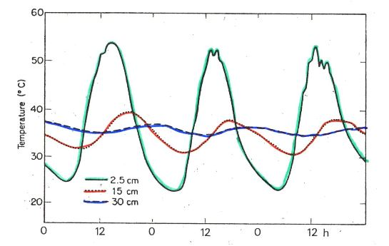

# II) Influence de la température

## A) Généralités

Température = élément majeur (avec humidité) des macro-climats terrestres

* hemisphère Sud : isothermes annuels ~ parallèles à l'équateur
en raison des masses maritimes

* hémisphère Nord : isothermes plus irréguliers
masses continentales plus importantes

Température moyennes annuelles les plus fortes: >30°C en Afrique (contient le plus chaud)

Régions intertropicales = températures élevées mais les variations journalières sont supérieur aux variations annuelles (pluies abondantes)

Régions extratropicales = régime thermique bien marqué

* Nord : chaud en juillet/août, froid en janvier 
* Sud : inverse (pluies moins importantes sauf massifs montagneux)

Intervalle thermique dans lequel la vie est possible :

* 200°C et + 100°C

Certaines formes de durée de vie supportent des - 180°C  :

* Spores de cryptogames
* Kystes de nématodes

Survie rendue possible par leur faible teneur en eau = **anhydrobiose**

Ex: Strain 121

Organisme unicellulaire appartenant aux Archées découverte en 2003, capable de survivre et de se reproduire à des températures extrêmes.

Localisation : évents hydrothermaux sous marins

Conditions : 

* obscurité totale
* eau bouillonnante (réchauffée par le magma) 121°C
* eau reste liquide en raison des fortes pressions 240 bars
* respire des oxydes de fer pour transformer sa nourriture, rejette de la magnétite

Particularité : Si la température est inférieure à 80°C, Strain 121 entre en dormance, elle survit après 2h passées à 130°C

## B) Propriétés thermiques

Grandes différences entre les milieux naturels à température égales, car cela dépend des conditions physiques des milieux.

Propriétés caractérisées par :

* capacité calorique : quantité en énergie nécessaire pour élever de 1°C un volume de 1cm3 d'un corps

eau >> humus >> silice > air

* diffusion thermique : inversement proportionnelle à la capacité calorique, elle dépend de la conductivité du corps considéré et varie avec:

* humidité
* porosité
* composition des matériaux

Le **régime thermique du sol** est très important en écologie

* influence des microorganismes, de la pédofaune...
	* croissance
    * reproduction
    * activité physiologique
    
* dépend:
	* du bilan énergétique du système sol - atmosphère
    * couvert végétal
    * des caractéristiques propres du sol :
    	* réflectance de la surface
        * constituants solides
        * prosité
        * humidité
        
## C) Température du sol et ses variations

Variations journalières

* Les variations de températures diminuent rapidement avec la profondeur des sols

* Au delà de 50 cm de profondeur, on a une absence de variation

Variations saisonnières

* Concerne des épaisseurs de sol beaucoup plus importantes 

Ex : sols en zones boréales pouvant atteindre 1m de profondeur (permafrost)

## D) Température de l'air

