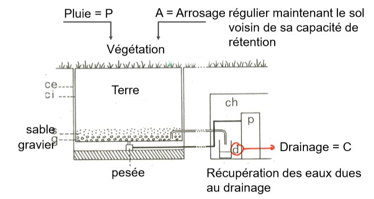
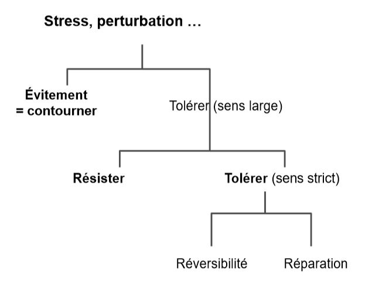

# Le facteur hydrique

## I) Généralités

L'eau est l'élément primoridial pour la vie 

* constituant le plus important
	* Biosphère
    * Matière vivante (90% de certains organismes)
* origine de l'eau : pluviométrie essentiellement
	* grande variabilité à la surface du globe
    
L'eau est facteur limitant explicatif de nombreux phénomènes biogéographiques ou processus écologiques

Il existe une très bonne corrélation entre pluviométrie annuelle et **biomasse** produite par les biomes.

Préciptations = variable climatique souvent liée à la température 

Il existe une corrélation entre le gradient de température et la pluviométrie

* milieu froid - humide
* milieu chaud - sec

Le cycle de l'eau est différent d'un cycle biogéochimique

* principaux échanges se font entre rivières - océans (liquide) et l'atmosphère (gazeux)
* eau transite par la matière organique mais n'y est pas stockée

Les réserves principales d'eau : 

* océans
* rivières
* atmosphère

## II) Circulation de l'eau

* Dans la biosphère : Dans la biosphère, les états et circulation de l'eau soumis à un ensemble de règles physiques dépendant

	* température
	* pression atmosphérique
	* humidité atmosphérique relative
	* ..

* Dans le système plante : Dans le système de la plante, la circulation de l'eau régie par les mêmes lois. Le processus passif engendré par une circulation ouverte.

Remarque : Chez les animaux, la circulation fermée

Le déplacement d'eau si **différence de niveau d'énergie potentielle** entre deux points, le déplacement du potentiel hydrique le plus **élevé** vers le plus **bas**.

Le potentiel hydrique (Ψ) dépend,

* de la **pression atmosphérique** = Pp
* **forces de tensions superficielles** s'exerçant sur les interfcaes eau-air et au-solides = **Pm** ou potentiel matriciel (phénomène de capillarité)
* **pression osmotique** liée aux substances dissoutes = **Ps**
* **potentiel gravitationnel** = **Pg**

**Ψ = Pp + Pm + Ps + Pg**

Le bilan hydrique :

* les **entrées**:
	* précipitations 
    * brouillards, rosées
    * nappe aquifère
	* ruissellements latéraux

* les **sorties**:
	* ruissellement de surface
    * drainage, lessivage
    * flux de vapeur d'eau = évapotranspiration
    
Dans le système forestier, le bilan hydrique varie selon : 

* la saison
* le stade phénologique

Bilan hydrique saisonnier en phénophase feuillée et défeuillée dans une chênaie belge

Les valeurs sont mm de précipitations ou en leur équivalent.

Sur le couvert végétal, 2 flux de vapeur sont mesurées

* le flux provenant du couvert végétal 
* le flux provenant du sol

Flux global = Evapotranspiration = ET

Evapotranspiration varie entre 0 et une valeur maximale atteinte quand : 

* surface d'évaporation bien alimentée en eau 
* surface oppose une résistance minimale à la diffusion de l'eau

La valeur max notée = ETP = ET Potentielle ou maximale

En condition réelles : mesures de l'ET réelle = ETR qui tient compte de:

* caractéristiques de la végétation 
* caractéristiques du sol
* caractéristiques physiques du milieu (albédo)

La mesure se fait à l'aide d'un lysimètre

Schéma d ’un évapotranspiromètre pesable et de son dispositif de mesure

ETR = P + A - C

La température et l'humidité contrôlent l'ET

Il est utile pour évaluer indirectement

* la production primaire 
* la décomposition de la litière

Formule de TURC :

**Etp = (Rg + 50) x [0,4t / (t + 15)] x [1 + (50-HR) / 70]**

t = T°moyenne

Rg = Rayonnement global

HR = degré hygrométrie moyen de l'air

Rmq : coeff [1 + (50-HR) / 70] utilisé pour hygrométrie < 50 %.

La température et l'humidité contrôlent l'ET

ET utile pour évaluer indirectement 

* la productivité primaire
* la décomposition de la litière 

## III) Circulation de l'eau dans le sol

L'eau du sol est sous 3 formes:

* l'eau **non absorbable** :
	* l'eau hygroscopique provenant de l'atmosphère
    * l'eau piégée dans capillaires : diamètre < 0.2 mm

Elle est non utilisable 

* l'eau capillaire : eau présente dans les capillaire, diamètre compris entre 0.2 et 8 mm

Elle est utilisable par les plantes et microorganismes

* l'eau de gravité : contenue dans les pores les plus gros du sol
	* écoulement rapide si sol grossier 
    * lent si sol fin

Le régime hydraulique des sols sont essentiel pour comprendre

* processus physico-chimiques (oxygénation)
* biologiques (enracinement)

La gamme d'eau utilisable par les plantes comprise entre :

* capacité de rétention au champ = surplus s'écoule par gravité 
* point de flétrissement = reliquat d'eau non absorbable

## IV) L'eau comme facteur écologique

Stratégie de résistance d'une espèce à un contrainte/perturbation :

* va de l'évitement total à la résistance maximale aux effets du facteur contraignant 
* réponse des organismes implique divers niveaux d'intégration biologiques

Schéma général des réponses possibles face à une contrainte :

Fondalementalement, il existe deux types d'adaptations

* **réponse réversible** = notion de plasticité/ élasticité = accomodats
* **réponse irréversible** = notion d'adaptation

**réversibilité** : réponses affectent essentiellement les caractères morphologiques de l'organisme = **xéromorphoses** 

* taille 
* port 
* caractère des feuilles  
* ratio tige/racine …

Objectifs : limiter les pertes en eau

* déplacement de la biomasse vers la ressource limitante (racines)
* affection du métabolisme vers la ressource limitante (racines)

**irréversibilité** : réponses de nature génétique

L'adaptation se transfert à le descendance, les adaptations sont xérophytiques.

Il existe trois grandes statégies de réponse chez les végétaux : 

1) Eviter la sécheresse : 

* cycle biologique très rapidement -> éphémérophytes
* semences à longévité importante ex : légumineuses, brassicacées, graminées
* éphémères vivaces : possèdent des bulbes, rhizomes -> géophytes (peu)

2) Tolérer la sécheresse : 

Cas de beaucoup d'espèces peu évoluées

* cytoplasme et organites doivent supporter la dessication 
* capacité de reviviscence et de réparation ex : bryophytes, lichen, ptéridophytes, phanérogames

3) Résister à la sécheresse : "défense"

Cela implique des adaptations morphologiques ou physiologiques 

* système souterrain très developpé pour puiser l'eau
* présence de poils sur les surfaces foliaires
* réduction des pertes d'eau :
	* chute des feuilles 
    * réduction de la surface foliaire : microphyllie
    * enroulement des feuilles
* augmentation de la cuticule
* enfoncement des stomates
* augmentation des parois cellulaires : perte de turgescence
* augmentation des réserves d'eau : dans les feuilles (crassulacées..), dans les tiges (Cactées, Euphorbes...) 
* métabolisme CAM : adaptations physiologiques et biochimiques certaines espèces : alternance de CAM et C3 entrée de CAM corrélé à la contrainte hydrique

Remarque : notion d'élasticité et de plasticité

**Elasticité** : organisme retrouve sa morphologique ou caractéristiques d'avant contrainte 

**Plasticité** : organisme enregistre une part de la réponse due à l'action de la contrainte

Réponse chez les animaux : beaucoup d'analogies

La tolérance à la déshydratation est faible: 12 à 20 % de perte d'eau : seuil létal atteint chez la plupart des animaux supérieurs

L'entrée en latence (animaux inférieurs) permet de palier à la contrainte : insectes, métazoaires (rotifères),..

La modification du comportement: permet de limiter les pertes vie nocturne plutôt que diurne 

Les adaptations morphologiques: cuticule des insectes, cryptes protégeant les orifices respiratoires.. 

Les adaptations physiologiques: absorption cutanée chez certains batraciens, arrêt de la transpiration… 

La fabrication d'eau à partir d'oxydation de molécules lipidiques: coléoptères = perte importante de poids

## V) Les facteurs abiotiques apériodiques

### A) Macro-éléments

N,P,K,Ca,Mg

* interviennent dans les cycles bio-géochimiques
* élément pouvant être stocké dans la biomasse ou dans l'environnement

Cas du calcaire : plantes calcicoles VS calcifuges

* calcifuge : rôle toxique du Ca pour les plantes (Ericacées, Digitale jaune..)
* calcicolie souvent difficile à distinguer de la thermophilie ou xérophilie (espèces souvent frugales en P et K)

### B) Micro-éléments et oligo-éléments

Fe, Cu, Zn, Cl, Mn, Bo ...

Les éléments indispensables dans les processus physiologiques sont photosynthèse, fer

Présence souvent limitée dans l'environnement : seuil de toxicité

### C) Rôle du pH

C'est un rôle important dans la répartition des organismes terrestres et aquatiques 

Certains organismes (plantes) exercent un effet sur le sol, augmentation ou diminution du pH en absorbant des cations et rejetant des acides organiques

## VI) Les facteurs biotiques

Les facteurs biotiques concernent les relations entre les organismes vivants 

(Compétition, prédation, mutualisme, parasitisme..)