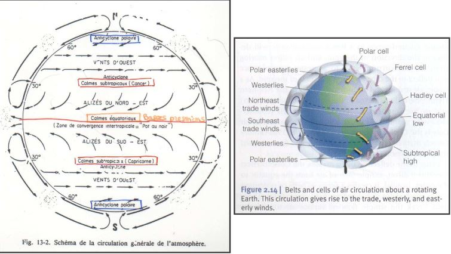
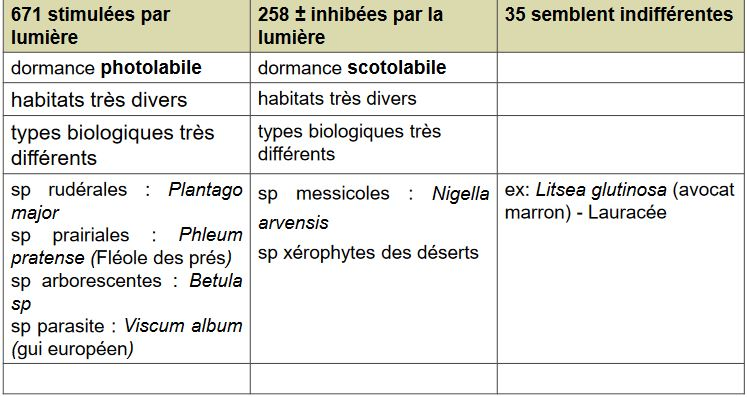
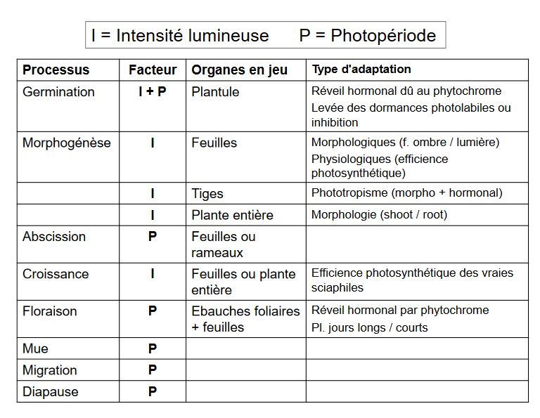

# Rayonnement et lumière

Le rayonnement et la lumière font parti des facteurs climatiques qui subissent des **variations récurrentes**:

Ex: Période glaciaire/Périodes interglacières

* liées aux mododifications de la forme de l'orbite terrestre
* liées à l'activité volcanique

**Les facteurs climatiques** sont des **facteurs périodiques** en raison de l'organisation de la biosphère selon deux périodicités fondamentales:

* rotation journalière de la Terre sur elle-même (alternance jour-nuit)
* inclinaison et rotation autour du Soleil (rythme des saisons)

Il en résulte:

* des variations journalières **aléatoires**: T° et Précipitations
* des variations périodiques plus ou moins **prévisibles**: chaleur en été, froid en hiver

Inclinaison de la Terre sur son axe, des modifications au niveau des quantités d'énergie reçues à la surface de la Terre.

## A) Le rayonnement solaire

### 1) Bilan radiatif

L'énergie arrivant sur terre provient du soleil, par :

* rayonnement direct
* rayonnement indirect

L'énergie est nécessaire au fonctionnement de tout écosystème:

* photosynthèse
* chaleur pour les animaux

La quantité d'énergie entrant dans l'atmosphère :

**2 cal / cm² / min soit 1 kW / m² / min**

Toutefois:

Cette constante d'énergie n'est pas égale en tout point du globe
La quantité d'énergie reçue par la croûte terrestre moins importante/ à ce qui entre dans l'atmosphère, du fait:

* de l'albédo: quantité rfléchie par l'atmosphère
* des circulations atmosphériques: nébulosités
* du point géographique où l'on se situe: la latitude influence l'angle d'inclinaison

Environ 30% du rayonnement est réfléchi directement 
	
* environ 17% absorbé par l'atmosphère, les nuages, poussières, eau...
* le reste est absorbé par la Terre puis ré-émis.

**Bilan**: la Terre conserve une température moyenne stable et n'accumule pas d'énergie thermique:

**Energie entrant = Energie sortant**

Ce bilan est **équilibré à l'échelle de la planète**, mais il existe des différences entre zones particulières:

* zones **tropicales**: le bilan est **positif**
* zones **polaires**: le bilan est **négatif**

Les différences d'échauffement des masses d'air provoquent une dynamique de ces masses d'air qui tend à compenser le déséquilibre énergétique.

Ces grands phénomènes de circulation atmosphérique s'organisent en **cellules de convection** qui expliquent la répartition des grandes **zones climatiques** de la planète:

UTILISATION de L’ENERGIE

Théoriquement : l'utilisation optimale de l'NRJ conduirait à un système dont la biomasse serait directement liée à la quantité disponible :

**Rayonnement fort -> Biomasse importante**

Pratiquement : utilisation pondérée par les facteurs limitants

Zones désertiques : rayonnement important **mais** manque d'eau

Il existe différents rayonnements:

* Rayonnement solaire: UV (absorbé par la couche d'ozone), le visible (400 à 700 nm) et l'IR
* Rayonnement thermique: émis par l'atmosphère, les nuages, surface terrestre et ses composants (energie des photons plus faible)

Les rayonnements s'opposent en direction. Le rayonnement thermique est continu à l'inverse du solaire

Le bilan énergétique entre ces deux rayonnements est un **rayonnement net** (Rn)

**Rn = Rg (1-a) + Ra - Rt**

Rg = rayonnement global 

a = albédo

Ra = Rt thermique atmosphérique + nuages vers le sol

Rt = rayonnement thermique de la Terre

### 2) Périodicité du rayonnement solaire

Jour : bilan du rayonnement solaire = positif

Nuit : bilan du rayonnement  = négatif 

-> **Périodicité journalière**

Sur une année : variation des bilans du rayonnement

* évolution saisonnière : + en été, - en hiver

-> **Périodicité annuelle**

Ce sont des **périodicités prévisibles**

### 3) Variablitié du rayonnement solaire

Nature de l'NRJ solaire atteignant une plante :

* **Energie réfléchie** = réflectance (réflexion totale pour une longueur d’onde donnée)

* **Energie transmise** = transmittance(Transmission)

* **Energie absorbée** au niveau des feuilles = absorbance (Absorption)

Une partie de l'énergie absorbée est utilisée sous forme de chaleur latente: transformation de l'eau en vapeur d'eau.

La nature des échanges énergétiques dépend:

* des longueurs d'onde (majoritairement)
* mais également des caractéristiques des feuilles

-> **existe des différence entre espèces**

La variablilité du rayonnement est fonction du couvert végétal

-> **en fonction de l'indice foliaire**

A l'intérieur du couvert végétal, le rayonnement solaire pénètre de façon différente:

* le rayonnement direct : feuillage ouvert
* le rayonnement transmis: feuillage dense

-> **important dans les processus de stratification des écosystèmes**

## B) Importance de la lumière sur les organismes

Fraction d'NRJ solaire entrant dans la photosynthèse : **< 1 %**

Dans le bilan énergétique : elle est négligeable **mais** fondamentale sur le plan écologique

Selon  le  système  considéré,  la  conversion énergie  lumineuse  en  énergie chimique est variable

Les réponses  écologiques  et  optimum écologique  des  espèces sont  variables  vis  à  vis  du  facteur  lumière.  Les  réponses  sont bornées par :

* insuffisance de lumière : étiolement des espèces
* excès de lumière : dessèchement des tissus

L'adaptation de certaines espèces à la lumière et d'autres à l'ombre permet une **stratification** des espèces dans les systèmes tels que les écosystèmes forestiers.

* **espèces sciaphiles : jamais en canopée**
* **espèces héliophiles : forment le couvert**

Dans le cas d'une intensité lumineuse extrême:

* feuillage à forte albédo : réflectance max
* orientation du feuillage différente

Ex: le Chêne

La germination des graines : meilleures avec une forte luminosité. Dès la 2eme année  : nécessité de diminuer la lumière sinon mortalité importante

Ex: le Hêtre

Germination des graines: nécessite une faible luminosité. Dès la 2eme année :  nécéssité d'augmenter la lumière sinon survie limitée

**Lumière** : influence de nombreux processus biologiques par les réactionsphotochimiques qu'elle provoque

Chez les **phanérogames**, elle influence:

* germination
* croissance
* floraison ...

### 1) Influence de la germination 

Bilan demultiples expériences : nombreuses espèces sont affectées par la lumière lors de leur germination

**Sur 964 espèces testées**

Sensiblité à la lumière évolue avec l'âge des plantes

ex: *Epilobium angustifolium*: perd ses exigences après quelques semaines

*Epilobium parviflorum* : garde ses exigences pendant plus d'1 an

Sensibilité est différente en fonction des conditions écologiquesdu milieu : variation en fonction de la température ou encore des teneurs en Nitrate de Sodium

ex : *Betula alba*: si la température est élevée, moins d'exigences lumineuse

*Hypericum perforatum* (millepertuis): si [C] élevée en NaNO3, besoins en lumière seront moindres

### 2) Influence sur la morphogénèse 

La lumière affecte la **croissance** des plantes

En conditions ombragées, il y a des adaptations phénotypiques, au niveau de la plante entière:

* les parties aériennes sont plus importantes que les parties souterraines = **ratio tige**/**racine augmente**

-> conséquence possible: moindre résistance à la sécheresse

Dans les conditions normales, la plante ou sa descendance retrouve son aspect initial.

Il y a également des adaptations locales:

* au niveau des organes:

	* augmentation de la surface foliaire et diminution de l'épaisseur = **ration surface / poids sex augmente**
    * structure du limbe différente: parenchyme palissadique est moins différencié, réseau de nervures plus lâche, densité des stomates plus faible, cuticule plus fine.
    
   * phénomène de phototropisme : modification de l'architecture de la plante (hormone) orientation vers le gradient lumineux.
   
### 3) Influence sur la photosynthèse et la croissance 

L'intensité lumineuse affecte la croissance et l'activité photosynthétique des végétaux

* feuille d'ombre: plus efficaces pour l'utilisation de l'énergie en condition de faible éclairement : se traduit par 1 point de compensation lumineux (point où la fixation photosynthétique du C = les pertes respiratoires) est bas
* fixation photosynthétique du CO2 par les feuilles d'ombres atteint une valeur saturante pour un éclairement plus faible par rapport aux feuilles de lumière
* en condition naturelles :photosynthèse des feuilles de lumière supérieur à celle des feuilles d'ombre

Même parallèle entre espèces sciaphiles et héliophiles

* ces deux types diffèrent au niveau de leur activité photosynthétique

Au sein des espèces héliophiles (= héliophytes) : possible de mettre en évidence de grandes différences en terme d'activité photosynthétique

* deux catégories d'héliophytes: 
	* les C4 : beaucoup de poacées tropicales
    * les C3
Les C4 n'ont pas de plateau de saturation en conditions de fort éclairement contrairement aux C3

Pour les espèces sciaphiles : leur adaptation est pondérée par un ensemble de conditions : 

* microclimat
* conditions édaphiques locales

Il est difficile de hiérarchiser les facteurs. Il est possible d'observer des espèces au comportement sciaphile dans des stations forestières mais pouvant vivre en conditions découvertes en altitude.

Ex: *Luzula sylvatica, Vaccinum myrtillus*

* en altitude : diminution de la température est compensée par l'augmentation de l'éclairement
* en plaine : la localisation de ces espèces est liée à leur sensibilité aux températures élevées et/ou à la sécheresse atmosphérique

Dans les forêts caducifoliées : les espèces sciaphiles = phase de croissance coïncide avec la phénophase feuillée des arbres.

Les espèces précoces des forêts tempérés = espèces héliophiles : phase de developpement avant la phénophase feuillée des arbres.

Pour les arbres, l'augmentation du besoin en lumière avec l'âge est bien connu. Généralement le stade plantule = faible éclairement, semis de 2 ans = éclairement moyen et supérieur à 2 ans = fort éclairement

### 4) Influence sur la floraison

L'action de la lumière est couplée à l'action de la photopériode. Par exemple, la différenciation d'ébauche des pièces florales dépend de la **durée du jour**.

Selon les espèces, le processus est différent, on distingue:

* les plantes de jour long = plante **héméropériodiques**
* les plantes de jour court = plantes **nyctipériodiques**
* les plantes indifférentes = plantes **photo-apériodiques**

### 5) De façon plus large, le photopériodisme exerce une action sur le monde animal

**mues** : lièvre d'amérique (*Lepus americanus*) modification de la couleur de leur pelage en fonction de la longueur du jour : devient blanc

**migration** : oiseaux migrent à la période hivernale. La diminution de la durée du jour est le déclencheur

**diapause** : nombreux insectes stoppent leur cycle de developpent (souvent sous forme de larves dans le sol)

**hibernation** : certains grands mammifères entrent en hibernation (marmottes, lérots et chauves-souris)

### C) Conclusion sur la lumière

Le **facteur écologique majeur** possédant

* périodicité 
* variabilité dans le temps et l'espace
* sur le plan énergétique chez les plantes:
	* lumière intervient essentiellement en chaleur latente = évaporation
    * très faiblement pour la photosynthèse (~1%)
    
Le facteur rarement isolé:

* Action  souvent combinée avec d'autres facteurs physique:
	* température
    * humidité
    
Les **réponses écologiques** des organismes affectent:

* soit l'organisme entier (adaptation d'une plante)
* soit certaines de ces organes
* soit certaines processus biologiques

Les réponses donnant lieu à des **adaptations**:

* morphologiques (feuille albéo)
* physiologiques (efficience photosynthétique - hormonale)
* comportementale (phénophase, migration)

Les deux facteurs influençant les adaptations sont:

* **l'intensité lumineuse**
* **photopériode**

Ils influent sur différents processus biologiques

