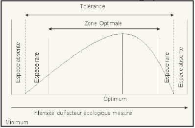

# Rôle des facteurs écologiques  dans la structuration de la  biosphère

## Introduction

Les êtres vivants de la Biosphère subissent +/- directement les facteurs de l'environnement, **facteurs écologiques**. Ils agissent au moins pendant une partie du cycle de developpement des organismes.

Les facteurs sont divisés en deux catégories:

* les facteurs abiotiques
* les facteurs biotiques

### A) Les facteurs abiotiques

Les facteurs abiotiques font intervenir les caractéristiques physico-chimiques du milieu, cest le **biotope**. Ils sont généralement **indépendants** de la densité des organismes.

* les facteurs climatiques:
	* lumière
    * température
    * pluviométrie
    * vent...
    
* Les facteurs édaphiques:
	* Texture/structure du sol
    * Composition physico-chimique du sol/de l'eau
    
Ces **facteurs abiotiques** peuvent:

1) Présenter des variations périodiques :
	* variables climatiques (température, précipitations)
    
2) Ne pas présenter de variations périodiques
	* pas de variations édaphiques : les propriétés restent stables même si elles sont hétérogènes dans une station.
    
### B) Les facteurs biotiques    

Les facteurs biotiques correspondent aux interactions pouvant intervenir entre les organismes:

* **intraspécifiques** ou **interspécifiques**

Ce sont des facteurs généralement **apériodiques**, avec une **intensité d'action augmentant** avec l'abondance des organismes.

### C) Réponse écologique

#### Notion de facteur limitant

Un facteur écologique est dit **limitant** s'il influence le comportement d'un organisme :

* lorsqu'il  est  absent  ou  passe  sous  un  seuil critique, 
* s'il  excède  un  niveau  maximum toléré  par l'organisme (ou la communauté).

Ex  :   En  culture,   l'absence  de Bore (rare  dans  le  sol) provoque :

* l'arrêt de la croissance des plantes cultivées même en présence d'autres éléments nutritifs
* sa trop forte présence le rend toxique

Etude de Bonneau (1995) sur les normes de composition foliaire pour les résineux à petites aiguilles (Épicéa, Sapin, Pin sylvestre, Douglas) :

* teneur optimale pour le bore de 15 à 30 mg/kg,
* niveau critique pour 8 à 10 mg/kg
* seuil de carence de 3 à 8 mg/kg. 

Chez le Cèdre : possibles carences en bore dans le Sud-Est du Massif central et la vallée du Rhône se traduisent par :

* des déformations,
* des dessèchements de pousses
* des  chutes  d’aiguilles  avec  des  teneurs  en  bore  inférieure s  à  4mg/kg

#### Notion de tolérance

Dans  tout  système  écologique,  les  êtres  vivants  présentent vis à vis des facteurs écologiques **des limites de tolérance** entre lesquelles se situe leur **optimum écologique**.

Il en existe deux cas:

* Espèce  capable  de  supporter  les  variations  d'intensité importante du facteur écologique considéré, espèce **euryèce**
* Espèce ne supporte pas de grandes variations d'intensité, espèce **sténoèce**.

Selon le facteur écologique (abiotique) considéré :

* température 
	* espèces **sténothermes**
	* espèces **eurythermes**
    
* sel
	* espèces **sténohalines**
    * espèces **euryhalines**

Le type de limites (limites larges ou restreintes) définit la **réponse écologique des espèces** par rapport aux variations du ou des facteurs écologiques considéres 

Si les limites sont connues pour un certain nombre de facteurs, c'est un **domaine de viabilité**.

* possible de prédire les fluctuations des populations (ex : Criquet migrateur, Locusta.sp)

Remarque : la réponse écologique d’une espèce peut varier

* selon l'âge (le stade de développement de l'espèce)
* selon l’intensité d’un autre facteur (compétition...)

Cette  notion  de **réponse  écologique** renvoie  à  la  notion d'**espèce généraliste** *versus* **spécialiste**.

* Une **espèce spécialiste** est inféodée à un milieu aux caractéristiques bien définies
* une **espèce généraliste** a la capacité de coloniser un milieu présentant une variation d'intensité des facteurs environnementaux

## I) Rayonnement et lumière 

Le rayonnement et la lumière font parti des facteurs climatiques qui subissent des **variations récurrentes**:

Ex: Période glaciaire/Périodes interglacières

* liées aux mododifications de la forme de l'orbite terrestre
* liées à l'activité volcanique

