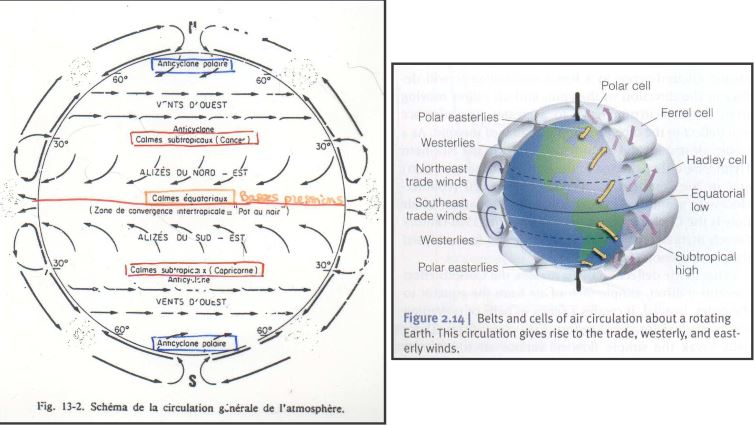

# I) Rayonnement et lumière

Le rayonnement et la lumière font parti des facteurs climatiques qui subissent des **variations récurrentes**:

Ex: Période glaciaire/Périodes interglacières

* liées aux mododifications de la forme de l'orbite terrestre
* liées à l'activité volcanique

**Les facteurs climatiques** sont des **facteurs périodiques** en raison de l'organisation de la biosphère selon deux périodicités fondamentales:

* rotation journalière de la Terre sur elle-même (alternance jour-nuit)
* inclinaison et rotation autour du Soleil (rythme des saisons)

Il en résulte:

* des variations journalières **aléatoires**: T° et Précipitations
* des variations périodiques plus ou moins **prévisibles**: chaleur en été, froid en hiver

Inclinaison de la Terre sur son axe, des modifications au niveau des quantités d'énergie reçues à la surface de la Terre.

## A) Le rayonnement solaire

### Bilan radiatif

L'énergie arrivant sur terre provient du soleil, par :

* rayonnement direct
* rayonnement indirect

L'énergie est nécessaire au fonctionnement de tout écosystème:

* photosynthèse
* chaleur pour les animaux

La quantité d'énergie entrant dans l'atmosphère :

**2 cal / cm² / min soit 1 kW / m² / min**

Toutefois:

Cette constante d'énergie n'est pas égale en tout point du globe
La quantité d'énergie reçue par la croûte terrestre moins importante/ à ce qui entre dans l'atmosphère, du fait:

* de l'albédo: quantité rfléchie par l'atmosphère
* des circulations atmosphériques: nébulosités
* du point géographique où l'on se situe: la latitude influence l'angle d'inclinaison

Environ 30% du rayonnement est réfléchi directement 
	
* environ 17% absorbé par l'atmosphère, les nuages, poussières, eau...
* le reste est absorbé par la Terre puis ré-émis.

**Bilan**: la Terre conserve une température moyenne stable et n'accumule pas d'énergie thermique:

**Energie entrant = Energie sortant**

Ce bilan est **équilibré à l'échelle de la planète**, mais il existe des différences entre zones particulières:

* zones **tropicales**: le bilan est **positif**
* zones **polaires**: le bilan est **négatif**

Les différences d'échauffement des masses d'air provoquent une dynamique de ces masses d'air qui tend à compenser le déséquilibre énergétique.

Ces grands phénomènes de circulation atmosphérique s'organisent en **cellules de convection** qui expliquent la répartition des grandes **zones climatiques** de la planète:

UTILISATION de L’ENERGIE

Théoriquement : l'utilisation optimale de l'NRJ conduirait à un système dont la biomasse serait directement liée à la quantité disponible :

**Rayonnement fort -> Biomasse importante**

Pratiquement : utilisation pondérée par les facteurs limitants

Zones désertiques : rayonnement important **mais** manque d'eau

Il existe différents rayonnements:

* Rayonnement solaire: UV (absorbé par la couche d'ozone), le visible (400 à 700 nm) et l'IR
* Rayonnement thermique: émis par l'atmosphère, les nuages, surface terrestre et ses composants (energie des photons plus faible)

Les rayonnements s'opposent en direction. Le rayonnement thermique est continu à l'inverse du solaire

