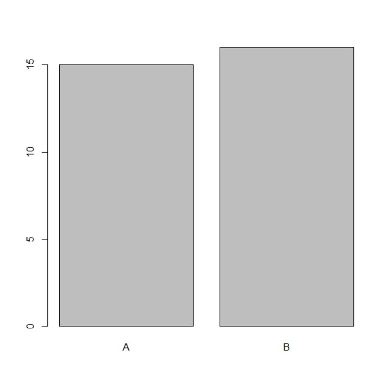
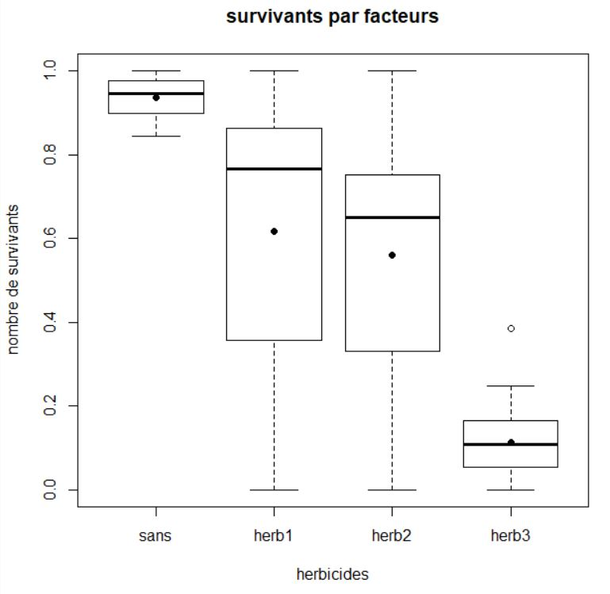

## Les vecteurs

Un vecteur est un tableau à une dimension, la fonction **c()** permet de le créer. Les données du vecteur doivent être toutes de la même dimension.

La fonction **seq()** permet que créer un vecteur contenant une suite de nombre entier.
```R
ages<- 
c(28,25,23,24,26,23,21,22,24,29,24,26,31,28,27,24,23,25,27,25,24,21,24,23,25,31,28,27,24,23)
ages
seq (2,6)
seq(1,10, by=0.5)
```

**by = 0.5** signifie de 0,5 en 0,5

```R
vecteur1 <- c(2,5)
vecteur1
vecteur2 <- c(2,6)
vecteur2
vecteur3 <- c(vecteur1, vecteur2)
vecteur3
vecteur1[2]
```
La fonction **c()** permet aussi de concaténer des vecteurs

La fonction **[x]** permet d'accéder à un élément du vecteur

```R
vecteur1[vecteur1 >2]
length(vecteur1)
length(vecteur1[vecteur1 >2])
```
La fonction **length()** permet de connaïtre la longueur d'un vecteur/tableau


## Les matrices (tableau à deux dimensions: données du même type)

La matrice possède un nombre de ligne **nr** et un nombre de colonne **nc**

```R
matrice <- matrix(c(1.5,2.1,3.2,1.6,1.4,1.5),nr = 3, nc = 2)
matrice

matrice[1,1]
matrice[1,]
matrice[2:3,1:2]
```
Elle peut donner une "sous matrice" comme ici correspondant aux éléments de la 2e et 3e ligne, 1ere et 2e colonne

## Les listes (tableau à une dimension : données de différents types)

```R
liste <- list("AH",55,45)
liste
```

## Les tableaux de données 

Chaque colonne donne un attibrut différent et chaque ligne correspond à un individu différent

```R
tab <- read.table("trees.csv", sep=",", header = TRUE)
tab

tab <- read.table(file = "trees.txt", row.names = 1, sep='\t', header = TRUE)
tab

tab2 <- read.table("trees_modif.txt", sep="\t", header = TRUE, row.names = 1)
tab2
```
**header = TRUE** signifie que la première ligne du fichier contient les noms des colonnes 

```R
names(tab)
ls(tab) 
```
**ls()**permet d'afficher une liste simple des objets en mémoire, seuls les noms des objets sont affichés

```R
dim(tab)
```
**dim()** donne la dimension de la matrice


```R
summary(tab)

tab <- read.table("trees_modif.txt")
tab

tab[1,2]
tab[1,"Height"]
tab[1,]
tab[,"Girth"]
tab$Girth

tab[tab$Girth>12,]
tab[tab$Girth ==12,]
subset(tab,Girth ==12.9)

sub <- tab[tab$Girth ==12,]
sub

attach(tab)
detach(tab)
attach(tab2)
```
**attach()** permet de définir le tableau par défaut

```R
tab["Girth"]

summary(tab)
ncol(tab) 
```
**ncol()** donne le nombre de colonne d'un tableau

```R
nrow(tab) 
```
**nrow()** donne le nombre de ligne du tableau

```R
mean(Girth)
median(Girth)
var(Girth)
sd(Girth) 
```
**sd()** donne l'écart-type

```R
mean(Girth, na.rm = TRUE)
```
**na.rm = TRUE** signifie qu'il ne faut pas tenir compte des valeurs NA pour ce calcul

## Représentation graphique

```R
plot(Species)
```


```R
plot(Volume~Height)
```


```R
plot(Girth~Species)
```


```R
plot(x=Species, y=Volume, main= "Volume des arbres en fonction de leur hauteur", xlab = "Hauteur", ylab ="Volume")
```


```R
hist(Girth)
```


```R
hist(Girth,freq=F)
```


```R
boxplot(Girth)
```


```R
boxplot(Girth~Species)
```


```R
par(mfrow=c(1,))
par(mfrow=c(1,2))
```

**mfrow()** permet d'affiche plusieurs graphes

```R
boxplot(Girth, Height, Volume)
box<-c("Girth","Height","Volume")
boxplot(Girth,Height,Volume,names=box)
```


## Exercice


```R
tab <- read.table("herbicide.csv", sep=',', header = TRUE)
tab


summary(tab)
dim(tab)


sans <- subset(tab, herbicide == "aucun")
sans

herb1 <- subset(tab, herbicide == "herbicide1")
herb1

herb2 <- subset(tab, herbicide == "herbicide2")
herb2

herb3 <- subset(tab, herbicide == "herbicide3")
herb3

box2 <- c("sans","herb1","herb2","herb3")
box2
boxplot(main="survivants par facteurs",xlab= "herbicides", ylab = "nombre de survivants", names= box2, sans$survivants, herb1$survivants, herb2$survivants, herb3$survivants)
boxplot

mean(sans$survivants)
mean(herb1$survivants)
mean(herb2$survivants)
mean(herb3$survivants)

points(1,mean(sans$survivants), pch = 16)
points(2,mean(herb1$survivants), pch = 16)
points(3,mean(herb2$survivants, pch = 16)
points(4,mean(herb3$survivants, pch = 16)
```


