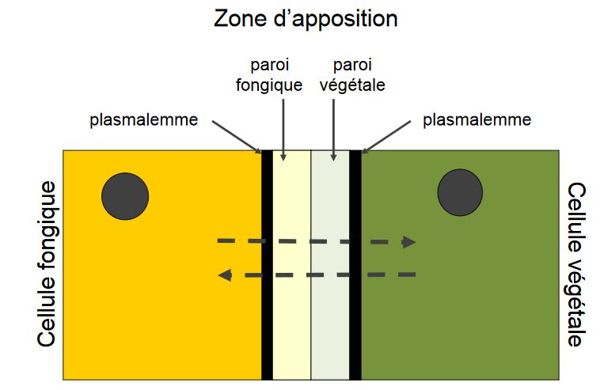

## IV) Symbioses plantes-champignons 

* **Mutualisme** : association entre au moins deux espèces qui en tirent un bénéfice réciproque

* **Symbiose** : mutualisme avec lien physique, durable (une vie) 

* Plante "hôte" ; mais chaque espèce est un partenaire = **symbiote**  

### A) Les symbioses mycorhiziennes

#### Mycorhizes

Il existe des contraintes liées à la colonisation des milieux terrestres:

* ségrégation des ressources (eaux, sels, minéraux)
* ressources hydriques, peu persistantes dans la majorité des sols

Il y  a un besoin de différenciation de l'appareil racinaire et de l'exploration du grand volume de sol

* mais poils absobants fragiles, leur durée de vie assez courte

*Rhynia sp*: apparaît au Dévonien (Paléozoïque, 410-360 M années)

Ils sont parmi les premiers trachéophytes à coloniser les milieux terrestres.

Les premières associations plantes - champignons observées datent de l'époque de la colonisation des terres (ca.400 Ma)

Le mot **mycorhize** vient de *mykos* qui signifie champignon et de *riza* qui signifie racine

Ces un terme proposé en 1885 par Frank; reconnaissance tardive et limitée de l'association et de son rôle

C'est une association omniprésente : 92% des familles terrestres sont mycorhiziennes. C'est un modèle de **coévolution**.

Les champignons interviennent:

* dans la dégradation de la matière organique
* dans la solubilisation de certains minéraux (Ni, Pi)

On a une augmentation des sels minéraux en solution dans le sol.

Les champignons peuvent absorber les ions solubilisés, il y a un transfert entre eux et la plante partenaire.

Les hyphes mycéliens sont de faible diamètre et on une croissance indéfinie, l'exploration du volume de sol sera augmenté.

Voies d'échanges entre les cellules dans un tissu végétal

Les apoplasmes mixtes permettent le transfert entre les cellules fongiques et les cellules végétale

#### Ectomycorhizes

Les ectomycorhizes ne sont pas les plus fréquentes mais ce sont les plus visibles.

Elles s'associent rarement avec des herbacées, mais surtout avec les arbres notamment ceux aux essences économiquement importantes (Fagacées, Betulacées, Salicacées, Pinacées...)

Elles s'associent avec des partenaires fongiques dont surtout les Dicaryomycète

Le statut ectomycrohizien a une évolution multiple : **co-évolution** suivant la diversification des plantes et champignons

Une **symbiose est obligatoire** pour le partenaire fongique

La spécificité est variable selon les partenaires:

* spécialistes: *Lactarius deliciosus - Pinus spp* et *Botelus grevillei - Larix spp*
* généralistes: >200 espèces fongiques et presque tous les arbres ectomycorhiziens

L'environnement terrestre est multiple : forêts tempérées, boréales, de Diptérocarpacées, zon de succession primaire...

1) Contact racine - hyphe, signaux d'évitement de réaction de défense
2) Initiation du manteau et pénétration de coins entre cellules épidermiques
3) Développement du manteau
4) Formation du réseau de Hartig

Bénéfices de l’ectomycorhize pour le développement de la plante : 

* Augmentation de la production de biomasse végétale 
* Réseau extra-racinaire mycélien augmentant le volume exploratoire, modification de l'architecture racinaire  
* Nutrition : dégradation de matière organique et solubilisation de N, P par partenaire fongique 
* Participation à l’assimilation d’eau et absorption sélective des ions du sol, protection contre dessiccation 

L'avantage secondaire de la mycorhization est la  protection sanitaire 

Les mécanismes impliqués dans la protection sanitaires des plantes sont:

* Compétition avec la microflore pathogène; protection mécanique par manteau fongique
* Amélioration du statut physiologique de la plante
* Emission de substances antibiotiques par les champignons
* Modification des exsudats racinaires
* Elicitation par transfert de signaux chimiques entre plantes *via* le réseau mycorhizien

Le partenaire fongiques aura des bénéfices de l'ectomycorhize, le flux de substances nutritives vont de la plante vers le champignon

Mise en évidence des échanges:

1) On fournit au partenaire donneur un élément marqué
* CO2 pour la plante
* P ou N pour le mycélium

2) Différentes substances se retrouvent marquées : dans le donneur, puis dans le receveur

Mise en évience de flux de composés **depuis la plante**:

* vitamines et hormones non synthétisable par le champignon
* surtout des composés C: passant la zone d'apposition sous forme de sucres simples, puis stockés dans les champignons sous forme de glycogène et de mannitol. 20 à 40% de la production photosythétique de la plante est transmise au partenaire fongique.

L'association est obligatoire pour  les champignons ectomycorhiziens, le statut de symbiote est obligatoire pour la fructification.

**Applications**: sélection de souches fongiques mycorhiziennes pour mycorhization contrôlée en pépinières (Laccaria, Lactarius, Suillus/ Pinacées) ou trufficulture (Tuber/Quercus,Corylus) 

Bénéfices : 

* augmentation de production de biomasse végétale
* baisse d'interventions mécaniques
* baisse intrants (phyto, engrais)
* production de carpophores

Limites :

* investissements à long terme
* maintien de l'association à la transplantation non maîtrisé (pas encore une domestication)
* risques d'introduction de souches invasives ?

Les association endomycorhiziennes touchent 80% des végétaux

Anatomie différente des ectomycorhizes:

* pas de manteau fongique externe à la racine
* pas de fructification épigée
* pénétration des parois cellulaires végétales : propagation du mycélium entre cellules racinaires puis entre paroi et membrane plasmique
* partenaire fongique : jusqu'à 10% du poids de la racine

#### Les Endomycorhizes Vésiculo-Arbusculaires (VAM)

Leurs partenaires végétaux sont de nombreuses espèces cultivées (Fabacées, Rosacées, Poacées, Solanacées, Liliacées)

Leurs partenaire fongiques sont les Gloméromycètes dont les principaux genres sont *Acaulospora, Gigaspora, Glomus, Sclerocystis*

Les mycorhizes ancerstrales sont présentes même chez les ptéridophytes : apparues avec les plantes terrestres au Dévonien ?

Il n'y a pas de spécificité entre la plante et le champignon remarquable, certaines associations sont peu efficaces.

Champignons ubiquistes : spores détéctées dans tous les sols, germant dans la rhizosphère des hôtes

Fossiles de champignons associés aux rhizomes d'*Aglaophyton major*(400 MA) : semblables aux mycorhizes vésiculo-arbusculaires actuelles 

1) Germination des spores, stimulée par les exsudats racinaires (liquide)
2) Haustoria entre cellules du cortex, production d'enzymes cellulolytiques par le champignon pour traverser la paroi (mécanisme semblable aux parasites)
3) Pénétration dans les cellules végétales; formation de palotons ou d'arbuscules, vésicules éventuelles repoussant et invaginant la membrane plasmique (extension du champignon limitée par la cellule-hôte)

Mise en place de la mycorhize du point de vue de la cellule-hôte:

* production d'une membrane d'isolement pectocellulosique de réaction
* observation (pafrois) de phagocytose du champignon par la cellule-hôte
* échanges dans la cellule-hôte par un apoplasme mixte similaire à celui des ectomycorhizes
* pas de pénétration du cylindre central

Echanges nutritionnels dans la symbiose VAM:

* C: de la plante vers le champignon
* P: du champignon vers la plante, sous forme de polyP, à travers les hyphes intracinaires (hydrolyse par ATPase dans les cellules végétales)
* N: du champignon vers la plante, sous forme d'arginine (passage dans cellules végétales par transporteurs d'ammonium, décomposition en urée)

Rôles du réseau mycélien extra-racinaire:

* Augmentation du volume de sol prospecté: facilitation en nutriments P, N et stabilisation des aggrégats du sol (glomaline + réseau d'hyphes)
* Protection contre excès d'éléments toxiques: teneur en Mn inférieur chez champignons mycorhizés/témoins, développement de Poacées mycorhizées sur sols pollués en métaux lourds (Zn, Ni)

Les bénéfices des endomycorhizes pour la plante sont:

* facilitation de la nutrition
* augmentation du developpement

Tous les champignons d'endomycorhizes ne sont pas également performants avec toutes les plantes à endomycorhizes.

Toutes les plantes ne sont pas autant dépendantes de la mycorhization.

Les mécanismes impliqués dans la protection contre les pathogènes sont:

* Compétition spatiale pour le site d'infection
* Compétition trophique pour les ressources carbonées de l'hôte
* Modification de la communauté racinaire de la rhizosphère
* Modification de la morphologie du système racinaire, stimulation production de lignine
* Modification de la physiologie : production composés phénolés, induction d'enzymes hydrolytiques de résistance

Cela permet l'inoculation de VAM en lutte biologique

#### Endomycorhizes

**Endomycorhizes d'Ochidacées**: partenaires fongiques toujours Basidiomycètes (*Corticium, Clitocybe, Mycena, Armillaria*)

La plante est totalement dépendante du champignon en stade jeune : embryon sans réserve, association nécessaire pour la germination et le developpement de la plantule.

L'association est mutualiste lors des stades suivant de la plante: 

* la pénétration des cellules par mycélium
* le developpement de pelotons d'hyphes non ramifiés

On a une hypertrophie des cellules végétales.

**Endomycorhizes éricoïdes**:

* Patenaires végétaux sont des Ericacées
* Partenaires fongiques sont surtout des Ascomycètes (Helotiales), des Basidiomycètes (Sebacinales)

Les champignons ont des similitudes anatomiques avec d'autres mycorhizes : 

* pelotons 
* manteau mycélien chez ectendomycorhizes
* pénétration entre et dans les cellules

L'association est nécéssaire en milieux acides ou pauvres en N

Associations mycorhiziennes : phénomène constitutif de l’évolution des végétaux terrestres  (constituant important de l’alimentation minérale des végétaux cultivés et sauvages) 

Pourtant, les pratiques culturales actuelles sont peu favorables à l'installation des associations mycorhiziennes: 

* labours profonds
* engrais chimiques
* produits phytosanitaire et fongicides
* selection de variétés performantes mais exigeantes en nutriments

Mais il existe quelques exceptions

* mycorhization contrôlée en pépinières arboricoles
* inoculation de spores de VAM en grandes cultures

La symbiose et d'autres interactions sont des stratégies compatibles:

* Compétition plante/plante influencée par le(s) symbiote(s) fongique(s)
* Compétition champignon/champignon influencée par le(s) symbiote(s) végétal(aux)
* Symbiose maintenue par communication hôte-champignons
* Chaque partenaire de la symbiose (plante, champignon) est associé à plusieurs individus, souvent de plusieurs espèces

Les **plantes mycohétérotrophes** sont totalement dépendantes du/des partenaire(s) fongique(s) pendant tout leur cycle de developpement :

* ressources N, P du sol
* ET ressources N, C organiques

L'utilisation des ressources est disponible dans le réseau mycorhizien

### B) Les champignons endophytes

Les interactions sont fréquentes et sous évaluée dans tous les organes végétaux

*Epichloe tiphina* (Ascomycète) produit des alcaloïdes proches de l'acide lysergique

Les poacées qui sont *infectées* toxiques et peu digeste ont une protection contre les herbivores, les pathogènes et le stress hydrique.

Le statut d'interaction est peu clair, commensalisme/ mutualisme/ parasitisme en phase de dormance ?

Il y a un effet indirect sur les interactions biotiques de l'hôte

*Alternaria* endophytes de *Centaurea stoebe* (indigène en Europe) : augmentation de la biomasse et de la compétitivité de l'hôte en contexte invasif

### C) Evolution des modes de vies fongiques

Le continum de stratégies fongiques est un mode de vie parfois mal défini.

* Parasites nécrotrophes/ saprotrophes ?
* Parasites/ endophytes/ mutualistes
* Saprophytes/ mycorhziens ?
* Saprophytes/ lichens ?
* Coévolution par proximité physique de l'interaction : forte pression de séléction vers le mutualisme
* Emergence/ perte répétée des symbioses dans certaines lignées
* Caractères conservés entre stratégies : 
	* mécanismes d'infection
    * enzymes de dégradation de la matière organique
    * morphologie