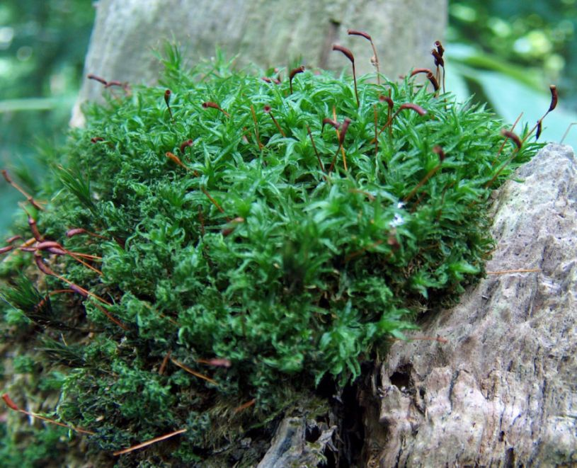
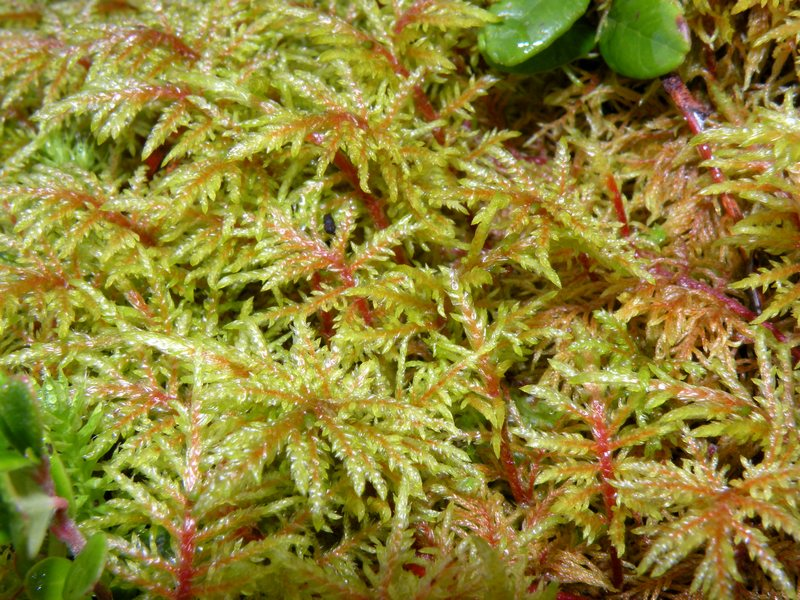

### POLYTRICACEES, *Atrichum undulatum*

###  POLYTRICHACEES, *Polytrichum formosum*

### DICRANACEES, *Dicranum scoparium*

### BRACHYTHECIACEES, *Eurhynchium striatum*

### MNIACEES, *Mnium hormum*

### DICRANACEES, *Dicranella heteromalla*

### LEUCOBRYACEES, *leucobryum glaucum*

### HYPNACEES, *Hypnum cupressiforme*

### LUNULARIACEES, *Lunularia cruciata*

### HYLOCOMIACEES, *Rhytidiadelphus triqueter*

### PELLIACEES, *Pellia epiphylla*

### LEPIDOZIACEES, *Lepidoza reptans*

### PLAGIOTHECIACEES, *Plagiothecium undulatum*

### FISSIDENTACEES, *Fissidens taxifolius*

### BRACHYTHECIACEES, *Eurhynchium stokesii*

### BRACHYTHECIACEES,*Brachythecium rutabulum*

### BRACHYTHECIACEES, *Isothecium myosuroides*

