# L'architecture des végétaux

Discipline qui est née il y a environ 40 ans, mise en place par des botanistes qui travaillaient sur des arbres tropicaux.

**Francis Hallé** : mise en place de méthode et 1er concept et a écrit *Tropical Trees and Forests*, vulgarisation pour le grand public et sensibilise les gens. Il arrive à regrouper les arbres dans 22 modèles différents

**Oldman** (1974) : notion de réitération ou duplication architecturale

**Edelin** (1977), **Barthélémy** (1977) : unité architecturale

Années 1990 : modélisation avec application en foresterie et en arboriculture fruitière

**Architecture végétale** = discipline qui s'intérresse à la forme et/ou à la structure des végétaux, et à leurs changements temporels et/ou topologiques

* Contraintes exogènes : environnement
* Processus endogènes de croissance : interne 

## I) Bases morphologiques et critères pour la description et l'analyse architecturale 

Il existe quatre grands groupes de critères utilisés

### A) Processus de croissance

#### 1) Croissance Définie *vs* Indéfinie

La plupart des conifères ont une croissance indéfinie de même pour les palmiers ou cocotiers...

#### 2) Croissance rythmique contre croissance continue

La croissance continue est une croissance régulière

La croissance rythmique alterne en croissance et un arrêt, notion d'**unité de croissance** (UC). Le caoutchou possède ce type de croissance.

Lorsqu'il y a un arrêt de croissance, il y a un bourgeon. Les **cataphylles** sont les écailles situés sur les bourgeons.

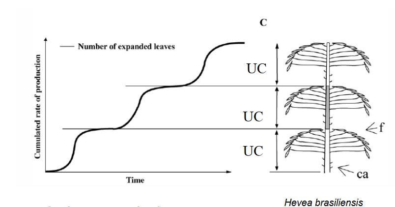

La croissance rythmique peut être "typique" (on peut l'anticiper) ou "atypique" comme le noyer, le chêne ou le hêtre.

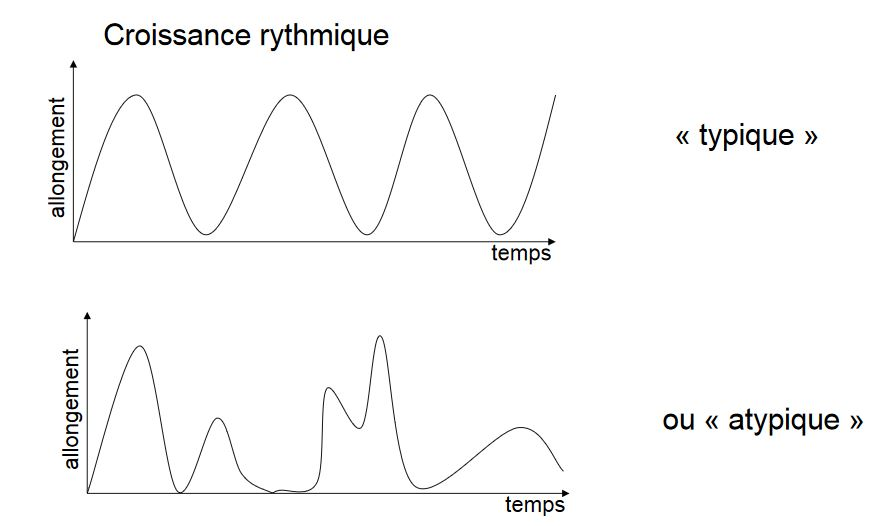

On peut observer ces différents types à l'aide : 

* des bourgeons (alternance de cataphylles et de feuilles photosynthétiques), 
* du changement dans la morphologie des feuilles,
* dans la moelle (diamètre et structure),
* de la couleur

#### 3) Notions de monocyclisme et polycyclisme

Croissance annuelle : exemple de plantes bicycliques

### B) Les processus de ramification

La ramification va se faire par un bourgeon latéral qui peut être de trois types différents :

* avec axe préformé : les feuilles sont déjà dans le bourgeons pour l'année suivante, le nombre de feuilles dépend des conditions de l'année précédente 
* avec axe néoformé : le bourgeon avec des écailles mais on y trouve pas de feuilles
* bourgeon mixte : base préformé et en fonction des conditions il y aura néoformation

#### 1) Ramification immédiate et différée

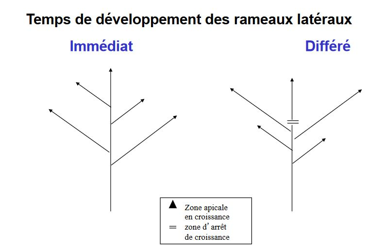

** Ramification immédiate** : formation d'un premier entre noeud généralement long = **l'hypopodium**

**Ramification différée** : Présence de prophylles signant la période de repos.

#### 2) Monopodie et sympodie

#### 3) Positionnnement des rameaux latéraux

**Acrotonie** : dominance d'un bourgeon apical (arbres)

**Mésotonie** : developpement privilégié dans la partie médiane

**Basitonie** : les rameaux à la base se developpent d'avantage (arbustes)

### C) Différenciation morphologique des axes

#### 1) Orthotropie, plagiotropie et axes mixtes

Orthotropie : axe à la verticale (palmier)

Plagiotropie : axe à l'horizontal 

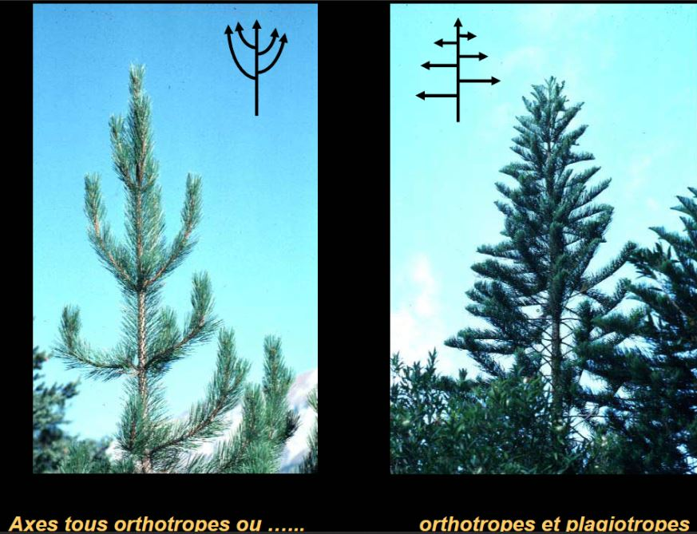

#### 2) Axes courts et axes longs

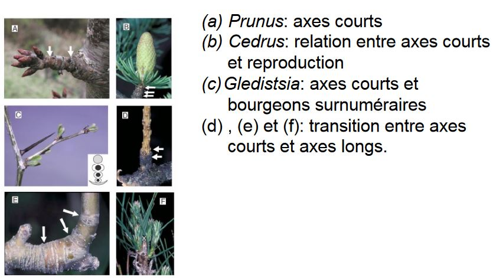

### D) Position terminale ou latérale des structures reproductrices

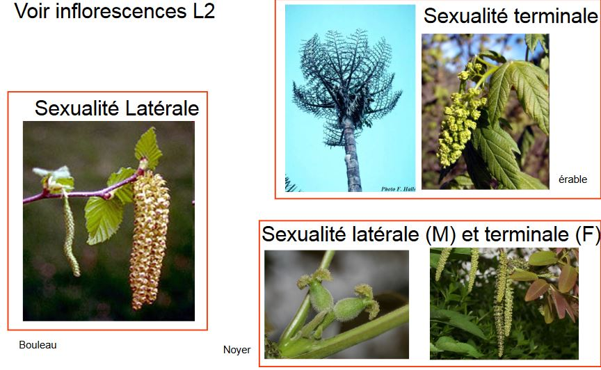

## II) Les modèles architecturaux

**Les modèles architecturaux** sont définis comme une stratégie de croissance inhérente à chaque végétal, qui définit à la fois la manière dont la plante édifie sa forme et le résultat.

Ils expriment la nature et la séquence des évenements affectant la croissance de la plante.

Une vision globale et dynamique du développement végétal

Un exemple de plantes non ramifiées à inflorescence terminale : 

* Modèle de **HOLTTUM**

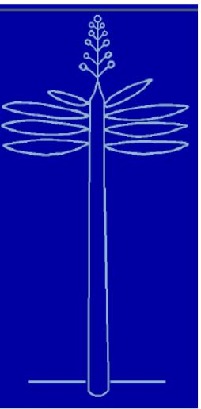

Un seul axe qui s'arrêtera par une inflorescence (sexualité terminale), c'est une plante **monocaule** (un seul axe)

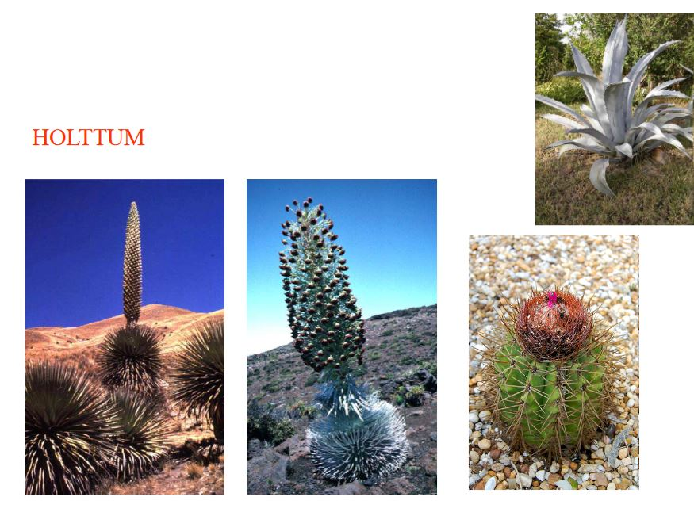

* Modèle de **CORNER**

Plante non ramifiée à inflorescence latérale, la croissance est continue (ex : palmier)

* Modèle de **LEEUWENBERG**

Plante entièrement sympodiale : Succession sympodiale d’unités équivalentes orthotropes et déterminées 

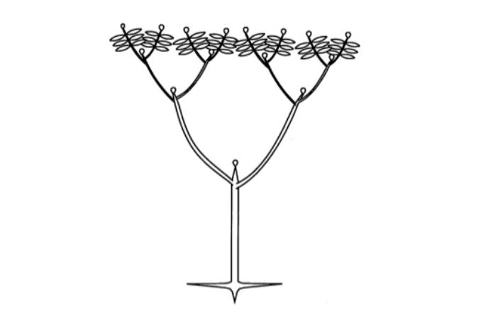

* Modèle de **RAUH**

Plante entièrement monopodiale

Ramification et croissance rythmique, axes monopodiaux, orthotropes et sexualité latérale

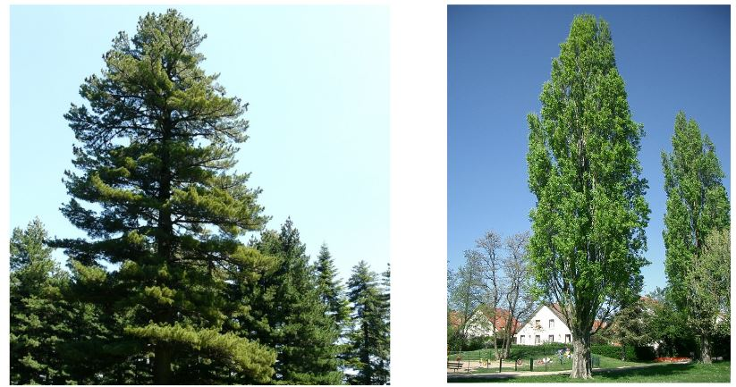

* Modèle de **MASSART**

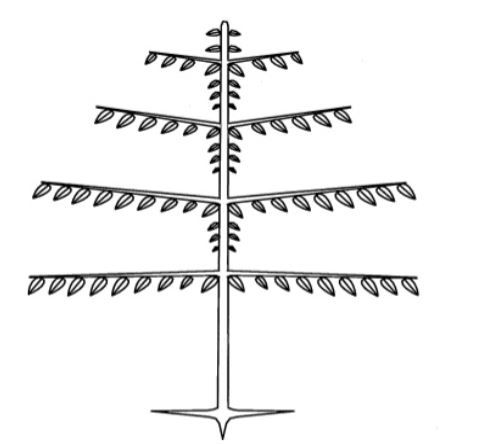

Croissance rythmique, tronc orthotrope mais branches plagiotropes, système ramifié monopodial, sexualité... 

## III) L'unité architecturale

Existence d'espèces ayant le même modèle mais des modalités de croissances différentes

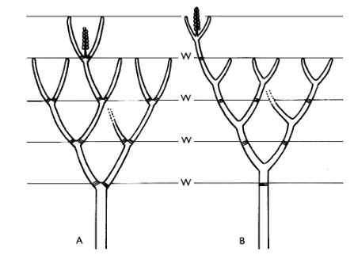

Pour mieux définir l'architecture, on va définir le concept d'unité architectural qui caractérise l'architecture élémentaire des arbres d'une même espèce. On va caractériser chaque type  d'axe et comprendre a quoi sert chaque axe.

## IV) La réitération

"*Ramification dont la place, **controlée par des facteurs écologiques**, n'est **pas prévisible** avec les seules données du modèle architectural, et qui mène à la **duplication de ce modèle** à partir de méristèmes qui n'étaient pas ceux de l'embryon*" OLDEMAN, 1974

**Réitération traumatique** : le haut de l'axe ne repousse pas, les axes latérales vont pousser grâce aux bourgeons latéraux 

 

**Réitération adaptative** : Elle peut être immédiate ou différée : refait de nouveau rameaux pour étoffer un peu, suite souvent au vieillissement

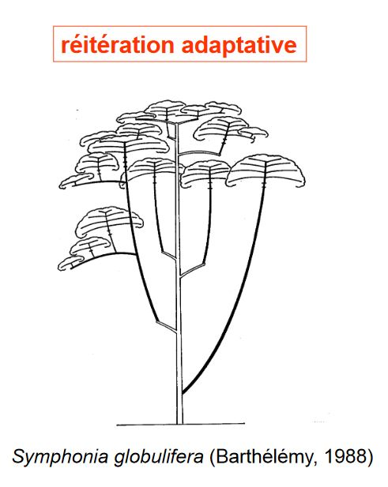

