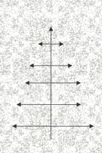
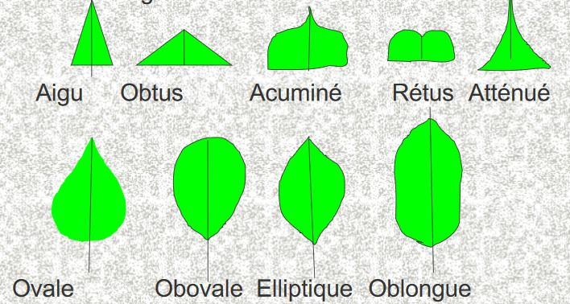
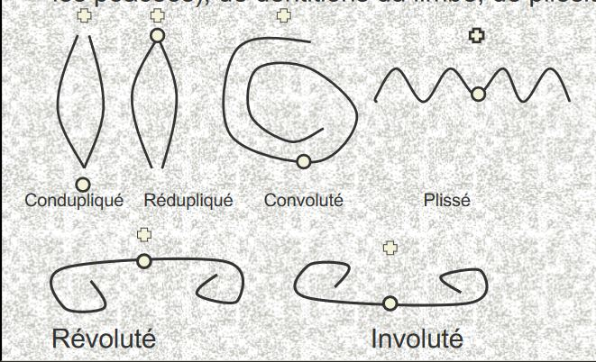
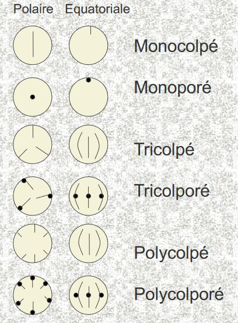
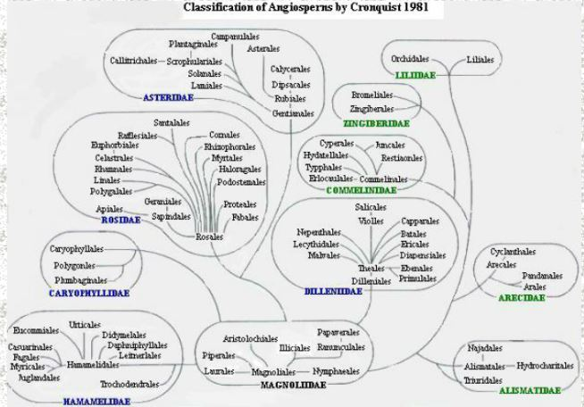

# La classification phylogénétique des Angiospermes

### Introduction

Une **classification** est un système hiérarchique permettant de placer les objets (ici biologiques et végétaux) dans des catégories.

La classification des végétaux repose sur des bases inclusives depuis Linné et ses 7 rangs.

Ses objectifs peuvent varier:

* médicinal
* utilitaire
* **phylogénétique** depuis Darwin (1859)

Elle peut également être **opératoire**:

* à peu près stable
* mémorisable
* pratique à mettre en oeuvre
* ces deux objectifs (phylogénétique et opératoire) sont parfois en conflits

Deux actes différents:

* **classer** : placer un groupe végétal dans une catégorie en fonction de ses objectifs propres

* **déterminer** : *déterminer* à quel groupe appartient un individu dans la classification d'interêt

Des caractères sont utilisés pour deux démarches: morphologiques, floraux, gustatifs.. 

Mais la classification s'appuie de plus en plus sur des caractères trop compliqués à aller mesurer lors d'une determination simple : les caractères moléculaires et biochimiques.

## I) Les arguments de la classification des Angiospermes

### A) La morphologie

Concernent la forme extérieure ou l'apparence. Importants en ce qu’ils sont encore fondamentaux  pour la détermination, et parce qu’ils furent la 
principale donnée disponible dès l’origine de la taxonomie.

Durée de vie et port de la plante:

* annuelle
* bisanuelle
* vivace monocarpique ou polycarpique
* orthotropie et plagiotropie
* monopadiale ou sympodiale
* prolepsie ou syllepsie des bourgeons

Conduits à différents modèles architecturaux des plantes

Axe et ramifications monopodiales : *Araucaria*

Il va y avoir un faible nombre de groupe d'architecture possible

#### Système racinaire

Plus difficile à décrire, car à ramification généralement irrégulière, moins informatives en terme de détermination

Opposition entre deux grands types:

* pivotant
* fasciculé

Peuvent développer des systèmes particuliers:

* racines adventives
* racines aériennes (éventuellement photosynthétiques)
* racines charnues/fibreuses
* racines à haustoriums

#### Système caulinaire

Organisé sur un mode rythmique dont l'unité fondamentale est l'ensemble noeud et entre noeud. Fournissent de nombreux caractères utilisés en systématique.

Rôle majeur: exposer les feuilles à la lumière solaire.

Rôles dérivés: stockage d’eau et de glucides, photosynthèse, fixation (volubiles), protection (épines raméales).  Position parfois hypogée (tubercules caulinaires et rhizomes)

#### Les bourgeons

Courtes tiges embryonnaires, se trouvant chez les Angiospermes à l'aisselle des feuilles et éventuellement à l'extrémité de la tige. Leur disposition reflète donc la phyllotaxie et l'architecture de la plante.

Bourgeon terminal, axillaire, floral, mixte, pseudoterminal

#### Les feuilles

Principaux organes photosynthétiques chez la plupart des Angiospermes.  Insérées sur des nœuds, généralement à croissance définie contrairement 
aux tiges. Organes polarisés, généralement fonctionnels.

Modifications possibles:

* épines (Cactacées)
* stockage d’eau (Aloes)
* fixation

Parfois présence d'une ligule ou d'une articulation inférieure (pulvinus)

Présence occasionnelle de stipules.

La phyllotaxie est variable.

De nombreux caractères issus de la nervation:

* pennée
* palmée 
* parallèle

La forme du limbe lui-même fait l'objet d'une terminologie riche:

Caractères de préfoliaison (pliée contre enroulée pour les poacées), de dentitions du limbe, de pilosité

### La morphologie florale

La fleur est un axe très modifié qui porte des appendices spécialisés. On peut, si on souhaite restreindre la définition aux angiospermes, poser que c'est l'organe qui donne un fruit.

Trois parties:

* périanthe
* androcée
* gynécée

Si ces trois parties sont présentes, la fleur est dite complète

Fleurs hermaphrodites, unisexuées (staminée ou pistillée)

Plantes monoïque et dioïques

La pollinisation et les syndromes associés, la diversité des fruits et des disséminations

### B) L'anatomie

Les caractères anatomiques sont étudiés au microscope optique, les caractères ultrastructuraux au MET.

Caractère du phloème et du liber:

un caractère important est la structure des plastes des tubes criblés: types S = amidon ou type P = proteines

### C) L'embryologie

L'embryon est l'albumen sont les deux parties qui résultent de la fécondation chez les Angiospermes. Typiquement, on a un axe dont une extrémité est la racine (radicule) et l'autre la tigelle (épi-cotyle).

Deux cotylédons = dicotylées

Un cotylédon = monocotylées

Développement de l'albumen: 

* deux types chez les dicotylées:

	* albuminée
	* exalbuminée

Chez les monocotylées : type hélobial (une cellule suit un developpement nucléaire, l'autre cellulaire)

### D) La palynologie

Leur taille est de 10 à 350 microns.

Caractères importants:

* les apertures

Caractères importants à l'échelle des grands groupes

Structure et forme de l'exine: lisse chez les anémogames, plus ou moins crochue chez les entomogames.

Caractère utilisable à des niveaux plus fins.

Classification de Cronquist (1981)

Dernier système sur caractères morphologiques et chimiques

### E) Les caractères moléculaires

A la base de la révolution de la systématique lors des dernières décénnies.
L'utilisation de l'ARN et de l'ADN pour les comparaisons entre organismes. A l'origine considérés comme moins sujets que les caractères morphologiques à la convergence et au parallélisme. Sont en tous cas informatifs de par le très grand nombre de caractères disponibles.

Génome chloroplastique:

Stable à l'échelle spécifique réarrangements suffisamment rares pour séparer les grands groupes. Deux séquences inversées symétriques.

rbcL: gène codant pour la sous-unité de la rubisco, existant chez presque toutes les plantes.

Forte pression de sélection évolution lente (~10-10 substitution/site/an)

NADP déshydrogénase : plus rapide

Les arguments permettant de décrire et de classer les plantes sont nombreux, de l'échelle de l'organisme à celle de son génôme.

Les résultats issus des caractères moléculaires viennent en partie renforcer les classifications reconnues auparavant, mais avec des changements majeurs.
