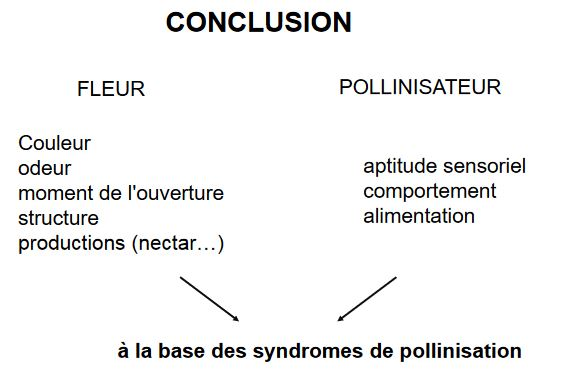

# La pollinisation

Constats : 

plantes = organismes fixés

malgré cet handicap = grande diversité chez les végétaux

*Quelles stratégies, quelles solutions, pour aboutir à ce résultat ?*

Hypothèse : Mécanisme de la POLLINISATION

## Introduction

Angiospermes : reproduction affranchie de l'eau, grain de pollen

Plantes primitives : gamètes lâchés dans le milieu anthérozoïdes dépourvus de flagelles

Deux objectifs pour une angiosperme

* se reproduire = établir une descendance
* se protéger de l'intrusion de flux de gènes potentiellement nuisibles = notion d'espèce 

**Notion d'espèce** : première définition

Chez les animaux : critère utilisé pour distinguer les espèces = faculté pour les individus de se croiser, amène le concept biologique de l'espèce (CBE), concept à prévalu dans la littérature zoologique et qu'il y a peu dans la littérature botanique

Chez les végétaux : flux de gènes varient beaucoup (faible à important) et existent entre les groupes de plantes

* des groupes reproducteurs à un ou quelques individus (individus autogames, clones assexués)
* des groupes ayant des assemblages morphologiques hétérogènes (hybridations)

Le concept biologique de l'espèce (CBE) aboutirait donc à désigner comme espèce un nombre élevé d'individus autogames .. mais également à créer des espèces très vastes (hybridation).

Quelques concepts d'espèce :

### Concept biologique

L'espèce est un ensemble de populations interfécondes isolées sur le plan reproductif d'autres  groupes similaires et qui occupe une niche particulière 

* approche populationnelle et génétique (l'espèce est un pool de gènes susceptibles de se mélanger à chaque génération)
* la discontinuité sexuelle implique un/des systèmes de reconnaissance 
* la spéciation, ou apparition de nouvelles espèces, se traduira par l'apparition d'un nouvel isolement

### Concept de reconnaissance

L'espèce est un ensemble d'individus interféconds et le flux de gènes est un facteur de cohésion conservant les ressemblances entre les individus au sein de l'espèce.

### Concept phénétique

Repose sur la ressemblance globale entre les membres d'une espèce, qui sont séparés des autres espèces par une discontinuité de la variation.

Espèce = ensemble des individus qui se ressemblent plus entre eux qu'ils ne ressemblent à aucun autre individu

### Concept évolutif 

Est basé sur l'identification de lignées évolutives mais ne donne pas de règles claires permettant de savoir comment identifier ces lignes évolutives.

Quelque soit la définition, un espèce est une entité discrète et temporelle qu'il faut replacer dans un processus dynamique évolutif

Processus de formation = **Spéciation**

Ce processus peut -être défini comme :

* un processus adaptatif induisant des barrières contre le flux de gènes entre les populations étroitement liées, par le developpement des mécanismes d'isolement à la reproduction
* un processus de changements génétiques produisant la naissance d'une nouvelle espèce

Un processus clé chez les espèces = la **Reproduction**

* indispensable condition pour la perpétuation de l'espèce au travers de la succession de générations 
* seul moyen de multiplication
* seul moyen de colonisation de nouveaux territoires

deux types de reproduction :

* assexuée ou végétative
* sexuée : production de graines

### Reproduction sexuée 

Inclus la fécondation croisée et la méiose, mécanisme de recombinaison génétique donc : source principale de variations héréditaires -> indispensable pour répondre aux changements de l'environnement

Les mécanismes d'isolement peuvent être des mécanismes de protection contre la disparition d'une espèce

trois types d'isolement communément cités

* isolement spatial ou géographique :
	* isolement extrinsèque à la biologie de l'espèce
    * peut-être responsable de l'établissement (par divergence) d'isolement reproductif

* isolement environnemental ou écologique
	* apparaît sous la pression de sélection contre les hybrides et leurs dérivés
    * favorise l'isolement reproductif 
	* rôle fondamental dans le mode de spéciation sympatrique

* isolement biologique
	* restriction ou blocage des échanges génétiques (différences contrôlées dans les modes de reproduction et dans les relations de fertilité des individus appartenant à différents groupes de populations)
	* isolement essentiel dans la préservation de l'intégrité génétique
    * étude de la nature et de l'origine de ces mécanismes = essentiel dans l'analyse du processus de spéciation

**mécanisme étudié = la pollinisation**

## La pollinisation

### Définitions

Le mécanisme de la **pollinisation** correspond à la période qui comprend le départ du grain de pollen jusqu'à son arrivée sur le stigmate

Le grain de pollen : protection des gamètes mâle, protection lors du transport

Ornementation : Exine Intine

### B) Pollinisation directe = **autogamie** pollen d'une fleur féconde le stigmate de la même fleur, via le balancement des étamines au dessus du stigmate 

Autogamie obligatoire : fécondation du stigmate avant l'ouverture de la fleur = cléistogamie

* fleurs tardives de certaines Violettes
* fleurs des Onagracées : autopollinisation stricte
* ouverture de la fleur une fois l'autopollinisation réalisée : blé, pois (difficile d'obtenir des hybrides)

Autogamie possible :

* même chez les espèces ayant acquis une différenciation poussée 
* chez les fleurs ouvertes
* autre : courbure du style (position sup/étamines) et application des stigmates sur anthères si pas d'apollinisation

Plantes autogames plus rares que les plantes allogames 

Stratégies tournées vers ce mode de pollinisation moins nombreuses que celles tournées vers la fécondation croisée

Dans une certaine mesure, les plantes autogames sont contre - séléctionnées : croisements consanguins mèneraient à une dépression de consanguinité

Pollinisation indirecte = **allogamie** = fécondation croisée pollen d'une fleur féconde une autre fleur (individus diffférents)

Remarque : si les fleurs sont différentes mais portées par un même individu = **géitonogamie** (se rapproche de l'autofécondation)

#### 1) Cas des plantes dioïques

Fleurs unisexuées : fécondation entre plante mâle et plante femelle

* Assez fréquente chez les plantes arborescentes, plutôt rare chez les plantes herbacées
* Immobilité des plantes : reproduction correcte implique l'existence sur le même lieu (ou à une distance autorisée par les processus de transport du pollen) des plantes des deux sexes.

#### 2) Fécondation au hasard

Fleurs **bisexuées** : pollen peut se déposer aussi bien sur les stigmates de la même fleur, d'une autre fleur de la même plante ou d'une fleur d'une fleur d'une autre plante

* Autofécondations ou fécondations croisées peuvent se réaliser **au hasard**
* Conséquences en expérimentation : à des fins génétiques préférences pour des autofécondations ou des fécondations croisées
* Le plus souvent, des dispositifs particuliers (anatomiques, temporels ou génétiques) permettent de choisir une stratégie : autofécondation, fécondation croisée

#### 3) Fécondation croisée

Fleurs bisexuées : dispositif autorise seulement la fécondation croisée, cas où l'on trouve la plus grande variété de stratégies pouvant être de nature

* anatomiques (en relation souvent avec la pollinisation par les insectes)
* génétiques : quel que soit le transport du pollen sur le stigmate des fleurs, la poursuite des processus permettant la fécondation est contrôlée par des phénomènes d'**incompatibilité génétique** interdisant l'autofécondation

### C) L'isolement à la reproduction

Pour assurer sa descendance une plante doit : 

1) Se "défendre" contre le flux génique nuisible : empêcher la fécondation de l'ovule par un gamète mâle d'une autre espèce -> developper des stratégies qui limitent l'arrivée de pollen autre que celui de l'espèce

2) Favoriser la fécondation par des individus "pollen" de la même espèce tout en évitant l'autofécondation = autopollinsation -> maximiser l'échange entre individus amène à developper des vecteurs = transporteurs de pollen

#### 1) Isolement temporel

Espèces étroitement apparentées fleurissent à des périodes différentes de l'année

Autre mécanisme : la floraison à des heures différentes de la journée

#### 2) Isolement floral

Adaptations florales :

* limitent voire empêchent les échanges de gènes entre espèces
* produisent leur effet : 
	* par la structure florale
	* en influençant le comportement de l'animal (éthologique)

* Forme et structure de la fleur déclenchent un comportement copulatoire chez le pollinisateur qui se charge de pollen ou bien la pollinise
* Fidélité : pollinisateur se limite à une espèce même si d'autres sont disponibles

#### 3) Autofécondation

Remplacement de l'autogamie, pollen d'un même individu accepté : autocomptabilité 

#### 4) Incomptabilité

Mécanismes de reconnaissance de l'interface pollen/ stigmate interdisant ou ralentissement la réhydratation du grain puis la croissance du tube pollinique provenant d'une autre espèce

Problème majeur rencontré par allogame : le transport du pollen jusqu'à un autre individu compatible

Transport se décline en trois étapes

1) Départ du pollen
2) Trouver le vecteur
3) Réception du pollen

### D) Départ du pollen

Maturité du pollen :

* coalescence (loges polliniques)
* déhiscence de l'anthère

### E) Les stratégies de la pollinisation

*Comment la plante attire t-elle les acteurs de la pollinisation ?*

**Couleur** = message d'attraction destiné aux insectes pollinisateurs

La couleur est subjective = n'est pas perçue de la même manière d'un animal ou d'un homme à autre

L'abeille : ne voit pratiquement pas le rouge, confond avec le vert, basée sur l'ultraviolet

Disposition des fleurs = fleurs souvent regroupées en inflorescence 

Meilleure attraction des insectes car : 

* plus visibles
* plus odorantes
* offre une différenciation florale = Astéracées

**Mimétisme** favorise également la pollinisation

Plusieurs exemples étudiés

* mâle trompé par la supercherie (= mimétisme) tente de copuler avec le labelle
* pseudo copulation est soit abdominale soit céphalique (selon les espèces)
* pollinies viennent se fixer sur l’abdomen ou le thorax de l’insecte
* insecte assure la fécondation croisée 

Objectif de la plante : 

* Produire des phéromones attractrices pour avoir une chance d'être pollinisée
* Produire des molécules repoussant les mâles vers les fleurs non fécondées du même pied et des autres individus pour augmenter la fitness (individu, espèce)

Plante produit des phéromones de femelles insectes prêtes à la copulation

Attraction des mâles réceptifs à la phéromone : notion de spécificité de l'espèce pollinisatrice

Statégie efficace pour la fécondation de la plante : dès l'échec de copulation, l'insecte s'envole à la recherche d'une autre partenaire

Passage successif de fleur en fleur, abeilles mâles recueillent le pollen sur leur thorax et le transportent vers différents stigmates : brassage génétique

Logiquement, la séléction naturelle devrait séléctionner les mâles capables de distinguer les insectes femelles de fleurs?

Période de floraison de l'orchidée coïncide pratiquement avec l'éclosion des mâles adultes qui se métamorphosent souvent avant les femelles

Les mâles dès leur éclosion se disputent les femelles adultes peu nombreuses, ce qui expliquerait leurs capacités de discernenement réduites

Dans cet état de frustation sexuelle, de nombreux mâles sont trompés par l'odeur et l'aspect de la fleur Ophrys

D'autres espèces de fleurs reproduisent l'odeur de la viande en décomposition.

Attraction des mouches femelles :

Attirées par erreur par le parfum de charogne, elles viennent se poser sur les pétales, qu'elles confondent avec la carcasse d'un animal et y pondent mêmes leurs oeufs.

## Conclusion

