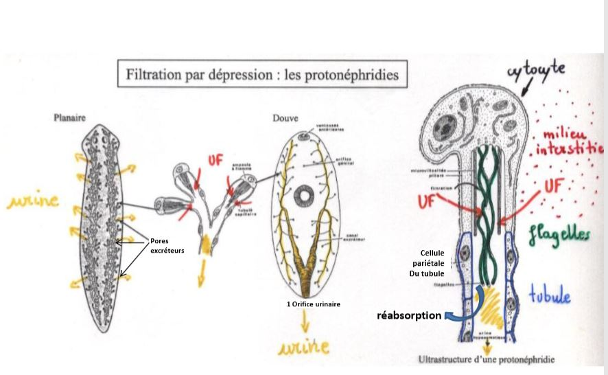
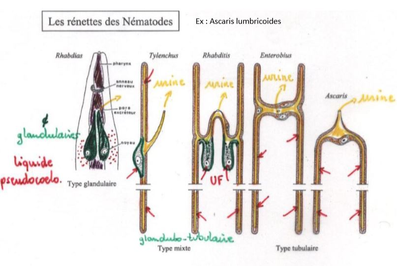
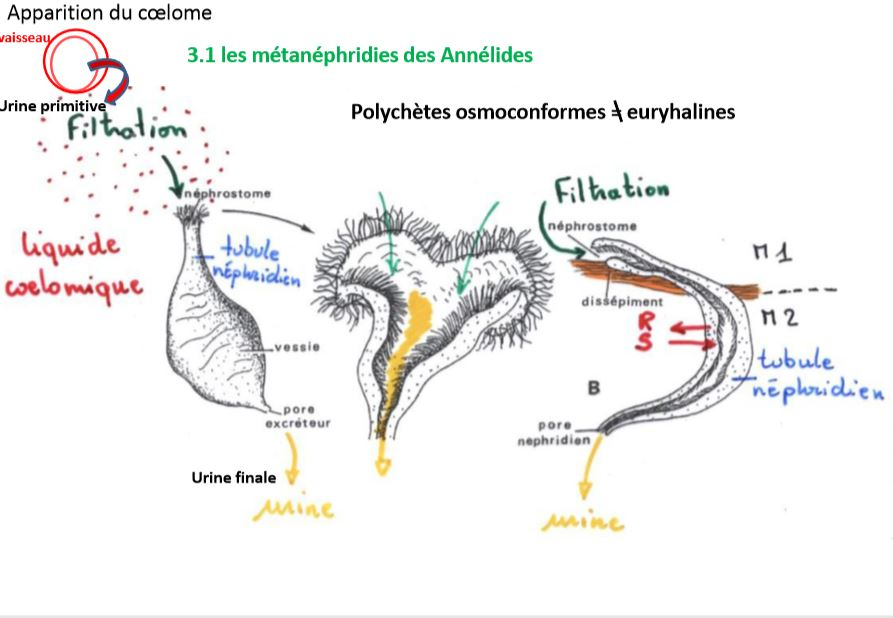
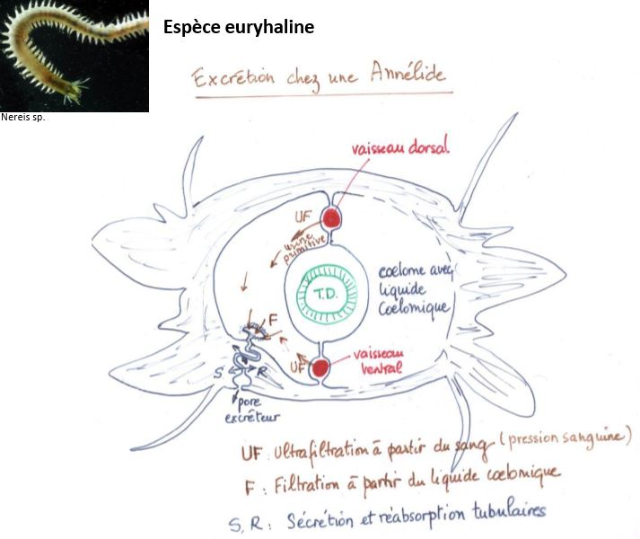

# Les appareils excréteurs et leur fonctionnement

## I) Absence d'organes excréteurs

## II) Organes filtrant par dépression

### A) Les protonéphridies

Chez les métazoaires triploblastiques dépourvus de cavités cœlomiques

### B) Les néphridies à solénocytes

Système  indépendant de la cavité cœlomique et donc retrouvé chez les larves sans cavité cœlomique ou chez les annélides adultes dont le cœlome a régressé 

### C) Les rénettes des Nématodes

## III) Organes filtrant par surpression

### A) Les métanéphridies des Annélides

### B) Les néphridies des mollusques

### C) Les néphridies des arthropodes

Origine mésodermique des néphridies

### D) Le rein des vertébrés

## IV) Organes filtrant par transport d'ions

