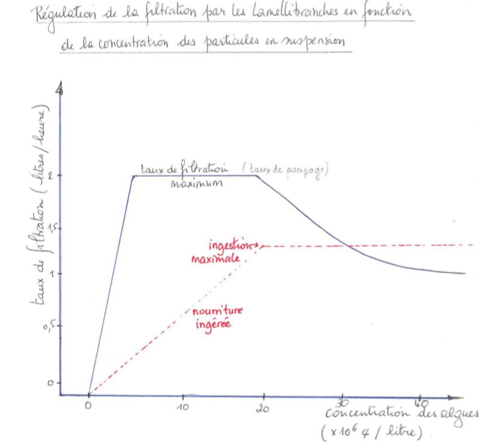
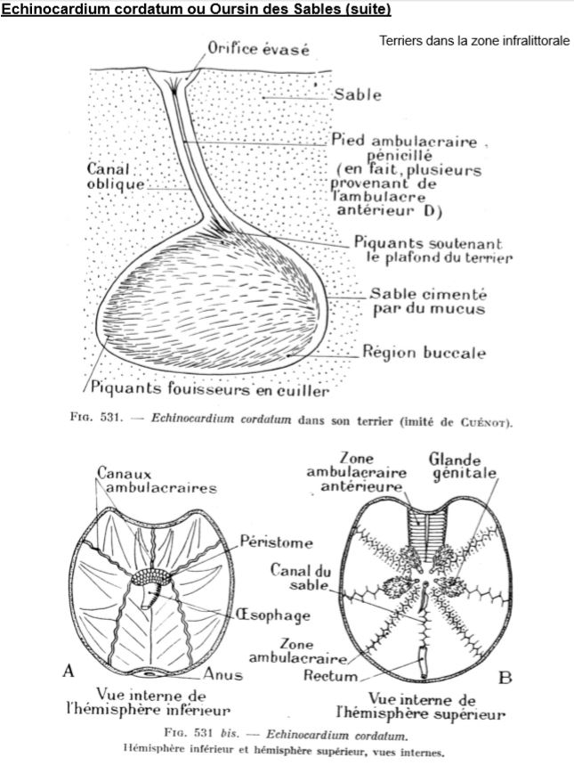
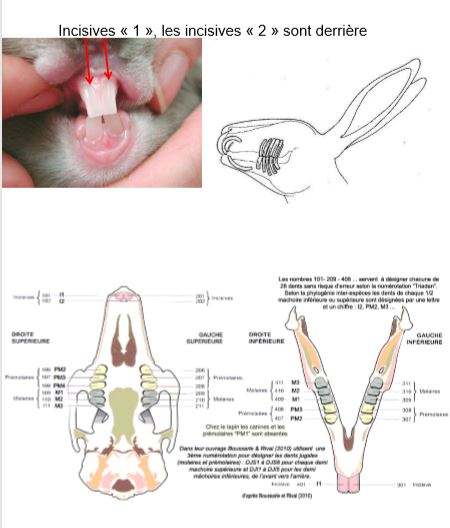
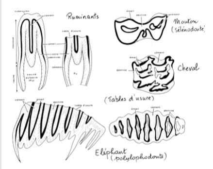
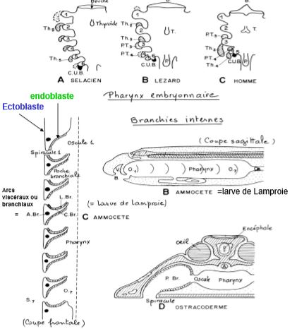
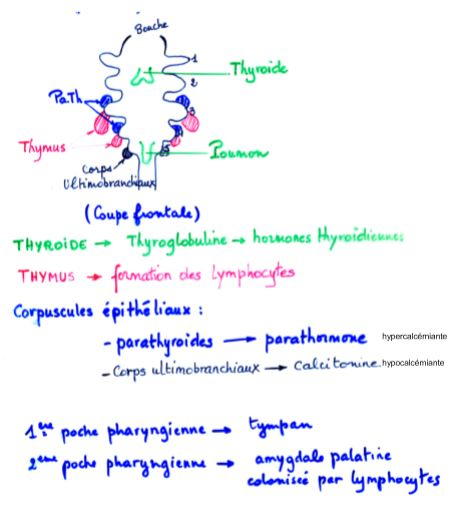

# Les modalités de la nutrition dans la série animale

## I) Les grands types de comportements alimentaires chez les Invertébrés

**L'osmotrophie**

Caractérise les espèces qui se nourrissent exclusivement de matière organique dissoute dans le milieu extérieur 

**La Phagotrophie**

Ce comportement alimentaire caractérise les espèces qui prélèvent la matière organique sous forme de particules plus ou moins grosses 

### A) Les animaux phagotrophes microphages

Les particules alimentaires fines peuvent être en **suspension**, déposées **sur le fond** de l’eau ou bien **mélangées** à la **fraction minérale**, cela permet de distinguer respectivement 3 groupes, les **Filtreurs** ou suspensivores, les **Détritivores** et les **Limivores**.

#### Les filtreurs (= suspensivores)

Les filtreurs sont aquatiques, ils peuvent créer le courant d'eau nécéssaire à la filtration, **filtreurs actifs**

Ou bien profiter du courant d'eau, **filtreur passifs**

Les cirripèdes localisés dans la zone intertidale ne se nourrissent qu’à marée haute. Les plus hauts placés supportent le jeûne. L’implantation est conditionnée par leur capacité à équilibrer leur budget énergétique. 

Le taux de pompage est ajusté à la concntration de la nourriture en suspension, afin de maintenir constante la quantité de nourriture ingérée. Lorsque le maximum d'ingestion est atteint, la vitesse de pompage diminue progressivement. Si la concentration d'algues continue d'augmenter, la nourriture en excès est alors rejetée sous forme de "pseudo-fecès". Pour ce mécanisme, les Filibranches participent à la sédimentation fine dans les milieux ou ils sont abondants.

#### Les détritivores

Le rejet des particules non consommées vers l'arrière de l'animal. Dans les gouttières cilliées, les particules alimentaires sont triées et acheminées vers la bouche.

Chez les Echinodermes, il n'y a pas d'appareil de capture mais une bouche constituée de plaques masticatrices.

#### Les limovores

Importance écologique

Rôle écologique important, en fouissant le sol ces animaux jouent un rôle très important dans la dynamique de sédimenttation.

### B) Les animaux phagotrophes macrophages

#### Les phytophages

Nectarivores

L’Hypertrophie de la galéa des maxilles creusée en gouttière = **Spiritrompe**, celle-ci est enroulée au repos et peut sous l’effet d’un afflux d’hémolymphe se dérouler. 

#### Les zoophages

Trois comportements majeurs et donc modalités de nutrition différentes:

* La prédation
* La nécrophagie
* Le parasitisme

##### Les prédateurs

La **prédation** est un mode de consommation très particulier (mort immédiate) qui implique l’utilisation d’outils et de comportements spécifiques.

La prédation s’exerce en général dans un écosystème donné avec des **proies vivantes** toujours du même type.

##### Les nécrophages

Les nécrophages se nourrissent de cadavres.

##### Les zoophages parasites

**Les ectoparasites hématophages**

D'une manière générale, l'hématophagie implique trois problèmes spécifiques:

* Empêcher la coagulation du sang
* Stocker un énorme volume de sang
* Digérer le sang : aliment particulier dans sa composition : riche en eau, excès de fer ect..

**Les endoparasites et mésoparasites**

Mésoparasites : se trouvent à l'intérieur des cavités +/- isolées du milieu externe

Chez les Nématodes, la cavité buccale est recourverte de cuticule et limitée par des lèvres et le pharynx en arrière, chez **Ankylostoma** par exemple, présence de dents et de plaques coupantes.

Chez les parasites osmotrophes, on a une disparition complète de l'appareil digestif.

## II) La cavité buccale chez les Vertébrés

### A) Structure de la région céphalique et évolution des mâchoires

### B) Les dents des vertébrés 

#### Généralités

Les mâchoires mobiles sont garnies de dents : organes de **préhension** et de **contention** des aliments.

Ce sont des organes **durs**, fortement **minéralisés** (au moins 75% du poids sec). Il faut distinguer les dents vraies des formations **odontoïdes** : qui sont des strctures **épidermiques** et qui se forment à partir de rides ou de papilles de l'épithélium buccal. Elles ne sont pas minéralisées. (ex: phanons des baleines, "dents" des Lamproies...).

Leur rôle primitif est la préhension des aliments, chez les Mammifères, elles acquièrent des fonctions nouvellles (ex : la mastication), la morphologie, la structure, l'implantation, la croissance et le renouvellement de ces dents se trouvent alors modifiés.

#### Developpement des dents

**Adamantoblastes** = cellules d’origine épidermique qui produisent l’émail  

**Odontoblastes** = cellules d’origine dermique qui produisent la dentine ou ivoire 

#### Formes des dents en fonction du régime alimentaire

Chez les Vertébrés aquatiques   

* **Homodontie** = dents toutes semblables  
* **Polyphyodontie** = Remplacement continu et quasi illimité  
* Fixation par des attaches conjonctives (Sélaciens)  
* ou par Ankylose – soudure directement sur l’os (Ostéichthyens,  Amphibiens) 

Les dents sont nombreuses et très largement réparties dans la cavité buccale (mâchoire sup. et  inf., voûte palatine, pharynx et même œsophage) .

Chez les Tétrapodes, on note une diminution progressive du nombre et de la localisation des dents (Amphibiens par ex.) 

Chez les crocodiles et les Mammifères les dents sont localisées uniquement sur les mâchoires (Os pré-maxillaire et maxillaire  pour la mâchoire sup. et dentaire pour la mâchoire inf.) 

L’implantation est **thécodonte** (dans des alvéoles)

Remplacement des dents (généralement 2 générations de dents: **diphyodontie**). Les dents se différencient en fonction du régime alimentaire **Hétérodontie** (dents différentes) et **oligodontie** (nombre restreint). 

Chez les Mammifères, des individus de même espèce ont un nombre constant de dents ce qui permet d’établir la 

Formule dentaire = Nombre de dents par ½ mâchoire sup/Nombre de dents par ½ mâchoire inf. 

Chez les Mammifères herbivores, 

* La croissance est continue : **Hypsodontie** les molaires présentent dans ce cas des couronnes hautes et des tables d’usure caractéristiques, un diastème ou barre (=séparation entre les dents labiales et jugales)  
* Type **Sélénodonte** les tables d’usure présentent des croissants longitudinaux par rapport au grand axe de la molaire (Ruminants, Équidés..)  
* Type **Lophodonte** les crêtes sont transversales par rapport au grand axe de la molaire (Éléphant, Rhinocéros, Lapin...) 

Mammifères à dents brachyondontes (croissance limitée et usure faible)

### C) Le tube digestif antérieur = parynx et ses dérivés

#### Organisation générale

#### Dérivés

