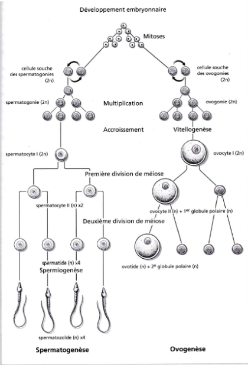

# La reproduction

**Reproduction asexuée** = monoparentale (un seul parent)

**Reproduction sexuée** = biparentale, où intervient des cellules spécialisées  (gamètes) et provoquant la fécondation mais parfois il n'y aura pas de fécondation

Il y a une reproduction asexuée dans lequel intervient une gamète mais il n'y aura pas de fécondation = **la parthénogenèse**

Chez la majeure partie des animaux, la formation des gamètes se fait à partir de cellules (**cellules germinales**) qui vont former les gamètes. Au départ ce ne seront pas de cellules germinales non différenciées et diploïdes. Lorsque cellules germinales commencent à se différencier des autres ce qu'on appelle des **gonies**, elles deviennent des cellules diploïdes (2n).

Les cellules sont soit des ovulogonies, soit des spermatogonies. Elle sont capable de se multiplier par mitose. Les gonies vont ensuite poursuivre leur différenciation et former un deuxième type de cellule qu'on appellera selon l'état **spermatocyte** ou **ovocyte**. Le passage se traduit par une modification de la cellule mais elle sera toujours diploïde.

Les cellules sont capable de se diviser en méïose. La première division de méiöse va les transformer en cellule **haploïde** dit **spermatocyte II** ou **ovocyte II**. Elles vont encore se diviser en meïose 2 d'où elles deviendront des **spermatides** ou **ovotides**. 

Ensuite, elles doivent encore se former afin de pouvoir former des gamètes qui sont des cellules **haploïdes**, elles vont donc former des **spermatozoïdes** par la **spermatogénèse**.

