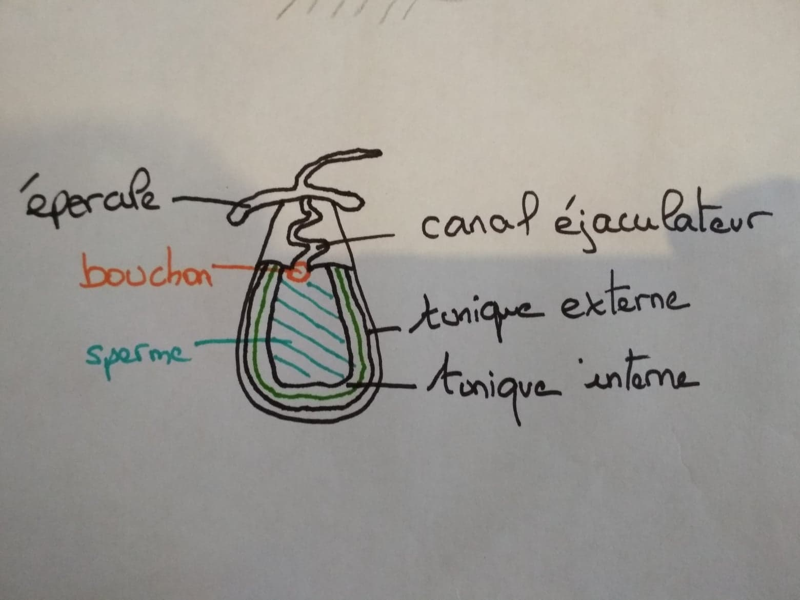
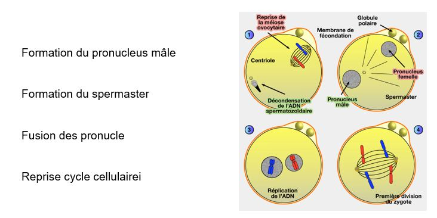

# La rencontre des gamètes

## I) La fécondation externe

Le premier grand type de stratégie, et la fécondation externe. Cette fécondation peut se faire :

### les géniteurs ne vont pas se rencontrer **sans appariement**

* Ce que l'on rencontre chez les oursins, animaux marins. Au moment de la reproduction, on a des individus mâles et femelles qui vont éjecter leurs gamètes dans l'eau de mer. Il y a beaucoup de pertes dans les gamètes. Il existe des mécanismes qui vont rapprocher les différents gamètes. Les spermatozoïdes nagent tous dans la même direction -> vers les ovules. Ils sont attirés par elles. Autour des ovules il y a une ou plusieurs enveloppes qui vont se dissoudre dans l'eau de mer, ce sont des **fertilisines** qui vont être detectées par les spermatozoïdes car ils possèdent des recepteurs aux fertilisines, appelés les **anti-fertilisines** et sont capable de détecter le taux de fertilisine pour trouver les ovules, c'est du **chimiotactine**.

### les géniteurs vont s'accoupler **avec appariement**

* Chez les homards, il y a chez le mâle un orifice au niveau de la dernière pâte du thorax. Chez  les deux premières paires abdominaux, les **cléopodes** vont porter les oeufs, ils possèdent de petites excroissances. Les homards vont s'accoupler en s'unissant, face-ventrale-face ventrale. La femelle va lacher ses ovules et le mâle va les arroser avec sa semence. Il y a donc peu de pertes. Les oeufs vont rester fixés sur la face ventrale de la femelle. Les individus sont vulnérables face aux prédateurs.

* Chez les amphibiens anoures, on a un accouplement **amplexus**. Il est axillaire quand le mâle est sur la femelle, lambaire quand le mâle est au niveau du bassin. La femelle va émettre les ovules et le mâle va les arroser. La peau de la femelle doit être humide pour que les spermatozoïdes puissent nager à la surface.

* Les vers de terre sont hermaphrodites, la fécondation des ovules aura lieu après l'accouplement et les spermatozoïdes du partenaire vont être stockés dans la femelle. Le **clitellum** va sécréter du mucus et va entourer les deux partenaires. Les deux individus sont mâles donc chacun va liberer des spermatozoïdes et vont se déplacer sur une goutière puis seront stockés dans des petits réservoirs, les **spermathèques**. Les deux individus se séparent et chacun va aller féconder ses ovules. Ils vont créer un trou et vont déposer le mucus qui va servir à envelopper les oeufs. Il va déposer ses propres ovules et va utiliser les spermatozoïdes pour les féconder puis abandonne les oeufs.

* Chez les épinoches (poissons), le mâle est rouge avec des épines sur le dos et la femelle a des couleurs ternes (**dimorphisme sexuel**). Au moment de la reproduction, les mâles vont construire des nids sur le fond des cours d'eau, au niveau de la végétation. Lorsque les femelles passent, le mâle les motive afin de savoir si elle pond ou pas dans son nid. si le nid lui convient, elle va y déposer des ovules et s'en aller. Le mâle va garder les oeufs et les protéger tout le long de leur developpement. 

## II) La fécondation interne directe

### Fécondation interne indirect fait appelle au **spermatophore** (sac qui enveloppe les spermatozoïdes)

#### sans accouplement

* Chez certains insectes, le mâle va abandonner dans l'environnement les spermatophores. Quand une femelle passe par là, elle les récupère et va assurer la fécondation.

#### avec accouplement

* Chez les seiches, au moment de la reproduction les deux grandes tentacules du mâle se différencient pour former **l'hectocotyle**. Il va servir d'organe copulateur. Le mâle va collecter des spermatophores libérés dans sa cavité paléale et met son héctocotyle dans la femelle. Les spermatophores seront déposés juste en face de l'appareil génital de la femelle. Ils sont très élaborés. Les tuniques étant perméables à l'eau, l'eau va passer entre les deux tuniques ce qui va gonfler le spermatophore et le mettre sous pression, le bouchon se retire et la semence va sortir du spermatophore et se déplacer vers les voies génitale de la femelle.

* Chez les scorpions, la fécondation est précédée d'une parade nuptiale qui peut durer plus de 24h. Le mâle va maintenir la femelle par ses grosses pinces et le mâle va emmener la femelle en  promenade (souvent la femelle le tue et le mange). Si la femelle accepte, le mâle l'emmène dans son terrier, le mâle va déposer tout en reculant un spermatophore sur le sol avec une goutte de sperm dessus et va devoir faire avancer la femelle au dessus de ce spermatophore où la goutte passera dans l'orifice génital de la femelle. Une fois que la fécondation est effectuée, la femelle mange le mâle.

* Chez les amphibiens urodèle (queue à l'âge adulte ex salamandre). Il y a une parade nuptiale avant la fécondation, le mâle dépose un spermatophore au sol qui sera récupéré par la femelle.

## III) Fécondation interne directe

### Pas d'organe copulateur

* Chez les collembolles, le mâle va déposer les spermatozoïdes dans la femelle avec ses pièces bucales.

* Chez les oiseaux, pour féconder la femelle, le mâle va coller son cloaque contre celui de la femelle.

### Possède des organes copulateurs

* Chez les Odonates, il existe deux sous ordres (Zygoptère et Anésoptères). Le male est plus joli, la femelle est plus terne (**dimorphisme sexuel**). Le mâle maintient la tête de la femelle. La femelle va mettre son orifice génitale au contact de l'appareil reproducteur mâle. Avant l'accouplement, le mâle doit se recourber afin de recharger en spermatozoïde ses organes copulateurs. 

* Chez les araignées mâles, les orifices sont sur la région postérieur mais les organes copulateurs se trouvent dans les parties d'appendices, les **pédipalpes**. Le mâle doit charger ses organes copulateurs en semence. Sur sa toile il déposera donc son sperm, et va l'aspirer avec l'organe copulateur qui est constitué d'un **bulbe** (réservoir) qui se prolonge d'un petit canal le **style**.

### Reliés aux voies génitales

* Chez les Sélaciens (requins, raies..), les organes copulateurs (**ptérygopodes**) se font à partir du bord interne des nageoires pelviennes.

* Chez la vipère et les lézards, les organes copulateurs se forment à partir du coacle qui peuvent se dévaginer, ils sont doubles **hémipénis**. Chez le serpent il est recouvert d'épines.

* Chez les anatifes, une espèce de crustacé, l'organe copulateur est capable de s'allonger 

### Adaptations favorisant l'accouplement

* Chez les dytiques (coléoptères), le mâle doit monter sur le dos de la femelle qui est recouvert par les **élytes** (ailes glissantes et rigides). Chez la femelle , les ailes présentent une zone plane qui présente une striation assez importante. Le mâle possède des ventouse au niveau de ses pattes pour pouvoir se fixer à la femelle.

* Chez les animaux parasites,	
	* le shistosoma mansoni les sexes sont séparés, le mâle possède une goutière sur sa face ventrale **canal gynécophore** qui permet de porter la femelle. ils vivent accolés l'un à l'autre. La femelle va être nourrit par le mâle. 
    
    * la sacculine, le mâle sera en parasite chez la femelle réduit à un testicule et vit sur l'**extrenat** l'ovaire de la femelle
    
    * diplozon paradoxum, vit fixé sur une branchie de Cyprimidés (poissons comme la Carpe), ce sont des hermaphrodites, la fusion est plus poussée. Le vagin est fusionnée avec le canal déférent de l'autre individu.
   
## IV) Mecanismes favorisant le rapprochement  des partenaires

### Signaux sonores

* Chez les insectes, 
	* cigales, les mâles vont faire des émissions sonores **stridulation** grâce à des tambours qui se trouve sur la face ventrale du thorax. Parfois le tambours sont recouverts par des opercules **cymbacalyptes**. Ils sont consitués d'une caisse de raisonnance avec au dessus des petites lamelles faites de cuticules. Leur mouvement va permettre le signal sonore

	* sauterelles et grillons (Orthoptères), on observe ce même phénomène mais les organes sont différents que chez la cigale.  La stridulation est dû au frottement entre les ailes postérieures et les ailes inférieures. Sur l'aile antérieure, il y a une nervure possèdant des épines **harchées** vont frotter contre une nervure spécialisée **la corde**. Les vibrations émises sont amplifiées par une structure **le miroir**. La femelle possède des organes **tympaniques** qui se trouve sur le tibia		
    
    * les criquets, le mâle utilise les ailes antérieures qui vont frotter le fémur des pattes postérieur
    
* Chez les anoures, le mâle va émettre des croassements, grâce aux **sacs vocaux**

* Chez les oiseaux, le chant n'est pas utilisé que pour leur partenaire, . il est produit par la **syrinx** qui se trouve au niveau de l'union des deux trachées, le cartilage est capable de faire une petite lame qui va vibrer avec le passage de l'air. Ils peuvent émettre deux sons en même temps.

### Signaux olfactifs

* Chez les papillons de nuit (hétérocères), la femelle possède une phéromone qui attire les mâles **bombycol**, cette substance attire des mâles jusqu'à plusieurs km (0,01 μg pour 4km). Le mâle possède des antennes plus larges que chez les femelles, elles ont des ramifications sur les côtés formant deux peignes **bipectinées** (très allongés chez le mâle). Chez les femelles ce sont des antennes en massues **rhopalocères**
 
### Signaux visuels

* Chez les vers luisants (coléoptères), les femelles, produisent de la lumière pour être repérées par les mâles dû à la **luciférine**.

### Signaux tactiles

* Chez les araignées, les femelles chassent à l'affût sur leur toile, le mâle doit venir sur la toile de la femelle pour la féconder. Le mâle va faire vibrer la toile d'une façon différente.

** La dépense énergétique est très importante pour ces signaux. De plus, ils peuvent être repérer par des prédateurs**

* signaux sonores : couteux à émettre, peuvent être perçus à grandes distances mais lorsque l'animal détecte un prédateur, le son disparaît intantannément
* signaux olfactifs : portée longue, coût assez faible en énergie mais lorsque l'animal va detecter un prédateur, le signal ne disparaîtra pas instantannément
* signaux visuels : faible persitance

## V) Les mécanismes cellulaires de la fécondation

### Structure de l'ovule

Chez la majeure partie des animaux, les ovules sortant de l'ovaire ne sont pas nu mais seront recouverts d'un nombre variable de l'enveloppe

* L'enveloppe primaire  est une structure produite par l'ovule lui - même
* Les enveloppes secondaires vont se situer en périphérie et sont produites par les cellules folliculaires
	* Chez les mammifères, on a une zone pélucide
* L'enveloppe tertaire va se créer dans les voies génitales femelle
    
### Les étapes de la fécondation

* Chez les oursins,  il y aura une réaction de l'**acrosome**, provoquer par la reconnaissance des cellules qui va s'accompagner  du **processus acrosomien** pour avoir contact avec la **membrane vitteline**  (membrane primaire). Quand le spermatozoïde se fixe sur la membrane, la membrane vitteline va s'écarter de la membrane plasmique pour empêcher les autres de passer.

* Chez les mammifères, le spermatozoïde va reconnaître l'enveloppe secondaire **enveloppe pélucides**. Des enzymes vont détruire les molécules de reconnaissance pour empêcher les autres spermatoïdes de reconnaître l'ovule.

On va avoir une première réaction (modification potentielle de la membrane de l'ovule provoqué par les ions sodium). On va passer de -70mV à +20mV. Cela empêche la fixation d'autres spermatozoïdes.L'ovule va reprendre sa méïose et la termine. Il va y avoir des modifications à l'interieur de la cellule. Le noyau du spermatozoïde va entrer au contact de l'ovule et va se transformer en **pronucléus**. L'ADN du spermatozoïde va se décondenser et va former une membrane nucléaire. Les deux noyaux vont s'approcher et vont fusionner, ensuite on reprend le cycle cellulaire.

