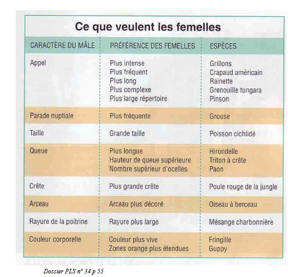

# Le choix du partenaire

## I) Le choix peut-être fait par la femelle

### Sur des bases comportementales

* Chez les guppys, la femelle a des couleurs ternes et le mâle des couleurs vives. Les femelles s'accouplent  avec le mâle qui a des couleurs les plus vives et le plus fort. Le mâle étant plus proche du prédateur gagne même si ces couleurs sont plus ternes.

### Sur des bases morphologiques

* Chez les mouches avec des yeux pédonculées, il y a une **sélection sexuelle** au niveau de la longueur des yeux engendrée par le choix effectué par les femelles

Il peut y avoir un developpement disproportionné des caractères **hypertélie**. 

* Chez les paons, le mâle dispose ses rectrices en arc de cercle. Le mâle a donc du mal à monter dans les arbres et donc il est le plus vulnérable des prédateurs.

* Chez les magaceros giganteus, cerf d'une espèce éteinte, ses bois pouvant atteindre plus de deux mètres de longueur.

### Sur des bases territoriales

* Chez les hippopotames, les territoires sont défendus par des mâles, les femelles vont parcourir les territoires et choisir celui qui leur plaît le mieux et vont chercher le mâle dans le fleuve.

* Chez les chevaliers combattant, le territoire servira juste à la reproduction. Les mâles vont se rassembler sur des **leks** petit territoire défendus par les mâles. Le mâle le plus vigoureux va obtenir le territoire au centre. Les femelles vont visiter, majoritairement, c'est le mâle central qui va assurer les accouplements.

### Principe du handicap

* Chez le crapaud, plus le crapaud est grand, plus il émet un son grave.

## II) Le choix peut-être fait par la femelle après l'accouplement

### La compétition spermatique

* Chez les agrions, la femelle va stocker le sperme dans les **spermathèques**. Quand un ovule va passer devant les spermatèque, il va ejecter quelques spermatozoïdes. Le pénis du mâle présente  deux excroissances pour pouvoir retirer les spermatozoïdes de la femelle.

* Chez la bruche (coléoptère), le mâle possède un pénis avec un  goupillon permettant de netoyer en profondeur, au bout d'un certain nombre d'accouplement les voies génitale de la femelle ne fonctionne plus.

### Le choix cryptique des femelles

* Avant la fécondation
	* La poule est capable d'expluser le sperme du mâle après l'accouplement.

* Après la fécondation
	* Chez les humains, 20-25% des fécondations n'ont pas lieu. Les causes sont multiples, comme notamment un problème de compatibilité des deux parents. Quand les CMH sont proches, on a deux patrimoines génétique qui sont proches aussi, il y aura plus de fausses couches. 