# Chapitre 2 : La phyllotaxie

Ordre d'implantation des feuilles ou rameaux sur la tige

Par extension : disposition des éléments d'un fruit, d'une fleur, d'un bourgeon, d'un capitule

**Phyllotaxie** = Science qui étudie ces arrangements 

2 types de structures :

* verticillées
* hélicoïdales = spiralées

## A) Disposition verticillée

Feuilles disposées par groupes, en nombre égal à chaque noeud

Verticillée par 2 : Cas des feuilles opposées, si les feuilles sont opposées deux pas deux, avec rotation de 90° d'un noeud au suivant = opposées - décussées

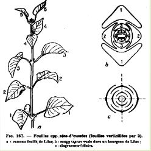

Verticillée par 3 : rotation de 60° entre chaque noeud. C'est une disposition assez rare.

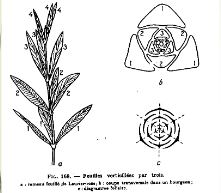

## B) Disposition alternée

Une seule feuille à chaque noeud

Disposition alterne distique

* fréquent chez les monocotylédones
* rare chez les dicotylédones

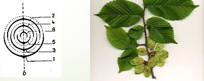

Disposition alterne quinconciale :

* feuilles jamais superposées exactement
* disposées le long d'une ou plusieurs spirales d'enroulement = spirale génératrice

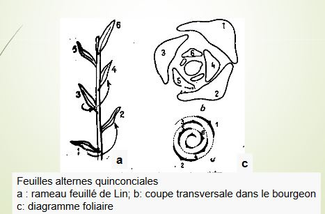

Disposition en spirale -> interprétations diverses

théorie de Plantefol (1948) = théorie des hélices foliaires -> pas une spirale unique, mais plusieurs nombres généralement fixes

Exemple d'interprétation : 

* cicatrices sur le tronc (stipe) d'un palmier par la chute des feuilles -> formes des hélices apparentes, de sens direct ou rétrograde = parastique

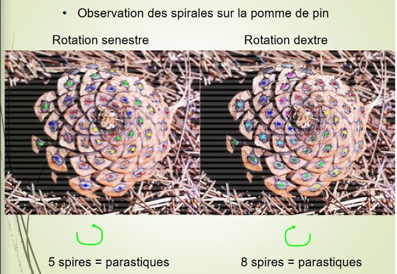

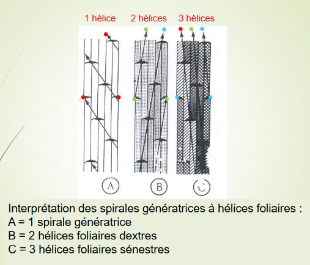

Origine de chaque hélice foliaire : à rechercher dans le point végétatif des tiges qui forme et place les feuilles.

Hypothèses : 

* à l'extrémité apicale de chaque hélice (point végétatif) se trouve un centre générateur de feuilles
* autant de centres qu'il y a d'hélices
* segments foliaires : contigus le long de la même hélice

-> Phyllotaxie de type verticillé correspondraient à des fonctionnements synchrones des centres générateurs

-> Phyllotaxie alterne correspondrait à un fonctionnement successif

Nombre de spirales s'inscrit dans la série mathématique de Ficonacci

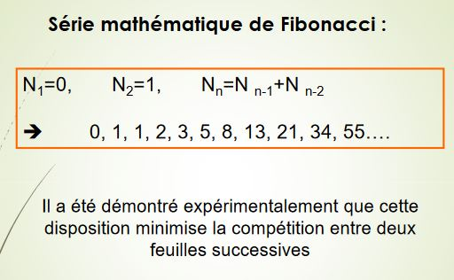

## C) La phyllotaxie : conclusion partielle

Méristème apical de la tige = petit groupe de cellules se divisant, permet d'obtenir les feuilles (=primordium) disposées de façon régulière et prédictible dans le temps et dans l'espace.

## D) Le fonctionnement du méristème apical

Mise en place d'organes : organogénèse

Mise en place de tissus : histogénèse

Cas simple : bryophytes -> une seule cellule apicale : tétraèdrique ou lenticulaire

Cas complexe : ptéridophytes et spermaphytes

Ces deux phénomènes assurés par des ensembles organisés de cellules -> conservent leurs caractères juvéniles = les méristèmes

2 grands types de méristèmes :

* primaires 
* secondaires

**Méristèmes primaires** = histogènes et organogènes

* Apparition très tôt : au cours du développement de l'embryon
* Mise en place : lors des premières étapes de la croissance végétative 

**Méristèmes secondaires** = histogènes

* Apparition plus tardive : une fois le développement végétatif bien avancé
* Provenance : soit de l'évolution de certains méristèmes primaires, soit de la dédifférenciation de cellules parenchymateuses
* Position latérale dans les axes (doubles manchons) 

La morphologie dans un cas simple : feuilles opposées décussées

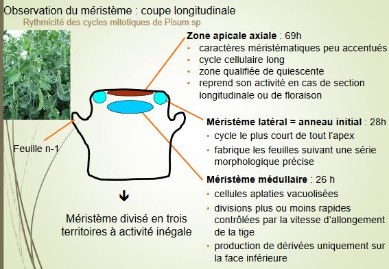

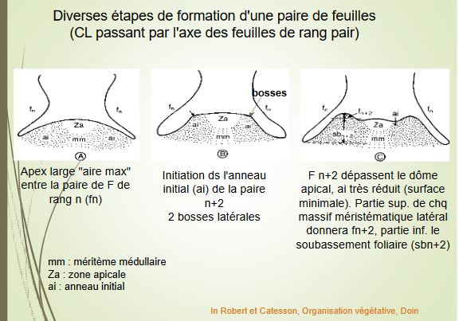
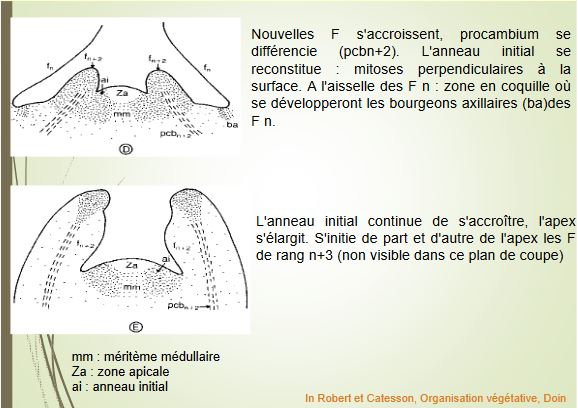

Primordia foliaires = très tôt le siège de la différenciation du procambium. Des cellules étroites, au cytoplasme dense, forment un cordon continu dans le soubassement foliaire et la jeune ébauche. Cordons semblent disparaître sur la coupe longitudinale lorsqu'ils arrivent au niveau des cordons procambiaux de la feuille n-1. En fait, ils se divisent en deux au dessus de l'insertion de la paire de feuilles de rang n puis se raccorde au procambium précédents = fenêtres foliaires

1,3,5 cordons par feuille ou plus (dico/mono)

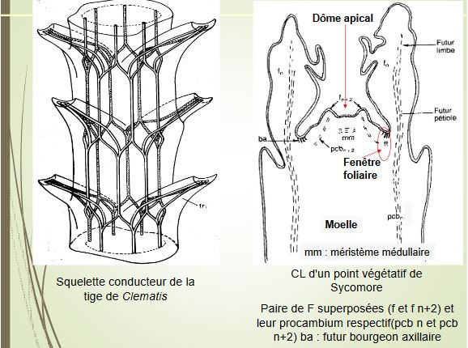
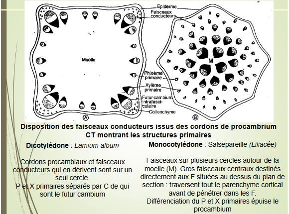

