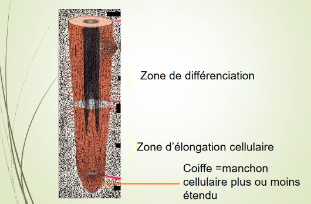
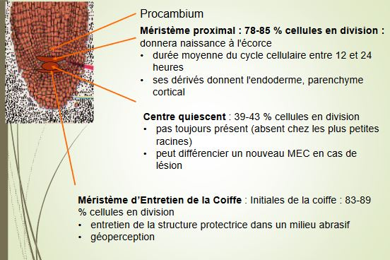
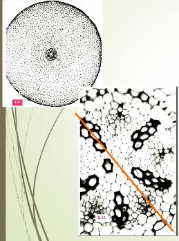
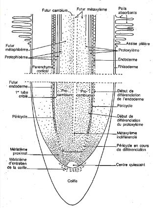

# Chapitre 3 : Organisation de la racine

Pas de racine chez les Ptéridophytes les plus primitifs

Les racines sont spécilisées dans :

* utilisation des ressources eaux et sels minéraux 
* ancrage
* établissement d'interactions mutualistes avec des champignons et des bactéries

## A) La morphologie

Il existe deux grands types de morphologies  :

* pivots (racines principales, système d'ancrage très profond)
* système fasciculé (ensemble de cellule qui vont se developper au niveau du colet, qui vont permettre d'ancrer l'individu au sol, payant pour l'exploration et la ressource du sol, système sur des petits ligneux ou type herbacées)

## B) Le méristème 

## C) La ramification

Developpement du système racinaire assuré

* soit par la mise en place de racines adventives
* soit par la ramification

Ramification rarement dichotomique

Origine endogène : dans le péricycle

Les systèmes racinaires ne montrent pas de rhizotaxie

## D) La morphologie et la différenciation

Ptéridophytes et origine de la racine

Les plus primitives : ex *Psilotum*

* dépourvues de racines -> uniquement des rhizoïdes

Chez les autres ptéridophytes : 

* racine vraie existe -> toujours adventive (prend naissance sur une tige)

Etude fragmentaires sur l'anatomie de la racine des fougères montrent :

* une coiffe réduite ou inexistante, dans un premier cas : faible durée de vie de la racine
* coiffe différenciée par l'apicale

Dans les deux cas, 

* les trachéophytes primitifs présentent une fonction méristématique devient plus large avec des territoires plus définis chez les spermaphytes