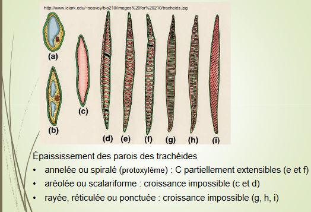

# Chapitre 4: Les tissus conducteurs : une des clés de la conquête du milieu terrestre

Tissus conducteurs sont les tissus les plus différenciés, jusqu'à se spécialiser dans la mort de la cellule. 

Il existe deux stratégies de conduction pour les solutés (tout type de sève) :

* conduction **apoplastique** : utilise la paroi de la cellule, elle prédomine pour la sève brute
* conduction **symplastique** : passe par le cytoplasme des cellules, prévaut dans le phloème

Deux grands types de tissu :

* Le xylème
* Le phloème

Les points communs :

* existence de cellules conductrices très modifiées
* cellules communiquant avec des cellules conductrices : cellules de contact
* présence de parenchyme (chlorophyllien ou réserve)
* présence des fibres (soutien)

Les contraintes fonctionnelles :

* L'eau : pénétration par toutes les surfaces non subérifiées des racines, absorption majoritairement apicale ou sous - apicale.
* Notion de potentiel hydrique : il est égal mais de signe opposé à l'énergie qu'il faut appliquer à un milieu (tissu végétal, sol..) pour en libérer 1g d'eau, il est toujours négatif : plus il est bas, plus la liaison est forte
* L'entrée dans la racine : poils absorbants et filaments mycéliens, poils présentent une convergence morphologique liée à la contrainte fonctionelle de l'absorption et de la conduction : forme filamenteuse fine, paroi mince, facteur multiplicatif de 2 à 10 par rapport à la surface racinaire

Absorption racinaire : possible via l'existence d'un potentiel hydrique inférieur dans la racine par rapport à celui du sol. Il est inférieur par :

* osmose, plus grande dans le poil (ou mycélium) que dans le sol, entraînant un flux d'eau
* une succion existant dans les tissus internes de la racine (due à la pression osmotique des vacuoles et à la pression des colloïdes)
* la transpiration de l'appareil aérien, qui entraîne un déficit et un flux d'eau

L'appel d'eau ainsi crée fait focntionner le système de conduction de la sève brute "sous tension". L'eau est attirée vers le haut et la cohésion de la colonne d'eau est assurée par les liaisons hydrogènes existant entre molécules d'eau.

## I) Le Xylème

Vaisseaux = Trachées = "tubes" :

* rangée de cellules qui se soudent bout à bout 
* absence de paroi transversale
* peuvent faire plusieurs m de long et au moins 30µm de diamètre
* paroi des vaisseaux renforcée par des épaississement de lignine

Trachéides = une cellule unique

* présence d'une paroi transversale avec ponctuations (reste la membrane pectocellulosique)
* longueur : de 0.3 à 10mm de longueur et au moins 30µm de diamètre

Une fois en place, trachéides et vaisseaux perdent noyau et contenu cellulaire = cellules mortes, incapables d'évoluer ou de se transformer

* tissu conducteur partiellement de cellules mortes assurant la conduction de la sève brute
* localisé dans la partie centrale des axes et des nervures des feuilles
* cellules alignées et en continuité
* paroi cellulosique primaire doublées d'une paroi secondaire imprégnée de lignine

A l'exception :

* de zones où seule la paroi primaire est présente : **ponctuations** présentes sur la paroi longitudinale et terminale des Trachéïdes (paroi transversale non perforée), échange latéraux au sein du xylème.
* de zones dépourvues de toute paroi : chez les vaisseaux : continuité grâce aux **perforations** de leurs parois transversales

La séquence de différenciation 

La plante, en cours de croissance (racine ou tige) doit accomoder

* la croissance en longueur 
* les besoins en alimentation en sève brute

Nécessité de fabriquer des éléments qui seront susceptibles d'être allongés ultérieurement

Les cellules de contact (CC) = Cellules accompagnatrices de vaisseaux (CAV)

* cellules vivantes, à proximité des éléments conducteurs 
* haute activité métabolique (comparable aux cellules compagnes du phloème)
* communication avec les cellules mortes conductrices via ponctuations
* pas d'accumulation de réserves

Le parenchyme et les fibres

Parenchyme :

* viant (paroi cellulosique parfois lignifiée)
* communique avec les CAV par des plasmodesmes, rôle de réserve (amidon, sucre, protéines)

Fibres :

* cellules à parois secondaires très épaisses, souvent tristratifiées
* mortes au terme de leur différenciation (laquelle dure parfois plusieurs mois)
* pauvres en ponctuations
* rôle dans le soutien de la plante (parfois dans la circulation de substances comme la lignine)

Pour les éléments du xylème primaire, différence majeure réside dans le type cellulaire des éléments conducteurs : tendance évolutive va vers

* des éléments de plus gros diamètre
* avec des communications verticales entre eux de plus en plus vastes

Un dilemme fonctionnel : efficacité vs sécurité

Un très faible pourcentage de l'eau conduite par le sylème sert à l'accroissement des tissus : environ 98% est évapotranspiré. L'évolution des végétaux vasculaires s'est accompagnée d'une hausse du débit de sève brute.

