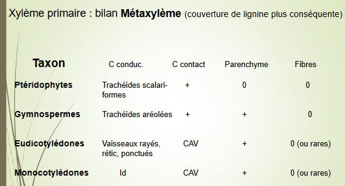
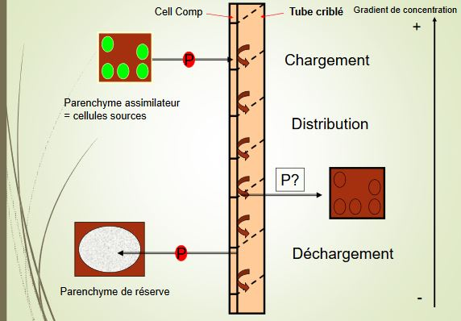
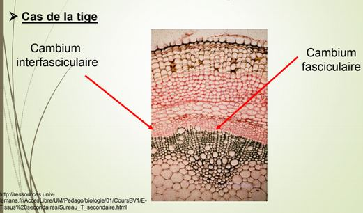

# Chapitre 4: Les tissus conducteurs : une des clés de la conquête du milieu terrestre

Tissus conducteurs sont les tissus les plus différenciés, jusqu'à se spécialiser dans la mort de la cellule. 

Il existe deux stratégies de conduction pour les solutés (tout type de sève) :

* conduction **apoplastique** : utilise la paroi de la cellule, elle prédomine pour la sève brute
* conduction **symplastique** : passe par le cytoplasme des cellules, prévaut dans le phloème

Deux grands types de tissu :

* Le xylème
* Le phloème

Les points communs :

* existence de cellules conductrices très modifiées
* cellules communiquant avec des cellules conductrices : cellules de contact
* présence de parenchyme (chlorophyllien ou réserve)
* présence des fibres (soutien)

Les contraintes fonctionnelles :

* L'eau : pénétration par toutes les surfaces non subérifiées des racines, absorption majoritairement apicale ou sous - apicale.
* Notion de potentiel hydrique : il est égal mais de signe opposé à l'énergie qu'il faut appliquer à un milieu (tissu végétal, sol..) pour en libérer 1g d'eau, il est toujours négatif : plus il est bas, plus la liaison est forte
* L'entrée dans la racine : poils absorbants et filaments mycéliens, poils présentent une convergence morphologique liée à la contrainte fonctionelle de l'absorption et de la conduction : forme filamenteuse fine, paroi mince, facteur multiplicatif de 2 à 10 par rapport à la surface racinaire

Absorption racinaire : possible via l'existence d'un potentiel hydrique inférieur dans la racine par rapport à celui du sol. Il est inférieur par :

* osmose, plus grande dans le poil (ou mycélium) que dans le sol, entraînant un flux d'eau
* une succion existant dans les tissus internes de la racine (due à la pression osmotique des vacuoles et à la pression des colloïdes)
* la transpiration de l'appareil aérien, qui entraîne un déficit et un flux d'eau

L'appel d'eau ainsi crée fait focntionner le système de conduction de la sève brute "sous tension". L'eau est attirée vers le haut et la cohésion de la colonne d'eau est assurée par les liaisons hydrogènes existant entre molécules d'eau.

## I) Le Xylème

Vaisseaux = Trachées = "tubes" :

* rangée de cellules qui se soudent bout à bout 
* absence de paroi transversale
* peuvent faire plusieurs m de long et au moins 30µm de diamètre
* paroi des vaisseaux renforcée par des épaississement de lignine

Trachéides = une cellule unique

* présence d'une paroi transversale avec ponctuations (reste la membrane pectocellulosique)
* longueur : de 0.3 à 10mm de longueur et au moins 30µm de diamètre

Une fois en place, trachéides et vaisseaux perdent noyau et contenu cellulaire = cellules mortes, incapables d'évoluer ou de se transformer

* tissu conducteur partiellement de cellules mortes assurant la conduction de la sève brute
* localisé dans la partie centrale des axes et des nervures des feuilles
* cellules alignées et en continuité
* paroi cellulosique primaire doublées d'une paroi secondaire imprégnée de lignine

A l'exception :

* de zones où seule la paroi primaire est présente : **ponctuations** présentes sur la paroi longitudinale et terminale des Trachéïdes (paroi transversale non perforée), échange latéraux au sein du xylème.
* de zones dépourvues de toute paroi : chez les vaisseaux : continuité grâce aux **perforations** de leurs parois transversales

La séquence de différenciation 

La plante, en cours de croissance (racine ou tige) doit accomoder

* la croissance en longueur 
* les besoins en alimentation en sève brute

Nécessité de fabriquer des éléments qui seront susceptibles d'être allongés ultérieurement

Les cellules de contact (CC) = Cellules accompagnatrices de vaisseaux (CAV)

* cellules vivantes, à proximité des éléments conducteurs 
* haute activité métabolique (comparable aux cellules compagnes du phloème)
* communication avec les cellules mortes conductrices via ponctuations
* pas d'accumulation de réserves

Le parenchyme et les fibres

Parenchyme :

* viant (paroi cellulosique parfois lignifiée)
* communique avec les CAV par des plasmodesmes, rôle de réserve (amidon, sucre, protéines)

Fibres :

* cellules à parois secondaires très épaisses, souvent tristratifiées
* mortes au terme de leur différenciation (laquelle dure parfois plusieurs mois)
* pauvres en ponctuations
* rôle dans le soutien de la plante (parfois dans la circulation de substances comme la lignine)

Pour les éléments du xylème primaire, différence majeure réside dans le type cellulaire des éléments conducteurs : tendance évolutive va vers

* des éléments de plus gros diamètre
* avec des communications verticales entre eux de plus en plus vastes

Un dilemme fonctionnel : efficacité vs sécurité

Un très faible pourcentage de l'eau conduite par le sylème sert à l'accroissement des tissus : environ 98% est évapotranspiré. L'évolution des végétaux vasculaires s'est accompagnée d'une hausse du débit de sève brute.

La sève brute circule dans les vaisseaux sous tension. S'il y a rupture de la colonne d'eau ou création d'une bulle d'air, annulation du moteur de la circulation -> **embolie** (piqûre, gel, blessure, invasions par un parasite, insuffisance d'un apport racinaire...)

Les moyens d'empêcher les embolies existent : 

* régulation stomatique
* photosynthèse à stomates fermés, la défense ultime se résume à limiter la propagation de l'embolie : thylles.

Fermeture de la ponctuation (torus) permettant de limiter la propagation de l'embolie.

**Les espèces végétales montrent une importante variabilité dans la taille et le nombre des vaisseaux du xylème primaire mis en place**.

## II) Le phloème

Différencie les cellules conductrices de la sève élaborée. Cellules ont perdu leur noyau mais ont conservé la quasi-totalité de leur cytoplasme : membrane plasmique conservée, ainsi que quelques mitochondries, quelques plastes. Cellules conductrices communiquent entre elles : plasmodesmes qui forment des pores ou perforations.

Tubes criblés : 

* cellules allongées, bout à bout (15-60µm)
* pas d'épaississement longitudinal
* cellules restent vivantes
* présence de cribles sur les faces terminales (C1) et latérale (C2, plus petits) permettant la diffusion de la sève élaborée (vitesse : 0.3 - 1.5 m/h)
* entourés de cellules compagnes

Cellules compagnes :

* conservent la totalité de leur fonctionnalité
* synthétisent des protéines de remplacement nécessaires aux éléments criblés
* assurent les échanges des assimilats avec les tubes criblés
* assurent les échanges des assimilats aec les tubes criblés
* communiquent avec les tubes criblés par des plasmodesmes

Parenchyme :

* cellules vivantes
* accumule les réserves, dans les tiges présence parfois de plastes + thyllakoïdes
* participe au système vertical
* paroi non lignifiée
* ressemble à celui du xylème

Fibres phloémiennes : 

* fréquentes chez les Angiospermes 
* peuvent rester cellulosiques chez les plantes herbacées (Lin...)
* ou se lignifier : participent à la formation du liber dit stratifié

Tissu conduisant la sève élaborée

La sève élaborée diffère par sa composition de la sève brute (au 1g/l de substances dissoutes)

Les moteurs de la circulation de la sèv élaborée sont encore discutés

Munch 1927 : proposition de flux de masse

La sève élaborée s'écoulerait suivant un gradient osmotique : des zones de productions = zones sources vers les zones de consommation = zones puits

Observation contradictoires : 

Les assimilats sont souvent plus concentrés dans le complexe tube criblé/cellule compagne que dans le mésophylle : circulation se fait donc contre le gradient de concentration (nécessite une pompe). Certains parenchymes à réserves accumulent du saccharose en position vacuolaire. Le déchargement a donc également lieu en gradient inverse.

Chargement : 3 possibilités

* chargement apoplastique : montré chez le mais et la betterave
* chargement symplastique : mis en évidence chez la courge
* chargement symplastique et apoplastique simultanés : apoplastique dans le protophloème, sympastique dans le métaphloème

Distribution vers : 

* organes puits
* zones en croissance 
* zones de stockages
* zones de fructification et de production de graines

La sève élaborée circule dans les deux sens (vers le haut et le bas), au sein des mêmes faisceaux et dans des tubes voisins 

Cas particuliers : plantes à faisceaux bicollatéraux, bourgeons / fleurs / fruits par le phloème interne racines par le phloème normal.

Egalement mise en évidence de flux alternés : bourgeons / fleurs / fruits le jour, racines la nuit chez le potiron.

Déchargement : voie apoplastique : graines, accumulation vacuolaire (betterave, canne à sucre), accumulation d'amidon 

Voie symplastique : feuilles en croissance, méristèmes.

Mécanismes de sécurité associés à la circulation de la sève élaborée : système sous pression, dans lequel la moindre lésion entraine une perte d'énergie importante.

Les cribles : 

* peuvent s'obstruer très rapidement en cas de baisse de la pression : protéines P s'accumulent en une fraction de seconde, la callose forme des bouches en moins d'une minute, les cellules compagnes fourniraient les enzymes nécessaires à la biosynthèse de la callose
* bouchons de callose sont digérés au moment de la reprise d'activité de la plante : chez les pérennes.

Chez les monocotylédones pérennantes, le métaphloème demeure fonctionnel pendant la vie du végétal.

## III) Epaississement et tissus secondaires

Contexte : 

* compétition pour la lumière
* relative fragilité des vaisseaux

Végétaux investissent une partie importante de leur budget énergétique dans :

* la croissance en diamètre
* le soutien
* la production régulière d'éléments conducteurs

Les végétaux qui produisent du bois en quantité importante :

* tous les gymnospermes actuels
* une partie des Eudicotylédones
* certaines dicotylédones produisent peu de bois et de liber = plantes annuelles = plantes herbacées

Assises génétratrices assurent la croissance en diamètre :

* assise libéro - ligneuse : le cambium
* assise subéro - phellodermique : le phellogène (proche de l'épiderme)

Trois communs à ces deux assises : 

* des divisions majoritairement tangentielles = périclines
* des origines plurielles dans une même plante
* un fonctionnement rythmique

Le cambium : différenciation à partir de procambium : cellules intrafasciculaire, différenciation de cellules de parenchymes : cellules interfasciculaire

Si la tige est ligneuse : quasi synchronisme entre la mise en place des deux cambiums. Si elle est herbacée, il peut y avoir :

* différenciation du seul cambium fasciculaire, plante à pachyte discontinu (Courge)
* différenciation des deux zones, mais en général les dérivées diffèrent (la Mercuriale), la zone fasciculaire assume l'essentiel de la fonction circulatoire, la zone interfasciculaire davantage le soutien

Cas de la racine : croissance secondaire rare chez les dicotylées annuelles et monocots

Deux origine du cambium : 

* zone de procambium : entre le xylème I et le phloème I
* zone du péricycle : dédifférenciation des cellules : cambium de raccord

Différenciation possible :

* de cambium discontinu
* de cambium hétérogène dans les dicot herbacées
* de mise en place synchrone et rapide chez les ligneuses

La mise en place du cambium et son fonctionnement ont pour conséquence de faire disparaitre le cortex de la racine.

2 types cellulaires dans le cambium :

Cellules initiales fusiformes donnent : 

* élément conducteurs
* fibres à disposition verticale

Cellules initiales des rayons produisent :

* cellules des rayons ligneux
* cellules des rayons libériens, disposition horizontale

