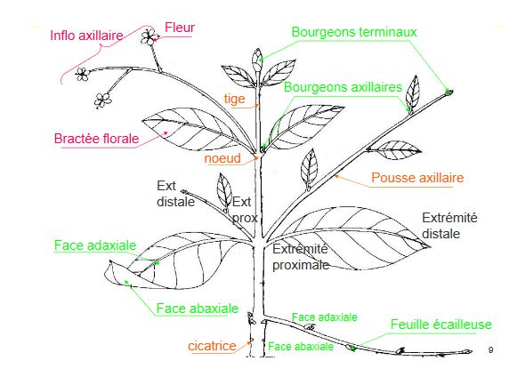
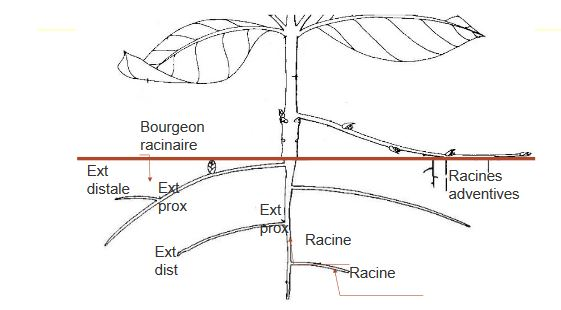

# Introduction

Végétaux vasculaires :

* développement dans un contexte de ressources spatialement ségrégées
* ségrégation : organes spécialisés dans la capture des ressources

* Organes épigés : feuilles (CO2, lumière)
* Organes endogés : racines (eau, sels minéraux)

Stratégie trachéophytique

1) Connexion entre ces deux organes riches en ressources différentes, existence d'un axe contenant des structures conductrices

2) Soutien de ces structures : absence de la poussée d'Archimède, existence de structure de soutien : tissus de soutien simples (primaires = xylème, secondaire = bois) également conducteurs

3) Contrôle des flux d'eau : nécéssaire au métabolisme, au soutien. Différentes formes : solvant pour les sels minéraux, les photosynthétats... 

* maximisation des entrées 
* contrôle du volume interne
* contrôle des sorties (nécéssité de flux)

4) Compétitivité dans l'utilisation de l'énergie lumineuse : ressource polarisée 

* développement d'organes dont la forme 
	* maximise la captation de photons 
   	* autorise au mieux la limitation des pertes
* développement des structures de soutien permettant l'accès à cette ressource
* développement d'un appareil végétatif et d'une période d'activité permettant d'accéder à cette ressource dans un contexte compétitif.

L'ensemble de ces contraites s'exercent dans un contexte :

* de développement du végétal devant s'accomoder tout au long de sa vie
* de compétition avec les autres végétaux

Or, trois mécanismes photosynthétiques existent avec des budgets énergétiques considérés comme similaires 

* C3 : classique
* C4 : séparation spatiale
* CAM : séparation temporelle

Pour s'en sortir : réponse végétative d'un végétal devra être différente de celle de son voisin

* expression de cette différence visible aux niveaux :
	* morphologique
    * anatomique
    * chronologique
    * chimique
    
Différence en termes d'allocation de ressources : privilèges à la croissance en hauteur , privilège à la reproduction... (notion de **trade - off**).

# Les plantes

Feuille

* organe aplati
* polarisé
* s'insérant suivant un plan organisé sur un axe 
* porte à sa base un bourgeon axillaire
* peut prendre différentes formes

Tige

* organe à symétrie axiale portant des feuilles suivant une organisation souvent complexe...

Racine

* organe à symétrie axiale
* ne portant pas de feuilles ni de bourgeons axillaires
* sans organisation de ramification complexe 

Grande diversité des modes de croissance chez les végétaux supérieurs aboutit à des appareils végétatifs diversifiés dans leur architecture, ces derniers limitant la compétition entre plantes.

