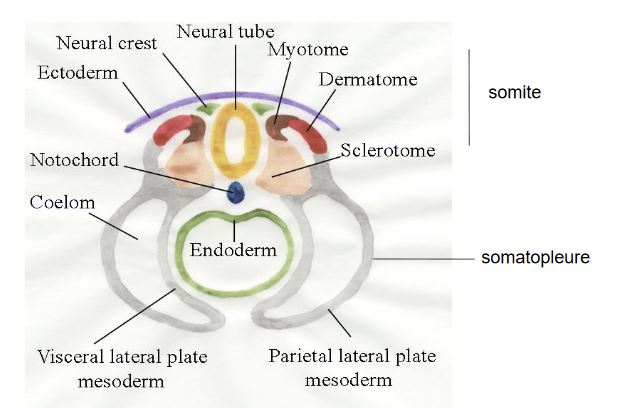

# Systématique des Vertébrés

## Introduction

Les vertébrés représentent un groupe de Deutérostomiens. 

Ils possèdent plusieurs critères dont la présence des vertèbres, un ensemble de pièces osseuse soudées entre elles et se developpent autour d'une structure squelettique différente des vertèbres appellé la chorde (baguette elastique qui servira de soutien à l'animal). 

Chez les mammifères, la chorde a disparu. 

Ces pièces squelettique vont entouré du côté dorsal la moelle épinière. Cela va constitué l'**arc neural**. Du côté ventral, elles vont entouré l'aorte, vont formés l'**arc hémal**.

Les Deustérostomiens sont divisés en deux lignées.

Première lignée:

* Acoelomorphes
* Echinodermes
* Hémicordés 

Deuxième lignées:

* Les Chordés

Les vertébrés se divisent en deux lignées:

* Les Cyclostomes : bouche circulaire, animaux avec une bouche toujours ouverte
* Les Gnathostomes : pourvu de machoire

## I) Les Clyclostomes

Les Clyclostomes (anciennement appelés Agnathes), sont divisés en deux lignées :

* Les Myxines
* Les Pétromyzontidés

Les Myxines sont des vertébrés aquatiques présentant des nageoires avec respiration branchiale. Ce sont des animaux charognards. Leurs vertèbres ont regressé, ils ne présentent que la chorde.

Les Lamproies ou Pétromyzontidés, sont des parasites qui se nourissent du sang des poissons. Leu bouche a une forme circulaire toujours ouverte sans machoire. Leur bouche présente de nombreux denticules cornés qui vont permettre de gratter le tégument de leur victime afin d'arriver aux vaisseaux sanguin. La bouche sert de ventouse. Les Lamproies possèdent des nageoires qui se trouvent dans le plan de symétrie. Ils possèdent 14 orifices servant à la respiration. 

Comme chez beaucoup de vertébrés, les Lamproies possèdent des paquets de fibres musculaire appelés **myomères**. La Chorde est bien developpée chez les Lamproies et on retrouve les pièces osseuses des vertébres. 

Les Lamproies passent par un stade larvaire appelé l'**ammocète**, sont mycrophages. On trouve trois espèces de Lamproies

* Lamproie marinus, vit milieu marin et se reproduire dans les cours d'eau au niveau des estuaires
* Lamproie fluviatilis, se reproduit aussi dans les cours d'eau
* Lamproie planeri, vit en eau douce

## II) Les Gnathostomes

### A) Apomorphies

Les Gnathostomes, possèdent des mâchoires ainsi que trois canaux semi-circulaire dans l'oreille interne. Les arcs branchiaux sont au milieu des branchies. Les axomes s'entourent de gaine de myéline (circulation plus rapide des messages nerveux).

La mâchoire permet une très forte diversification des régimes alimentaires de type macrophage.

### B) Apparition de la mâchoire

Le squelette crânien des vertébrés est divisé en deux parties, le **neurocrane** et des arcs branchiaux ou arcs viscéraux constituent le Splanchnocrane qui est constitué de 7 paires d'arcs viscéraux. Les mâchoires peuvent provenir de la transformation des arcs viscéraux plus en avant de l'animal. 

En effet, à l'aide de l'étude embryonnaire de certains vertébres, nous avons pu observer que les os sont de même forme que les arcs viscéraux avant de former petit à petit la mâchoire. 

De plus, à l'aide de l'anatomie comparé, on a comparé l'énervation du crâne chez les Gnathostomes et les Cyclostomes. La mâchoire chez les Gnathotosmes est innervée par plusieurs nerfs crâniens. Le 7e nerf sert à maintenir la mâchoire. 

La mâchoire n'a pas toujours la même organisation. Les différentes modalités de suspension de la mâchoire, (liaison au neurocrâne).

La mâchoire supérieur forme le Ptérygocarré et la mâchoire inférieure, le cartilage de Mechel. Ceci est homologue du premier arc viscéral que l'on appelle l'arc mandibulaire. Il existe d'autres pièces osseuses afillé à la mâchoire. Chez certains Gnathotosmes on a l'os hyomandibulaire, homologue à l'arc viscéral, l'arc hyoidien. 

Chez les Teleostéens, on a une **suspension hyoitylique**. 

Chez les Tétrapodes, la mâchoire supérieur est directement liée au neurocrâne, **suspension autotylique**.

### C) Origine des membres pairs 

Les Téléostéens possèdent des nageoires pairs antérieurs appelés les pterygiens. 

Sur des fossiles des Vertébrés dépourvus de nageoires paires, présentaient sur la face ventrale, deux replis du tégument longitudinaux faisant toute la longueur de l'animal. Les nageoires ptérygiens seraient apparus par fragmentation des deux bourrelets.  

### D) Les grands groupes de Gnathostomes

Au sein des Gnathostomes nous avons, 

* Les Chondrichthyens 
* Les Austélitiens

#### 1) Les Chondryctiens

Les Chondrychtiens ont un taux sanguin d'urée élevé, disparition des poumons et présence de ptérygopodes chez le mâle.

Les Chondryctiens se divisent en deux groupes :

* Les Sélaciens, requins et raies
* Les Holocéphales ou Chimères

Les Chondyctiens possèdent un cartilage, matrice extra cellulaire très importance. C'est un tissu souple et elastique, ainsi qu'un tissu osseux, matrice extra cellulaire minéralisé.

Les os ont deux origines possible. Le squelette axial est formé à partir des somites.

Les os sont formés à partir du cartilage. 

La nageoire n'a pas la même architecture chez tous les Chondrictyens.

* nageoire tribasale, on a trois os à la base reliant la nageoire à la ceinture puis sont inserer une grande quatité d'os

##### a) Les Sélaciens 

Les Sélaciens ont un appareil respiratoire comportant 5 paires de fentes branchiales fonctionnelles. Chaque fente possède un petit clapet est peu s'ouvrir indépendamment des autres. Ils possèdent des écailles placoïdes, écaille, formées à partir du derme. Elles sont fortement minéralisées, car constitué d'une partie basale osseuse recouverte par la dentine qui est recouverte par un émail. Ce sont des dents réparties sur l'ensemble du corps de l'animal.

###### 1/ Les requins = Pleurotrèmes

Les fentes branchiales sont latérales. 

Les requins possèdent des régimes alimentaires différents entre eux:

* poissons (Requin taupe, dents étroites et pointes)
* mammifères blancs (Requin blanc)
* crustacés (Roussettes, dents en pavés)
* plancton (Requin pèlerin, placton filtré par des branchiospines)

Les requins prédateurs possèdent des detections sensorielles permettant de détecter les proies, dont les ampoules de Lorenzini, des organes sensoriels dispersés dans le tégument. Ils sont capable de detecter les champs electrique émis par les proies. 

###### 2/ Les hypotrèmes

Les raies possèdent des écailles placoïdes. Les dents sont en pavés. Plusieurs espèces possèdent des organes electriques possédant plusieurs fonctions dont neutraliser les proies.

##### b) Les Chimères 

Les Chimères vivent dans des eaux très profondes.

#### 2) Les Ostéichtyens, poissons osseux

Les poissons osseux possèdent des sacs aériens connectés au tube digestifs. Il existe deux lignées : 

* les Sarcoptérigiens 
* les Actinoptérygiens,  poissons à nageoires rayonnées, possédant les Chondrostéens et les Téléostéens.

##### a) Les Chondrostéens

"Poissons" qui ont un squelette encore largement cartilagineux. Ils sont peu diversifiés, se caractérisant par la présence de barbillions sensoriels en avant de la bouche. Leurs corps est recouvert de 5 rangées de plaques osseuses cuirassés qui protègent le corps. Leur nageoire caudale est hétérocerque. Groupe des esturgeons, poissons d'eau douce. 

##### b) Les Téléostéens

La nageoire caudale est homocerque. Les écailles sont élasmoïdes, écailles formés par le derme. Elles sont osseuse et moins minéralisés que les écailles placoïdes. On en distingue deux types : 

* type cycloïdes possédant des stries concentriques permettant de calculer l'âge du poisson
* type cténoïde, possédant des épines à la base

Les nageoires pairs (pelviennes et pectorales) sont des nageoires rayonnées/ pluribasales reliés aux os de la ceinture par de nombreux os.

Les Téléostéens se forment une vessie gazeuse, qui est une ex-croissance se formant sur le pharynx au stade embryonnaire. Elle garde sa liaison avec le tube digestif. Lorsqu'elle est en relation avec celui ci, la disposition est **physostome**. Cependant, durant le developpement, elle va se détacher du tube digestif, la disposition est **physoclyste**. Elle va servir de flotteur et baisser la densité et l'animal va pouvoir se stabiliser à faible profondeur. Du côté ventrale, une glande gazeuse va permettre de faire passer par transport actif, le sang vers la vessie gazeuse. 

La ligne latéral est un organe sensoriel qui s'étire sur tout le côté de l'animal, ligne au niveau de laquelle, les écailles sont percées d'un petit canal qui permet à l'eau de venir en contact de cellules sensorielles cillées à la pression et au mouvement de l'eau.

Les Téléostéens vont migrer, certaines vont s'effectuer dans le même milieu de vie, **migration holobiotique** comme le hareng qui l'effectue en milieu marin (**thalassique**).

D'autres migrations vont s'effectuer entre deux milieux. La migration est **amphibiotique** comme le saumon. Le saumon se reproduit près des sources dans les cours d'eau mais vit en milieu marin. Le saumon va passer 3 ans dans les cours d'eau et lorsqu'il atteint une taille suffisante, il va entamer une migration vers l'aval, **catadrome** (amont vers l'aval). Le Saumon va se modifier en arrivant dans l'estuaire (**smoldification**) engendrée par des bouleversements hormonaux qui vont adapter le saumon à la vie en milieu salée. 

