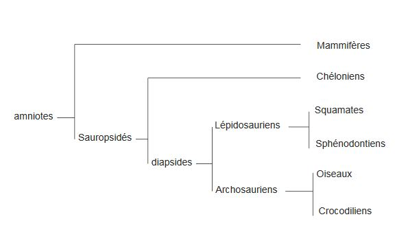
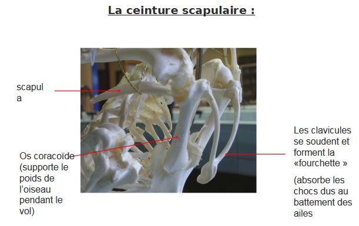
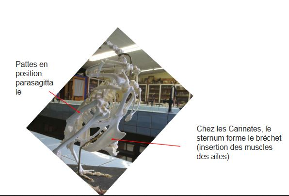

# Les amniotes

Leur developpement des Amniotes se fait dans l'amnios. Chez les amniotes, les condyles occipitaux sont convexe, permet la rotation de la tête.

Les Sauropsidés possèdent des écailles cornées soudées, les phanères. Parmis ceux - ci se trouvent les Chéloniens, les Diapsides. 

## I) Les Chéloniens

La carapace des tortues est formée de trois couches :

* les écailles cornées
* plaque osseuses
* côte et colonne vertébrale

La carapace se prolongent sur la face ventrale avec le plastron.

### A) Les tortues marines

Les tortues marines possèdent des palettes natatoires. Elles ont perdus leur écailles. La base de leur régime alimentaire est les méduses. Elles confondent les méduses et les sacs plastiques.

### B) Les tortues terrestres

Les tortues terrestres, possèdent des pattes. 

## II) Les Diapsides

Les Diapsides possèdent deux fosses temporales en arrière de l'orbite ainsi qu'une fenêtre sous - orbitaire.

## III) Les Lépidosauriens

Les deux os formant la base du pied, fusion de l'astragale (os de la cheville) et du calcaneum.

### B) Les Squamates

Les Squamates possèdent un os carré mobile (streptostylie), permet à la gueule de s'ouvrir encore plus. L'os bordant la fosse temporale inférieure disparait. Ils possédent deux hémipénis.

Les substances volatilent vont se dissoudre sur la langue, les organes sensoriels sont dans les organes de Jacobson, organes voméro - naseux. 

#### Les Ophidiens

Les Ophidiens font partie des Toxiphères. Le venin est produit dans la bouche par des glandes salivaires. Mais on distingue des serpents dépourvu de glande venimeuses, les Aglyphes (couleuvres, Boa, pythons). D'autres serpents possèdent des crochets en arrière de la bouche, Opistoglyphes (le reste des couleuvres). D'autres possèdent des crochets venimeux mais les utilisent que lorsque leur proie doit être ingéré (Cobras). Les Solénoglyphes ont des crochets en avant de la bouche et sont mobiles (vipère). La famille des Crotalinés ont des organes thermo-sensibles, fossettes loréales. 

## IV) Les Archosauriens

Les Archosauriens ont un gésier.

### A) Les crocodiliens

* Palais secondaire osseux
* Fosse temporale inférieur triangulaire
* Denture thécodonte

Au sein des crocodiliens, les museaux diffèrent.

### B) Les oiseaux

#### 1) Apomorphies

Les oiseux possèdent des plumes rémiges, plumes disymétriques. Elles se situent sur les ailes des oiseaux. Les plumes recouvrant le corps sont des tectrices, ont un rôle isolant. Les plumes sur le croupion, servant à diriger l'oiseau sont les rectrices. Hallux, le plus gros orteil des membres inférieurs et Pirostyle.

#### 2) Origine évolutive

Les oiseux dérivent d'un groupe de dinosaure, Sauroschiens. On pense qu'il dérive de dinosaures carnivores, les Théropodes.

Origine des plumes : dinosaures présentant des plumes qui étaient incapables de voler. Les plumes avaient pour rôle la protection thermique. Caudipteryx mangeait des insectes, et lui servait à se stabiliser pendant la poursuite de ses proies.

Les plumes sont apparues avant le vol. Les plumes sont des écailles modifiés, ce sont des phanères. Une plume au départ est un petit bourgeon qui a la même structure que la formation d'une écaille.

#### 3) Adaptation au vol

Les adaptations au vol sont multiples :

* os sont creux et remplie par de l'air, pneumatisés
* transformation des membres antérieurs en aile
* réduction du nombre de doigt, surface portante sont les mériges
* modification au niveau de la ceinture scapulaire formé de trois os dont l'os toracoïde qui va se souder sur le sternum, les clavicules elles se soudent formant la fourchette absorbe les chocs mécaniques, la scapula forme de sabre et vient longer les côtes
* le sternum forme le bréchet (insertion des muscles des ailes)

#### 4) Le chant

Le chant est produit par la syrinx constitué de deux trachées permettant de faire deux chants différents. 

