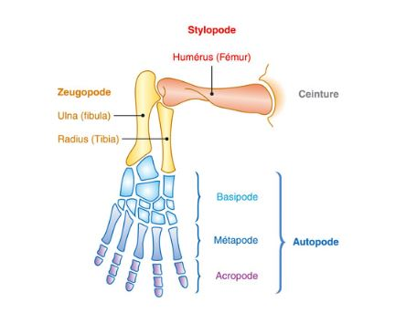

# Les Tétrapodes

## I) Apomorphies

Les tétrapodes possèdent un cou (ceinture scapulaire séparée de la tête). On a aussi l'apparition de l'oreille, avec un stape, os qui va transmettre les vibrations à l'oreille interne. Ce stade est l'homologue de l'os hyomandibulaire. La première vertèbre va se modifier et va former l'atlas permettant de bouger le cou. Les tétrapodes présentent aussi des membres chridiens. 

## II) Origine des membres chridiens

### A) Embryologie

### B) Paléonthologie

Quelques particularités avec l'Acanthostega, possédant des membres antérieurs semblables à Eustonopteron, queue aplatie. Il possède des poumons et des branchies. Ce membre chridien est developpé chez les animaux aquatiques et il  avait d'autres fonctions.

Le deuxième fossile est celui de Ichthyostega, capable de se déplacer comme les phoques. 

Avant de permettre de marcher, les membres chridiens auraient permis de sortir la tête de l'eau pour respirer (Acanthostega),  marche sur le fond, ou on servit à pagayer. Facilité par la répartition des doigts en éventail.

## 	III) Les grandes lignées de Tétrapodes

### A) Le clade des Lissamphibiens

Les Lissamphibiens ne possèdent pas de cage thoracique et possèdent des dents à deux pointes.

#### 1) Adaptations physiologiques et affranchissment du milieu aquatique

##### a) La respiration

La respiration s'effectue grâce à des poumons sacculaires. La déglutition permet de remplir les poumons. La grenouille fait aussi des échanges respiratoires avec son tégument. La couche cornée est très fine chez les Amphibiens permet de rendre le tégument perméable. Le sang est à proximité de l'air à l'aide des vaisseaux sanguins proches de l'épiderme. Présence aussi de glande muqueuse permettant de garder la peau humide.

##### b) Appareil excréteur

Le mésonephros (rein) est dépourvu d'anse de Henlé important dans le rein pour économiser de l'eau. Les amphibiens excrètent de l'urée.

##### c) Des adaptations à la secheresse chez les Anoures

L'Amphibien d'Arizona est capable de stocker 25% de son poids en eau dans sa vessie sous forme d'urine diluée.

La grenouille du Zimbabwe prend la couleur blanche afin de limiter ses pertes en eau par réchauffement. Cette grenouille fait de l'uricotelie permettant d'économiser de l'eau.

La grenouille du Paraguay, fait de l'urécotélie et stocke l'eau dans sa vessie. Elle possède des glandes cutanés sireuses la protégeant des pertes en eau par l'évaporation.

#### 2) Reproduction des Amphibiens et affranchissement du  milieu aquatique

##### a) La tétard

Le tétard possède une nageoire caudale, respire par des branchies. Ces particularités font que le tétard à besoin d'un milieu aquatique pour se developper. Le passage à l'état adulte se fait durant la métamorphose. Les pattes de l'adulte apparaissent de façon décalé. Lorsque la patte arrière droite sort par l'orifice respiratoire (le spiracle). Les pattes vont apparaitrent petit à petit, la queue va régresser. Les branchies vont disparaitre et les poumons vont se developper. L'hémoglobine du tétard va être remplacer par une autre hémoglobine au stade adulte pour pouvoir faciliter le relarguage d'oxygène au stade adulte. Chez l'adulte, l'hémoglobine présente un effet Bohr (variation de l'affinité en fonction du pH). 

[http://www.snv.jussieu.fr/bmedia/xenope1/M%8EtamorphXenope/Metamxen.html#](Métamorphose d'un Amphibien)

##### b) Acquisition d'un developpement ovipare direct

Type de developpement direct chez la grenouille rousse, pas de stade larvaire. Les nectophrynes ne passent plus par le stade larvaire. 

##### c) Acquisition d'un developpement vivipare direct

