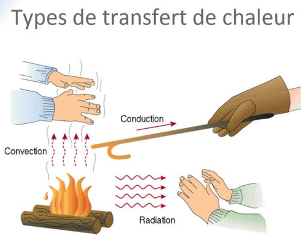

# Bilan énergétique de la Terre

## I) L'énergie et la météo

Tous les phénomènes météorologiques sont le résultat de transferts d'énergie (chaleur). Tout transfert de chaleur requiert une différence de température. Trois mécanismes de transfert de chaleur par différence de température :

* conduction
* convection
* rayonnement (radiation)
* changement d'état

### A) Conduction

Tranfert des vibrations moléculaires par contact direct avec molécules voisines. Energie transférée **sans déplacement macroscopique des molécules elles - mêmes**. 

Impératif : la présence de matière (solide, liquide ou gaz).

### B) Convection

Transport d'énergie par **transport direct de la matière elle - même**. N'est possible que pour les fluides (liquides ou gazeux).

Le moins dense remonte (Orage, Eau qui bout sur le feu)

### C) Rayonnement

Transfert d'énergie par **ondes électromagnétiques**. Possible à travers toute forme de matière **et aussi dans le vide**.

Entre le Soleil et la Terre il y a du vide, donc le transfert par rayonnement est le seul moyen de transmettre de la chaleur du Soleil à la Terre.

Tous les corps matériels émettent des ondes électromagnétiques (EM) (
(également appelées rayonnement thermique)  en vertu de leur chaleur
interne, c’est à dire leur température.

En quelque sorte, les ondes EM contiennent l’énergie de l’objet et la 
diffusent ou la transportent dans toutes les directions à la vitesse de la 
lumière (300 000 km/s).

À son tour, l’énergie (ou la « chaleur ») contenue dans une onde EM dépend 
de :

* Sa longueur d’onde (la « qualité » de ses rayons)
* Son intensité (la « quantité » de ses rayons)

Les ondes EM sont classées selon leur longueur d’onde, selon leur «qualité».

Une onde "dure" (très courte) : les rayons X

* balles d'acier
* une seule balle de fusil peut tuer

Une onde "douce" (très longue) : les ondes radio

* balle de ouate
* des centaines de balles de ouates ne font rien

Les "balles" de lumière s'appellent des "photons".

## II) Lois du rayonnement thermique

Le rayonnement thermique est proportionnel, la température à la quatrième puissance. Un corps x2 plus chaud émet x16 plus d'énergie.

N'existe pas qu'à une seule longueur d'onde mais s'étale selon une distribution.

Un corps chaud :

* émet plus d'énergie totale
* émet la majorité de cette énergie à des longueurs d'ondes relativement courtes (ondes plus énergétiques ou plus "dures"). (Etoiles)

Un corps froid :

* émet moisn d'énergie totale
* émet la majorité de cette énergie à des longueurs d'ondes relativement longues (moins énergétiques ou plus "molles"). (Terre, notre propre corps car émet dans l'IR)
