# Climatologie cours 3

## X) La dynamique océanique à l'échelle planétaire

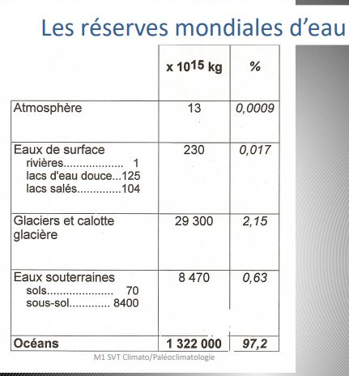

Les continents sont inégalements répartis. 22% de la planète entre 0 et 1 000 m d'altitude. 26% de la planète entre -4 000 et - 5 000 m d'altitude.

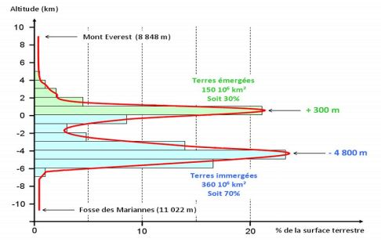

Les grandeux mesurées sont :

* le niveau d'eau : altimétrie, pression
* la pression en profondeur
* la salinité, la température
* les vitesses et directions de courants
* les sels dissous
* les particules

Dans la mer, il y a 35 g / L de sel. Dans la Mer Morte : 300 g de sel / L

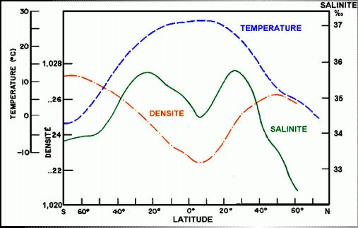
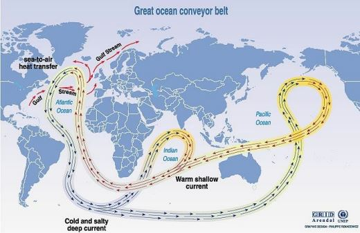

Les eaux plongent plus facilement dans l'atlantique nord et sud parce que l'Altantique est plus salé que le Pacifique.

L'Atlantique est plus salé que le Pacifique car :

1. Forte évaporation coté caraïbes et fortes précipitations coté pacifique
2.  Les eaux du Kuroshio sont moins salées à cause de la mousson.
3. Le Pacifique Nord est très froid : il y a peu d’évaporation.
4. La méditerranée contribue à sursaler l’Atlantique équatorial.

Le "débit" des courants océaniques : 

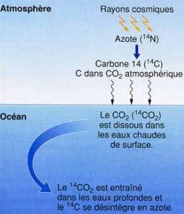

débit : unité sv

Le plus puissant 140 sv x10 le débit d'Atlantique

Les eaux les plus vieilles sont dans le Pacifique. On le sait à l'aide du C14 O2, elle ne peut s'appliquer que sur du carbone organique. La demi - vie du C14, la période de Libie. La demi vie : le temps qu'il faut pour que l'élément perd la moitié de son activité. Pour avoir son temps maximum x8. On peut dater jusqu'à 40 000 ans. 

Upwelling : les eaux aux fond sont chargé en nutriments et en oxygène, quand elle remonte, les nutriments et l'oxygène aussi : la chaine trophique se booste. detection par sattelite de la chlorophyle parmet de faire une carte des zones d'upwelling. Leur taille varie. L'eau remonte en tourbillon et redescend en tourbillon.

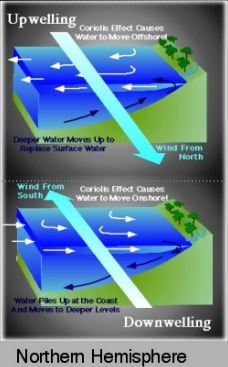

Remontée d'eau -> condensation -> création nuage -> cyclone 

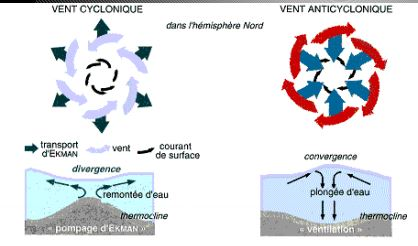
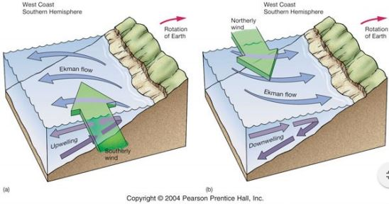

L'équateur, des vents qui converge et diverges, les alizées. Il faut de l'eau remonte pour équilibrer. Le niveau de la mer n'est pas homogène à l'échelle du globe. L'océan est bombé où il fait chaud et moins quand il fait froid. L'eau est très bombé en Australie car eau chaude, upwelling sur les côtes.

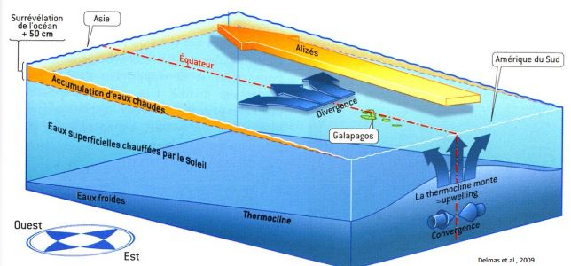

## XI) Couplage océan atmosphère

### ENSO El nino southern oscillation

El nino est à l'échelle du Pacifique. Impact important sur le globe. La mousse est impactée par le couvercle de glace de l'Arctique. On a une eau très chaude qui est habituellement de l'autre côté du Pacifique et qui vient se plaquer contre l'Amérique du Sud. Elle va tapé des reliefs -> pluies -> crues, devastation. La colline côtière est bloqué donc plus de pêche et donc crise économique. L'origine ne El Nino n'est pas connu, les alizés se sont affablis. 

La Nina -> pluie côté australie, Normal, pluie au centre de l'océan.

Les conditions sont plus chaudes et plus sèches en mérique du Nord. Mais il y aura plus de crues, de coulées de boue.. Les régimes de temps sont dits anormaux. En Afrique du Sud, il y a des sécheresses. Le principal facteur est l'eau chaude qui vient contre l'Amérique du Sud. L'air est donc chaud et chargé en humidité. Les quantités d'eau se déversent dans le continent.

En période El Nina, l'Australie se prend de l'eau, l'Amérique du Sud est en sécheresse. Eau chaude -> eau dillatée soit des températures différentes.

El Nino a un effet sur la température sur la valeur mondiale.

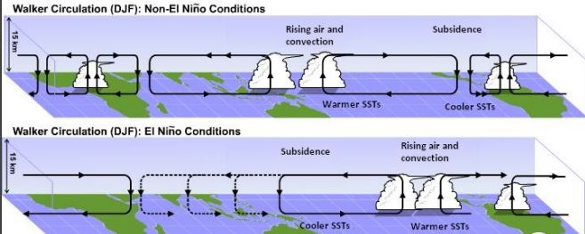
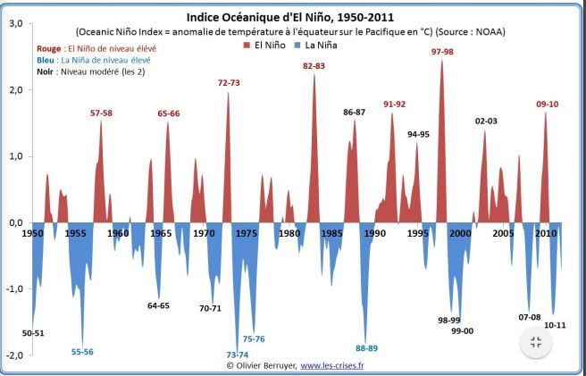

### NAO North Atlantic Oscillation

Différence de pression entre les assors et l'islande. Indice qui donne le gradient entre ces deux pressions, elles ont un rôle sur la trajectoire des précipitations. Précipitations qui passent au dessus de la Scandinavie ou de la France. Le régime de précipitation est érigée par ces deux cellules cycloniques et anticyclonique. Les masses d'air vont voyagés au travers de l'Altantique. 

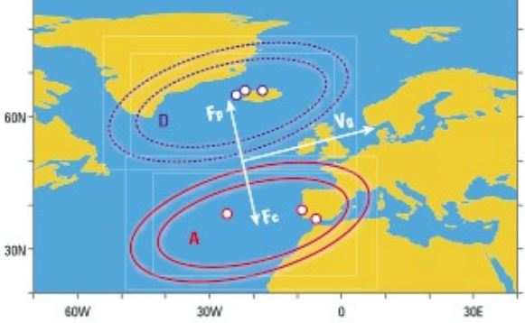

Le débit de la Seine montre les fréquences de la NAO. On ne connaît pas le moteur de ces variations de pression. On voit une légère tendance positive, plus humide en Scandinavie que chez nous.

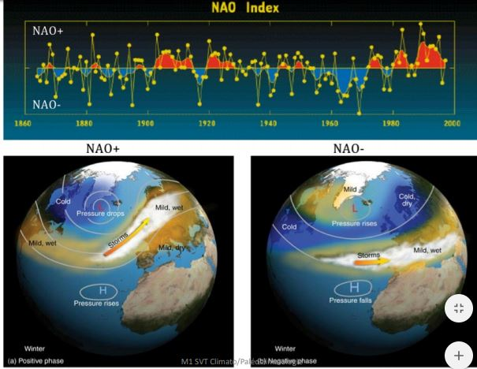

### Mousson Indienne - Africaine - Américaine

Orages en fin de journée, précipitations sur des cours d'eau secs. 

Humidité rencontre un relief et monte -> précipitation -> crues

Mousse indienne la plus importante et la plus forte.

[https://www.youtube.com/watch?v=sWhMhfbJcTw](Moussons)

L'été il fait très chaud, le continent chauffe. Sur les zones peu couvertes, on a une air qui va se chauffer beaucoup plus vite que l'air marin. Entrée d'air marine qui vont air chargé en humidité et vont se bloquer contre les reliefs, l'air va remonter et il va pleuvoir.

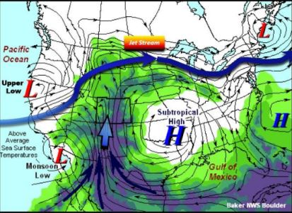

Brise de mer et brise de terre à l'échelle d'un bassin océanique

La zone de convergence intertropicale est centrée sur le domaine continental. Le déficit de chaleur océanique crée un gradient de température. L'air humide est bloquée par le plateau tibétain.

La zone de convergence intertropicale est centrée sur l'océan indien. Le déficit de chaleur sur le continent crée un gradient de température. L'effet de Foehn sur le versant Sud accentue la sécheresse indienne.

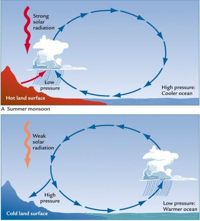