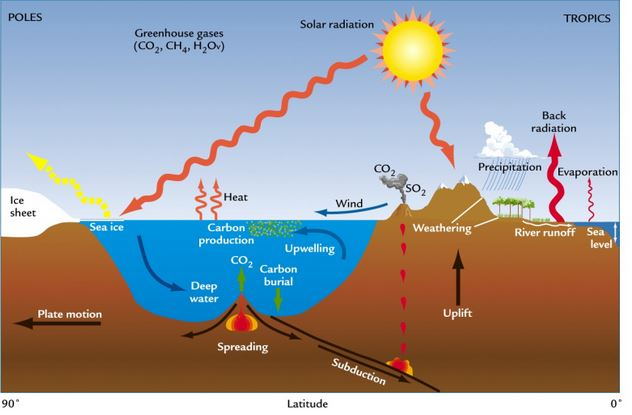

# Le Système Climatique

Excès d'énergie dans l'hemisphère Sud avec l'inclinaison de la Terre.

L'énergie arrivant par en dessous est négligeable à celle arrivant par l'espace.

L'échelle est primordiale. Un échelle de temps où on peut rajouter une échelle spatiale.

**Météorologie** : Science qui étudie les phénomènes atmosphériques notamment en vue d'établir des prévisions.

**Climatologie** : Etude de la succession de conditions météorologiques sur de longues périodes de temps

**Paléoclimatologie** : Discipline qui documente les climats passés à l'échelle des temps géologiques.

La climatologie peut avoir un impact sur la météorologie.

## I) Mise en contexte

Le Soleil :

* Etoile ordinaire en périphérie de notre Galaxie (la Voie Lactée) contenant quelques 200 milliards d'étoiles
* Etoiles : boules de gaz d'hydrogène incandescent générant des quantités colossales d'énergie provenant de la fusion nucléaire de leur hydrogène en hélium dans le noyau
* Le Soleil est prévu pour fournir cette énergie pour encore 5 milliards d'années, avant de s'éteindre

Le Système solaire :

* Huit planètes majeures gravitant autour du Soleil
* Astéroïdes, comètes, planètes naines (Pluton etc..), poussières
* Formation : il y a 4,5 milliards d'années par accrétion de la matière interstellaire. La Terre est en quelque sorte un amas de poussières rocheuses et de gaz, agglutinés par gravité.

La Terre : 

* 3e planète en distance, à ~150 millions de km du Soleil
* 5e planète en taille (diamètre de ~12 700 km)
* Planète rocheuse comme Mercure, Vénus et Mars

On est situé à la distance parfaite pour avoir l'eau sur trois phases, et ainsi créer un cycle hydrologique.

### A) Les atmosphère planétaires

Lors de la formation des planètes, les poussières et roches forment la partie solide sphérique et les gaz s'accumulent autour, puisque plus légers.

L'atmosphère est conséquence naturelle de la formation des planètes.

Seules les planètes les plus massives conservent leur atmosphère. Toutes les planètes majeures, sauf Mercure, en possèdent une.

### B) Notre atmosphère

La Terre est entourée d'une mince pellicule de gaz appelée l'atmosphère. Principalement composée d'azote (N2) et d'Oxygène (O2). Epaisseur avoisinant la centaine de km (ligne de Kàrmàn).

* limite aéronotique de l'atmosphère

Poids total : 5 000 000 000 000 000 tonnes

Le rôle de l'atmosphère est très importante. Elle nous protège des rayons x, UV du Soleil, des météorites et des écarts extrêmes de températures grâce à son effet de serre. Elle permet à la vie d'exister.

L'énergie rayonné par la Terre est emprisonnée par les gaz à effet de serre.

Destin de la radiation solaire dans l'atmosphère

25% réfléchie vers l'espace

* 19% réfléchie par les nuages
* 6% diffusée par les gaz atmosphériques

25% absorbée par les gaz atmosphériques

* 18% : vapeur d'eau
* par l'ozone

* 50% transmise au sol

Un rayonnement dans le domaine du visible. On a une radiation de la Terre correspondant à la température de la Terre (15°C) renvoie en IR. Les gaz à effet de serre piège les infrarouges émit par la Terre (96%). 

Si on augmente la quantité de CO2, méthane ou gaz à effet de serre, on empêche encore plus de gaz à repartir donc les basses couches de l'atmosphère se réchauffe.

En terme de spectre, le Soleil renvoie dans le domaine du visible. Ainsi que le domaine de l'UV mais l'Ozone le filtre donc on ne le reçoit pas, nous ne sommes donc pas brulé par le rayonnement.

Le spectre d'emission de la Terre est absorbé par le méthane et le gaz carbonique ce sont des cycles ouverts.

L'effet de serre piègeage des gaz à effet de serre du rayonnements infrarouge de la Terre pas celui du Soleil. 

La vapeur d'eau est un cycle fermé, on ajoute pas de vapeur d'eau dans l'atmopshère.

Les nuages réfléchissent les rayonnement solaire ainsi que les déserts et les zones polaires.

L'energie émise du Soleil est plus grande que celle émise par la Terre

