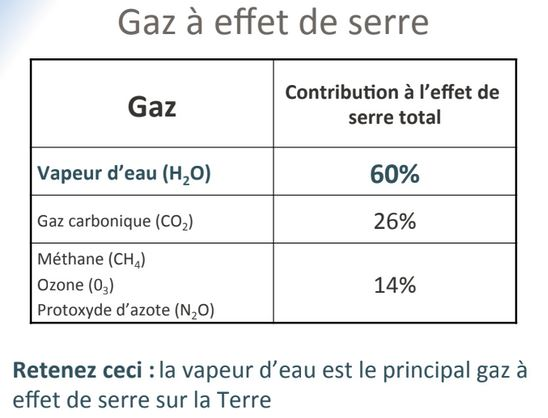

# Effet de serre

L'eau a un rôle important dans le gaz à effet de serre. Il a fallu 40 ans pour résorber le trou de la couche d'Ozone après la décision d'arrêter ces effets (traité de Montréal) grâce à une prise de conscience international même si les chinois on continué dans relarguer un peu.

L'Ozone stratosphérique nous protège. L'Ozone troposphérique (smog) est néfaste pour nous, il a une forte augmentation l'été dans les villes, effet toxique sur l'Homme et la végétation.

L'Ozone Stratosphérique comprimé ferait 3 mm d'épaisseur. Elle permet la vie sur Terre car bloque les UV.

Contribution à l'effet de serre 50% de CO2

Le potentiel de réchauffement des gaz. Le CO2 est prit comme référence, est ce que ça emmagasine plus de chaleur que le CO2 ou pas.

On compte 1 an pour le CO2, au bout de 100 ans nous ne reserberons pas la couche de méthane, protoxyde d'azote : augmentation 100 ans après. Il suffit d'avoir une très faible quantité pour avoir un réchauffement très fort.

L'origine du CO2 est 91% de l'utilisation d'énergie fossile type ciment.

Les suies sont pieger par l'atmosphère, 25% dans les forêts, si on veut tout pieger il faut énormément d'arbre. 25% va dans les Océans.

L'augmentation du CO2 est historique depuis 1960, depuis qu'on s'en rend compte. L'augmentation du CO2 est en dent de scie, 2014 on a atteint la barre des 400ppm. Dent de scie : saisons, plus de continents dans l'hémisphère Nord, pendant l'été boréale, on piège plus de CO2 que pendant l'été australe.

Le CO2 est dans l'atmosphère à cause des industries.

Les sources du méthane : feu de biomasse, les ruminants, les zones humides (si en Sibérie il fait plus chaud, neige va fondre, donc marécages, zone humides : zone de méthane, c'est une bombe climatique), sources fossiles, thermites, hydrate de gaz sur les talus continentaux qu'on veut chercher pour le carburant

L'Ocean piège le méthane.  Il est en augmentation depuis 1983. 

C'est augmentation sont dû à la population qui ne cesse de croitre.

L'Ozone stratosphérique, aux pôles car réaction à très faible température.
