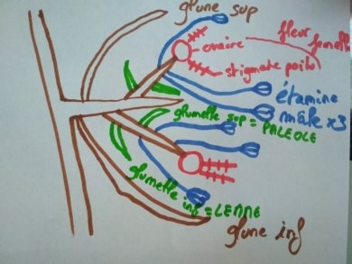
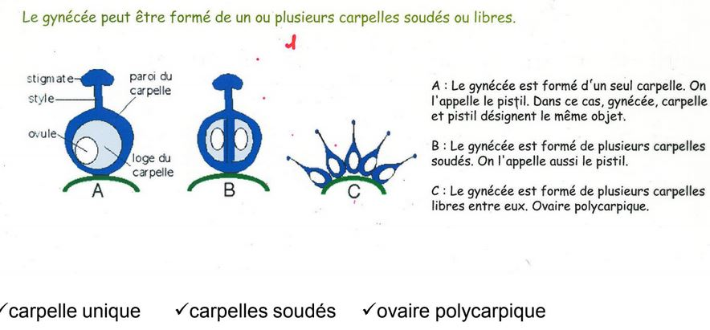
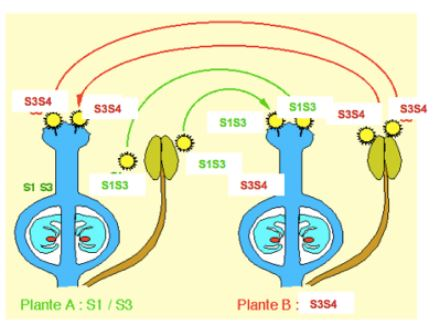

# Chapitre 2 : La production des graines

## I) L'organisation du gynécée

Les pièces stériles : le périanthe

* le calice, l'ensemble des sépales
* la corolle, l'ensemble des pétales

Les pièces fertiles 

* femelle, **gynécée** : le pistil, l'ensemble des carpelles
* mâle, l'**androcée** : l'ensemble des étamines

Présentation de la fleur de graminée, on a une organisation florale différente. Constituée de plusieurs fleurs formant un épi situé à l'extrémité des chaumes (tiges). 

Le gynécée est constitué d'un ensemble de carpelles. Un carpelle est constitué d'une partie creuse et dilatée qu'on appelle l'ovaire. Cette ovaire est prolongée par une partie plus effilée qu'on appelle le style. On va trouver un ou plusieurs ovules fixés sur le placenta. La dernière partie est constituée par le stigmate.

Le gynécée peut être constitué d'un carpelle unique ou de plusieurs carpelles. Si on a plusieurs carpelles, ils peuvent être soudés, ou bien libres à la surface du receptacle, dans ce cas, on parle d'**ovaires polycarpiques**.

On peut avoir deux types d'organisation d'ovaire, 

* ovaire infère, l'ovaire est dans le receptacle 
* ovaire supère, l'ovaire est en position supérieur au niveau du réceptacle floral

## II) Formation du gamétophyte femelle

Les ovules sont situés dans l'ovaire et sont destinés à se transformer en graines après la fécondation, un ou plusieurs ovules par ovaires. L'ovule est rattaché au placenta par un petit filet, le **funicule**. 

 Au sein de l'ovule se forme le gamétophyte femelle, la **macrosporogénèse**. L'ovule va se former par un bourgeonnement de la surface ovarienne, un cellule mère, l'**archespore** va donner un **mégasporocite diploïde**. Ce mégasporocite diploïde va subir une méïose où il va y avoir la formation de 4 cellules hamploïdes appelés **macrospore**. Avant la méoïse, sporocyte et après spore. Un seul macrospore va se former, celui se trouvant au niveau du **micropyle**. 
 

La macrospore qui survit va subir trois mitoses successives qui vont aboutir à sept cellules haploïdes et à huit noyaux. Les trois cellules situées aux pôles chalazien se nomment les antipodes. Les synergides dans le pôle mycropilaire. 

MMC: archespore qui va évoluer pour donner un mégasporocyte. Cellule mère des mégaspores

Le mégasporocyte est entouré par les **cellules épidermique du nucelle**.

Le mégasporocyte subit l’étape de méiose pour former quatre spores. Les trois spores localisés du
coté du micropyle vont subir la **mort cellulaire programmée**. Celui du côté du pôle de la chalaze va devenir fonctionnel.

C —> stade FG1, devient fonctionnel et va subir une première division de mitose. Croissance des téguments interne et externe.

D—> stade FG2, orientation des deux noyaux.

L’un migre au niveau du pôle du micropyle et l’autre vers le pôle de la chalaze. Ce qui occupe le centre de la cellule est une **vacuole**.

FG4: Une cellule avec quatre noyaux.

FG5: dernière division de mitose, cloisonnement cellulaire.

Les deux noyaux de la cellule centrale vont fusionner pour former le noyau central CCN. Les trois cellules antipode vont dégénérer.

Le gamétophyte femelle mature est constitué de quatre cellules.

Chez les graminées on n’a pas la dégénération des 3 cellules antipode, elles vont proliférer et se diviser. Rôle dans la **transition alimentaire**, elles vont former des **papilles**.

Rôle crucial du gamétophyte femelle dans le développement des plantes.

La phytohormone auxine joue un rôle déterminant dans la formation du gamétophyte femelle chez cette plante.

Au départ de la formation du gamétophyte final on avait un source d’**auxine** qui était présente au
niveau du **nucelle**. Transport polarisé de l’auxine. L’auxine arrive du coté du micropyle,
progressivement on va avoir un **gradient d’auxine** au travers du gamétophyte femelle. Le pôle qui
va avoir une forte concentration d’auxine c’est le **micropyle** et celui qui va avoir une faible
concentration c’est le pôle de la **chalaze**. Ce gradient va être responsable de l’**identité cellulaire** des cellules constituant le gamétophyte. La concentration d’auxine va diminuer ensuite. La concentration maximale d’auxine observé au niveau du micropyle au stade FG2 est du à 2 facteurs: expression du gène **YUC1**. Cette expression se fait au niveau du micropyle au **stade G1**.
Ensuite au stade G2 on a un transport de l’auxine et on a un second gène qui va rentrer en jeu, gène **PIN1** transporteur d’auxine.

## III) Formation du gamétophyte mâle

Une **anthère**: deux loges reliées par un connectif. Chacune des loges contient deux sacs polliniques. Quand l’anthère arrive à maturité les sacs pollinique vont fusionner.

L’**assise mécanique** va être constituée par des cellules qui vont avoir une paroi présentant des
**dépôts de lignine** (en u) qui vont se rajouter à la paroi précédente. La lignine permet une
rigidification. Cette lignification se trouve sur tout le tour de la coupe de l’anthère sauf sur la **fente
de déhiscence**. Quand l’anthère arrive à maturité elle se déshydrate. On a une importance du
tapis; réservoir de protéines et de nutriments pour la formation du grain de pollen.

La formation du **gamétophyte mâle** va débuter lorsque les anthères sont en formation. L’anthère
va être constituée d’un **massif de cellule** homogène, seulement l’épiderme est différencié puis
dans chaque angle de l’anthère on va avoir une ébauche de cellule sous épidermique qui
commence à se différencier pour former les **archespores**. Chaque archespore va subir une
division pour former deux cellules.

La **cellule pariétale** est la cellule qui est sous l’épiderme et la **cellule sporogène** est un peu plus
en profondeur. Ces deux cellules vont continuer à se diviser et dans un premier temps elles vont
subir une division et former **des cellules pariétales secondaires**.

**Tétrade** entouré d’une paroi épaisse riche en **callose**.

**Plasmodesmes**: interruption dans la paroi cellulaire pour permettre aux quatre cellules de la
tétrade de communiquer et pour pouvoir se coordonner au niveau de leur développement.

La **primexine** va venir se renforcer avec la formation de la **sporopollénine**. Cela va venir
consolider la paroi. On a formation de l’**intime**.

Les constituants de l’exine sont fabriqués par les cellules du tapis.

Auxine importante dans le développement des anthères et dans le grain de pollen.

Le grain de pollen résiste à la dessication.

## IV) Les modes de pollinisation

La répartition et l’organisation des fleurs vont impacter directement les modes de pollinisation.
On retrouve majoritairement chez les Angiosperme des plantes de type hermaphrodite; sur un
même pied et au sein d’une même fleur on va avoir des fleurs mâles et des fleurs femelle.
On a des plantes qui sont **monoïque** (mais, noisetier), sur un même individu on a des fleurs mâles
et des fleurs femelles mais au sein de fleurs séparées. On a aussi des plantes **dioïque**; on a des
individus mâles et des individus femelles. 

On va avoir des modes de pollinisation qui sont de l’**autogamie** ou de l’**allogamie**.
La **pollinisation** est le transport du grain de pollen de l’anthère vers la surface réceptrice du pistil
(stigmate). 

Quand on parle d’**autogamie** on parle d’**autofécondation**, une plante va être pollinisée par du
pollen qui provient du même individus soit à l’intérieur d’une même fleur ou bien de fleur différente.
Ce mode ne va pas être favorable au brassage génétique et malgré le fait qu’on a 80% de fleurs
hermaphrodite très peu de plante font usage de ce mode de fécondation. On va avoir des
mécanismes au sein de la plante qui vont favoriser la pollinisation croisée et limiter l’autogamie.

L’**allogamie** désigne la pollinisation croisée, c’est à dire que le grain de pollen est transporté sur le
stigmate d’une autre plante de la même espèce.

La pollinisation au hasard: dans le cas des plantes monoïque ou hermaphrodite. Autogamie et
allogamie.

Les facteur favorisant l’**allogamie**:

* Les espèces dioïque car elles n’ont pas le choix.
* Mécanisme génétique ou adaptation anatomique qui limite l’autofécondation chez les plantes hermaphrodite et monoïque.

Par exemple chez le **Pélargonium**, organisme **protandre**. Au sein d’une même fleur on a des
**étamines** et des **carpelles** (risque d’autofécondation). On a une **disjonction** dans le temps entre
la formation des étamines et celle des carpelles. Les étamines vont libérer le grain de pollen alors
que la partie femelle n’est pas encore arrivée à maturité. Les stigmates ne sont pas encore
**réceptifs**. Cela peut être l’inverse, on parlera de **protogynie**, cas du plantain. Les carpelles sont
situés en position supérieur par rapport aux étamines, ce qui limite l’autofécondation.

Exemple du l’**hétérostylie**; 50% de plante longistylées (partie femelle longue et partie mâle
courte) et 50% de plante **brévistylées** (partie femelle courte et partie mâle longue) cela permet de
limiter au maximum la distance entre le lieu de formation des grains de pollen et la surface du
carpelle pour favoriser la fécondation par les insectes. Cas chez les primevères.

Chez les Campanules, on va avoir de la **protandrerie**. Quand on a un bouton floral en cours de
maturation on a la présence des étamines qui vont avoir à leurs surface les grains de pollen. Les
carpelles ne sont pas encore à maturité. Quand la fleur s’ouvre les carpelles se développent avec
les styles et le stigmate et les étamines fanent. Le stigmate va s’enrouler si non pollinisation et en
s’enroulant il va arriver au contact des grains de pollen qui se sont accrochés lors de la croissance
du style. On peut donc avoir de l’autogamie si la fleur n’a pas été pollinisée.

On va avoir des mécanisme d’**auto-incompatibilité**. 

Lorsque le grain de pollen se dépose sur les stigmates on a des incompatibilité entre espèce
différentes mais aussi des incompatibilité au sein d’une même espèce pour limiter l’autogamie, on
parlera d’**auto-incompatibilité**. On va avoir des **mécanisme de reconnaissance**.
Au sein d’une plante hermaphrodite on a souvent le pollen qui ne peut pas germer si il viens de la
même fleurs ou d’une même plante. Il existe des **système d’incompatibilité génétique** pour
rendre obligatoire la fécondation croisée. Ce mécanisme est basé sur l’expression de gène d’autoincompatibilité que l’on appelle les **gènes S**. Ces gènes S existent sous la forme de nombreux
allèles. On les appellera S1, S2, S3. Ces gènes codent pour des **glycoprotéines** présentes. Ces
glycoprotéines peuvent être présentent à différents endroits à la fois sur la partie mâle et sur la
partie femelle.
Sur le **gamétophyte mâles**, soit ces glycoprotéines vont être localisées sur la partie externe du
grain de pollen donc au niveau de l’**exine**. Dans ce cas l’exine va se former à partir de molécule en
provenance du tapis. La protéine qui viens de ce tapis résulte de l’expression des **deux allèles** du
gène.
On peut aussi avoir des glycoprotéines S qui seront localisées au niveau de l’**intine** fabriquée par
le gamétophyte lui même. Protéine qui résulte de l’expression d’un **allèle unique**.

Pour la **partie femelle** on retrouve des glycoprotéines localisées soit au niveau du stigmate soit
au niveau du **style**.

On va avoir deux types d’auto-incompatibilité:

* Chez les brassicaceae, on a de l’**auto-incompatibilité sporophytique**.
* Les glycoprotéines sont localisées au niveau de l’exine (diploïde).

On va avoir un rejet précoce du grain de pollen, il ne va pas pouvoir germer car on a des
reconnaissance entre les glycoprotéines à la surface du grain de pollen et les glycoprotéines du
stigmate.

Chez d’autres plantes comme les Solanacées, on a de l’**auto-incompatibilité gamétophytique**.
Les glycoprotéines sont fabriquées par le gamétophyte mâle donc haploïde et localisées au niveau
de l’intine.

La formation du **tube pollinique**

La phase de **réhydratation du grain de pollen**. Il arrive dans un état déshydraté, en **dormance**.

Cette phase de réhydratation dépend du type de stigmate que l’on va avoir:

* Stigmate **hydraté**; surface **mucilagineuse**.
* Stigmate **sec**; présence de **papilles**.

La **réceptivité du stigmate** est plus ou moins longue selon les espèces végétale, cela varie de
une heure à plusieurs jours.

Stigmate dont l’épiderme se différencie pour former des **papilles**. Lorsque le grain de pollen arrive
sur ce type de stigmate on va avoir une hydratation du grain de pollen très régulée. Lorsque l’on va 
avoir des stigmates hydratés, il se trouve dans un endroit aqueux. Il va pouvoir prélever de l’eau et
germer si il est compatible.

**Stigmate sec**, régulation des grains de pollen.
Dans un premier temps on a une phase d’**adhésion cellulaire** qui va mettre en oeuvre les
constituants de l’exine afin de former une **zone de contact**, mobilisation de molécule de l’exine
pour former une zone de contact et renforcer l’adhésion entre le pollen et le stigmate. Au départ on
a une adhésion faible entre les deux puis au fur et à mesure l’interface va évoluer et se renforcer
avec des contacts supplémentaires. Mobilisation du **manteau pollinique**. Si le pollen est
**compatible** avec le stigmate on a une **hydratation régulée** du grain de pollen qui fait intervenir
des **aquaporines**. Cela permet la croissance du tube pollinique. Sur les même papilles si on a un
grain de pollen compatible et un autre incompatible ils seront chacun régulé finement.

Une fois la réhydratation faite on va avoir la croissance du **tube pollinique**, c’est une croissance
**scalariforme**. Tout au long de la croissance on va avoir formation de **bouchon de callose**. On va
avoir une forme « d’échelle » qui se forme. Moyen de pousser à l’extrémité du tube le contenue du
cytoplasme pour qu’il puisse arriver jusqu’au gamétophyte femelle. Malgré la croissance du tube
pollinique le volume du cytoplasme ne bouge pas. Le tube à une forte activité métabolique puisque
qu’il doit synthétiser des **polymères pariétaux**.

Il faut des moyens pour guider la croissance du tube pollinique, on a une hiérarchie de signaux
pour guider le tube pollinique jusqu’au niveau du gamétophyte femelle. La croissance de ce tube
sera guidée différemment suivant si on a un style **creux** ou un style avec un **tissu de
transmission gélifié**.

Chez le Lys, le grain de pollen lorsqu’il va germer va croitre le long de l’épiderme du tissu de
transmission. L’**épiderme du tissu de transmission** (TTE)

On a des mécanismes qui vont permettrent d’orienter la croissance de ce tube et on a des
molécules capables d’attirer par **chimiotactisme** le tube pollinique. Dans le Cas du Lys cette
molécule est une protéine et qui s’appelle la **chemocyanine**. Il existe des **gradients de
chemocyanine** de plus en plus important lorsque l’on va du stigmate vers l’ovaire. La protéine
**SCA**, riche en cystéine, famille des adénise. On la trouve au niveau du style et stigmate chez le
Lys. Elle va se lier avec des **pectines** pour former une **matrice** sur lesquels le grain de pollen va
pouvoir adhérer.

Dans le cas du tabac on a un **style gélifié**, les mécanismes qui vont permettrent la croissance et
l’adhésion vont être différents. On a un temps de 26 à 30 heures pour atteindre l’ovaire. Le tube
pollinique va croitre a l’intérieur de ce gel dans lequel on va retrouver des **pectine et AGP**. On a
des AGP spécifique au niveau du style et du stigmate. Rôle dans l’adhésion et la défense de la
racine. Ce qui va permettrent de contrôler la croissance du tube pollinique cela va être un **gradient**
de **glycosylation des AGP** qui va guider le tube pollinique vers l’ovaire. Les **synergides** sécrètent
des molécules pour attirer le tube pollinique.

Chez Arabidopsis, le POP2 c’est le mutant qui n’est pas capable de dégrader une molécule qui
est le GABA. Au niveau du micropyle on a un maximum de **concentration de GABA**. L’hypothèse
est que le GABA intervenant comme molécule signal pour guider le tube pollinique au dernier
stade de la croissance. Ce mutant n’est pas capable de dégrader le GABA, il est déficient en une
enzyme qui est la **transaminase**. On a donc un **excès de GABA**. On a pas un bon « guidage » du
tube pollinique. La **plantacyanine** ressemble à la chemocyanine du Lys..
Quand le tube pollinique arrive dans la **synergide** cela va induire la **mort cellulaire des
synergides**. On va avoir des molécules qui vont servir de **signaux de répulsion** pour ne plus
attirer d’autre tube pollinique en cours de croissance. Au cours de la croissance du tube on va
avoir la deuxième mitose qui va avoir lieu, le noyau de la cellule spermatogène va subir une mitose
ce qui va former les deux gamètes (spz). Les deux Spz vont être acheminés jusqu’à l’ovule.

## VI) Double fécondation

Temps variable de la fécondation selon les espèces. Le **tube pollinique** va progresser dans les tissus du style pour arriver à l'ovule. Suite à la **double fécondation** toutes les cellules ne vont pas avoir le même devenir.

Le **tube pollinique** va déverser son contenu dans une des **synergides**, dégénérescence des
synergides, les **antipodes** vont avoir une fonction dans l’alimentation de l’ovule. L’**oosphère** va
fusionner avec l’un des spermatozoïdes et les deux noyaux de la cellule centrale qui vont fusionner
avec le deuxième gamètes.

Les conséquences de la double fécondation:
le spermatozoïde qui va féconder l’oosphère va former le zygote principal.

L’autre spermatozoïde va fusionner avec les deux **noyaux polaires** ce qui va donner un **embryon
triploïde** que l’on appelle le **zygote accessoire** et qui va former l’**albumen** au niveau de la
**graine**.
Au niveau des autres compartiments, les téguments de l’ovule après la double fécondation vont
former les téguments de la graine.

Une graine va être composée de ces trois compartiment: **embryon**, **albumen** et **tégument**.
L’ovaire suite à la double fécondation va reprendre sa **croissance** ou subir des transformations.
L’ovaire va former le fruit qui va contenir la graine.
Les pétales et sépales vont dégénérer, les étamine sont aussi faner. Au niveau du style et du
stigmate, ils vont dégénérer.
La paroi de l’ovaire va se transformer pour donner la paroi du fruit, on l’appelle alors le **péricarpe**.
Il est composé de trois tissus: l’**épicarpe** (le plus externe), le **mésocarpe** et l’**endocarpe**.

## VII) La formation de la graine

La formation de la graine est découpée en trois phases.

*  La période de 0 à 30 jours après pollinisation, phase d'embryongénèse précoce de la graine : la graine ne grossit pas, essentiellement de nombreuses mitoses, différenciation de l'axe embryonnaire, l'apparition des cotylédons

* Entre 30 et 95 jours, phase de croissance importante, la graine va accumuler des réserves

* La graine se stabilise, **uniquement chez les graines orthodoxes qui tolèrent la dessication**. Les graines vont être capable de subir une désydratation totale et va entrer en dormance.

Les autres graines vont devoir  germer aussi tôt : graines recalcitrantes

### A) L'embryogénèse de la graine

Suite à la **double fécondation** on va retrouver le **zygote principal** qui est **diploïde**, c’est une
cellule allongée et qui va posséder une large **vacuole centrale** au niveau de la partie basale. On a
une **polarité** qui s’établie. On a une première division de mitose, **division asymétrique**. On va
avoir à l’issus de cette division une cellule de petite taille et une cellule de grande taille. Du coté de
la **chalaze** on va avoir une petite cellule apicale et du coté du **micropyle** on va avoir une grande
cellule basale. C’est cette petite cellule apicale qui va être à l’origine du futur embryon. La cellule
basale va se diviser aussi mais son devenir va être de former le **suspenseur** (partie qui va relier
l’embryon au niveau du micropyle). Le suspenseur va avoir un **rôle transitoire de nutrition** lors
de la formation de l’embryon. 

A : une zygote diploïde, cellule allongée et qui va posséder une large vacuole centrale au niveau de la partie basale du côté du nicropyle. Très tôt, on aura une polarité.

B : On aura une première division de mitose asymétrique = petite cellule apicale + grosse cellule basale du côté du nycropile. La petite cellule apicale deviendra l'embryon. La cellule basale va devenir le suspenseur. Il aura un rôle transitoire de nutrition lors de la formation de l'embryon.

C+D : Les deux cellules vont subir des divisions

E+F : Stade embryoglobulaire, l'embryon a grossit, les cellules se sont différenciées. On a apparition des cellules du protoderme (formera ensuite le tissu de revêtement). Embryon cordiforme, on a une symétrie qui va s'installer . On a des ébauches de cotylédons qui vont commencer à apparaitre de chaque côté de l'embryon. On a la mise en différence des méristèmes et du procambium. Les méristèmes seront présents tout au long de la plante.

G : Embryon torpille allongement de celui - ci. L'embryon se renverse à l'intérieur de la graine : stade "u" renversé.

H : stade "u" renversé, le suspenseur va dégénerer, l'embryon est formé. 

Chez Arabiopsis, 

A: on a déjà les deux cellules en première phase A. La cellule basale va aussi donner le suspenseur.

B+C+D+E: Cellule apicale va être la partie d'origine de l'embryon, la cellule apicale va se diviser et les cellules situées sur la partie apicale vont former les cotylédons et le méristème colinaire. Les issus situées basalement, vont se diviser et former l'hypocotyle et les parties sup du système racinaire. Le suspenseur va donner l'hypophyse qui va donner naissance au centre aquiscent raicnaire et le méristème de coiffe.

La partie racinaire provient donc de la cellule apicale et aussi de la cellule basale.

L'enveloppe de l'embryon va être finement régulée et faire intevenir un certain nombre de gènes hautement régulés.

Les différents gènes vont être exprimés durant différents stades.

Le gène GURKE va contrôler le dvp de la partie aérienne de la plante. Il va s'exprimer dès le stade codiforme. On va avoir un phénotype altéré.Si le gène est muté, on va retrouver que la racine et l'hypocotyle. 

Le gène MONOPTEROS contrôle le dvp de la racine. Si ce gène est muté, le système racinaire ne peut pas se dvp.

Le gène GNOM s'exprime dès le stade zygote. Il est impliqué dans le contrôle des parties aériennes et racinaires. Si ce gène se trouve muté, on aura des cellules indifférenciés ou les seuls tissus seront l'épiderme, parenchyme cortical et une ébauche de tissu vasculaire.

On va retrouver un contrôle de l'embryogénèse par des gradients l'auxine. L'auxine va contrôler cette étape de dvp. Les transporteurs sont PIN1 4 et 7, ABCD1 et 19. On s'aperçoit que dès le stade zygote, on aura le transporteur PIN 7 qui sera sur la partie apicale du suspenseur qui vont permettre un flux d'auxine du suspenseur vers l'embryon. L'auxine va être acheminé par PIN7 puis PIN1 va permettre une répartition homogène de l'auxine dans tout l'embryon. Stade globulaire, réarrangement des transporteurs d'auxines qui vont être acheminés en sens inverse. Au niveau de l'hypophyse et au niveau des cotylédons ainsi qu'au niveau du procambium. 

Chez les graminées, on aura les mêmes étapes, si ce n'est que pas de stade codiforme car un seul cotylédon sera formé. Deux structures membranaires vont se former qui vont permettre de protéger la tige lors de sa croissance, le coléoptile qui protéger le méristème et la coléorhize qui va protéger la partie racine.

### B) Formation de l'albumen

L'**albumen** va se former par la fécondation d'un spermatozoïde avec les deux noyaux polaires pour former le **zygote accessoire** triploïde qui provient de la fécondation des deux noyaux polaires. Le zygote accessoire va subir des mitoses sans cloisonnement cellulaire : **stade syncitial**. Pas de paroi cellulaire au départ, les premiers noyaux vont se disperser tout au tour d'une grande vacuole centrale. 

Lorsque la croissance de l'albumen se poursuit, on aura le cloisonnement cellulaire de l'albumen qui va se former et va se faire en débutant du micropyle à la chalaze. Ce stade d'albumen cellulaire va avoir lieu du stade embryon globulaire - stade embryon cordiforme.  

A partir de ce dernier stade, l'albumen va accumuler des réserves et va se former au dépend du nucelle. Dans certains cas on aura un stade où l'embryon va digéré les réserves de l'alumen et va stocker ces reserves dans ses propres cotylédons. Les cellules stockent l'amidon (amyloplaste), protéines(grains d'aleurone), lipides(cytoplasme) ou des composés pariétaux comme la cellulose (paroi de l'albumen).

L'albumen nourrit l'embryon après la germination en attendant que la plante soit autonome et fasse la photosynthèse. L'albumen est la base de notre alimentation (farine) : 60% de l'apport nutritionnel de la pop mondiale.

Albumen nucléaire (bourrache) : albumen syncitial persiste longtemps

Albumen cellulaire (myosotis) : se cloisonne rapidement

Albumen à cloisonnement incomplet : graine contenue dans la noix de coco ( la partie centrale reste liquide et la partie périphérique est solide et forme le coprah).

### C) Les différents types de graines

Le nucelle : tissu qui entoure le sac embryonnaire dans l'ovule.

Suivant les familles, le nucelle subit une destruction soit une prolifération lors de la formation de l'albumen. Cependant, il existe certaines familles pour lesquelles le nucelle persiste et s'enrichit de réserves : le périsperme. 

Soit on classe les graines en fonction de l'endroit où ils stockent les graines ou en fonction du type de réserve.

Chaque plante ne va pas accumuler le même type de réserve.

* céréales : glucides pédominent, graines amylacées (amidon)
* colza : lipides prédomine, graines oléagineuses
* légumineuse : protéine prédomine, graines protéagineuses

Réserves proviennent des transferts des produits de la photosynthèse de la plante mère vers la graine. Ce transport va se faire par plusieurs étapes successives. Elles vont être transportées via le phloème. Va passer par le funicule et les tissus conducteurs vont se ramifier dans les téguments externes de l'ovule mais après plus de connexions pour aller jusqu'à l'albumen. Le transport se fera différemment en arrivant aux téguments.

Les assimilats vont dans un premier temps sortir des tubes criblés et vont être véhiculés de façon symplastique (c à c) au niveau du parenchyme phloémien des téguments. Ces assimilats vont être déversés dans un parenchyme constitué de lacunes appelé aérenchyme. Les assmilats vont être véhiculés à l'exterieur des cellules -> transport apoplastique. Lorqu'ils arrivent à l'extrémité des téguments, sont déchargés dans l'albumen et l'embryon. Ces assimilats sont du saccharose et des aa vont être assimlés soit au niveau de l'embryon soit de l'albumen pour synthétiser des grosses molécules en substance de réserve. 

L'amidon va petre synthétiser à partir du saccharose. Ce saccharose va être hydrolysé en fructose et en glucose et grâce à l'amidon synthétase, on va avoir formation d'amylose (enchainement de glucose) auquel se rajoute des ramification pour former de l'amylopectine.

L'amidon ainsi former va être transporter dans des amyloplastes. Ces amyloplastes sont constitués de structures ayant un ou plusieurs points centraux (hile) et vont former des cercles concentriques de dépot d'amidon. La position du hile et les stries et la taille des grains permettent l'identification. Les grains d'amidon se retrouvent dans le cytoplasme de l'albumen (mais et blé) ou bien dans le cytoplastes des cotylédons (pois, haricot).

La mise en réserve de glucide sous forme hémi-cellulose. Le milieu de mise en réserve n'est plus le cytoplasme. On va retrouver une paroi très épaisse hémi-cellulosique et va permettre une grande dureté aux cellules de l'albumen. On retrouve des galactomannanne ou des xyloglucane. Albumen cornet est l'albumen rigidifier et très dur.

Les triglycérines proviennent du saccharose qui est acheminé jusqu'à l'embryon. Ce saccharose après hydrolyse va être transformé soit en glycérol - 3 - phosphate ou en acid gras. Les triglycérines sont des triestères de glycérol et d'acide gras. (voir diapo)

Mise en réserve des protéines

Les proteines proviennent des aa qui sont transportées avec les assimilats. On trouve quatre classes de protéines, elles sont définies selon leur différences de solubilité :

* Classe des Albumines : protéines hydrosoluble
* Classe des Gobulines, protéines solubles en solution saline (légumineuses)
* Classe des Glutéines
* Classe des Prolamines

Ils sont sources d'aliments + sources aa lors de la germination des graines. Certains espèces végétale comme la citrouille ont corps protéique provenant d'expension du réticulum endoplastique, ils vont se cliver et cale va être largué dans le cytoplasme.

Dans le cas des céréales, les protéines sont localisés dans la partie la plus externe, la couche alerone. Les graines d'alerone forme des organismes délimités par une membrane. Ils changent de morphologie lors de la déshydratation de la graine et lors de cette déshydratation, on peut voir apparaitre des inclusions à l'intérieur.

Lors de la phase de déshydratation de la graine les vacuoles de réserves vont se fragmenter en plus petites vacuoles et la membrane des corps protéique provient de la membrane des vacuoles de réserves. Dans ces corps protéique il y a aura 70% à 80 % de protéines, ainsi que 10% de phytine. Cette acide phytique va permettre de se complexe avec du fer, potassium, magnésium, calcium. Cette phytine va représenter une réserve importante de minéraux dans la graine.

On peut les retrouver dans l'albumen ou les cotylédons. Ces graines qui tolèrent la déssications sont orthodoxes. On y retrouve que la troisième phase. 

Angiospermes : tolèrent la dessication seulement au stade graine à cause de la germination

Chez les graines ont été découvertes des protéines LEA dans une graine coton car elles s'y accumlaient de façon importante. Ces protéines sont dans toutes les graines orthodoxes et également chez les plantes reviviscente. La synthèse des proteines LEA, se fait au cours de la phase 2 avec un pique d'acide abscissique. Acquisition de la tolérance à la dessication des graines pendant la phase 2. Les proteines LEA ont un rôle de molécule chaperone et vont stabiliser les macromolécules (lipides et proteines) lors de la dernière phase de déshydratation. Ce sont des protéines qui présentent de nombreux groupes hydroxyles. Lorsque l'eau va quitter cette protéines, elles vont venir se fixer (théorie du remplacement de l'eau), à la place des molécules d'eau pour stabiliser les macromolécules dans leur conformation natives.

Stress mécanique : remplissage des vacuoles avec des solutés compatibles, des sucres.

Cette production acide abscissique est importante dans la survie de la graine. C'est elle qui va permettre à la graine d'acquérir la dessication -> longévité plus important et permet le stockage de celle ci. Mais par ailleurs, un taux élevé, va la mettre dans un état de dormance ce qui est essentiel à la survie de la graine, elle l'empêcher de germer de façon précoce. La dormance de la graine va être conditionné par la teneur en acide abcsissique et la teneur en gibblérines.  