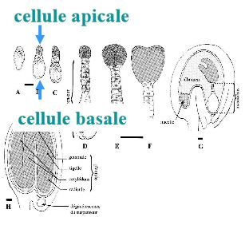
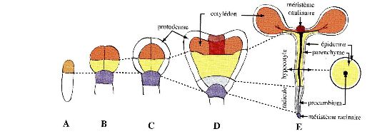
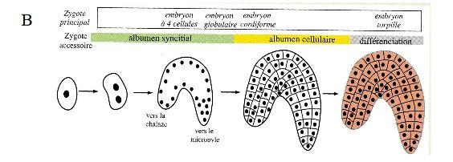

## VII) La formation de la graine

La formation de la graine est découpée en trois phases.

*  La période de 0 à 30 jours après pollinisation, phase d'embryongénèse précoce de la graine : la graine ne grossit pas, essentiellement de nombreuses mitoses, différenciation de l'axe embryonnaire, l'apparition des cotylédons

* Entre 30 et 95 jours, phase de croissance importante, la graine va accumuler des réserves

* La graine se stabilise, **uniquement chez les graines orthodoxes qui tolèrent la dessication**. Les graines vont être capable de subir une désidratation totale et va entrer en dormance.

Les autres graines vont devoir  germer aussi tot : graines recalcitrantes

### A) L'embryogénèse de la graine

A : une zygote diploïde, cellule allongée et qui va posséder une large vacuole centrale au niveau de la partie basale du côté du nicropyle. Très tot, on aura une polarité.

B : On aura une première division de mitose asymétrique = petite cellule apicale + grosse cellule basale du côté du nycropile. La petite cellule apicale deviendra l'embryon. La cellule basale va devenir le suspenseur. Il aura un rôle transitoire de nutrition lors de la formation de l'embryon.

C+D : Les deux cellules vont subir des divisions

E+F : Stade embryoglobulaire, l'embryon a grossit, les cellules se sont différenciées. On a apparition des cellules du protoderme (formera ensuite le tissu de revêtement). Embryon cordiforme, on a une symétrie qui va s'installer . On a des ébauches de cotylédons qui vont commencer à apparaitre de chaque côté de l'embryon. On a la mise en différence des méristèmes et du procambium. Les méristèmes seront présents tout au long de la plante.

G : Embryon torpillen allongement de celui - ci. L'embryon se renverse à l'intérieur de la graine : stade "u" renversé.

H : stade "u" renversé, le suspenseur va dégénerer, l'embryon est formé. 

Chez Arabiopsis, 

A: on a déjà les deux cellules en première phase A. La cellule basale va aussi donner le suspenseur.

B+C+D+E: Cellule apicale va être la pratie d'origine de l'embryon, la cellule apicale va se diviser et les cellules situés sur la partie apicale vont former les cotylédons et le méristème colinaire. Les issus situés basalement, vont se diviser et former l'hypocotyle et les parties sup du système racinaire. Le suspenseur va donner l'hypophyse qui va donner naissance au centre aquiscent raicnaire et le méristème de coiffe.

La partie racinaire provient donc de la cellule apicale et aussi de la cellule basale.

L'enveloppe de l'embryon va être finement régulée et faire intevenir un certain nombre de gènes hautement régulés.

Les différents gènes vont être exprimée durant différents stades.

Le gène GURKE va contrôler le dvp de la partie aérienne de la plante. Il va s'exprimer dès le stade codiforme. On va avoir un phénotype altéré.Si le gène est muté, on va retrouver que la racine et l'hypocotyle. 

Le gène MONOPTEROS contrôle le dvp de la racine. Si ce gène est muté, le système racinaire ne peut pas se dvp.

Le gène GNOM s'exprime dès le stade zygote. Il est impliqué dans le contrôle des parties aériennes et racinaires. Si ce gène se trouve muté, on aura des cellules indifférenciés ou les seuls tissus seront l'épiderme, parenchyme cortical et une ébauche de tissu vasculaire.

On va retrouver un contrôle de l'embryogénèse par des gradients l'auxine. L'auxine va contrôler cette étape de dvp. Les transporteurs sont PIN1 4 et 7, ABCD1 et 19. On s'aperçoit que dès le stade zygote, on aura le transporteur PIN 7 qui sera sur la partie apicale du suspenseur qui vont permettre un flux d'auxine du suspenseur vers l'embryon. L'auxine va être acheminé par PIN7 puis PIN1 va permettre une répartition homogène de l'auxine dans tout l'embryon. Stade globulaire, réarrangement des transporteurs d'auxines qui vont être acheminés en sens inverse. Au niveau de l'hypophyse et au niveau des cotylédons ainsi qu'au niveau du procambium. 

Chez les graminées, on aura les mêmes étapes, si ce n'est que pas de stade codiforme car un seul cotylédon sera formé. Deux structures membranaires vont se former qui vont permettre de protéger la tige lors de sa croissance, le coléoptile qui protéger le méristème et la coléorhize qui va protéger la partie racine.

### B) Formation de l'albumen

L'albumen va se former par la fécondation d'un spermatozoïde avec les deux noyaux polaires pour former le zygote accessoire triploïde qui provient de la fécondation des deux noyaux polaires. Le zygote accessoire va subir des mitoses sans cloisonnement cellulaire : Stade syncitial. Pas de paroi cellulaire au départ, les premiers noyaux vont se disperser tout au tour d'une grande vacuole centrale. 

Lorsque la croissance de l'albumen se poursuit, on aura le cloisonnement cellulaire de l'albumen qui va se former et va se faire en débutant du micropyle à la chalaze. Ce stade d'albumen cellulaire va avoir lieu du stade embryon globulaire - stade embryon cordiforme.  

A partir de ce dernier stade, l'albumen va accumuler des réserves et va se former au dépend du nucelle. Dans certains cas on aura un stade où l'embryon va digéré les réserves de l'alumen et va stocker ces reserves dans ses propres cotylédons. Les cellules stockent l'amidon (amyloplaste), protéines(grains d'aleurone), lipides(cytoplasme) ou des composés pariétaux comme la cellulose (paroi de l'albumen).

L'albumen nourrit l'embryon après la germination en attendant que la plante soit autonome et fasse la photosynthèse. L'albumen est la base de notre alimentation (farine) : 60% de l'apport nutritionnel de la pop mondiale.

Albumen nucléaire (bourrache) : albumen syncitial persiste longtemps

Albumen cellulaire (myosotis) : se cloisonne rapidement

Albumen à cloisonnement incomplet : graine contenue dans la noix de coco ( la partie centrale reste liquide et la partie périphérique est solide et forme le coprah).

### C) Les différents types de graines

Le nucelle : tissu qui entoure le sac embryonnaire dans l'ovule.

Suivant les familles, le nucelle subit une destruction soit une prolifération lors de la formation de l'albumen. Cependant, il existe certaines familles pour lesquelles le nucelle persiste et s'enrichit de réserves : le périsperme. 

Soit on classe les graines en fonction de l'endroit où ils stockent les graines ou en fonction du type de réserve.

Chaque plante ne va pas accumuler le même type de réserve.

* céréales : glucides pédominent, graines amylacées (amidon)
* colza : lipides prédomine, graines oléagineuses
* légumineuse : protéine prédomine, graines protéagineuses

Réserves proviennent des transferts des produits de la photosynthèse de la plante mère vers la graine. Ce transport va se faire par plusieurs étapes successives. Elles vont être transportées via le phloème. Va passer par le funicule et les tissus conducteurs vont se ramifier dans les téguments externes de l'ovule mais après plus de connexions pour aller jusqu'à l'albumen. Le transport se fera différemment en arrivant aux téguments.

Les assimilats vont dans un premier temps sortir des tubes criblés et vont être véhiculés de façon symplastique (c à c) au niveau du parenchyme phloémien des téguments. Ces assimilats vont être déversés dans un parenchyme constitué de lacunes appelé aérenchyme. Les assmilats vont être véhiculés à l'exterieur des cellules -> transport apoplastique. Lorqu'ils arrivent à l'extrémité des téguments, sont déchargés dans l'albumen et l'embryon. Ces assimilats sont du saccharose et des aa vont être assimlés soit au niveau de l'embryon soit de l'albumen pour synthétiser des grosses molécules en substance de réserve. 

L'amidon va petre synthétiser à partir du saccharose. Ce saccharose va être hydrolysé en fructose et en glucose et grâce à l'amidon synthétase, on va avoir formation d'amylose (enchainement de glucose) auquel se rajoute des ramification pour former de l'amylopectine.

L'amidon ainsi former va être transporter dans des amyloplastes. Ces amyloplastes sont constitués de structures ayant un ou plusieurs points centraux (hile) et vont former des cercles concentriques de dépot d'amidon. La position du hile et les stries et la taille des grains permettent l'identification. Les grains d'amidon se retrouvent dans le cytoplasme de l'albumen (mais et blé) ou bien dans le cytoplastes des cotylédons (pois, haricot).

La mise en réserve de glucide sous forme hémi-cellulose. Le milieu de mise en réserve n'est plus le cytoplasme. On va retrouver une paroi très épaisse hémi-cellulosique et va permettre une grande dureté aux cellules de l'albumen. On retrouve des galactomannanne ou des xyloglucane. Albumen cornet est l'albumen rigidifier et très dur.

Les triglycérines proviennent du saccharose qui est acheminé jusqu'à l'embryon. Ce saccharose après hydrolyse va être transformé soit en glycérol - 3 - phosphate ou en acid gras. Les triglycérines sont des triestères de glycérol et d'acide gras. (voir diapo)

Mise en réserve des protéines

Les proteines proviennent des aa qui sont transportées avec les assimilats. On trouve quatre classes de protéines, elles sont définies selon leur différences de solubilité :

* Classe des Albumines : protéines hydrosoluble
* Classe des Gobulines, protéines solubles en solution saline (légumineuses)
* Classe des Glutéines
* Classe des Prolamines

Ils sont sources d'aliments + sources aa lors de la germination des graines. Certains espèces végétale comme la citrouille ont corps protéique provenant d'expension du réticulum endoplastique, ils vont se cliver et cale va être largué dans le cytoplasme.

Dans le cas des céréales, les protéines sont localisés dans la partie la plus externe, la couche alerone. Les graines d'alerone forme des organismes délimités par une membrane. Ils changent de morphologie lors de la déshydratation de la graine et lors de cette déshydratation, on peut voir apparaitre des inclusions à l'intérieur.

Lors de la phase de déshydratation de ma graine les vacuoles de réserves vont se fragmenter en plus petites vacuoles et la membrane des corps protéique provient de la membrane des vacuoles de réserves. Dans ces corps protéique il y a aura 70% à 80 % de protéines, ainsi que 10% de phytine. Cette acide phytique va permettre de se complexe avec du fer, potassium, magnésium, calcium. Cette phytine va représenter une réserve importante de minéraux dans la graine.

(voir diapo formation de cristal)

On peut les retrouver dans l'albumen ou les cotylédons. Ces graines qui tolèrent la déssications sont orthodoxes. On y retrouve que la troisième phase. 

Angiospermes : tolèrent la dessication seulement au stade graine à cause de la germination

Chez les graines ont été découvertes des protéines LEA dans une graine coton car elles s'y accumlaient de façon importante. Ces protéines sont dans toutes les graines orthodoxes et également chez les plantes reviviscente. La synthèse des proteines LEA, se fait au cours de la phase 2 avec un pique d'acide abscissique. Acquisition de la tolérance à la dessication des graines pendant la phase 2. Les proteines LEA ont un rôle de molécule chaperone et vont stabiliser les macromolécules (lipides et proteines) lors de la dernière phase de déshydratation. Ce sont des protéines qui présentent de nombreux groupes hydroxyles. Lorsque l'eau va quitter cette protéines, elles vont venir se fixer (théorie du remplacement de l'eau), à la place des molécules d'eau pour stabiliser les macromolécules dans leur conformation natives.

Stress mécanique : remplissage des vacuoles avec des solutés compatibles, des sucres.

Cette production acide abscissique est importante dans la survie de la graine. C'est elle qui va permettre à la graine d'acquérir la déssication -> longévité plus important et permet le stockage de celle ci. Mais par ailleurs, un taux élevé, va la mettre dans un état de dormance ce qui est essentiel à la survie de la graine, elle l'empêcher de germer de façon précoce. La dormance de la graine va être conditionné par la teneur en acide abcsissique et la tenur en gibblérines.  

