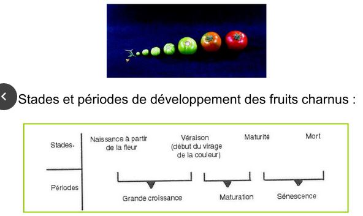
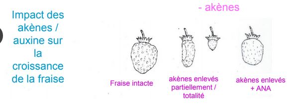
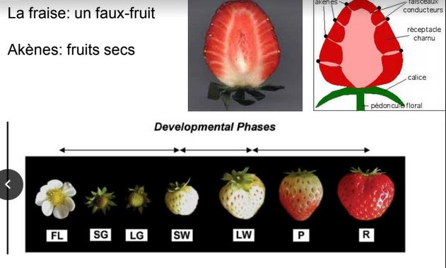

# Chapitre 3 : La formation des fruits

La maturation des fruits va être découpé en trois phases :

* phase de croissance
* phase de maturation
* phase de sénescence

I) Phase de croissance du fruit charnu ou nouaison

C'est la phase de transformation de l'ovaire en fruit, elle est déclenchée par la pollinisation ce qui donne des fruits parthénocarpique. Cela se fait de façon naturelle (banane) ou chez le raisin (sans graine) transformé pour ne pas qui est de graine à l'intérieur.

Phase de croissance : phase de croissance importante après la fécondation. Grandissement cellulaire : augmentation de la taille considérable. La multiplication cellulaire n'intervient pas ou très peu. Souvent la courbe se termine par un plateau (surtout chez les drupes car lignification de l'endocarpe). Deux phyto hormones acitves durant cette phase : auxine et Gibbérellines. Après la pollinisation, le dvp des fruits (ou faux fruits) est contrôlé par les graines en formation source importante d'hormones.

Les gibbérelines peuvent égalemet jouer un rôle dans l'élongation cellulaire et l'ouverture des fruits.

L'ovule après pollinisation secrète de l'auxine en grande quantité. Induit la prolifération des tissus du péricarpe. Expérimentalement, l'application exogène d'auxine mime la pollinisation : obtention de fruits parthénocarpiques.

L'auxine va diminuer ensuite inhibe le murissement du fruit (couleur..). Pour que le fruit puisse avoir sa phase de murrissement.

## II) La maturation des fruits charnus

La phase de maturation des fruits charnus débute quand le fruit atteint sa taille limite. Les fruits vont subir de nombreux changements métaboliques (teneur en sucre, alcool,). Le fruit sera moins acide, plus juteux, changement de couleur.. Toutes ces modifications ont pour objectif d'attirer les aniamux pour favoriser la dispersion des semences.

Ce changement de la couleur du fruit est la **véraison** : augmentation de la synthèse en pigment et diminution de la teneur en chlorophylle. On va avoir un enrichissement en sucres solubles et une diminution de la teneur en acides organiques. Au cours de la maturation, on aura une diminution de la teneur en acide organique : la saveur du fruit va s'effectuer en fonction de la balance sucres - acides. 

Le fruit deviendra moins ferme -> relachement de la paroi cellulaire végétale. Elle va s'accompagner d'une augmentation d'activité enzymatiques :

* Polygalacturonases : pomme, kiwi, cerise, tomate
* Cellulases : hydrolysent la cellulose chez la tomate
* XET : tomate, kiwi, melon

Ces modifications sont sous le contrôle des phytohormones : Ethylène va contrôler l'activité d'enzyme chez les climactériques.

Fruits climactérique sont des fruits avec la production d'éthylène à maturité, possède ces propres récepteurs à l'éthylène. A partir du moment où on peut cueillir un fruit, dans la phase de maturation, il est capable de continuer sa maturation. Comme l'éthylène est une hormone gazeuse, il va pouvoir stimuler les fruits étant à proximité. Pour retarder la maturation des fruits, on baisse le taux d'éthylène. Ou on va retarder l'activité de l'éthylène.

Chez les non climactérique, on a une production acide abscissique. 

Durant la maturation des fruits, 2 piques : éthylène et intensité respiratoire. Les fruits possèdent une crise climactérique. Chez les non - climactérique, il n'y a pas de pique d'éthylène et une diminution de l'intensité respiratoire. 

## III) La maturation des fruits secs

