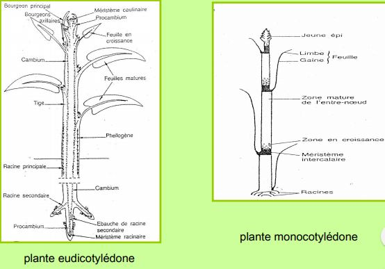
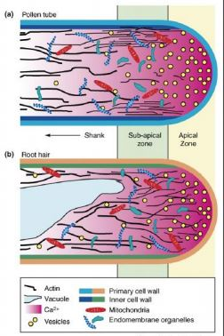

# Chapitre 5 :La croissance des Angiospermes

## I) La morphogénèse végétale

Chez les plantes, la morphogénèse constitué de 3 évenements 

* division
* élongation cellulaire
* différenciation cellulaire

### A) Les méristèmes

Chez le végétal, les cellules devront se diviser qu'au niveau des **méristèmes**, responsable dans la **croissance dans la longueur** de la plante. Tandis que les méristèmes qui vont apparaitre plus tardivement sont responsables dans la **croissance en épaisseur**.  

**Avant la division** : le **noyau** d'une cellule méristématique est **volumineux**, isodiamétrique avec une paroi fine, plusieurs petits partiments vacuolaires. Ce sont des cellules active, présence de petites vésicules avec mitochondries dans l'appareil de Golgi. Les méristèmes peuvent être en **dormance**. Chez une plante monocot, méristème secondaire :  phellogène avec cambium. 

### B) L'élongation cellulaire

Cette **élongation cellulaire** résulte de la **tension pariétale** par rapport à la pression de turgescence. Pour pouvoir avoir une croissance cellulaire, il faut un relachement de la tension pariétale couplé à une absorption en eau. Cette élongation cellulaire va être de **forme isotropique** (croissance dans toutes les directions de la cellule -> **expansion cellulaire**). 

Certains cas peuvent utiliser la **croissance anisotropique**, la croissance va se faire dans **une direction privilégiée** (le tube pollinique ou poil racinaire). 

**Auxine -> Baisse du pH pariétal -> Augmentation de la plasticité pariétale -> simulation de l'élongation cellulaire**

L'éthylène intervient dans la **différenciation cellulaire**. 

Les fibres de coton sont une cellules faisant jusqu'à 2 - 4 cm. La cellule est capable de s'allonger 1000 à 2000 fois sa taille originelle. 

### C) La différenciation cellulaire

La **différenciation cellulaire** s'accompagne de **modifications au niveau de la paroi** des cellules. Relation entre la forme de la paroi, la composition et la fonction de la cellule.

La différenciation est régulée par les **microtubules et l'actine** au niveau cellulaire. La morphologie des cellules végétales est fortement **dépendante du tissu ou de l'organe** auquel elles appartiennent.

### D) La totipotence cellulaire

Toute cellule végétale est capable de régénérée un autre individu identique à celui dont elle est issue. La totipotence est possible grâce à une phase de dédifférenciation. Cette totipotence implique qu'à partir des morceaux d'une plante on peut avoir une nouvelle plante entière (clone) -> reproduction végétative. Rôle des auxines et des cytokinines dans l'orientation de l'organogénèse.

## II) La racine : organe d'interface sol - racine

La **racine** est la partie **cachée** de la plante, elle reste bien moins étudiée que la **partie aérienne**. Les racines sont importantes dans l'**ancrage de la plante**, fonction bien définie dans l'**absorption de l'eau et des minéraux** ainsi qu'elle **stocke les produits de la photosynthèse**.  La racine, de part sa position dans le sol sera en contact d'une **multitudes de micro organismes**. Certains sont bénéfiques dans la **croissance** de la plante : **champignons mycoriziens**, les **bactéries PGPR** (plant growth promoting rhizobactériea). Ainsi que des multitudes d'agents pathogènes qui vont avoir un impact sur la plante dans sa totalité. La réponse immunitaire de la racine est très peu connue. 

L'architecture de la racine : 

(voir schéma diapo racine)

Il existe différents compartiments au niveau du méristème, plusieurs cellules appelés **initiales** qui vont être à l'origine d'un **tissu racinaire** qui va être spécifique. Il existe différents **territoires méristématiques**. Des cellules sont à l'origine de l'**écorce** et de l'**endoderme**. Au dessus, d'autres cellules qui seront à l'origine du **tissus vacuslaires** (procambium). Deux cellules vont correspondre au **centre quiescent**, il ne se divise que très peu et se trouve situé en position central en dessous se retrouve les **méristèmes d'entretien de la coiffe**. Dans la **columelle** (centre de la coiffe) se trouve des cellules appelées **statocytes** possédant des **grains d'amidon** qui perçoivent la **gravité**. Ces différents territoires fonctionnent **indépendamment**.

(voir schéma coiffe racinaire)

La phase de différenciation se situe dans la **zone pilifère**, un cylindre central sera réduit avec une **écorce développée**. 

Les cellules jeunes seront localisé à **proximité du méristème**, les cellules les plus anciennes, se retrouveront à **la périphérie**. Les cellules en vieillissant **changera de fontion** au fur et à mesure. Ces différentes fonctions sont valables dans la **zone de la columelle**. Dans les cellules **situées à la périphérie**, on a une **sécrétion très importante de nombreuses vésicules golgiennes** venant fusionner avec la membrane plasmique afin de livrer leur contenu dans la paroi. La **fonction de ces cellules périphériques** est de produire du **mucilage**. Les cellules vont ensuite se **détacher de la coiffe** racinaire et être **libérées dans le sol**. Cela est valable pour **toutes les ramifications racinaires**. Va être ainsi sécrété des **molécules dans la rhizosphère** de faible et haut poids moléculaires : sucres, acides organiques, mucilage et protéines.  

## III) Le développement de l'appareil végétatif aérien

Le **méristème caulinaire** est un méristème de surface, d'où proviennent tous les tissus primaires de la tige feuillée. Il va être situé entre les deux cotylédons au **niveau de l'embryon** (dicot) ou dans une **position latérale** (monocot). Il est présent dès le **stade embryonnaire**. On va y retrouver différentes zones qui vont être à l'origine de tissus bien spécifiques. 

* la **zone apicale axiale** (ou zone centrale) : **zone la plus superficielle**. Zone méristématique mais elle aura très peu de divisions cellulaire pendant toute la phase végétative de la plante. C'est un **méristème d'attente**. Elle est **responsable du bouton floral**.

* le **méristème médullaire** : ces cellules vont se **diviser mais de façon modéré**. Elle va permettre la formation de la **partie centrale de la tige**.

* la **zone périphérique** (ou anneau initial) : zone très **active durant toute la phase végétative**. Elle permet la formation des **tissus corticaux** de la tige ainsi que le **cylindre central** et la **formation de nouvelles feuilles**.

Autre façon de décrire le méristème caulinaire :

* **tunica** : couche superficielle L1 et L2
* **corpus** : zone L3

Le **passage a l'état reproducteur** est un **phénomène complexe**. Il va dépendre de **facteurs environnementaux** et de **facteurs internes**. Il sera constituée de deux phases.

* le **virage floral** : aboutit à un changement au niveau de l'organisation du méristème.
	* **phase d'induction florale** : fait intervenir différents organes de la plante dont les feuilles : elles vont percevoir des simulus externes (T°, lumière) et vont **envoyer un message au méristème caulinaire** à l'aide la protéine FT synthétisée en fonction des facteurs dans les cellules compagnes. Elle est sous le contrôle de facteurs trophiques. On aura une compétition entre la croissance végétative et le développement des organes reproducteurs. La plante aura besoin de nutriments en quantité suffisante. D'autres signaux comme le froid vont intervenir.

	* **phase d'évocation florale** : **réorganisation du méristème**, des mitoses ont lieu au niveau de la zone apicale. Aflux de saccharose qui va se faire au niveau du méristème floral à l'aide d'un accélration du métabolisme cellulaire.
    
* la **morphogénèse florale** : formation des pièces florales et floraison

	* **phase d'initiation florale** : **formation des primordium des pièces florales**. Epuisement de l'anneau initial ainsi qu'une dédifférenciation du méristème d'attente: dilation importante de ce méristème d'attente suite à ces mitoses. Les sépales (rôle de protection) seront les premières pièces qui vont se différencier avec l'apparition du calice et vont enrouler l'apex caulinaire. Il y aura ensuite la différenciation des autres pièces florales : pétales, les étamines et le pistil.
    
    * **phase de floraison** : **les ébauches florales vont continuer leur développement**. L'ouverture des pièces florales va se faire juste après la phase florale sinon après la dormance.
    
   