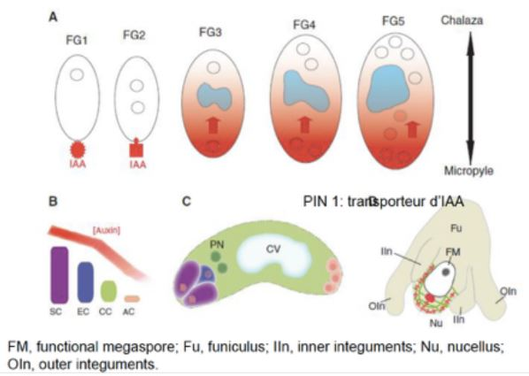

# La production des graines

## I) L'organisation du gynécée

Les pièces stériles : le périanthe

* le calice, l'ensemble des sépales
* la corolle, l'ensemble des pétales

Les pièces fertiles 

* femelle, **gynécée** : le pistil, l'ensemble des carpelles
* mâle, l'**androcée** : l'ensemble des étamines

Présentation de la fleur de graminée, on a une organisation florale différente. Constitué de plusieurs fleurs formant un épi situé à l'extrémité des chaumes (tiges). 

Le gynécée est constitué d'un ensemble de carpelles et un carpelle est constitué d'une partie creuse et dilatée qu'on appelle l'ovaire. Cette ovaire est prolongée par une partie plus effilée qu'on appelle le style. On va trouver un ou plusieurs ovules fixés sur le placenta. La dernière partie est constitué par le stigmate.

Le gynécée peut être constitué d'un carpelle unique ou de plusieurs carpelles. Si on a plusieurs carpelles, ils peuvent être soudés, ou bien libres à la surface du receptacle, dans ce cas, on parle d'**ovaires polycarpiques**.

On peut avoir deux types d'organisation d'ovaires, 

* ovaire infère, l'ovaire est dans le receptacle 
* ovaire supère, l'ovaire est en position supérieur au niveau du réceptacle floral

## II) Formation du gamétophyte femelle

Les ovules sont situés dans l'ovaire et sont destinés à se transformer en graines après la fécondation, un ou plusieurs ovules par ovaires. L'ovule est rattaché au placenta par un petit filet, le **funicule**. 

 Au sein de l'ovule se forme le gamétophyte femelle, la **macrosporogénèse**. L'ovule va se former par un bourgeonnement de la surface ovarienne, un cellule mère, l'**archespore** va donner un **mégasporocite diploïde**. Ce mégasporocite diploïde va subir une méïose où il va y avoir la formation de 4 cellules hamploïdes appelés **macrospore**. Avant la méoïse, sporocyte et après spore. Un seul macrospore va se former, celui se trouvant au niveau du **micropyle**. 
 

La macrospore qui survit va subir trois mitoses successives qui vont aboutir à sept cellules haploïdes et à huit noyaux. Les trois cellules situés aux pôles chalazien, les antipodes. Les synergides dans le pôle mycropilaire. 

MMC: archespore qui va évoluer pour donner un mégasporocyte. Cellule mère des megaspores

Le mégasporocyte est entouré par les cellules épidermique du nucelle.

Le mégasporocyte subit l’étape de méiose pour former quatre spores. Les trois spores localisés du
coté du micropyle vont subir la mort cellulaire programmée. Celui du coté du pôle de la chalaze
va devenir fonctionnel.

C —> stade FG1, devient fonctionnel et va subir une première division de mitose. Croissance des
téguments interne et externe.

D—> stade FG2, orientation des deux noyaux.

L’un migre au niveau du pôle du micropyle et l’autre vers le pôle de la chalaze. Ce qui occupe le
centre de la cellule est une vacuole.

FG4: Une cellule avec quatre noyaux.

FG5: dernière division de mitose, cloisonnement cellulaire.

Les deux noyaux de la cellule centrale vont fusionner pour former le noyau central CCN.
Les trois cellules antipode vont dégénérer.

Le gamétophyte femelle mature est constitué de quatre cellules.

Chez les graminées on n’a pas la dégénération des 3 cellules antipode, elles vont proliférer et se
diviser. Rôle dans la transition alimentaire, elles vont former des papilles.

Rôle crucial du gamétophyte femelle dans le développement des plantes.

La phytohormone auxine joue un rôle déterminant dans la formation du gamétophyte femelle chez
cette plante.

Au départ de la formation du gamétophyte final on avait un source d’**auxine** qui était présente au
niveau du **nucelle**. Transport polarisé de l’auxine. L’auxine arrive du coté du micropyle,
progressivement on va avoir un **gradient d’auxine** au travers du gamétophyte femelle. Le pôle qui
va avoir une forte concentration d’auxine c’est le **micropyle** et celui qui va avoir une faible
concentration c’est le pôle de la **chalaze**. Ce gradient va être responsable de l’**identité cellulaire**
des cellules constituant le gamétophyte. La concentration d’auxine va diminuer ensuite. La concentration maximale d’auxine observé au niveau du micropyle au stade FG2 est du à 2 facteurs: expression du gène **YUC1**. Cette expression se fait au niveau du micropyle au **stade G1**.
Ensuite au stade G2 on a un transport de l’auxine et on a un second gène qui va rentrer en jeu, gène **PIN1** transporteur d’auxine.

## III) Formation du gamétophyte mâle

Une **anthère**: deux loges reliées par un connectif. Chacune des loges contient deux sacs polliniques. Quand l’anthère arrive à maturité les sacs pollinique vont fusionner.

L’**assise mécanique** va être constituée par des cellules qui vont avoir une parois présentant des
**dépôts de lignine** (en u) qui vont se rajouter à la paroi précédente. La lignine permet une
rigidification. Cette lignification se trouve sur tout le tour de la coupe de l’anthère sauf sur la **fente
de déhiscence**. Quand l’anthère arrive à maturité elle se déshydrate. On a une importance du
tapis; réservoir de proteines et de nutriments pour la formation du grain de pollen.

La formation du **gamétophyte mâle** va débuter lorsque les anthères sont en formation. L’anthère
va être constituée d’un **massif de cellule** homogène, seulement l’épiderme est différencié puis
dans chaque angle de l’anthère on va avoir une ébauche de cellule sous épidermique qui
commence à se différencier pour former les **archespores**. Chaque archespore va subir une
division pour former deux cellules.

La **cellule pariétale** est la cellule qui est sous l’épiderme et la **cellule sporogène** est un peu plus
en profondeur. Ces deux cellules vont continuer à se diviser et dans un premier temps elles vont
subir une division et former **des cellules pariétales secondaires**.

**Tétrade** entouré d’une paroi épaisse riche en **callose**.

**Plasmodesmes**: interruption dans la paroi cellulaire pour permettre aux quatre cellules de la
tétrade de communiquer et pour pouvoir se coordonner au niveau de leur développement.

La **primexine** va venir se renforcer avec la formation de la **sporopollénine**. Cela va venir
consolider la paroi. On a formation de l’**intime**.

Les constituants de l’exine sont fabriqués par les cellules du tapis.

Auxine importante dans le développement des anthères et dans le grain de pollen.

Le grain de pollen résiste à la dessication.

