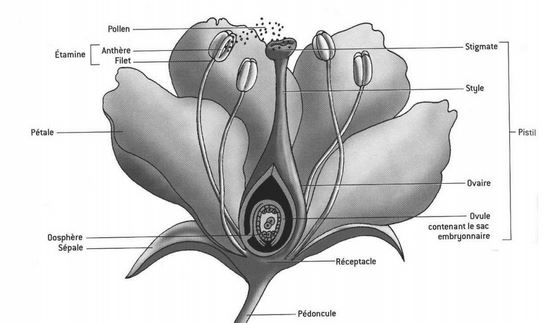
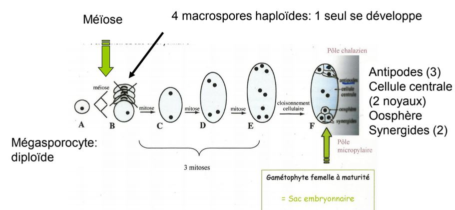
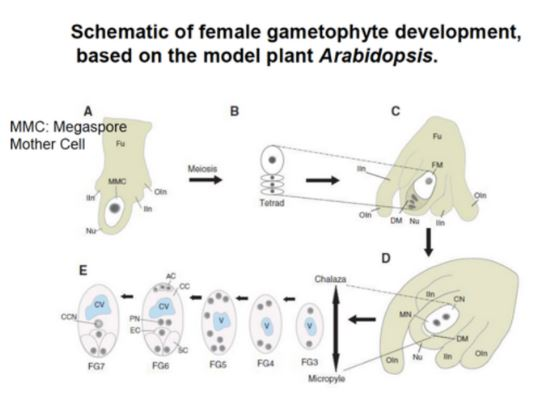
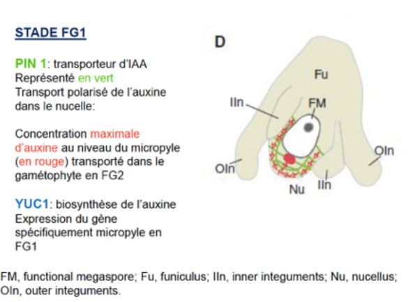
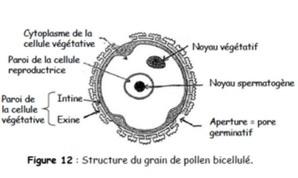

# La production des graines

## I) L'organisation du gynécée

Les pièces stériles : le périanthe

* le calice, l'ensemble des sépales
* la corolle, l'ensemble des pétales

Les pièces fertiles 

* femelle, **gynécée** : le pistil, l'ensemble des carpelles
* mâle, l'**androcée** : l'ensemble des étamines

Présentation de la fleur de graminée, on a une organisation florale différente. Constitué de plusieurs fleurs formant un épi situé à l'extrémité des chaumes (tiges). 

Le gynécée est constitué d'un ensemble de carpelles et un carpelle est constitué d'une partie creuse et dilatée qu'on appelle l'ovaire. Cette ovaire est prolongée par une partie plus effilée qu'on appelle le style. On va trouver un ou plusieurs ovules fixés sur le placenta. La dernière partie est constitué par le stigmate.

Le gynécée peut être constitué d'un carpelle unique ou de plusieurs carpelles. Si on a plusieurs carpelles, ils peuvent être soudés, ou bien libres à la surface du receptacle, dans ce cas, on parle d'**ovaires polycarpiques**.

On peut avoir deux types d'organisation d'ovaires, 

* ovaire infère, l'ovaire est dans le receptacle 
* ovaire supère, l'ovaire est en position supérieur au niveau du réceptacle floral

## II) Formation du gamétophyte femelle

Les ovules sont situés dans l'ovaire et sont destinés à se transformer en graines après la fécondation, un ou plusieurs ovules par ovaires. L'ovule est rattaché au placenta par un petit filet, le **funicule**. 

 Au sein de l'ovule se forme le gamétophyte femelle, la **macrosporogénèse**. L'ovule va se former par un bourgeonnement de la surface ovarienne, un cellule mère, l'**archespore** va donner un **mégasporocite diploïde**. Ce mégasporocite diploïde va subir une méïose où il va y avoir la formation de 4 cellules hamploïdes appelés **macrospore**. Avant la méoïse, sporocyte et après spore. Un seul macrospore va se former, celui se trouvant au niveau du **micropyle**. 
 

La macrospore qui survit va subir trois mitoses successives qui vont aboutir à sept cellules haploïdes et à huit noyaux. Les trois cellules situés aux pôles chalazien, les antipodes. Les synergides dans le pôle mycropilaire. 

MMC: archespore qui va évoluer pour donner un mégasporocyte. Cellule mère des megaspores

Le mégasporocyte est entouré par les cellules épidermique du nucelle.

Le mégasporocyte subit l’étape de méiose pour former quatre spores. Les trois spores localisés du
coté du micropyle vont subir la mort cellulaire programmée. Celui du coté du pôle de la chalaze
va devenir fonctionnel.

C —> stade FG1, devient fonctionnel et va subir une première division de mitose. Croissance des
téguments interne et externe.

D—> stade FG2, orientation des deux noyaux.

L’un migre au niveau du pôle du micropyle et l’autre vers le pôle de la chalaze. Ce qui occupe le
centre de la cellule est une vacuole.

FG4: Une cellule avec quatre noyaux.

FG5: dernière division de mitose, cloisonnement cellulaire.

Les deux noyaux de la cellule centrale vont fusionner pour former le noyau central CCN.
Les trois cellules antipode vont dégénérer.

Le gamétophyte femelle mature est constitué de quatre cellules.

Chez les graminées on n’a pas la dégénération des 3 cellules antipode, elles vont proliférer et se
diviser. Rôle dans la transition alimentaire, elles vont former des papilles.

Rôle crucial du gamétophyte femelle dans le développement des plantes.

La phytohormone auxine joue un rôle déterminant dans la formation du gamétophyte femelle chez
cette plante.

Au départ de la formation du gamétophyte final on avait un source d’**auxine** qui était présente au
niveau du **nucelle**. Transport polarisé de l’auxine. L’auxine arrive du coté du micropyle,
progressivement on va avoir un **gradient d’auxine** au travers du gamétophyte femelle. Le pôle qui
va avoir une forte concentration d’auxine c’est le **micropyle** et celui qui va avoir une faible
concentration c’est le pôle de la **chalaze**. Ce gradient va être responsable de l’**identité cellulaire**
des cellules constituant le gamétophyte. La concentration d’auxine va diminuer ensuite. La concentration maximale d’auxine observé au niveau du micropyle au stade FG2 est du à 2 facteurs: expression du gène **YUC1**. Cette expression se fait au niveau du micropyle au **stade G1**.
Ensuite au stade G2 on a un transport de l’auxine et on a un second gène qui va rentrer en jeu, gène **PIN1** transporteur d’auxine.

## III) Formation du gamétophyte mâle

Une **anthère**: deux loges reliées par un connectif. Chacune des loges contient deux sacs polliniques. Quand l’anthère arrive à maturité les sacs pollinique vont fusionner.

L’**assise mécanique** va être constituée par des cellules qui vont avoir une parois présentant des
**dépôts de lignine** (en u) qui vont se rajouter à la paroi précédente. La lignine permet une
rigidification. Cette lignification se trouve sur tout le tour de la coupe de l’anthère sauf sur la **fente
de déhiscence**. Quand l’anthère arrive à maturité elle se déshydrate. On a une importance du
tapis; réservoir de proteines et de nutriments pour la formation du grain de pollen.

La formation du **gamétophyte mâle** va débuter lorsque les anthères sont en formation. L’anthère
va être constituée d’un **massif de cellule** homogène, seulement l’épiderme est différencié puis
dans chaque angle de l’anthère on va avoir une ébauche de cellule sous épidermique qui
commence à se différencier pour former les **archespores**. Chaque archespore va subir une
division pour former deux cellules.

La **cellule pariétale** est la cellule qui est sous l’épiderme et la **cellule sporogène** est un peu plus
en profondeur. Ces deux cellules vont continuer à se diviser et dans un premier temps elles vont
subir une division et former **des cellules pariétales secondaires**.

**Tétrade** entouré d’une paroi épaisse riche en **callose**.

**Plasmodesmes**: interruption dans la paroi cellulaire pour permettre aux quatre cellules de la
tétrade de communiquer et pour pouvoir se coordonner au niveau de leur développement.

La **primexine** va venir se renforcer avec la formation de la **sporopollénine**. Cela va venir
consolider la paroi. On a formation de l’**intime**.

Les constituants de l’exine sont fabriqués par les cellules du tapis.

Auxine importante dans le développement des anthères et dans le grain de pollen.

Le grain de pollen résiste à la dessication.

## IV) Les modes de pollinisation

La répartition des fleurs chez les plantes Angiospermes sont de type hermaphrodite. Au sein d'une même fleur, on va retrouver des carpelles et des étamines. On a aussi des plantes monoïques, qui, sur un même individu possèdent des fleurs mâles et femelles mais au sein des fleurs sont séparés.
Chez les plantes dioïque, on a des individus mâles et femelles.

On va avoir des modes de pollinisation (transport du grain de pollen de l'anthère vers le stigmate) autogame ou allogame. 

**Autogamie** : Auto fécondation, une plante va être pollinisée par du pollen qui provient du même individu, soit à l'intérieur d'une même fleur, ou bien de fleur différente. Ce mode de pollinisation n'est pas favorable au brassage génétique et malgré le fait qu'on à 80% de fleur hermaphrodites, la plupart de sont pas autogames.

**Allogamie** : pollinisation croisée, le grain de pollen est transporté sur le stigmate d'une autre plante de la même espèce.

Les espèces dïoiques seront favorables à l'allogamie. Mécanisme génétique ou adaptation atomique qui limite l'autofécondation chez les plantes hermaphrodites et monoïques. 

(voir photo)

Les étamines vont libérer le grain de pollen alors que la partie femelle ne sera pas encore arrivée à maturité.

**Protoginie** : La fleur femelle va arrivée à maturité en premier, les étamines de la même fleur, ne sont pas encore à maturité. Les carpelles sont situés au niveau supérieur des étamines chez les plantes monoïques, limitent l'autofécondation.

**L'hétérostylie** : 50% de plantes brévistylées (style très court et étamines très longues), 50% des plantes sont longistylées (partie femelle longue et partie mâle très courte) afin de favoriser l'allogamie.

Chez les campanules, on va avoir de la **protandrie**, quand on a un bouton floral en cours de maturation, on à la présence des étamines qui sont formés et vont avoir à leur surface les grains de pollens. Les carpelles ne seront pas encore arrivée à maturité. Lorsqu'elle éclos, les étamines se fanent. Au moment où la fleur s'évanouie, les carpelles vont se developper ainsi que le style et les stigmates. Si il n'y a pas eu de pollinisation, le stigmate va s'enrouler et va arriver en contact des grains de pollen qui se sont accrochés au niveau du style. Au tout dernier moment, on aura de l'autogamie.

Lorsque le grain de pollen se dépose sur les stigmates, on aura des incompatibilité au sein du même espèce, **auto - incompatibilité**. Le pollen ne pourra pas germer si elle provient d'une même fleur et plante. Il existe des sytèmes auto - incompatibilité génétique pour rendre obligatoire la fécondation croisée. Ce mécanisme est basé sur l'expression de gène d'auto - compabilité qui sont les gènes S. Ils existent sous la forme de nombreux allèles. Les gènes vont former des glycoprotéines. Ces glycoprotéines peuvent être présentes à différents endroits, à la fois sur la partie mâle et sur la partie femelle.  

* les glycoprotéines seront au niveau de l'exine du tapis résulte de l'expression des deux allèles du gène
* les glycoprotéines seront localisés au niveau de l'intine (paroi interne du grain de pollen) résultera de l'expression d'un seul allèle du gène

Pour la partie femelle, on va retrouver des glycoprotéines soit :

* au niveau des stigmates
* au niveau du style

On aura deux types d'auto - incompatibilité

* sporophytique (diploide) : les glycoprotéines sont situés au niveau de l'exine, rejet précoce du grain de pollen, il ne va pas pouvoir germer car on aura reconnaissance entre les glycoprotéines à la surface du grain de pollen et les glycoprotéines du stigmate. 
* gamétophytique (grain de pollen) : les gycoprotéines sont synthétiser par le gamétophyte mâle, et sont situés au niveau de l'intine.   

## V) La croissance du tube pollinique

1. Réhydration du grain de pollen. Le grain de pollen dans un état déshydrater, il est en dormance. Elle se fera de façon différente selon le type de stigmate : stigmate hydratée (gel qui va le recouvrir) ou stigmate sec (présence de papilles). Pour pouvoir germer et se réhydrater, il doit être sur un stigmate receptif qui peut durer en 1h à plusieurs jours.

2. Lorsque le grain de pollen arrive sur ce stigmate, on aura une hydratation du pollen très régulée. Lorsqu' on a des stigmates hydratés, si il est compatible il va se retrouver dans un environnnement aqueux et va pouvoir prélever de l'eau. Dans le cas des stigmates secs, il y aura dans un premier temps une phase d'adhésion cellulaire qui va mettre en oeuvre les consituants de l'exine afin de former une zone de contact (mobilisation de molécule de l'exine) et renforcer l'adhésion entre le pollen et le stigmate. Ainsi il y aura une hydratation régulée du grain de pollen qui va faire intervenir des canaux à eaux. 

3. La croissance du tube pollinique, c'est une croissance scallariforme. Tout au long de la croissance, on va avoir formation de bouchon de callose d'une forme d'"échelle". Moyen de pousser l'extrémité du tube le contenu du cytoplasme pour qu'il puisse arriver jusqu'au gamétophyte femelle. Malgré la croissance du tube pollinique, le volume du cytoplasme ne bouge pas. Le tube à forte activité métabolique puisque qu'il doit synthétiser des polymères pariétaux. Il faut des moyens pour guider la croissance du tube pollinique, on a une hiérarchie de signaux pour guider le tube pollinique jusqu'au gamétophyte femelle. La croissance de ce tube sera guidé différemment suivant si on a un style creux ou un style avec un tissu de transmission gélifié.

Lorsque le grain de pollen va germer, il va croitre le long de l'épiderme du tissu de transmission. Des molécules sont capables d'attirer par chimiotactisme la croissance de ce tube, les molécules qui sont capable d'orienter la croissance du tube. 

Dans le cas du Lys c'est la chemoscyanine, qui sera de plus en plus important du stigmate vers l'ovaire. La protéine SCA appartient à la famille des adhésine et on la retrouve au niveau du style et du stigmate. Elle va se lier avec une pectine pour former une matrice sur lequel le grain de pollen va adhérer.  La fonction des synergides  secrètent des molécules  pour attirer le tube pollinique. 

Dans le cas du tbac,  on a un gel gélifié, les mécanismes vont permettrent la croissance et l'adhésion vont être différents. La tube pollinique va croitre à l'intérieur d'un gel dans lequel on aura de l'AGP et des pectines. L'APG est situé au niveau du style ou des stigmates. On a des APG spécifiques à le défense de la racine ainsi qu'à la croissance du tube. Le gradient de glycolysation va guider le tube pollinique vers l'ovaire. Les synergides sécrètent des molécules pour attirer le tube pollinique. Quand le tube pollinique arrive dans la synergide, les synergides vont mourir.  Au cours de la croissance du tube, on va avoir la deuxième mitose qui va avoir lieu.

## VI) La double fécondation

Temps variable de la fécondation selo les espèces. Le tube pollinique va progresser dans les tissus du style pour arriver à l'ovule. Toutes les cellules ne vont pas avoir le même devenir.

On va avoir une dégénérescence du style. Les antipodes vont avoir une fonction dans l'alimentation de l'ovule. L'orosphère va fusionner avec l'un des spermatozoïde et les deux noyaux de la cellules centrale vont fusionner avec le deuxième gamète.

Le spermatozoide fusionnant avec l'orosphère va former le zygote principal. L'autre spermatozoïde va fusionner avec les deux noyaux polaires qui vont donner un embryon triploïde que l'on appelle le zygote accessoire et qui va former l'albumen au niveau de la graine.

Au niveau des autres compartiments, les téguments de l'ovule après la double fécondation vont former les téguments de la graine. Une graine va être composée de ces trois compartiments : embryon, albumen et tégument.

L'ovaire suite à la double fécondation va également subir des transformation et l'ovaire va former le fruit qui va contenir la graine. Les pétales et sépales, le style, le stigmates et les étamines vont dégénerer. La paroi de l'ovaire va se transformer pour donner la paroi du fruit et le péricarpe est consitué de trois tissus : lépicarpe ( le tissu le plus ext), le mésocarpe et l'endocarme (le plus interne). 

Suite à cette double fécondation, on aura la formation de la graine.

## VII) La formation de la graine

La formation de la graine est découpée en trois phases.

*  La période de 0 à 30 jours après pollinisation, phase d'embryongénèse précoce de la graine : la graine ne grossit pas, essentiellement de nombreuses mitoses, différenciation de l'axe embryonnaire, l'apparition des cotylédons

* Entre 30 et 95 jours, phase de croissance importante, la graine va accumuler des réserves

* La graine se stabilise, **uniquement chez les graines orthodoxes qui tolèrent la dessication**. Les graines vont être capable de subir une désidratation totale et va entrer en dormance.

Les autres graines vont devoir  germer aussi tot : graines recalcitrantes

### A) L'embryogénèse de la graine

(Voir diapo)

A : une zygote diploïde, cellule allongée et qui va posséder une large vacuole centrale au niveau de la partie basale du côté du nicropyle. Très tot, on aura une polarité.

B : On aura une première division de mitose asymétrique = petite cellule apicale + grosse cellule basale du côté du nycropile. La petite cellule apicale deviendra l'embryon. La cellule basale va devenir le suspenseur. Il aura un rôle transitoire de nutrition lors de la formation de l'embryon.

C+D : Les deux cellules vont subir des divisions

E+F : Stade embryoglobulaire, l'embryon a grossit, les cellules se sont différenciées. On a apparition des cellules du protoderme (formera ensuite le tissu de revêtement). Embryon cordiforme, on a une symétrie qui va s'installer . On a des ébauches de cotylédons qui vont commencer à apparaitre de chaque côté de l'embryon. On a la mise en différence des méristèmes et du procambium. Les méristèmes seront présents tout au long de la plante.

G : Embryon torpillen allongement de celui - ci. L'embryon se renverse à l'intérieur de la graine : stade "u" renversé.

H : stade "u" renversé, le suspenseur va dégénerer, l'embryon est formé. 

Chez Arabiopsis, 

A: on a déjà les deux cellules en première phase A. La cellule basale va aussi donner le suspenseur.

B+C+D+E: Cellule apicale va être la pratie d'origine de l'embryon, la cellule apicale va se diviser et les cellules situés sur la partie apicale vont former les cotylédons et le méristème colinaire. Les issus situés basalement, vont se diviser et former l'hypocotyle et les parties sup du système racinaire. Le suspenseur va donner l'hypophyse qui va donner naissance au centre aquiscent raicnaire et le méristème de coiffe.

La partie racinaire provient donc de la cellule apicale et aussi de la cellule basale.

L'enveloppe de l'embryon va être finement régulée et faire intevenir un certain nombre de gènes hautement régulés.

Les différents gènes vont être exprimée durant différents stades.

Le gène GURKE va contrôler le dvp de la partie aérienne de la plante. Il va s'exprimer dès le stade codiforme. On va avoir un phénotype altéré.Si le gène est muté, on va retrouver que la racine et l'hypocotyle. 

Le gène MONOPTEROS contrôle le dvp de la racine. Si ce gène est muté, le système racinaire ne peut pas se dvp.

Le gène GNOM s'exprime dès le stade zygote. Il est impliqué dans le contrôle des parties aériennes et racinaires. Si ce gène se trouve muté, on aura des cellules indifférenciés ou les seuls tissus seront l'épiderme, parenchyme cortical et une ébauche de tissu vasculaire.

On va retrouver un contrôle de l'embryogénèse par des gradients l'auxine. L'auxine va contrôler cette étape de dvp. Les transporteurs sont PIN1 4 et 7, ABCD1 et 19. On s'aperçoit que dès le stade zygote, on aura le transporteur PIN 7 qui sera sur la partie apicale du suspenseur qui vont permettre un flux d'auxine du suspenseur vers l'embryon. L'auxine va être acheminé par PIN7 puis PIN1 va permettre une répartition homogène de l'auxine dans tout l'embryon. Stade globulaire, réarrangement des transporteurs d'auxines qui vont être acheminés en sens inverse. Au niveau de l'hypophyse et au niveau des cotylédons ainsi qu'au niveau du procambium. 

Chez les graminées, on aura les mêmes étapes, si ce n'est que pas de stade codiforme car un seul cotylédon sera formé. Deux structures membranaires vont se former qui vont permettre de protéger la tige lors de sa croissance, le coléoptile qui protéger le méristème et la coléorhize qui va protéger la partie racine.

### B) Formation de l'albumen

L'albumen va se former par la fécondation d'un spermatozoïde avec les deux noyaux polaires pour former le zygote accessoire triploïde qui provient de la fécondation des deux noyaux polaires. Le zygote accessoire va subir des mitoses sans cloisonnement cellulaire : Stade syncitial.

