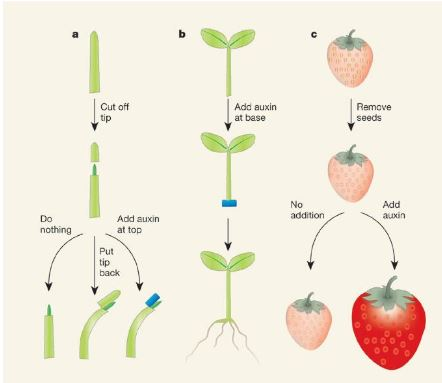

# Les Auxines

En 1880, Darwin observe que le coleoptile (protection de la futur tige dans la graine) d'une graminée se courbe lorsqu'elle est éclairée latéralement. Le **phototropisme** est une croissance différentielle qui est orienté en fonction d'un stimulus, elle est irreversible. 

Darwin a démontré que c'est l'apex du coleoptile qui est sensible à se stimulus mais la réponse se fera au niveau de l'élongation : on a une zone de perception différente de la zone de réponse. C'est donc un signal pouvant passer certains supports. L'auxine migrera du côté des cellules non exposées à la lumière. 

Il existe des auxines naturelles ainsi que des auxines de synthèse, plus puissante que les hormones naturelles.

AIA est la principale auxine naturelle constituée d'un cycle indole sur lequel est greffé une chaîne latérale d'acide acétique. 

L'ANA est utilisé commercialement, c'est l'hormone de bouturage. 2-4-D est utilisé comme herbicide. 

Grande variété chimique

* induction de l'élongation cellulaire
* induction de la division cellulaire
* induction de la différenciation racinaire latérale
* croissance des fruits parthénocarpiques
* induction formation éthylène

Les anti-auxines sont des substances synthétiques qui présentent une structure analogue aux auxines, elles vont bloquer les recepteurs des auxines.

Les auxines sont synthétisées essentiellement au niveau des graines, ou au niveau de l'apex des tiges.

Il existe plusieurs voies de biosynthèse de l'auxine, comme précurseur majoritaire nous avons le tryptophane. A partir de celui-ci, nous retrouvons trois phases de biosynthèse. La voie de l'Indole 3 acétonitrile est la voie prédominante chez les Brassicacées. La voie de l'Indole 3 pyruvique et la voie de la typtamine. Elles seront préférentielles en fonction des espèces. Il existe également, une voie de biosynthèse indépendante du tryptophane.  

On va souvent retrouver ces auxines sous forme conjuguées avec des molécules, suite à sa biosynthèse. Les molécules peuvent être des acides aminées ou des sucres mais la forme conjuguée sera inactive. Cela leur permet d'être transportées dans la plante sans être dégradées.

Par ailleurs, ces formes conjuguées peuvent former un réservoir d'auxines car cette formation va être réversible ce qui permet de réguler le taux d'auxine et permet le maintient de l'homeostasie de l'auxine.

Le transport de l'auxine est polarisé. L'auxine va pouvoir diffuser plus facilement au niveau des membranes. Le transport de l'auxine va s'effectuer de l'apex vers le bas de la plante. L'auxine ne peut pas traverser la paroi donc elle ne pourra traverser la membrane plasmique que si elle est prise en charge par un recepteur. Les recepteurs ne sont pas localisés de façon homogène sur la cellule et sont capables de créer des gradient d'auxine pour orienter le flux vers certaines cellules.

L'auxine est impliquée :

* dans le phototropisme
* dans la formation des racines (la mésogénèse)
* dans le contrôle du developpement des fruits charnus
* dans le gravitropisme

