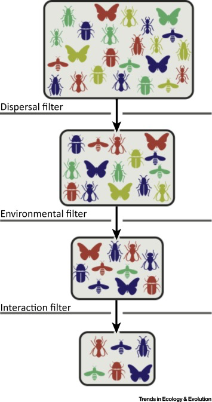
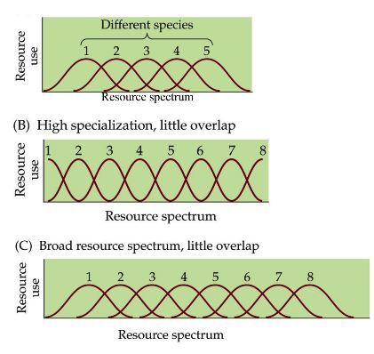
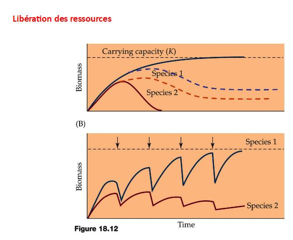
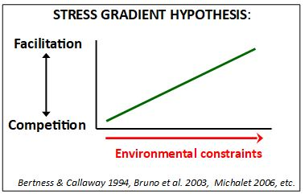
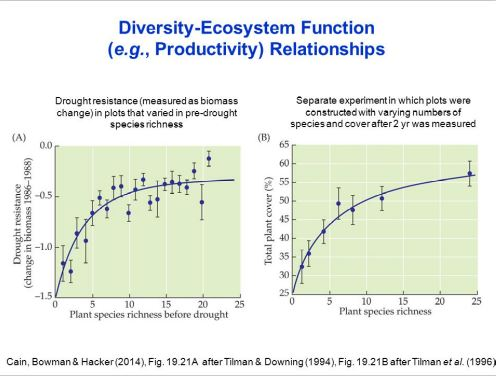
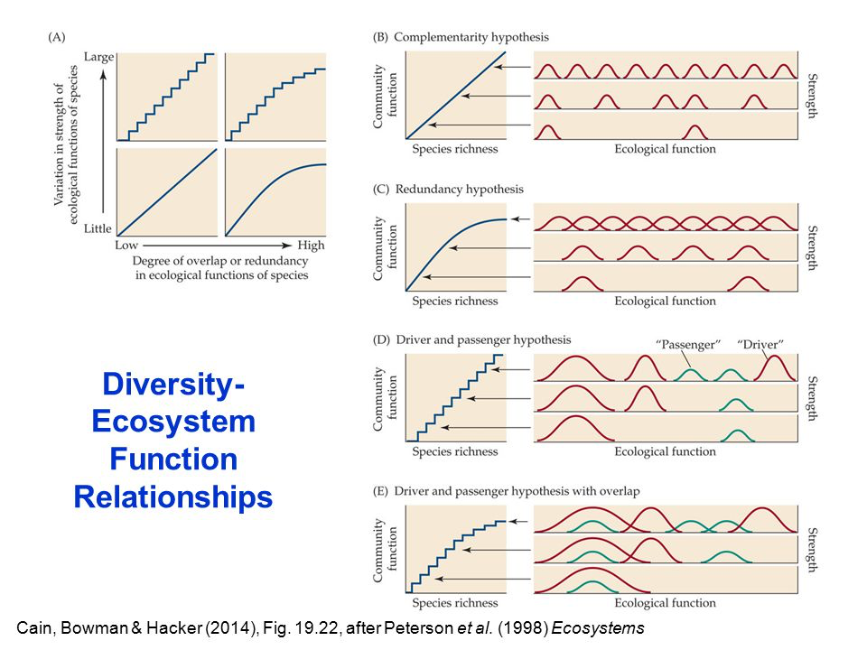
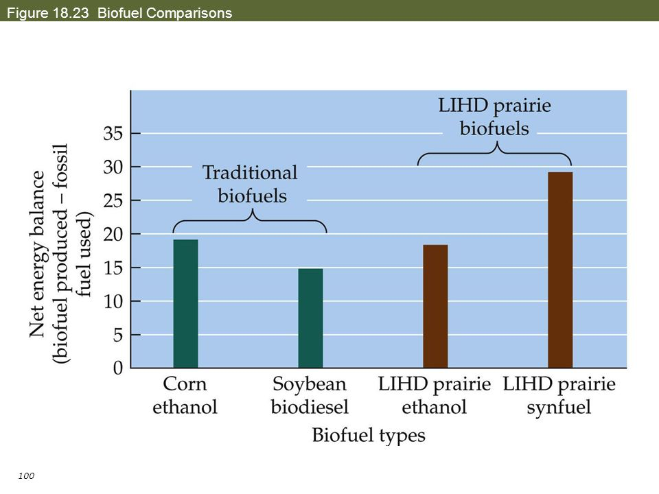
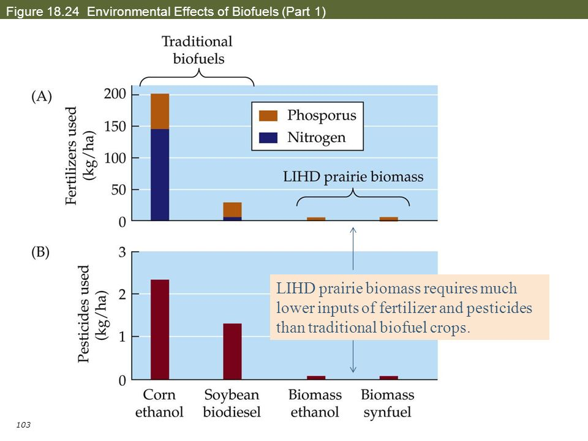
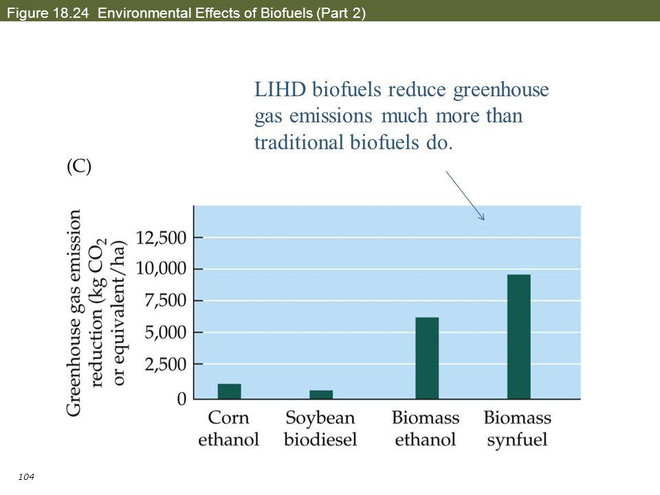

# Ecologie des communautés

Agriculture très intensive sur des prairies qui ont été ensuite abandonnées en 1980 car plus
assez de rendement = zones marginales.

Aujourd’hui, énergies fossiles épuisables.

Apparition du biocarburant, utilisation de biomasse végétale.
Première génération = blé, colza, soja : cultures alimentaires détournées.
Les avantages sont le carbone neutre et la ressource est inépuisable. Les inconvénients sont
l’utilisation de fertilisants
nécessitant des énergies fossiles + réduction de la quantité de terre utilisée pour les cultures
alimentaires (augmentation du prix des denrées alimentaires) => conflit d’usage

Beaucoup de producteurs de biocarburants se sont tournées vers des zones inutilisées comme
les grandes plaines nord-américaines où il n’était pas rentable de produire des cultures
alimentaires mais où il était rentable de produire des cultures dédiées au biocarburant car
c’était subventionné.

Compétition et coexistence: exploitation des ressources. Resource partitioning hypothesis

Processus favorisant la coexistence.

- Libération de ressources.
- Hypothèse de la perturbation intermédiaire
- Le modèle d’équilibre dynamique
- Interactions positives
- Le modèle de Menge-Sutherland
- Le modèle de la loterie.

Conséquence de la diversité

## I) Introduction

Les membres d’une communauté dans un endroit donné sont filtrés par leur capacité de
dispersion, les contraintes abiotiques et les interactions biotiques s’exerçant entre les espèces
(**théorie des filtres**).

Concept 1 : La diversité diffère entre des communautés en raison de variations dans le
pool régional d’espèces, des conditions abiotiques et des interactions interspécifiques.

## II) Division / partitionnement des ressources – Mc ARTHUR (1958-1959)

Principe du partage des ressources entre les espèces.
Deux espèces peuvent coexister si elles se partagent les ressources.
Des espèces cohabitent quand elles se partagent une ressource de façon **complémentaire** avec
parfois du **chevauchement** dont on peut calculer l’indice (plus celui-ci est fort, plus la
compétition est élevée).

On peut avoir une augmentation de la **richesse spécifique** au sein d’une communauté si on a
une **ségrégation écologique** plus forte (variation de caractères) qui va limiter le
chevauchement.
Plus l’intensité de la compétition est forte, plus la ségrégation écologique est forte.
Selon Mc ARTHUR, la compétition est le facteur structurant une communauté (et son nombre
d’espèces).
Si la **gamme des ressources** augmente, le nombre d’espèces peut augmenter et l’intensité de
la compétition interspécifique reste la même.

Variabilité de a distribution des ressources.
	
Ex : N sol et humidité du sol.

Le caractère hétérogène est important car il relève de la complexité de l’habitat.

## III) Processus promouvant la coexistence

Les 3 premiers facteurs sont le **stress**, les **perturbations** et la **prédation**.
Ces 3 facteurs permettent de libérer et mettre à disposition des ressources pour des espèces.

La perturbation (régulière) permet la coexistence des deux espèces.
Idem pour le stress et la perturbation qui limitent la dominance d’une espèce et permettent
la cohabitation.

Hutchinson (1961) : le paradoxe du phytoplancton

Modèle mécaniste basé sur 2 paramètres :

*Comment les espèces phytoplancton peuvent coexister alors qu’elles consomment les mêmes
ressources exactement ?*

* Tc : temps exclusion compétitive; temps nécessaire à une espèce pour en exclure une autre par compétition, dépend du taux de croissance des espèces.

* Te : temps fluctuations environnementales; temps nécessaire pour l’apparition d’une perturbation saisonnière (changement de climat).

Si Tc<<Te, alors on aura une diminution de la diversité puisqu’on donnera prise à l’exclusion
compétitive.

Si Te<<Tc, alors (avec des espèces dont la durée de vie est longue) il y aura coexistence, selon
l’intensité de la perturbation.

Pour avoir une diversité maximale, il faut une perturbation moyenne ou intermédiaire.

Hypothèse de la perturbation intermédiaire – Connell, 1978

Le niveau de richesse le plus important est à un stade intermédiaire de perturbation, à un stade
intermédiaire de succession; une succession se déroule jusqu’au bout dans un milieu plus
stable, moins perturbé et probablement moins riche.

Test – faune du sol – gradient d’inondation en Normandie
Les grands méandres de la Seine sur des terrains plats donnent lieu à des inondations à chaque
marée.

Modèle de l’équilibre dynamique - Dynamic Equilibrium Model
Huston (1979) : Déplacement compétitif – le taux de croissance du plus fort compétiteur
dépend de la productivité de l’écosystème.

La fréquence de la perturbation et le taux de déplacement compétitif interagissent pour déterminer
la diversité au sein d’une communauté.

Ce modèle prédit une diversité maximale lorsque le niveau de perturbation et le taux de déplacement compétitif sont équivalents et faibles à intermédiaires.

Prise en compte des interactions positives (Hacker & Gaines 1997)

Interactions interspécifiques modulables (intensité et direction) en fonction de facteurs biotiques ou abiotiques.

Stress gradient hypothesis.

**Faible niveau de perturbation**: la compétition réduit la diversité.

**Fort niveau de perturbation**: les interactions positives augmentent la diversité.

**Niveau intermédiaire**: les interactions positives contrebalancent l’effet de la compétition.

Les interactions positives peuvent encourager la coexistence.

Le modèle de Menge-Sutherland sépare les effets de la prédation de ceux de la perturbation ou du stress.

L’hypothèse de la perturbation intermédiaire met au même niveau: prédation, stress et
perturbation.
Prédation est un facteur biologique contrairement aux 2 autres et est indépendamment
impactée par les 2 autres.
Ce modèle permet de prédire l’effet relatif de chacun des facteurs (biotiques vs abiotiques).
Une combinaison de prédation et de perturbation/stress peut encourager la coexistence.
Dans tous les modèles vus il y avait une hiérarchie de dominance entre espèces.

*Qu’en est-il si les espèces ont une même habilité compétitive?*

Exemple des poissons : il n’y a pas de hiérarchie compétitive mais seulement de la stochasticité,
une niche laissée vacante est aléatoirement occupée par une espèce présente par chance, il est
impossible de prévoir quelle espèce en remplacera une autre (modèle aléatoire de la loterie).

**Stochasticité**: rôle important dans la diversité si l’environnement est imprévisible et dans un
milieu très diversifié avec une richesse spécifique très importante.

Dans des milieux avec des espèces présentant des interactions d’intensité très diverses, alors
on aura un rôle plus important des processus réduisant l’exclusion compétitive.

## IV) Conséquence de la Diversité

La diversité peut contrôler plusieurs fonctions assurées par les communautés : qualité de l'eau, résistance à la perturbation ... Ces fonctions requiert des services écosystémiques. 

La question qui se pose actuellement : Période d'extinction très forte -> *En perdant les espèces on altère les fonctions, on altère aussi les services écosystémiques ?*

Les quadrats présentant une plus forte richesse, repartent plus vite que les autres l'année suivant la sécheresse. En effet, meilleure résistance à la sécheresse lorsque qu'il y a plus de diversité (d'après le graph). 

Tilman cherche à voir si il y a la même chose avec une autre fonction : (graph B) avec un proxy de productivité primaire : la couverture végétale. Plus il y a de richesse, plus y a de la diversité

Il y a donc une relation positive entre la diversité et les fonctions mesurées.

A partir d'une moment, la complémentarité diminue car la nouvelle espèce n'apportera pas plus de fonctions car tout est déjà présent dans la communauté. Toutes les espèces qui vont être amené par la suite vont être de la redondance. Mais cette redondance permet une assurance fonctionnelle contre l'érosion de la diversité. 

Donc lorsque l'on a une grande diversité dans une communauté, on aura une plus grande résistance aux perturbations.

C'est un modèle général de la relation entre la diversité et les fonctions. Chaque espèce apporte la même intensité d'un point de vue fonctionnelle (graph en ligne), soit elles ont une intensité différente (graph denté). On obtient 4 modèles différents. 

1er modèle : **Hypothèse de la complémentarité fonctionnelle**, même intensité, chaque espèce assure une complémentarité.

2e modèle : même intensité où on introduit de la redondance, **Hypothèse de la redondance**. Complémentarité au départ, puis redondance (chevauchement entre espèces au niveau de leur fonction).

3e modèle : faible redondance, intensité qui diffère entre espèces, **Hypothèse des conducteurs et des passagers**, certaines espèces vont mener les fonctions et d'autres vont les accompagnés car ils n'apporteront qu'une petite fonction.

4e modèle : forte redondance, forte intensité **Hypothèse des conducteurs et passsagers avec redondance**. 

Conducteurs : 

* Espèces ingénieurs qui vont modifier leur milieu de vie au delà de leur durée de vie (vers de terre, castor). 

* Espèces fondatrices : Espèce qui détermine un écosystème par sa biomasse, exemple : Arbres

Hypothèse de la redondance est la plus utilisée. 

Ces modèles ne prennent pas en compte les interactions entre espèces. Alors que les interactions peuvent créer de nouvelles fonctions -> **modèle idiosyncrasique**. 

idiosyncrasique : propre à soi

On a une relation positive entre diveristé et fonction, ainsi que de nombreuses hypothèses sous - jacentes.

Prairie et biocarburants : 

Ces graphiques présentent la balance énergétique. Ils montrent ce qui reste en utilisation une fois la production faite.

Ethanol : très équivalent mais pour le gazol c'est supérieur en production

Utiisation de fertilisants et de pesticides : très nettement inférieurs en cas de prairie qu'en monoculture.

Les herbicides sont très spécifiques, en monoculture, ils représentent une grosse menace. Alors que dans les prairies, avec la redondance fonctionnelle, ce sont des herbivores.

La diversité en prairie est supérieur à la monoculture et possède donc une plus grande résistance aux contraintes par les herbivores.

Les traditions de biocarburants ne sont presque plus utilisé, on est plus rentable économiquement parlant avec la monoculture.

Les prairies très diversifiés peuvent être utilisé mais seulement si elle est bien diversifiée.

Si on utilise beaucoup moins de fertilisants et de pesticides -> emission de gaz à effet de serre important.

Autre exemple de relation Diversité - Fonction / Service

Tout commmence par le décès de plusieurs personnes dans le Sud des USA, dont un jeune  sportif alors qu'ils n'ont aucun problème immunitaire, on ne sait pas pourquoi, des gens très différents mais vivant très proches les uns des autres. On découvre que c'est le virus SNV, un nouveau virus qui est transmis par des souris sylvestre. Le nombre de souris sylvestre porteur par le virus augmentait, lorsque la diversité diminuait. 

Plusieurs hypothèse :

* compétition / prédation
* probabilité de contact
* résistance

Rôle de la diversité des communautés dans la protection sanitaire : Au cours des 60 dernières années : 62% des nouvelles maladies sont transmises par des animaux (Zika, Ebola, grippe aviaire).

