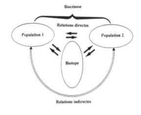

# Introduction à l'écologie des écosystèmes

## I) Introduction : l'écologie des écosystèmes

### A) Ecosystème, écocomplexe et biosphère

L'écologie est l'étude des intéractions entre les organismes vivants et le milieu, et des organismes vivants entre eux dans les conditions naturelles.

Distinction possible entre : 

* l'écologie des populations ou **autoécologie** qui s'intéresse aux espèces individuelles;
* l'écologie des communautés ou **synécologie** qui s'interesse aux ensembles d'espèces dans un milieu donné.

**Autoécologie** : recherches orientées sur l'adaptation d'une espèce vivante à son environnement, analyse des adaptations morphologiques, physiologique, comportemmentale, analyse de l'abondance de la répartition des espèces et de leurs réponses aux facteurs de l'environnement.

**Synécologie** : recherches orientées sur les règles d'assemblage et de coexistence des espèces à l'échelle des communautés.

**Ecologie des écosystèmes** : recherches orientées sur l'organisation, le fonctionnement et l'évolution des écosystèmes.

Ecologie des écosystèmes : étude et analyse des interactions entre les organismes et leur environnement physique.

Ecosystèmes : systèmes qui integrent des processus biotiques (au sein des populations et des communautés), des processus abiotiques (physico-chimiques) et leurs intéractions respectives.

Cette approche à l'échelle des ecosystèmes est fondamentale pour la gestion des ressources naturelles parce qu'elle s'intéresse aux interactions qui lient les systèmes biologiques, dont les sociétés humaines font partie, avec les systèmes physiques (non biologiques) dont ils dépendent.

Dans tout système naturel, il est possible de distinguer :

* biotope : ensemble de conditions physiques et chimiques, relativement homogènes sur une aire géographique donnée, à un instant "*t*".
* biocénose : totalité des organismes peuplant ce biotope (bactéries, champignons, végétaux et animaux)
* population : ensemble des individus appartenant à une même espèce (unité de base)
* communauté : ensemble des populations d'un biotope

C'est grâce à l'existence de multiples interactions entre biotope et biocénose, et au sein de la biocénose entre organismes que se met en place un système fonctionnel, dénommé écosystème.

